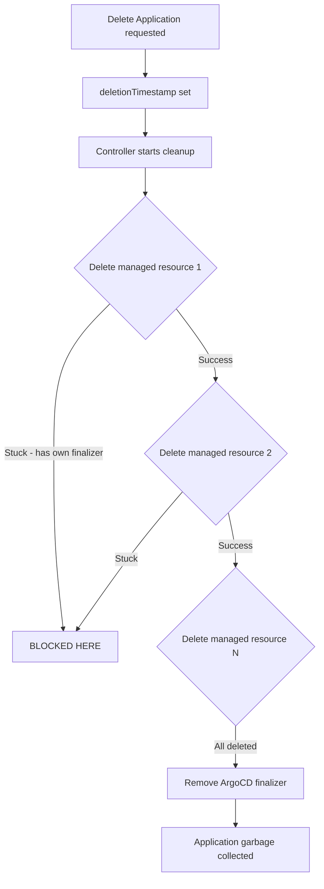

# How to Handle Finalizer Issues During ArgoCD Application Deletion

Author: [nawazdhandala](https://github.com/nawazdhandala)

Tags: ArgoCD, GitOps, Kubernetes, Troubleshooting, Finalizer

Description: Learn how to diagnose and resolve finalizer-related issues that block ArgoCD application deletion, including stuck resources, misconfigured finalizers, and cleanup strategies.

---

Finalizers are the gatekeepers of deletion in Kubernetes. They tell the API server "do not fully remove this resource until I say it is okay." When finalizers work correctly, they ensure clean resource teardown. When they malfunction, they turn simple deletions into a debugging exercise.

In ArgoCD, finalizer issues manifest in two main ways: the Application itself has a finalizer that blocks its deletion, or the managed resources within the application have finalizers that prevent ArgoCD from completing its cleanup. Both need different troubleshooting approaches.

## Understanding the finalizer lifecycle during deletion

When you delete an ArgoCD Application with a cascade finalizer, here is what happens step by step:

1. Kubernetes sets `metadata.deletionTimestamp` on the Application
2. The ArgoCD controller sees the deletion timestamp and begins cleanup
3. The controller iterates over all managed resources and sends delete requests
4. Each managed resource must complete its own deletion (including its own finalizers)
5. Once all resources are gone, the ArgoCD controller removes its finalizer
6. Kubernetes garbage-collects the Application

A failure at any step in this chain causes the deletion to stall.



## Issue 1: ArgoCD Application finalizer prevents deletion

If you see this pattern, the ArgoCD finalizer itself is the problem:

```bash
# Check the Application's finalizers
kubectl get application my-app -n argocd -o jsonpath='{.metadata.finalizers}'
# Output: ["resources-finalizer.argocd.argoproj.io"]

# Check if deletion is pending
kubectl get application my-app -n argocd -o jsonpath='{.metadata.deletionTimestamp}'
# Output: 2026-02-26T10:30:00Z
```

**Diagnosis:** The ArgoCD controller cannot complete cleanup. Check the controller logs:

```bash
kubectl logs -n argocd deployment/argocd-application-controller \
  --since=30m | grep -i "my-app"
```

Common errors you will see:

- `failed to delete resource` - Permission issue or cluster connectivity
- `context deadline exceeded` - Timeout reaching the target cluster
- `resource not found` - The resource was already deleted but ArgoCD tracking is stale

**Resolution for each:**

```bash
# Permission issue: Check controller RBAC
kubectl auth can-i delete deployments -n target-namespace \
  --as system:serviceaccount:argocd:argocd-application-controller

# Cluster connectivity: Test connection
argocd cluster list
kubectl --context target-cluster get nodes

# Stale tracking: Force refresh the application
argocd app get my-app --hard-refresh
```

## Issue 2: Managed resources have their own finalizers

This is the most common stuck deletion scenario. ArgoCD can successfully send delete requests for managed resources, but those resources have their own finalizers preventing actual deletion.

```bash
# Find resources stuck in Terminating in the target namespace
kubectl get all -n production --field-selector metadata.deletionTimestamp!=''

# Check a specific resource's finalizers
kubectl get deployment my-deployment -n production -o json | \
  jq '{name: .metadata.name, finalizers: .metadata.finalizers, deletionTimestamp: .metadata.deletionTimestamp}'
```

### Common resource finalizers and how to handle them

**PVC protection finalizer:**
```bash
# kubernetes.io/pvc-protection prevents deletion while mounted
# Wait for pods to terminate first, then the finalizer auto-clears
kubectl get pods -n production -o json | \
  jq '.items[] | select(.spec.volumes[]?.persistentVolumeClaim != null) | .metadata.name'

# If pods are gone but finalizer persists:
kubectl patch pvc my-pvc -n production \
  --type json -p '[{"op":"remove","path":"/metadata/finalizers"}]'
```

**Custom operator finalizers:**
```bash
# Operators like cert-manager, external-dns add their own finalizers
# Example: cert-manager.io/certificate-controller
# The operator must be running to process its finalizer

# Check if the operator is healthy
kubectl get pods -n cert-manager

# If the operator is gone and cannot process the finalizer:
kubectl patch certificate my-cert -n production \
  --type json -p '[{"op":"remove","path":"/metadata/finalizers"}]'
```

**Helm release finalizers:**
```bash
# If resources were originally managed by Helm
# They might have: helm.sh/hook-delete-policy finalizers
kubectl get job pre-install-hook -n production -o jsonpath='{.metadata.finalizers}'

# Remove if Helm is no longer managing these
kubectl patch job pre-install-hook -n production \
  --type json -p '[{"op":"remove","path":"/metadata/finalizers"}]'
```

## Issue 3: Wrong finalizer configured on Application

Sometimes applications have finalizers that do not match your intended deletion behavior:

```yaml
# Oops - this application has cascade finalizer but you did not want that
apiVersion: argoproj.io/v1alpha1
kind: Application
metadata:
  name: my-app
  namespace: argocd
  finalizers:
    - resources-finalizer.argocd.argoproj.io  # Will delete all resources
```

If you need to change the finalizer before deletion:

```bash
# Switch from cascade to no finalizer (orphan delete)
kubectl patch application my-app -n argocd \
  --type merge \
  -p '{"metadata":{"finalizers":null}}'

# Or switch from foreground to background finalizer
kubectl patch application my-app -n argocd \
  --type json \
  -p '[{"op":"replace","path":"/metadata/finalizers","value":["resources-finalizer.argocd.argoproj.io/background"]}]'
```

## Issue 4: Finalizer on Application but no controller to process it

This happens when:
- ArgoCD controller is down or restarting
- The Application was created in a namespace not watched by any ArgoCD instance
- The ArgoCD instance was uninstalled but Applications remain

```bash
# Check if ArgoCD controller is running
kubectl get pods -n argocd -l app.kubernetes.io/name=argocd-application-controller

# Check controller health
kubectl describe pod -n argocd -l app.kubernetes.io/name=argocd-application-controller

# If no controller will ever process this finalizer, remove it manually
kubectl patch application my-app -n argocd \
  --type merge \
  -p '{"metadata":{"finalizers":null}}'
```

## Issue 5: Namespace stuck in Terminating blocks resource deletion

When the target namespace itself is stuck:

```bash
# Check namespace status
kubectl get namespace production -o json | jq '.status'

# Identify what is blocking namespace deletion
kubectl api-resources --verbs=list --namespaced -o name | \
  xargs -I {} kubectl get {} -n production 2>/dev/null

# Often caused by unavailable API services
kubectl get apiservices | grep False
```

If an apiservice is unavailable, either fix it or remove it:

```bash
# Check which apiservice is problematic
kubectl get apiservice v1beta1.metrics.k8s.io -o yaml

# If the backing service is gone, remove the apiservice
kubectl delete apiservice v1beta1.metrics.k8s.io
```

## Bulk finalizer cleanup script

For situations where many resources are stuck across multiple applications:

```bash
#!/bin/bash
# Clean up all stuck ArgoCD applications and their stuck resources

echo "=== Stuck ArgoCD Applications ==="
STUCK_APPS=$(kubectl get applications -n argocd -o json | \
  jq -r '.items[] | select(.metadata.deletionTimestamp != null) | .metadata.name')

for app in $STUCK_APPS; do
  echo "Processing: $app"

  # Get target namespace
  NS=$(kubectl get application $app -n argocd -o jsonpath='{.spec.destination.namespace}')

  # Clean stuck resources in target namespace
  if [ -n "$NS" ]; then
    STUCK_RES=$(kubectl get all -n $NS --field-selector metadata.deletionTimestamp!='' -o name 2>/dev/null)
    for res in $STUCK_RES; do
      echo "  Removing finalizers from: $res"
      kubectl patch $res -n $NS --type json \
        -p '[{"op":"remove","path":"/metadata/finalizers"}]' 2>/dev/null
    done
  fi

  # Wait briefly
  sleep 2

  # Check if app is still stuck
  if kubectl get application $app -n argocd -o jsonpath='{.metadata.deletionTimestamp}' 2>/dev/null | grep -q .; then
    echo "  Application still stuck, removing Application finalizer"
    kubectl patch application $app -n argocd --type merge \
      -p '{"metadata":{"finalizers":null}}'
  fi
done

echo "=== Cleanup complete ==="
```

## Preventing finalizer issues

### Use background finalizer for applications with many resources

```yaml
metadata:
  finalizers:
    # Less likely to get stuck than foreground
    - resources-finalizer.argocd.argoproj.io/background
```

### Do not add cascade finalizer to applications managing external operator CRDs

If your application deploys resources managed by external operators (cert-manager Certificates, ExternalSecrets, etc.), the operator must be running to process those resource finalizers during deletion. Consider using non-cascade delete for these applications.

### Monitor ArgoCD controller health

If the controller is unhealthy, no finalizer processing happens. Set up liveness monitoring for the controller pod and alert on restarts.

For an in-depth look at how to use finalizers proactively, see the guide on [ArgoCD Application Finalizers](https://oneuptime.com/blog/post/2026-02-09-argocd-application-finalizers/view).

## Summary

Finalizer issues during ArgoCD deletion almost always trace back to one of five root causes: the ArgoCD controller cannot reach the target cluster, managed resources have their own finalizers, the namespace is stuck, no controller exists to process the finalizer, or the wrong finalizer was configured. Diagnose by checking controller logs and looking for resources with deletionTimestamp set. Fix by addressing the root blocker first, and remove finalizers manually only as a last resort after understanding what cleanup will be skipped.
