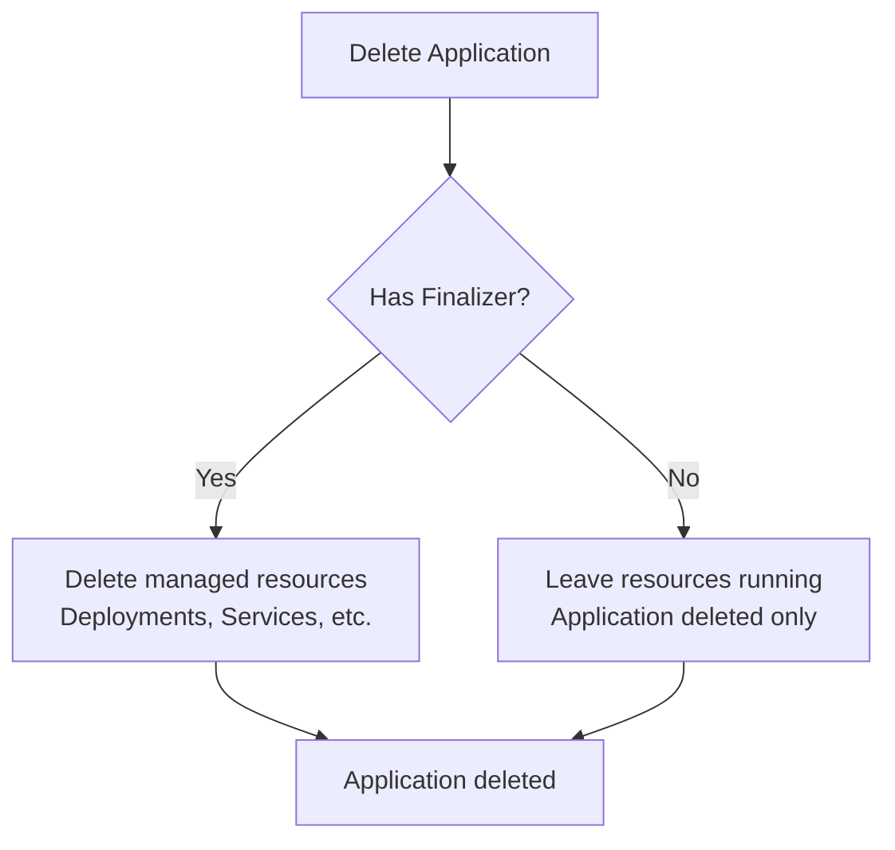

# How to Use Finalizers in Declarative ArgoCD Applications

Author: [nawazdhandala](https://github.com/nawazdhandala)

Tags: ArgoCD, GitOps, Kubernetes, Finalizers, Resource Cleanup

Description: Learn how to configure finalizers in declarative ArgoCD Application manifests to control resource cleanup behavior when applications are deleted.

---

When you delete an ArgoCD Application, what happens to the Kubernetes resources it manages? By default, nothing - the resources are left running in the cluster. Finalizers give you control over this behavior, ensuring that managed resources are properly cleaned up when an application is removed. This is especially important in declarative setups where applications are created and deleted through Git changes.

## What Are Finalizers in ArgoCD?

A finalizer is a Kubernetes mechanism that tells the API server to run specific cleanup logic before deleting a resource. In ArgoCD, finalizers on Application resources control whether the managed Kubernetes resources (Deployments, Services, ConfigMaps, etc.) are deleted when the Application itself is deleted.



## The Two Finalizer Options

ArgoCD provides two finalizer values:

### 1. Cascade Delete (resources-finalizer.argocd.argoproj.io)

This finalizer deletes all managed resources when the Application is deleted:

```yaml
apiVersion: argoproj.io/v1alpha1
kind: Application
metadata:
  name: backend-api
  namespace: argocd
  finalizers:
    - resources-finalizer.argocd.argoproj.io
spec:
  # ...
```

When this Application is deleted (either manually or by removing the YAML from Git in an App-of-Apps setup), ArgoCD will:

1. Find all resources managed by this Application
2. Delete each resource from the cluster
3. Wait for resources to be fully deleted
4. Remove the Application resource itself

### 2. Background Cascade Delete (resources-finalizer.argocd.argoproj.io/background)

This variant uses background propagation for deletion, meaning ArgoCD does not wait for dependent resources to be fully cleaned up:

```yaml
apiVersion: argoproj.io/v1alpha1
kind: Application
metadata:
  name: backend-api
  namespace: argocd
  finalizers:
    - resources-finalizer.argocd.argoproj.io/background
spec:
  # ...
```

This is faster but means resources may still be terminating after the Application is gone.

## When to Use Finalizers

### Always Use Finalizers When:

- **App-of-Apps pattern** - When removing a YAML file should clean up the entire application
- **Ephemeral environments** - Preview environments that should be fully cleaned up
- **CI/CD-created applications** - Applications created by automation should be fully removable

```yaml
# Preview environment application - always needs cleanup
apiVersion: argoproj.io/v1alpha1
kind: Application
metadata:
  name: preview-pr-123
  namespace: argocd
  finalizers:
    - resources-finalizer.argocd.argoproj.io
spec:
  project: previews
  source:
    repoURL: https://github.com/myorg/frontend.git
    targetRevision: feature/new-checkout
    path: k8s/overlays/preview
  destination:
    server: https://kubernetes.default.svc
    namespace: preview-pr-123
```

### Skip Finalizers When:

- **Migration scenarios** - You want to delete the Application but keep resources running under a different management system
- **Handoff to another team** - Resources should persist after the Application is removed from ArgoCD
- **Critical production services** - An extra safety net against accidental deletion

```yaml
# Production database - do NOT auto-delete resources
apiVersion: argoproj.io/v1alpha1
kind: Application
metadata:
  name: production-database
  namespace: argocd
  # No finalizer - resources persist if Application is deleted
spec:
  project: data
  source:
    repoURL: https://github.com/myorg/database-config.git
    targetRevision: main
    path: production
  destination:
    server: https://kubernetes.default.svc
    namespace: database
```

## Finalizers in App-of-Apps

In the App-of-Apps pattern, finalizers have cascading effects. Consider this hierarchy:

```
parent-app (with finalizer)
  |-- child-app-1 (with finalizer)
  |     |-- Deployment
  |     |-- Service
  |-- child-app-2 (with finalizer)
        |-- StatefulSet
        |-- Service
```

If you delete the parent Application:

1. Parent's finalizer triggers deletion of child Application resources
2. Each child's finalizer triggers deletion of its managed Kubernetes resources
3. Everything is cleaned up

If child applications do NOT have finalizers:

1. Parent's finalizer triggers deletion of child Application resources
2. Child Applications are deleted, but their managed resources remain in the cluster
3. You end up with orphaned Deployments, Services, etc.

This is why the general recommendation is to always include finalizers on child applications in App-of-Apps:

```yaml
# Child application in App-of-Apps - always include finalizer
apiVersion: argoproj.io/v1alpha1
kind: Application
metadata:
  name: backend-api-production
  namespace: argocd
  finalizers:
    - resources-finalizer.argocd.argoproj.io
  annotations:
    argocd.argoproj.io/sync-wave: "1"
spec:
  project: team-backend
  source:
    repoURL: https://github.com/myorg/backend-api.git
    targetRevision: main
    path: k8s/overlays/production
  destination:
    server: https://kubernetes.default.svc
    namespace: backend
  syncPolicy:
    automated:
      prune: true
      selfHeal: true
```

## Adding Finalizers to Existing Applications

If you have existing applications without finalizers, add them through the declarative manifest:

```yaml
# Before (no finalizer)
metadata:
  name: my-app
  namespace: argocd

# After (with finalizer)
metadata:
  name: my-app
  namespace: argocd
  finalizers:
    - resources-finalizer.argocd.argoproj.io
```

Or using kubectl:

```bash
# Patch an existing Application to add a finalizer
kubectl patch application my-app -n argocd \
  --type json \
  -p '[{"op": "add", "path": "/metadata/finalizers", "value": ["resources-finalizer.argocd.argoproj.io"]}]'
```

## Removing Finalizers for Emergency Cleanup

Sometimes an Application gets stuck in a Terminating state because the finalizer cannot complete (e.g., the target cluster is unreachable). Remove the finalizer to force deletion:

```bash
# Remove the finalizer to unblock deletion
kubectl patch application stuck-app -n argocd \
  --type json \
  -p '[{"op": "remove", "path": "/metadata/finalizers"}]'
```

This immediately deletes the Application resource, but leaves any managed resources in the target cluster.

## Finalizer Behavior with Sync Options

Finalizers interact with sync options in important ways:

### With Prune Enabled

When the parent app has `prune: true` and you remove a child Application YAML from Git:

```yaml
# Parent sync policy
syncPolicy:
  automated:
    prune: true  # Deletion of child YAML triggers Application deletion
```

The child Application YAML removal triggers: prune removes the Application resource, then the finalizer cleans up managed resources.

### With PrunePropagationPolicy

You can control how resources are deleted during pruning:

```yaml
syncPolicy:
  syncOptions:
    - PrunePropagationPolicy=foreground  # Wait for dependents
    # Or: PrunePropagationPolicy=background  # Do not wait
    # Or: PrunePropagationPolicy=orphan     # Delete owner but not dependents
```

## Testing Finalizer Behavior

Before relying on finalizers in production, test the deletion behavior:

```bash
# Create a test application with finalizer
kubectl apply -f - <<EOF
apiVersion: argoproj.io/v1alpha1
kind: Application
metadata:
  name: test-finalizer
  namespace: argocd
  finalizers:
    - resources-finalizer.argocd.argoproj.io
spec:
  project: default
  source:
    repoURL: https://github.com/argoproj/argocd-example-apps.git
    path: guestbook
    targetRevision: HEAD
  destination:
    server: https://kubernetes.default.svc
    namespace: test-finalizer
  syncPolicy:
    syncOptions:
      - CreateNamespace=true
EOF

# Wait for sync
argocd app wait test-finalizer

# Verify resources exist
kubectl get all -n test-finalizer

# Delete the application
kubectl delete application test-finalizer -n argocd

# Verify resources are cleaned up
kubectl get all -n test-finalizer
# Should return "No resources found"
```

## Best Practices

1. **Default to including finalizers** on all applications unless you have a specific reason not to
2. **Always use finalizers in App-of-Apps** to prevent orphaned resources
3. **Skip finalizers for stateful services** where accidental deletion could cause data loss
4. **Document your finalizer strategy** so team members know what to expect when deleting applications
5. **Use background finalizer** for large applications with many resources to speed up deletion
6. **Test deletion behavior** in staging before relying on it in production

Finalizers are a critical part of declarative ArgoCD management. They ensure that your Git repository truly represents the desired state of your cluster, including what should NOT be running. For more on declarative setup, see our guides on [managing applications declaratively](https://oneuptime.com/blog/post/2026-02-26-argocd-manage-applications-declaratively/view) and the [App-of-Apps pattern](https://oneuptime.com/blog/post/2026-02-26-argocd-app-of-apps-pattern-guide/view).
