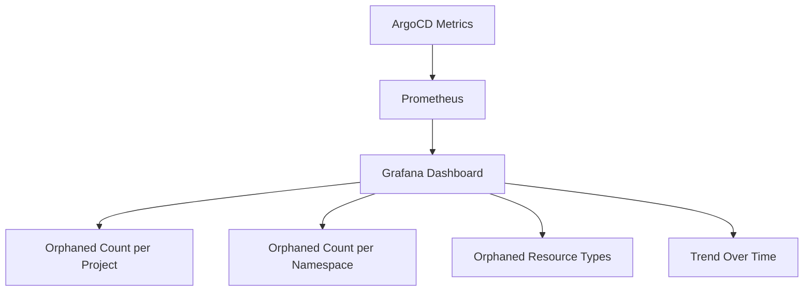

# How to Find Orphaned Resources in Your Cluster with ArgoCD

Author: [nawazdhandala](https://github.com/nawazdhandala)

Tags: ArgoCD, GitOps, Kubernetes, Resource Management, Cluster Hygiene

Description: Learn practical techniques to discover orphaned Kubernetes resources using ArgoCD project monitoring, CLI commands, and custom scripts for cluster cleanup.

---

Orphaned resources are a silent problem. They do not cause alerts, they do not break anything immediately, but they accumulate over time. Unused ConfigMaps, leftover test Deployments, abandoned PersistentVolumeClaims consuming storage, forgotten CronJobs running on schedule with no purpose. Finding them requires a systematic approach.

This guide covers multiple methods to discover orphaned resources using ArgoCD's built-in features and complementary tools.

## Method 1: ArgoCD Project Orphaned Resource Report

The primary way to find orphaned resources is through ArgoCD's project-level orphaned resource monitoring. First, enable it on your project if you have not already:

```yaml
apiVersion: argoproj.io/v1alpha1
kind: AppProject
metadata:
  name: production
  namespace: argocd
spec:
  destinations:
    - namespace: production
      server: https://kubernetes.default.svc
  orphanedResources:
    warn: true
    ignore:
      - group: ""
        kind: Endpoints
      - group: discovery.k8s.io
        kind: EndpointSlice
      - group: ""
        kind: Event
```

### Viewing the Report via CLI

```bash
# Get the project details including orphaned resources
argocd proj get production -o json | jq '.status.orphanedResources'
```

Sample output:

```json
[
  {
    "group": "",
    "kind": "ConfigMap",
    "name": "debug-config",
    "namespace": "production"
  },
  {
    "group": "apps",
    "kind": "Deployment",
    "name": "test-app",
    "namespace": "production"
  },
  {
    "group": "",
    "kind": "Secret",
    "name": "old-api-key",
    "namespace": "production"
  }
]
```

### Viewing in the ArgoCD UI

Navigate to Settings > Projects > [Your Project]. The orphaned resources section shows a list of all untracked resources. Click on any resource to see its details.

## Method 2: Comparing Namespace Contents to ArgoCD Applications

For a more thorough analysis, compare everything in a namespace against what ArgoCD tracks:

```bash
#!/bin/bash
# compare-namespace.sh - Find resources not tracked by ArgoCD

NAMESPACE="production"

echo "=== Resources in namespace $NAMESPACE ==="
echo ""

# Get all resources ArgoCD manages in this namespace
echo "ArgoCD-managed resources:"
argocd app list -o json | \
  jq -r ".[] | .status.resources[]? | select(.namespace == \"$NAMESPACE\") | \"\(.kind)/\(.name)\"" | \
  sort > /tmp/argocd-resources.txt

# Get all resources in the namespace from Kubernetes
echo "All namespace resources:"
kubectl api-resources --verbs=list --namespaced -o name | \
  xargs -I {} kubectl get {} -n $NAMESPACE -o jsonpath='{range .items[*]}{.kind}/{.metadata.name}{"\n"}{end}' 2>/dev/null | \
  sort > /tmp/cluster-resources.txt

# Find resources only in the cluster (orphaned)
echo ""
echo "=== Orphaned Resources (in cluster but not in ArgoCD) ==="
comm -23 /tmp/cluster-resources.txt /tmp/argocd-resources.txt
```

## Method 3: Using kubectl with ArgoCD Labels

ArgoCD labels managed resources with tracking labels. Resources without these labels in ArgoCD-managed namespaces are potentially orphaned:

```bash
# Find resources WITHOUT the ArgoCD tracking label
kubectl get all -n production -o json | \
  jq '.items[] | select(.metadata.labels["app.kubernetes.io/instance"] == null) | "\(.kind)/\(.metadata.name)"'

# For annotation-based tracking
kubectl get all -n production -o json | \
  jq '.items[] | select(.metadata.annotations["argocd.argoproj.io/tracking-id"] == null) | "\(.kind)/\(.metadata.name)"'
```

## Method 4: Resource Age Analysis

Old resources are more likely to be orphaned. Find resources created before a certain date:

```bash
# Find resources older than 30 days without ArgoCD tracking
kubectl get all -n production -o json | jq -r '
  .items[] |
  select(
    .metadata.labels["app.kubernetes.io/instance"] == null and
    (.metadata.creationTimestamp | fromdateiso8601) < (now - 2592000)
  ) |
  "\(.kind)/\(.metadata.name) created: \(.metadata.creationTimestamp)"'
```

## Method 5: Finding Orphaned Resources by Type

Some resource types are more prone to being orphaned than others. Check them specifically.

### Orphaned ConfigMaps

```bash
# ConfigMaps not managed by ArgoCD
kubectl get configmap -n production -o json | jq -r '
  .items[] |
  select(
    .metadata.labels["app.kubernetes.io/instance"] == null and
    .metadata.name != "kube-root-ca.crt"
  ) |
  "\(.metadata.name) - created: \(.metadata.creationTimestamp)"'
```

### Orphaned Secrets

```bash
# Secrets not managed by ArgoCD (excluding ServiceAccount tokens)
kubectl get secrets -n production -o json | jq -r '
  .items[] |
  select(
    .metadata.labels["app.kubernetes.io/instance"] == null and
    .type != "kubernetes.io/service-account-token"
  ) |
  "\(.metadata.name) - type: \(.type) - created: \(.metadata.creationTimestamp)"'
```

### Orphaned PersistentVolumeClaims

PVCs are especially important to find because they consume storage:

```bash
# PVCs not managed by ArgoCD
kubectl get pvc -n production -o json | jq -r '
  .items[] |
  select(.metadata.labels["app.kubernetes.io/instance"] == null) |
  "\(.metadata.name) - \(.spec.resources.requests.storage) - status: \(.status.phase)"'

# PVCs not bound to any running pod
kubectl get pvc -n production -o json | jq -r '
  .items[] |
  select(.status.phase == "Bound") |
  .metadata.name' | while read pvc; do
    pods=$(kubectl get pods -n production -o json | jq -r ".items[].spec.volumes[]? | select(.persistentVolumeClaim.claimName == \"$pvc\") | .name" 2>/dev/null)
    if [ -z "$pods" ]; then
      echo "Orphaned PVC: $pvc (not mounted by any pod)"
    fi
  done
```

### Orphaned Services

```bash
# Services with no matching endpoints
kubectl get services -n production -o json | jq -r '
  .items[] |
  select(.spec.type != "ExternalName") |
  .metadata.name' | while read svc; do
    endpoints=$(kubectl get endpoints $svc -n production -o jsonpath='{.subsets[*].addresses[*].ip}' 2>/dev/null)
    if [ -z "$endpoints" ]; then
      echo "Service with no endpoints: $svc"
    fi
  done
```

### Orphaned Jobs and Completed Pods

```bash
# Completed Jobs older than 7 days
kubectl get jobs -n production -o json | jq -r '
  .items[] |
  select(
    .status.completionTime != null and
    (.status.completionTime | fromdateiso8601) < (now - 604800)
  ) |
  "\(.metadata.name) - completed: \(.status.completionTime)"'
```

## Method 6: Cross-Namespace Orphan Scan

Scan all namespaces that ArgoCD manages:

```bash
#!/bin/bash
# scan-all-namespaces.sh

echo "=== Orphaned Resource Scan ==="
echo ""

# Get all namespaces that ArgoCD applications deploy to
NAMESPACES=$(argocd app list -o json | \
  jq -r '.[].spec.destination.namespace' | sort -u)

for ns in $NAMESPACES; do
  echo "--- Namespace: $ns ---"

  # Count total resources
  total=$(kubectl get all -n $ns --no-headers 2>/dev/null | wc -l)

  # Count ArgoCD-managed resources
  managed=$(kubectl get all -n $ns -l "app.kubernetes.io/instance" --no-headers 2>/dev/null | wc -l)

  orphaned=$((total - managed))
  echo "  Total: $total | Managed: $managed | Potentially orphaned: $orphaned"

  if [ $orphaned -gt 0 ]; then
    echo "  Orphaned resources:"
    kubectl get all -n $ns -o json | jq -r '
      .items[] |
      select(.metadata.labels["app.kubernetes.io/instance"] == null) |
      "    \(.kind)/\(.metadata.name)"'
  fi
  echo ""
done
```

## Creating an Orphaned Resource Dashboard

Build a Grafana dashboard using ArgoCD metrics:



Key Prometheus queries:

```promql
# Total orphaned resources across all projects
sum(argocd_app_orphaned_resources_count)

# Orphaned resources by project
argocd_app_orphaned_resources_count{project=~".*"}

# Rate of orphaned resource growth
rate(argocd_app_orphaned_resources_count[7d])
```

## Automated Orphan Reporting

Set up a CronJob to generate weekly orphaned resource reports:

```yaml
apiVersion: batch/v1
kind: CronJob
metadata:
  name: orphan-reporter
  namespace: argocd
spec:
  schedule: "0 9 * * 1"  # Every Monday at 9 AM
  jobTemplate:
    spec:
      template:
        spec:
          serviceAccountName: argocd-server
          containers:
            - name: reporter
              image: bitnami/kubectl:latest
              command:
                - /bin/bash
                - -c
                - |
                  echo "Weekly Orphaned Resource Report"
                  echo "================================"
                  echo ""
                  # Add your reporting logic here
                  # Send results to Slack, email, or a ticket system
          restartPolicy: Never
```

## Best Practices

1. **Enable orphaned resource monitoring on every project** - It has minimal overhead and provides valuable visibility
2. **Build a comprehensive ignore list** - Auto-generated Kubernetes resources create noise if not filtered
3. **Automate regular scanning** - Weekly or monthly scans catch orphans before they accumulate
4. **Track PVCs specifically** - They consume storage and cost money
5. **Investigate before deleting** - An "orphaned" resource may be managed by another tool or process outside ArgoCD
6. **Use labels and annotations** - Even for manually created resources, add labels so they are easier to identify later

For more on handling orphaned resources, see [How to Enable Orphaned Resource Monitoring in ArgoCD](https://oneuptime.com/blog/post/2026-02-26-argocd-orphaned-resource-monitoring/view) and [How to Clean Up Orphaned Resources Safely](https://oneuptime.com/blog/post/2026-02-26-argocd-clean-up-orphaned-resources/view).
