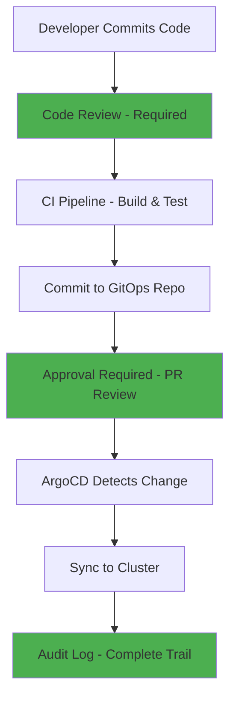

# ArgoCD for Fintech: Compliance-First Deployments

Author: [nawazdhandala](https://github.com/nawazdhandala)

Tags: ArgoCD, GitOps, Kubernetes, Fintech, Compliance

Description: Learn how to configure ArgoCD for fintech environments with SOC 2, PCI DSS, and regulatory compliance requirements built into every deployment.

---

Financial technology companies operate under some of the strictest regulatory requirements in the software industry. SOC 2, PCI DSS, SOX, and various banking regulations mandate strict controls around who can change production systems, how those changes are tracked, and how quickly you can demonstrate compliance during an audit. ArgoCD's GitOps model is uniquely well-suited for fintech because Git provides the immutable audit trail that auditors demand. This guide shows how to configure ArgoCD specifically for fintech compliance requirements.

## Why GitOps Works for Fintech Compliance

Traditional deployment methods create compliance gaps that auditors flag repeatedly. Manual deployments lack traceability. CI/CD pipelines with direct cluster access create security concerns. ArgoCD's pull-based model addresses these issues structurally.



Every deployment is a Git commit with an author, reviewer, timestamp, and description. This is exactly what SOC 2 auditors look for.

## PCI DSS Compliance Configuration

PCI DSS (Payment Card Industry Data Security Standard) requires strict access controls, change management, and network segmentation. Here is how to configure ArgoCD to meet these requirements.

### Requirement 6: Develop and Maintain Secure Systems

PCI DSS requires that all changes to system components are tested, documented, and approved before deployment to production.

```yaml
# Enforce manual sync for production - no auto-sync
apiVersion: argoproj.io/v1alpha1
kind: Application
metadata:
  name: payment-service
  namespace: argocd
  annotations:
    # Track change ticket number
    change-ticket: "CHG-2024-0142"
spec:
  project: pci-zone
  source:
    repoURL: https://github.com/org/payment-gitops.git
    path: services/payment-service/production
    targetRevision: main
  destination:
    server: https://pci-cluster.internal
    namespace: payment-processing
  # NO automated sync - all production deployments require manual approval
  syncPolicy:
    syncOptions:
      - Validate=true
      - CreateNamespace=false
      - PruneLast=true
```

### Requirement 7: Restrict Access by Business Need to Know

```yaml
# AppProject restricting access to PCI zone
apiVersion: argoproj.io/v1alpha1
kind: AppProject
metadata:
  name: pci-zone
  namespace: argocd
spec:
  description: "PCI DSS compliant payment processing applications"
  # Only approved repositories
  sourceRepos:
    - 'https://github.com/org/payment-gitops.git'
    - 'https://github.com/org/payment-charts.git'
  # Restrict to PCI-compliant clusters and namespaces
  destinations:
    - namespace: 'payment-*'
      server: 'https://pci-cluster.internal'
  # No cluster-scoped resources
  clusterResourceWhitelist: []
  # Only specific namespace resources
  namespaceResourceWhitelist:
    - group: 'apps'
      kind: Deployment
    - group: ''
      kind: Service
    - group: ''
      kind: ConfigMap
    - group: 'networking.k8s.io'
      kind: NetworkPolicy
  # RBAC roles
  roles:
    - name: payment-deployer
      description: "Can sync payment applications"
      policies:
        - p, proj:pci-zone:payment-deployer, applications, sync, pci-zone/*, allow
        - p, proj:pci-zone:payment-deployer, applications, get, pci-zone/*, allow
      groups:
        - payment-team-leads
    - name: payment-viewer
      description: "Read-only access to payment applications"
      policies:
        - p, proj:pci-zone:payment-viewer, applications, get, pci-zone/*, allow
      groups:
        - payment-team
        - compliance-auditors
```

### Requirement 10: Track and Monitor Access

Configure ArgoCD to produce comprehensive audit logs.

```yaml
# argocd-cmd-params-cm configuration for audit logging
apiVersion: v1
kind: ConfigMap
metadata:
  name: argocd-cmd-params-cm
  namespace: argocd
data:
  # Enable detailed audit logging
  server.log.level: "info"
  controller.log.level: "info"
  # Log format for SIEM integration
  server.log.format: "json"
  controller.log.format: "json"
```

Export ArgoCD events to your SIEM system.

```yaml
# ArgoCD Notifications for compliance events
apiVersion: v1
kind: ConfigMap
metadata:
  name: argocd-notifications-cm
  namespace: argocd
data:
  trigger.on-sync-running: |
    - when: app.status.operationState.phase in ['Running']
      send: [compliance-log]
  trigger.on-sync-succeeded: |
    - when: app.status.operationState.phase in ['Succeeded']
      send: [compliance-log]
  trigger.on-sync-failed: |
    - when: app.status.operationState.phase in ['Failed', 'Error']
      send: [compliance-log, alert-security]

  template.compliance-log: |
    webhook:
      siem:
        method: POST
        body: |
          {
            "event": "argocd-deployment",
            "application": "{{.app.metadata.name}}",
            "project": "{{.app.spec.project}}",
            "status": "{{.app.status.operationState.phase}}",
            "revision": "{{.app.status.sync.revision}}",
            "initiatedBy": "{{.app.status.operationState.operation.initiatedBy.username}}",
            "timestamp": "{{.app.status.operationState.startedAt}}",
            "cluster": "{{.app.spec.destination.server}}",
            "namespace": "{{.app.spec.destination.namespace}}"
          }
```

## SOC 2 Compliance

SOC 2 focuses on security, availability, processing integrity, confidentiality, and privacy. ArgoCD supports several SOC 2 controls.

### Change Management Controls

```yaml
# Sync windows restrict when deployments can happen
apiVersion: argoproj.io/v1alpha1
kind: AppProject
metadata:
  name: production-apps
spec:
  syncWindows:
    # Allow production syncs only during business hours
    - kind: allow
      schedule: '0 9 * * 1-5'  # Mon-Fri, 9 AM
      duration: 8h               # Until 5 PM
      applications:
        - '*'
      clusters:
        - 'https://production-cluster.internal'
    # Deny all syncs during weekends
    - kind: deny
      schedule: '0 0 * * 0,6'  # Sat-Sun
      duration: 48h
      applications:
        - '*'
    # Emergency window with manual override
    - kind: allow
      schedule: '* * * * *'     # Always
      duration: 24h
      applications:
        - '*'
      manualSync: true           # Only manual sync allowed
```

### Separation of Duties

```yaml
# RBAC enforcing separation of duties
# Developers can create applications but not sync to production
# Release managers can sync but not modify application config
data:
  policy.csv: |
    # Developers - can modify application config
    p, role:developer, applications, create, */*, allow
    p, role:developer, applications, update, */*, allow
    p, role:developer, applications, get, */*, allow

    # Release managers - can sync to production
    p, role:release-manager, applications, sync, production-apps/*, allow
    p, role:release-manager, applications, get, */*, allow

    # Auditors - read-only access
    p, role:auditor, applications, get, */*, allow
    p, role:auditor, logs, get, */*, allow
    p, role:auditor, projects, get, *, allow

    # No one person can both modify and deploy
    g, dev-team, role:developer
    g, release-team, role:release-manager
    g, compliance-team, role:auditor
```

## Secret Management for Financial Data

Financial applications must never store secrets in Git. Use the External Secrets Operator with ArgoCD.

```yaml
# External Secret pulling from AWS Secrets Manager
apiVersion: external-secrets.io/v1beta1
kind: ExternalSecret
metadata:
  name: payment-db-credentials
  namespace: payment-processing
spec:
  refreshInterval: 1h
  secretStoreRef:
    name: aws-secrets-manager
    kind: ClusterSecretStore
  target:
    name: payment-db-credentials
    creationPolicy: Owner
  data:
    - secretKey: username
      remoteRef:
        key: /production/payment-service/db
        property: username
    - secretKey: password
      remoteRef:
        key: /production/payment-service/db
        property: password
```

## Network Segmentation

PCI DSS requires network segmentation between cardholder data environments and other systems.

```yaml
# NetworkPolicy deployed via ArgoCD for PCI zone isolation
apiVersion: networking.k8s.io/v1
kind: NetworkPolicy
metadata:
  name: payment-service-policy
  namespace: payment-processing
spec:
  podSelector:
    matchLabels:
      app: payment-service
  policyTypes:
    - Ingress
    - Egress
  ingress:
    # Only allow traffic from the API gateway
    - from:
        - namespaceSelector:
            matchLabels:
              zone: pci
          podSelector:
            matchLabels:
              app: api-gateway
      ports:
        - port: 8443
          protocol: TCP
  egress:
    # Only allow traffic to the payment database
    - to:
        - namespaceSelector:
            matchLabels:
              zone: pci
          podSelector:
            matchLabels:
              app: payment-db
      ports:
        - port: 5432
          protocol: TCP
    # Allow DNS
    - to:
        - namespaceSelector: {}
          podSelector:
            matchLabels:
              k8s-app: kube-dns
      ports:
        - port: 53
          protocol: UDP
```

## Audit Preparation

When auditors come, they typically ask for evidence of:

1. **Change authorization** - Git PR approvals with reviewer information
2. **Change history** - Git log showing who changed what and when
3. **Access controls** - ArgoCD RBAC configuration and SSO integration
4. **Deployment controls** - Sync windows and manual approval requirements
5. **Monitoring** - Alerts and notifications for unauthorized changes

```bash
# Generate audit evidence from Git
# All deployment changes for the past quarter
git log --since="2024-01-01" --until="2024-03-31" \
  --format="%H|%an|%ae|%ai|%s" \
  -- services/payment-service/production/ > audit-evidence.csv

# Verify all changes had PR approvals
# Use GitHub API to check PR merge status for each commit
```

ArgoCD's GitOps model makes fintech compliance significantly easier than traditional deployment approaches. The audit trail is built into the workflow, not bolted on after the fact. For comprehensive monitoring of your fintech ArgoCD deployments, integrate with [OneUptime](https://oneuptime.com/blog/post/2026-02-26-argocd-healthcare-hipaa/view) for real-time alerting and compliance dashboards.
