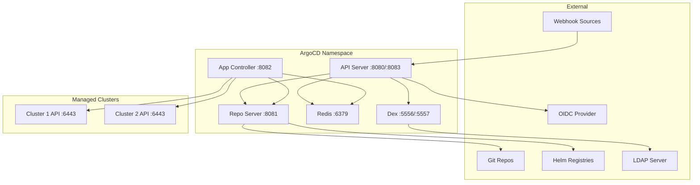

# How to Handle Firewall Rules for ArgoCD Operations

Author: [nawazdhandala](https://github.com/nawazdhandala)

Tags: ArgoCD, GitOps, Kubernetes, Security, Networking

Description: A comprehensive guide to configuring firewall rules for ArgoCD, covering all required ports, network flows, and security best practices for production deployments.

---

Deploying ArgoCD in a production environment with proper network security requires understanding every network connection ArgoCD makes. ArgoCD components communicate with each other, with Git repositories, with Kubernetes API servers, with Helm registries, and with external authentication providers. Getting the firewall rules right is essential for both security and functionality.

## ArgoCD Network Architecture

Before diving into firewall rules, let us map out all the network connections ArgoCD requires.



## Required Ports and Connections

Here is a complete breakdown of every port and connection ArgoCD needs:

### Internal Component Communication

These are connections between ArgoCD components within the cluster:

| Source | Destination | Port | Protocol | Purpose |
|--------|------------|------|----------|---------|
| API Server | Repo Server | 8081 | gRPC | Manifest generation |
| API Server | Redis | 6379 | TCP | Caching |
| API Server | Dex | 5557 | gRPC | Authentication |
| App Controller | Repo Server | 8081 | gRPC | Manifest generation |
| App Controller | Redis | 6379 | TCP | Caching |
| App Controller | Kube API | 6443 | HTTPS | Resource management |

### External Outbound Connections

These are connections from ArgoCD to external services:

| Source | Destination | Port | Protocol | Purpose |
|--------|------------|------|----------|---------|
| Repo Server | Git (GitHub/GitLab) | 443 | HTTPS | Clone repositories |
| Repo Server | Git (SSH) | 22 | SSH | Clone via SSH |
| Repo Server | Helm registries | 443 | HTTPS | Fetch charts |
| API Server | OIDC Provider | 443 | HTTPS | SSO authentication |
| Dex | LDAP Server | 636 | LDAPS | Directory auth |
| App Controller | Remote K8s API | 6443 | HTTPS | Multi-cluster |

### External Inbound Connections

These are connections coming into ArgoCD:

| Source | Destination | Port | Protocol | Purpose |
|--------|------------|------|----------|---------|
| Users / CLI | API Server | 443 | HTTPS/gRPC | UI and CLI access |
| Webhook sources | API Server | 443 | HTTPS | Git webhooks |
| Monitoring | API Server | 8083 | HTTP | Metrics |
| Monitoring | App Controller | 8082 | HTTP | Metrics |
| Monitoring | Repo Server | 8084 | HTTP | Metrics |

## Configuring Kubernetes Network Policies

Network Policies are the Kubernetes-native way to control traffic between pods. Here is a complete set for ArgoCD:

```yaml
# Allow ArgoCD API server to receive external traffic
apiVersion: networking.k8s.io/v1
kind: NetworkPolicy
metadata:
  name: argocd-server-ingress
  namespace: argocd
spec:
  podSelector:
    matchLabels:
      app.kubernetes.io/name: argocd-server
  policyTypes:
    - Ingress
  ingress:
    # Allow traffic from ingress controller
    - from:
        - namespaceSelector:
            matchLabels:
              kubernetes.io/metadata.name: ingress-nginx
      ports:
        - port: 8080
          protocol: TCP
    # Allow webhook traffic from specific sources
    - from:
        - ipBlock:
            cidr: 140.82.112.0/20  # GitHub webhook IPs
        - ipBlock:
            cidr: 192.30.252.0/22  # GitHub webhook IPs
      ports:
        - port: 8080
          protocol: TCP
    # Allow metrics scraping from monitoring namespace
    - from:
        - namespaceSelector:
            matchLabels:
              kubernetes.io/metadata.name: monitoring
      ports:
        - port: 8083
          protocol: TCP
---
# Allow repo server to receive connections from API server and controller
apiVersion: networking.k8s.io/v1
kind: NetworkPolicy
metadata:
  name: argocd-repo-server-ingress
  namespace: argocd
spec:
  podSelector:
    matchLabels:
      app.kubernetes.io/name: argocd-repo-server
  policyTypes:
    - Ingress
  ingress:
    - from:
        - podSelector:
            matchLabels:
              app.kubernetes.io/name: argocd-server
        - podSelector:
            matchLabels:
              app.kubernetes.io/name: argocd-application-controller
      ports:
        - port: 8081
          protocol: TCP
    # Metrics
    - from:
        - namespaceSelector:
            matchLabels:
              kubernetes.io/metadata.name: monitoring
      ports:
        - port: 8084
          protocol: TCP
---
# Allow Redis to receive connections from API server and controller
apiVersion: networking.k8s.io/v1
kind: NetworkPolicy
metadata:
  name: argocd-redis-ingress
  namespace: argocd
spec:
  podSelector:
    matchLabels:
      app.kubernetes.io/name: argocd-redis
  policyTypes:
    - Ingress
  ingress:
    - from:
        - podSelector:
            matchLabels:
              app.kubernetes.io/name: argocd-server
        - podSelector:
            matchLabels:
              app.kubernetes.io/name: argocd-application-controller
      ports:
        - port: 6379
          protocol: TCP
```

## Configuring Egress Rules

Egress rules control what ArgoCD can connect to externally:

```yaml
# Repo server egress - allow Git and Helm registry access
apiVersion: networking.k8s.io/v1
kind: NetworkPolicy
metadata:
  name: argocd-repo-server-egress
  namespace: argocd
spec:
  podSelector:
    matchLabels:
      app.kubernetes.io/name: argocd-repo-server
  policyTypes:
    - Egress
  egress:
    # Allow DNS resolution
    - to:
        - namespaceSelector: {}
          podSelector:
            matchLabels:
              k8s-app: kube-dns
      ports:
        - port: 53
          protocol: UDP
        - port: 53
          protocol: TCP
    # Allow HTTPS to Git providers
    - to:
        - ipBlock:
            cidr: 0.0.0.0/0
      ports:
        - port: 443
          protocol: TCP
        - port: 22
          protocol: TCP
    # Allow communication with ArgoCD internal components
    - to:
        - podSelector:
            matchLabels:
              app.kubernetes.io/part-of: argocd
---
# Application controller egress - allow Kubernetes API access
apiVersion: networking.k8s.io/v1
kind: NetworkPolicy
metadata:
  name: argocd-controller-egress
  namespace: argocd
spec:
  podSelector:
    matchLabels:
      app.kubernetes.io/name: argocd-application-controller
  policyTypes:
    - Egress
  egress:
    # DNS
    - to:
        - namespaceSelector: {}
          podSelector:
            matchLabels:
              k8s-app: kube-dns
      ports:
        - port: 53
          protocol: UDP
    # Kubernetes API servers (local and remote)
    - to:
        - ipBlock:
            cidr: 0.0.0.0/0
      ports:
        - port: 6443
          protocol: TCP
    # Internal ArgoCD components
    - to:
        - podSelector:
            matchLabels:
              app.kubernetes.io/part-of: argocd
```

## Cloud Provider Firewall Rules

### AWS Security Groups

For ArgoCD running on EKS with external access:

```bash
# Create a security group for ArgoCD
aws ec2 create-security-group \
  --group-name argocd-sg \
  --description "ArgoCD security group" \
  --vpc-id vpc-12345

# Allow HTTPS from corporate network
aws ec2 authorize-security-group-ingress \
  --group-id sg-argocd \
  --protocol tcp \
  --port 443 \
  --cidr 10.0.0.0/8

# Allow GitHub webhooks
aws ec2 authorize-security-group-ingress \
  --group-id sg-argocd \
  --protocol tcp \
  --port 443 \
  --cidr 140.82.112.0/20

# Allow outbound to Git repos
aws ec2 authorize-security-group-egress \
  --group-id sg-argocd \
  --protocol tcp \
  --port 443 \
  --cidr 0.0.0.0/0

# Allow outbound SSH for Git
aws ec2 authorize-security-group-egress \
  --group-id sg-argocd \
  --protocol tcp \
  --port 22 \
  --cidr 0.0.0.0/0
```

### GCP Firewall Rules

```bash
# Allow HTTPS access to ArgoCD
gcloud compute firewall-rules create allow-argocd-https \
  --network=my-vpc \
  --allow=tcp:443 \
  --source-ranges=10.0.0.0/8 \
  --target-tags=argocd-server

# Allow ArgoCD to reach Git repos
gcloud compute firewall-rules create allow-argocd-egress-git \
  --network=my-vpc \
  --allow=tcp:443,tcp:22 \
  --direction=EGRESS \
  --target-tags=argocd-repo-server
```

## Webhook-Specific Firewall Rules

ArgoCD supports webhooks from GitHub, GitLab, and Bitbucket. Each provider uses specific IP ranges:

```bash
# Get current GitHub webhook IP ranges
curl -s https://api.github.com/meta | jq '.hooks[]'

# Get GitLab IP ranges (for gitlab.com)
# GitLab publishes their IP ranges at:
# https://docs.gitlab.com/ee/user/gitlab_com/#ip-addresses
```

Configure webhook-specific ingress rules:

```yaml
# Network policy for webhook sources
apiVersion: networking.k8s.io/v1
kind: NetworkPolicy
metadata:
  name: argocd-webhook-ingress
  namespace: argocd
spec:
  podSelector:
    matchLabels:
      app.kubernetes.io/name: argocd-server
  policyTypes:
    - Ingress
  ingress:
    - from:
        # GitHub hooks
        - ipBlock:
            cidr: 140.82.112.0/20
        - ipBlock:
            cidr: 185.199.108.0/22
        - ipBlock:
            cidr: 192.30.252.0/22
      ports:
        - port: 8080
          protocol: TCP
```

## Verifying Firewall Rules

After configuring firewall rules, test connectivity from within the ArgoCD pods:

```bash
# Test Git connectivity from repo server
kubectl exec -n argocd deploy/argocd-repo-server -- \
  curl -sS https://github.com -o /dev/null -w "%{http_code}"

# Test Kubernetes API connectivity from controller
kubectl exec -n argocd deploy/argocd-application-controller -- \
  curl -sk https://kubernetes.default.svc:443/healthz

# Test remote cluster connectivity
kubectl exec -n argocd deploy/argocd-application-controller -- \
  curl -sk https://remote-cluster-api:6443/healthz
```

## Summary

Proper firewall rules for ArgoCD require understanding every network connection the platform makes. Start with the principle of least privilege - only open the ports and IP ranges that ArgoCD actually needs. Use Kubernetes Network Policies for intra-cluster traffic and cloud provider firewalls for external access. Always test connectivity after applying rules to catch any misconfigurations early. For related topics, check our guide on [configuring ArgoCD proxy settings](https://oneuptime.com/blog/post/2026-02-26-argocd-proxy-settings/view).
