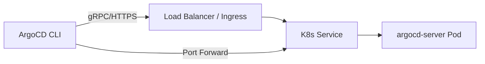

# How to Fix ArgoCD CLI Connection Refused

Author: [nawazdhandala](https://github.com/nawazdhandala)

Tags: ArgoCD, GitOps, Kubernetes, CLI, Troubleshooting

Description: Learn how to diagnose and resolve ArgoCD CLI connection refused errors including server unreachable, TLS issues, port forwarding problems, and authentication failures.

---

You run `argocd app list` and get "connection refused." The ArgoCD CLI cannot reach the server, and you are stuck. This is one of the most common issues when setting up or maintaining ArgoCD. Let us walk through every possible cause and fix.

## Understanding the CLI to Server Connection

The ArgoCD CLI communicates with the ArgoCD API server over gRPC (port 443 by default). The connection can break at several points:



## Error: "dial tcp: connection refused"

This is the most basic error. The CLI cannot establish a TCP connection to the server.

### Fix 1: Check If the Server Is Running

```bash
# Verify the argocd-server pod is running
kubectl get pods -n argocd -l app.kubernetes.io/name=argocd-server

# Check for crash loops or pending status
kubectl describe pod -n argocd -l app.kubernetes.io/name=argocd-server | tail -20
```

If the pod is not running, check events:

```bash
kubectl get events -n argocd --sort-by='.lastTimestamp' | grep argocd-server
```

### Fix 2: Verify the Server Address

Check what server the CLI is trying to reach:

```bash
# Show the current CLI context
argocd context

# List all configured contexts
argocd context list
```

If the address is wrong, update it:

```bash
# Login with the correct address
argocd login argocd.example.com --grpc-web
```

### Fix 3: Use Port Forwarding for Local Access

If you are on a development cluster or do not have an ingress set up:

```bash
# Start port forwarding to the ArgoCD server
kubectl port-forward svc/argocd-server -n argocd 8080:443 &

# Login using localhost
argocd login localhost:8080 --insecure
```

The `--insecure` flag is needed because the server's TLS certificate will not match `localhost`.

## Error: "transport: authentication handshake failed"

This means the TCP connection works, but TLS negotiation fails.

### Fix 1: Use --grpc-web Flag

If ArgoCD is behind an ingress that does not support HTTP/2 (required for gRPC), use gRPC-Web:

```bash
# Use gRPC-web which works over HTTP/1.1
argocd login argocd.example.com --grpc-web

# Or set it permanently in the CLI config
argocd login argocd.example.com --grpc-web --grpc-web-root-path=""
```

### Fix 2: Handle Self-Signed Certificates

If ArgoCD uses a self-signed certificate:

```bash
# Option 1: Skip TLS verification (development only)
argocd login argocd.example.com --insecure

# Option 2: Provide the CA certificate
argocd login argocd.example.com --certificate-authority /path/to/ca.crt

# Option 3: Use the --plaintext flag for non-TLS connections
argocd login argocd.example.com --plaintext
```

### Fix 3: Check If Server Is Running in Insecure Mode

If the ArgoCD server is configured with `--insecure` flag (common when TLS termination happens at ingress), the CLI needs to know:

```bash
# Check if server is running in insecure mode
kubectl get deploy argocd-server -n argocd -o jsonpath='{.spec.template.spec.containers[0].command}' | tr ',' '\n'
```

If `--insecure` is in the server command, connect with `--plaintext` when port-forwarding, or `--grpc-web` when going through ingress.

## Error: "context deadline exceeded"

The CLI can reach the server but the request times out before getting a response.

### Fix 1: Increase Timeout

```bash
# Use a longer timeout
argocd app list --grpc-web --server-timeout 60
```

### Fix 2: Check Server Load

```bash
# Check if the server is overloaded
kubectl top pod -n argocd -l app.kubernetes.io/name=argocd-server

# Check for high connection count
kubectl logs -n argocd deploy/argocd-server --tail=50 | grep -i "timeout\|deadline"
```

### Fix 3: Check Network Policies

Network policies might be blocking traffic:

```bash
# List network policies in the argocd namespace
kubectl get networkpolicies -n argocd

# Check if the policy allows ingress to argocd-server
kubectl describe networkpolicy -n argocd
```

## Error: "Unauthenticated" or "token expired"

The connection works but your session is invalid.

```bash
# Check current auth status
argocd account get-user-info

# Re-login
argocd login argocd.example.com --grpc-web

# If using SSO, use the --sso flag
argocd login argocd.example.com --grpc-web --sso
```

For CI/CD environments where interactive login is not possible, use auth tokens:

```bash
# Generate a token for automation
argocd account generate-token --account your-service-account

# Use the token in CLI commands
ARGOCD_AUTH_TOKEN=your-token argocd app list --server argocd.example.com --grpc-web
```

## Error: "permission denied" After Successful Connection

You can connect but cannot perform operations:

```bash
# Check your current permissions
argocd account can-i get applications '*'
argocd account can-i sync applications '*'

# Check which account you are logged in as
argocd account get-user-info
```

If permissions are wrong, the RBAC policy needs updating (that is a separate topic from connection issues).

## Debugging the Connection Step by Step

Here is a systematic approach to debug any CLI connection issue:

```bash
#!/bin/bash
# argocd-cli-debug.sh

SERVER="argocd.example.com"
NAMESPACE="argocd"

echo "=== ArgoCD CLI Connection Debug ==="

# Step 1: Check DNS resolution
echo -e "\n--- DNS Resolution ---"
nslookup $SERVER 2>&1 || echo "DNS resolution failed"

# Step 2: Check TCP connectivity
echo -e "\n--- TCP Connectivity ---"
nc -zv $SERVER 443 2>&1 || echo "TCP connection failed"

# Step 3: Check TLS
echo -e "\n--- TLS Check ---"
echo | openssl s_client -connect $SERVER:443 -servername $SERVER 2>/dev/null | \
  openssl x509 -noout -subject -dates 2>/dev/null || echo "TLS check failed"

# Step 4: Check ArgoCD server pod
echo -e "\n--- Server Pod Status ---"
kubectl get pods -n $NAMESPACE -l app.kubernetes.io/name=argocd-server

# Step 5: Check service
echo -e "\n--- Service ---"
kubectl get svc -n $NAMESPACE argocd-server

# Step 6: Check ingress
echo -e "\n--- Ingress ---"
kubectl get ingress -n $NAMESPACE

# Step 7: Try CLI connection
echo -e "\n--- CLI Connection Test ---"
argocd version --server $SERVER --grpc-web --insecure 2>&1
```

## Common Fixes Summary

| Error | Most Likely Cause | Fix |
|-------|------------------|-----|
| Connection refused | Server not running or wrong address | Check pod status, verify address |
| TLS handshake failed | Certificate mismatch | Use `--insecure` or `--grpc-web` |
| Context deadline exceeded | Network issue or server overloaded | Check network policies, increase timeout |
| Unauthenticated | Token expired | Re-login with `argocd login` |
| EOF | Ingress not supporting gRPC | Use `--grpc-web` flag |

## Setting Up CLI for Different Environments

To avoid connection issues across environments, set up named contexts:

```bash
# Set up dev context
argocd login dev-argocd.example.com --grpc-web --name dev

# Set up prod context
argocd login prod-argocd.example.com --grpc-web --name prod

# Switch between contexts
argocd context dev
argocd context prod

# List all contexts
argocd context list
```

## Summary

ArgoCD CLI connection refused errors almost always come down to one of four categories: the server is not running, the network path is blocked, TLS is misconfigured, or authentication is expired. Work through the debug steps systematically, starting with the simplest checks (is the pod running?) and moving to more complex ones (is the ingress routing correctly?). For production setups, always use `--grpc-web` when ArgoCD is behind an ingress controller, and set up proper TLS certificates to avoid needing `--insecure`.
