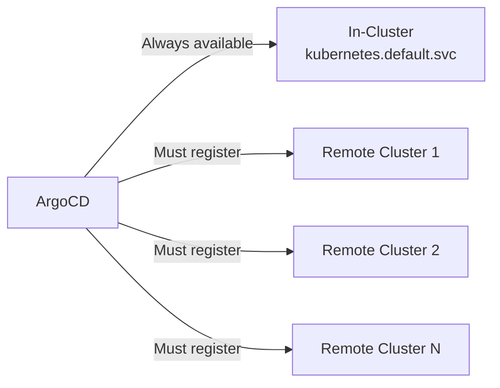

# How to Fix 'cluster not found' Error in ArgoCD

Author: [nawazdhandala](https://github.com/nawazdhandala)

Tags: ArgoCD, GitOps, Kubernetes, Troubleshooting, Multi-Cluster

Description: Resolve the ArgoCD cluster not found error by properly registering clusters, fixing credential secrets, and troubleshooting cluster connection issues in multi-cluster setups.

---

The "cluster not found" error in ArgoCD means your application references a destination cluster that ArgoCD does not recognize. This typically happens in multi-cluster setups where you are deploying applications to remote Kubernetes clusters managed by a central ArgoCD instance.

The error looks like:

```
cluster 'https://remote-cluster.example.com' is not configured in ArgoCD
```

Or:

```
cluster not found: https://remote-cluster.example.com
```

Let us walk through the common causes and how to fix each one.

## Understanding Cluster Registration in ArgoCD

ArgoCD maintains a list of known clusters in the form of Kubernetes Secrets in the `argocd` namespace. The in-cluster (where ArgoCD itself is running) is always available automatically. Remote clusters must be explicitly registered.



## Fix 1: Register the Remote Cluster

The most common cause - the cluster was never added to ArgoCD.

**Using the CLI:**

```bash
# First, make sure your kubeconfig has the remote cluster context
kubectl config get-contexts

# Add the cluster to ArgoCD
argocd cluster add remote-cluster-context --name remote-production
```

This command:
1. Creates a service account `argocd-manager` in the remote cluster
2. Grants it cluster-admin permissions
3. Stores the credentials as a Secret in the ArgoCD namespace

**Verify the cluster was added:**

```bash
argocd cluster list
```

You should see output like:

```
SERVER                                   NAME                VERSION  STATUS      MESSAGE
https://kubernetes.default.svc           in-cluster          1.28     Successful
https://remote-cluster.example.com       remote-production   1.28     Successful
```

## Fix 2: Fix the Server URL Mismatch

The cluster might be registered, but the URL in your application does not match the registered URL exactly.

**Check registered cluster URLs:**

```bash
argocd cluster list
```

**Compare with the application destination:**

```bash
argocd app get my-app -o yaml | grep -A5 destination
```

**Common URL mismatches:**

```
# These are all considered DIFFERENT by ArgoCD:
https://remote-cluster.example.com
https://remote-cluster.example.com:443
https://remote-cluster.example.com/
https://192.168.1.100:6443
```

**Fix the application to use the exact registered URL:**

```bash
argocd app set my-app --dest-server https://remote-cluster.example.com
```

Or if using cluster name instead of URL:

```bash
argocd app set my-app --dest-name remote-production
```

## Fix 3: Use Cluster Name Instead of Server URL

You can reference clusters by name instead of URL, which avoids URL mismatch issues:

```yaml
apiVersion: argoproj.io/v1alpha1
kind: Application
metadata:
  name: my-app
  namespace: argocd
spec:
  destination:
    # Use name instead of server URL
    name: remote-production
    namespace: default
```

**Note:** You cannot use both `name` and `server` in the destination. Use one or the other.

## Fix 4: Re-register a Broken Cluster

If the cluster was previously registered but the credentials have expired or the secret was deleted:

```bash
# Remove the old cluster registration
argocd cluster rm https://remote-cluster.example.com

# Re-add it
argocd cluster add remote-cluster-context --name remote-production
```

**Check if the cluster secret exists:**

```bash
kubectl get secrets -n argocd -l argocd.argoproj.io/secret-type=cluster
```

If the secret is missing, re-add the cluster with the `argocd cluster add` command.

## Fix 5: Register Cluster Declaratively

For GitOps workflows where you manage everything declaratively:

```yaml
apiVersion: v1
kind: Secret
metadata:
  name: remote-production-cluster
  namespace: argocd
  labels:
    argocd.argoproj.io/secret-type: cluster
type: Opaque
stringData:
  name: remote-production
  server: https://remote-cluster.example.com
  config: |
    {
      "bearerToken": "eyJhbGciOiJSUzI1NiIsImtpZCI...",
      "tlsClientConfig": {
        "insecure": false,
        "caData": "LS0tLS1CRUdJTi..."
      }
    }
```

**Using Service Account token authentication:**

```yaml
stringData:
  name: remote-production
  server: https://remote-cluster.example.com
  config: |
    {
      "bearerToken": "<service-account-token>",
      "tlsClientConfig": {
        "insecure": false,
        "caData": "<base64-encoded-ca-cert>"
      }
    }
```

**Using AWS EKS with IAM:**

```yaml
stringData:
  name: eks-production
  server: https://XXXXXXXXX.eks.amazonaws.com
  config: |
    {
      "awsAuthConfig": {
        "clusterName": "my-eks-cluster",
        "roleARN": "arn:aws:iam::123456789:role/argocd-cluster-role"
      },
      "tlsClientConfig": {
        "insecure": false,
        "caData": "<base64-encoded-ca-cert>"
      }
    }
```

## Fix 6: Handle the In-Cluster Reference

For the local cluster (where ArgoCD is installed), use the standard URL:

```yaml
destination:
  server: https://kubernetes.default.svc
  namespace: my-namespace
```

If you accidentally registered the local cluster with a different URL:

```bash
# Check if there is a duplicate cluster entry
argocd cluster list

# If you see both "in-cluster" and another entry pointing to the same cluster,
# update your application to use https://kubernetes.default.svc
```

## Fix 7: Fix Cluster Credentials

The cluster might be registered but the credentials are invalid:

```bash
# Check cluster connection status
argocd cluster get https://remote-cluster.example.com

# If status shows errors, check the service account in the remote cluster
kubectl --context remote-cluster-context get sa argocd-manager -n kube-system
kubectl --context remote-cluster-context get clusterrolebinding argocd-manager-role
```

**Recreate the service account if needed:**

```yaml
# Apply this to the remote cluster
apiVersion: v1
kind: ServiceAccount
metadata:
  name: argocd-manager
  namespace: kube-system
---
apiVersion: rbac.authorization.k8s.io/v1
kind: ClusterRoleBinding
metadata:
  name: argocd-manager-role
roleRef:
  apiGroup: rbac.authorization.k8s.io
  kind: ClusterRole
  name: cluster-admin
subjects:
  - kind: ServiceAccount
    name: argocd-manager
    namespace: kube-system
---
# For Kubernetes 1.24+, create a long-lived token
apiVersion: v1
kind: Secret
metadata:
  name: argocd-manager-token
  namespace: kube-system
  annotations:
    kubernetes.io/service-account.name: argocd-manager
type: kubernetes.io/service-account-token
```

Then update the ArgoCD cluster secret with the new token:

```bash
# Get the token from the remote cluster
TOKEN=$(kubectl --context remote-cluster-context get secret argocd-manager-token \
  -n kube-system -o jsonpath='{.data.token}' | base64 -d)

# Update the cluster in ArgoCD
echo $TOKEN  # Use this to update the cluster secret
```

## Fix 8: ApplicationSet Cluster Generator

If using ApplicationSets with a cluster generator and getting "cluster not found":

```yaml
apiVersion: argoproj.io/v1alpha1
kind: ApplicationSet
metadata:
  name: my-appset
  namespace: argocd
spec:
  generators:
    - clusters:
        selector:
          matchLabels:
            env: production
  template:
    spec:
      destination:
        server: '{{server}}'
        namespace: default
```

Make sure:
1. The clusters are registered in ArgoCD
2. The clusters have the correct labels

```bash
# Check cluster labels
argocd cluster get https://remote-cluster.example.com -o yaml | grep -A5 labels

# Add labels to a cluster
argocd cluster set https://remote-cluster.example.com \
  --label env=production
```

## Debugging Steps

```bash
# 1. List all registered clusters
argocd cluster list

# 2. Check a specific cluster's status
argocd cluster get https://remote-cluster.example.com

# 3. Check cluster secrets in Kubernetes
kubectl get secrets -n argocd -l argocd.argoproj.io/secret-type=cluster -o name

# 4. Check controller logs for cluster errors
kubectl logs -n argocd deployment/argocd-application-controller | \
  grep -i "cluster\|connection" | tail -20

# 5. Test connectivity from ArgoCD to the remote cluster
kubectl exec -n argocd deployment/argocd-application-controller -- \
  curl -k https://remote-cluster.example.com/healthz
```

## Summary

The "cluster not found" error means ArgoCD does not have the target cluster in its registry. Fix it by registering the cluster using `argocd cluster add`, ensuring the server URL matches exactly between the application spec and the cluster registration, or switching to name-based cluster references to avoid URL mismatches. For declarative setups, create the cluster Secret with the proper labels and credentials. Always verify with `argocd cluster list` after making changes.
