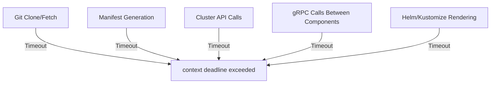

# How to Fix 'context deadline exceeded' in ArgoCD

Author: [nawazdhandala](https://github.com/nawazdhandala)

Tags: ArgoCD, GitOps, Kubernetes, Troubleshooting, Performance

Description: Resolve the context deadline exceeded error in ArgoCD by fixing timeout configurations, Git connectivity, slow manifest generation, and cluster communication delays.

---

The "context deadline exceeded" error in ArgoCD is a timeout error. It means an operation took longer than the configured time limit and was forcefully cancelled. This is a Go-level context timeout that can appear in several different places within ArgoCD - from Git operations to manifest generation to cluster communication.

Here is what the error typically looks like:

```text
FATA[0030] rpc error: code = DeadlineExceeded desc = context deadline exceeded
```

Or in the application status:

```text
ComparisonError: context deadline exceeded
```

This guide covers the most common scenarios where this error appears and how to fix each one.

## Where Context Deadline Exceeded Occurs

ArgoCD has multiple timeout boundaries. The error can come from any of these:



Understanding which operation timed out is the key to fixing this error.

## Scenario 1: Git Operations Timeout

The most common cause. ArgoCD's repo server needs to clone or fetch from your Git repository, and the operation takes too long.

**Symptoms:**

```text
rpc error: code = Unknown desc = Get "https://github.com/org/repo": context deadline exceeded
```

**Common reasons:**
- Large repositories taking too long to clone
- Slow network connection to the Git host
- Corporate proxy adding latency
- Rate limiting by GitHub/GitLab

**Fixes:**

Increase the Git request timeout:

```yaml
# argocd-cmd-params-cm ConfigMap
apiVersion: v1
kind: ConfigMap
metadata:
  name: argocd-cmd-params-cm
  namespace: argocd
data:
  # Increase Git request timeout (default is 15s for ls-remote, 90s for fetch)
  reposerver.git.request.timeout: "300"
```

Enable shallow clones for large repos:

```yaml
# argocd-cm ConfigMap
apiVersion: v1
kind: ConfigMap
metadata:
  name: argocd-cm
  namespace: argocd
data:
  # Enable shallow cloning to reduce clone time
  # This is available in ArgoCD 2.8+
```

Set up a Git proxy if you are behind a corporate firewall:

```yaml
# argocd-cmd-params-cm ConfigMap
data:
  reposerver.git.proxy.url: "http://proxy.corp.example.com:8080"
```

## Scenario 2: Manifest Generation Timeout

Helm template rendering or Kustomize builds can take a long time for complex charts.

**Symptoms:**

```text
ComparisonError: failed to generate manifest: context deadline exceeded
```

**Fix - increase the exec timeout:**

```yaml
# Set on the repo server deployment
containers:
  - name: argocd-repo-server
    env:
      - name: ARGOCD_EXEC_TIMEOUT
        # Default is 90s, increase for complex charts
        value: "300s"
```

You can also set this in the ConfigMap:

```yaml
# argocd-cmd-params-cm
apiVersion: v1
kind: ConfigMap
metadata:
  name: argocd-cmd-params-cm
  namespace: argocd
data:
  # Timeout for each manifest generation operation
  reposerver.default.cache.expiration: "10m"
```

**Optimize your manifests to generate faster:**

```bash
# Check how long Helm template takes locally
time helm template my-release ./chart --values values.yaml

# If it takes more than 30s locally, it will definitely timeout in ArgoCD
# Consider splitting large charts into smaller ones
```

## Scenario 3: Cluster Communication Timeout

When ArgoCD communicates with a remote cluster and the Kubernetes API is slow to respond:

**Symptoms:**

```text
failed to sync cluster: context deadline exceeded
```

**Check cluster connectivity:**

```bash
# Verify the cluster is reachable
argocd cluster list

# Check the cluster connection status
kubectl get secret -n argocd -l argocd.argoproj.io/secret-type=cluster
```

**Fix - increase the controller's Kubernetes client timeout:**

```yaml
# argocd-cmd-params-cm ConfigMap
data:
  # Increase timeout for k8s API calls
  controller.k8s.client.timeout: "120s"
```

For remote clusters behind VPN or with high latency:

```yaml
# Set cluster-specific configuration
apiVersion: v1
kind: Secret
metadata:
  name: remote-cluster
  namespace: argocd
  labels:
    argocd.argoproj.io/secret-type: cluster
type: Opaque
stringData:
  name: remote-production
  server: https://remote-cluster.example.com
  config: |
    {
      "tlsClientConfig": {
        "insecure": false
      },
      "execProviderConfig": {
        "command": "argocd-k8s-auth",
        "args": ["aws", "--cluster-name", "my-cluster"],
        "installHint": "Install argocd-k8s-auth"
      }
    }
```

## Scenario 4: gRPC Timeout Between Components

The ArgoCD API server communicates with the repo server and controller via gRPC. These calls have their own timeouts.

**Fix - increase the server-side timeout:**

```yaml
# argocd-cmd-params-cm ConfigMap
data:
  # Timeout for repo server operations
  reposerver.timeout.seconds: "300"
  # Default reconciliation timeout
  timeout.reconciliation: "180s"
```

## Scenario 5: CLI Login Timeout

When logging in via the ArgoCD CLI:

```text
FATA[0030] rpc error: code = DeadlineExceeded desc = context deadline exceeded
```

**Possible fixes:**

```bash
# Increase the client-side timeout with --grpc-web flag
argocd login argocd.example.com --grpc-web --grpc-web-root-path /

# If behind a slow proxy, increase timeout
# Check if the server is reachable first
curl -k https://argocd.example.com/api/version
```

If the server is reachable via HTTPS but not gRPC, your load balancer might not support HTTP/2:

```bash
# Use gRPC-Web as a workaround
argocd login argocd.example.com --grpc-web
```

## Scenario 6: Webhook Reconciliation Timeout

When ArgoCD receives a webhook but takes too long to process:

```yaml
# argocd-cmd-params-cm ConfigMap
data:
  # Increase the webhook processing timeout
  timeout.reconciliation: "300s"
```

## General Timeout Configuration Reference

Here is a reference of all the timeout-related settings you can configure:

```yaml
# argocd-cmd-params-cm - complete timeout configuration
apiVersion: v1
kind: ConfigMap
metadata:
  name: argocd-cmd-params-cm
  namespace: argocd
data:
  # Git operation timeout
  reposerver.git.request.timeout: "300"

  # Repo server operation timeout
  reposerver.timeout.seconds: "300"

  # Application reconciliation timeout
  timeout.reconciliation: "180s"

  # Reconciliation jitter
  timeout.reconciliation.jitter: "0s"

  # Hard reconciliation timeout
  timeout.hard.reconciliation: "0s"
```

And for environment variables on deployments:

```yaml
# Repo server deployment
env:
  - name: ARGOCD_EXEC_TIMEOUT
    value: "300s"
  - name: ARGOCD_GIT_ATTEMPTS_COUNT
    value: "5"
```

## Diagnosing Which Timeout Is Hit

Check the logs of the specific component to find out which operation timed out:

```bash
# Check repo server for Git or manifest generation timeouts
kubectl logs -n argocd deployment/argocd-repo-server --tail=200 | grep -i "deadline\|timeout"

# Check controller for cluster communication timeouts
kubectl logs -n argocd deployment/argocd-application-controller --tail=200 | grep -i "deadline\|timeout"

# Check API server for client-facing timeouts
kubectl logs -n argocd deployment/argocd-server --tail=200 | grep -i "deadline\|timeout"
```

## Preventive Measures

1. **Keep Git repositories lean** - avoid storing large binaries or unnecessary history
2. **Use webhooks instead of polling** to reduce unnecessary Git fetch operations
3. **Monitor operation durations** using ArgoCD Prometheus metrics like `argocd_git_request_duration_seconds`
4. **Scale the repo server** if you have many applications competing for manifest generation resources
5. **Use caching** effectively - the repo server caches generated manifests, so repeated operations should be faster

## Summary

The "context deadline exceeded" error is always a timeout. The fix is identifying which operation timed out and either increasing the timeout configuration or addressing the root cause of the slowness. Start by checking repo server logs to determine if it is a Git operation, manifest generation, or cluster communication issue. Then apply the appropriate timeout increase while also investigating why the operation is slow in the first place.
