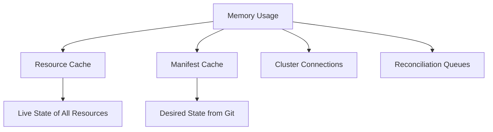

# How to Fix ArgoCD Controller OOMKilled Issues

Author: [nawazdhandala](https://github.com/nawazdhandala)

Tags: ArgoCD, GitOps, Kubernetes, Troubleshooting, Performance

Description: Resolve ArgoCD application controller OOMKilled crashes by tuning memory limits, enabling sharding, optimizing reconciliation settings, and reducing the controller memory footprint.

---

When the ArgoCD application controller pod gets killed with an OOMKilled (Out of Memory Killed) status, it means the pod exceeded its memory limit and the kubelet terminated it. This is one of the most disruptive ArgoCD issues because the controller is responsible for reconciling all applications. When it crashes, no applications get synced, health checks stop, and the entire GitOps workflow halts until it recovers.

The problem typically manifests as:

```bash
$ kubectl get pods -n argocd -l app.kubernetes.io/name=argocd-application-controller
NAME                                                READY   STATUS      RESTARTS   AGE
argocd-application-controller-5f88b7c6d9-xxxxx      0/1     OOMKilled   15         2h
```

Or in a crash loop:

```
CrashLoopBackOff (OOMKilled)
```

This guide covers why the controller runs out of memory and how to fix it permanently.

## Understanding Controller Memory Usage

The ArgoCD application controller maintains an in-memory cache of all resources it manages across all clusters. Its memory consumption is roughly proportional to:

- Number of applications
- Number of resources per application
- Number of clusters
- Size of manifests (large ConfigMaps, Secrets)
- Reconciliation frequency



## Step 1: Confirm the OOMKill

```bash
# Check the pod's last termination reason
kubectl describe pod -n argocd -l app.kubernetes.io/name=argocd-application-controller | \
  grep -A5 "Last State"

# Check events
kubectl get events -n argocd --sort-by='.lastTimestamp' | grep -i oom

# Check current memory usage
kubectl top pods -n argocd -l app.kubernetes.io/name=argocd-application-controller
```

Also check the current memory limits:

```bash
kubectl get deployment argocd-application-controller -n argocd \
  -o jsonpath='{.spec.template.spec.containers[0].resources}'
```

## Fix 1: Increase Memory Limits

The most immediate fix - give the controller more memory:

```yaml
apiVersion: apps/v1
kind: Deployment
metadata:
  name: argocd-application-controller
  namespace: argocd
spec:
  template:
    spec:
      containers:
        - name: argocd-application-controller
          resources:
            requests:
              cpu: "1"
              memory: "2Gi"
            limits:
              cpu: "4"
              memory: "8Gi"
```

**Memory sizing guidelines:**

| Applications | Approximate Memory Needed |
|-------------|--------------------------|
| 1 to 50     | 512Mi to 1Gi            |
| 50 to 200   | 1Gi to 2Gi              |
| 200 to 500  | 2Gi to 4Gi              |
| 500 to 1000 | 4Gi to 8Gi              |
| 1000+       | 8Gi+ (consider sharding) |

Apply the change:

```bash
kubectl apply -f controller-deployment.yaml
# Or patch directly
kubectl patch deployment argocd-application-controller -n argocd \
  --type json \
  -p '[{"op":"replace","path":"/spec/template/spec/containers/0/resources/limits/memory","value":"8Gi"}]'
```

## Fix 2: Enable Controller Sharding

Instead of one controller handling everything, distribute the load across multiple controller instances:

```yaml
# argocd-cmd-params-cm ConfigMap
apiVersion: v1
kind: ConfigMap
metadata:
  name: argocd-cmd-params-cm
  namespace: argocd
data:
  # Enable sharding with round-robin algorithm
  controller.sharding.algorithm: "round-robin"
```

Then scale the controller:

```bash
# If using a StatefulSet (HA mode)
kubectl scale statefulset argocd-application-controller -n argocd --replicas=3

# If using a Deployment (non-HA mode), switch to StatefulSet first
# or use the environment variable approach
```

**For Deployment-based installations, set the shard count:**

```yaml
env:
  - name: ARGOCD_CONTROLLER_REPLICAS
    value: "3"
```

Each shard handles a subset of clusters, significantly reducing per-instance memory usage.

## Fix 3: Reduce Reconciliation Frequency

More frequent reconciliation means more work and more memory:

```yaml
# argocd-cmd-params-cm ConfigMap
data:
  # Increase reconciliation interval (default is 180s)
  timeout.reconciliation: "300s"

  # Add jitter to spread reconciliations
  timeout.reconciliation.jitter: "30s"
```

## Fix 4: Limit Concurrent Operations

Reduce the number of concurrent operations the controller handles:

```yaml
# argocd-cmd-params-cm ConfigMap
data:
  # Reduce status processors (default: 20)
  controller.status.processors: "10"

  # Reduce operation processors (default: 10)
  controller.operation.processors: "5"
```

These settings control how many applications are reconciled simultaneously. Lower values reduce peak memory usage but increase overall reconciliation time.

## Fix 5: Exclude Unnecessary Resources

Reduce the amount of data the controller caches by excluding resource types you do not need:

```yaml
# argocd-cm ConfigMap
apiVersion: v1
kind: ConfigMap
metadata:
  name: argocd-cm
  namespace: argocd
data:
  resource.exclusions: |
    - apiGroups:
        - "events.k8s.io"
      kinds:
        - "Event"
      clusters:
        - "*"
    - apiGroups:
        - "cilium.io"
      kinds:
        - "CiliumIdentity"
        - "CiliumEndpoint"
      clusters:
        - "*"
    - apiGroups:
        - ""
      kinds:
        - "Event"
      clusters:
        - "*"
```

Excluding high-cardinality resources like Events and CiliumIdentity can save significant memory.

## Fix 6: Use Resource Inclusion Instead of Exclusion

For very large clusters, it can be more effective to specify what to include rather than what to exclude:

```yaml
data:
  resource.inclusions: |
    - apiGroups:
        - "*"
      kinds:
        - "Deployment"
        - "Service"
        - "ConfigMap"
        - "Secret"
        - "Ingress"
        - "StatefulSet"
        - "DaemonSet"
        - "Job"
        - "CronJob"
        - "HorizontalPodAutoscaler"
        - "PersistentVolumeClaim"
        - "ServiceAccount"
        - "Role"
        - "RoleBinding"
        - "ClusterRole"
        - "ClusterRoleBinding"
        - "Namespace"
      clusters:
        - "*"
```

## Fix 7: Optimize GOMEMLIMIT

Starting with Go 1.19, you can set `GOMEMLIMIT` to help the garbage collector work more efficiently:

```yaml
containers:
  - name: argocd-application-controller
    env:
      - name: GOMEMLIMIT
        # Set to ~90% of the memory limit
        value: "7GiB"
    resources:
      limits:
        memory: "8Gi"
```

This tells the Go runtime to be more aggressive with garbage collection before hitting the memory limit, reducing the chance of OOMKill.

## Fix 8: Disable Unnecessary Features

If you do not use certain features, disable them to save memory:

```yaml
# argocd-cmd-params-cm ConfigMap
data:
  # Disable orphaned resource monitoring if not needed
  # (This feature tracks all resources in managed namespaces)
```

In the AppProject, disable orphaned resource monitoring:

```yaml
apiVersion: argoproj.io/v1alpha1
kind: AppProject
spec:
  orphanedResources: null  # Disable orphaned resource monitoring
```

## Fix 9: Check for Memory Leaks

If memory grows steadily over time without stabilizing, there might be a memory leak:

```bash
# Monitor memory over time
kubectl top pods -n argocd -l app.kubernetes.io/name=argocd-application-controller

# Check the controller metrics
kubectl port-forward -n argocd deployment/argocd-application-controller 8082:8082
curl localhost:8082/metrics | grep process_resident_memory_bytes
```

If you identify a memory leak, check the ArgoCD GitHub issues for your version and consider upgrading to a newer version.

## Monitoring Memory Usage

Set up proactive monitoring to catch OOM issues before they happen:

```yaml
# PrometheusRule
apiVersion: monitoring.coreos.com/v1
kind: PrometheusRule
metadata:
  name: argocd-memory-alerts
spec:
  groups:
    - name: argocd.memory
      rules:
        - alert: ArgoCDControllerHighMemory
          expr: |
            container_memory_working_set_bytes{
              namespace="argocd",
              container="argocd-application-controller"
            } / container_spec_memory_limit_bytes{
              namespace="argocd",
              container="argocd-application-controller"
            } > 0.8
          for: 10m
          labels:
            severity: warning
          annotations:
            summary: "ArgoCD controller using >80% of memory limit"
        - alert: ArgoCDControllerOOMKilled
          expr: |
            kube_pod_container_status_last_terminated_reason{
              namespace="argocd",
              container="argocd-application-controller",
              reason="OOMKilled"
            } > 0
          for: 0m
          labels:
            severity: critical
          annotations:
            summary: "ArgoCD controller was OOMKilled"
```

## Capacity Planning

To plan your controller resources, gather these metrics:

```bash
# Count applications
argocd app list | wc -l

# Count total resources
argocd app list -o name | while read app; do
  argocd app resources "$app" | wc -l
done

# Count clusters
argocd cluster list | wc -l
```

Then use the sizing guidelines above to set appropriate memory limits, and add a 50% buffer for safety.

## Summary

ArgoCD controller OOMKilled is caused by the in-memory cache exceeding the pod's memory limit. The immediate fix is increasing memory limits. For long-term solutions, enable controller sharding to distribute load, exclude high-cardinality resources, reduce reconciliation frequency, and set GOMEMLIMIT for better garbage collection. Monitor memory usage proactively with Prometheus alerts to catch issues before they cause OOMKill crashes.
