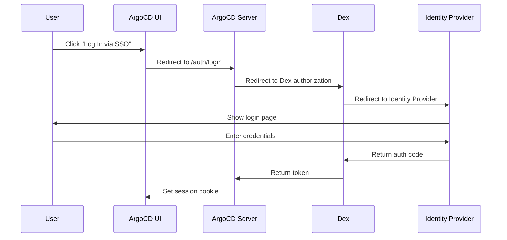

# How to Fix ArgoCD Dex Authentication Errors

Author: [nawazdhandala](https://github.com/nawazdhandala)

Tags: ArgoCD, GitOps, Kubernetes, Authentication, Dex

Description: Learn how to diagnose and fix common ArgoCD Dex authentication errors including OIDC failures, connector misconfigurations, and token issues that prevent users from logging in.

---

Dex is the identity broker that sits between ArgoCD and your identity provider. When Dex breaks, nobody can log in - and the error messages are often cryptic enough to leave you staring at logs for hours. This guide walks through every common Dex authentication error and how to fix each one.

## Understanding How Dex Works in ArgoCD

Before diving into fixes, you need to understand the authentication flow:



When any link in this chain breaks, authentication fails. Let us look at the most common errors.

## Error 1: "Failed to authenticate: no session information"

This typically happens when the Dex server is not reachable from the ArgoCD server.

First, check if the Dex pod is running:

```bash
# Check Dex pod status
kubectl get pods -n argocd -l app.kubernetes.io/name=argocd-dex-server

# Check Dex logs for startup errors
kubectl logs -n argocd -l app.kubernetes.io/name=argocd-dex-server --tail=100
```

If the pod is running but authentication still fails, verify the Dex gRPC connection:

```bash
# Test Dex connectivity from argocd-server pod
kubectl exec -n argocd deploy/argocd-server -- \
  curl -s http://argocd-dex-server:5557/healthz
```

If the connection fails, check the service:

```bash
# Verify the Dex service exists and has endpoints
kubectl get svc -n argocd argocd-dex-server
kubectl get endpoints -n argocd argocd-dex-server
```

## Error 2: "Invalid redirect_uri"

This is one of the most frequent Dex errors. It happens when the callback URL configured in your identity provider does not match what ArgoCD sends.

Check your current ArgoCD URL configuration:

```bash
# Get the configured ArgoCD URL
kubectl get configmap argocd-cm -n argocd -o jsonpath='{.data.url}'
```

The redirect URI must follow this pattern: `https://<your-argocd-url>/auth/callback`

Update the ArgoCD ConfigMap if the URL is wrong:

```yaml
# argocd-cm ConfigMap
apiVersion: v1
kind: ConfigMap
metadata:
  name: argocd-cm
  namespace: argocd
data:
  url: "https://argocd.example.com"
  dex.config: |
    connectors:
      - type: github
        id: github
        name: GitHub
        config:
          clientID: your-client-id
          clientSecret: $dex.github.clientSecret
          orgs:
            - name: your-org
```

Make sure the redirect URI in your identity provider is set to exactly:
```
https://argocd.example.com/auth/callback
```

## Error 3: "Dex: failed to query connector"

This error means Dex cannot communicate with the upstream identity provider. Common causes include network issues, expired credentials, or wrong connector configuration.

```bash
# Check Dex logs for connector errors
kubectl logs -n argocd deploy/argocd-dex-server | grep -i "failed\|error\|connector"
```

For OIDC connectors, verify the issuer URL is reachable from inside the cluster:

```bash
# Test connectivity to the OIDC issuer from within the cluster
kubectl run -n argocd curl-test --rm -it --image=curlimages/curl -- \
  curl -s https://accounts.google.com/.well-known/openid-configuration
```

## Error 4: "Token validation failed" or "Invalid token"

Token issues usually come from clock skew between your Dex server and the ArgoCD server, or from an expired signing key.

```bash
# Check if there is clock skew between pods
kubectl exec -n argocd deploy/argocd-dex-server -- date
kubectl exec -n argocd deploy/argocd-server -- date
```

If the clocks are off by more than a few seconds, you have a clock skew problem. Fix it at the node level with NTP synchronization.

For signing key issues, restart Dex to regenerate keys:

```bash
# Restart the Dex server to regenerate signing keys
kubectl rollout restart deployment argocd-dex-server -n argocd
```

## Error 5: "Connector not found" or "Unknown connector"

This happens when the connector ID referenced in the login request does not exist in the Dex configuration.

```bash
# Verify the Dex configuration has the connector defined
kubectl get configmap argocd-cm -n argocd -o jsonpath='{.data.dex\.config}' | head -30
```

Make sure connector IDs are consistent. Here is an example with multiple connectors:

```yaml
# argocd-cm ConfigMap - dex.config section
dex.config: |
  connectors:
    - type: oidc
      id: okta
      name: Okta
      config:
        issuer: https://your-org.okta.com
        clientID: $dex.okta.clientID
        clientSecret: $dex.okta.clientSecret
        insecureEnableGroups: true
        scopes:
          - openid
          - profile
          - email
          - groups
    - type: github
      id: github
      name: GitHub
      config:
        clientID: $dex.github.clientID
        clientSecret: $dex.github.clientSecret
        orgs:
          - name: your-org
```

## Error 6: "Secret not found" for Dex Credentials

When Dex references secrets that do not exist in `argocd-secret`, authentication fails silently.

```bash
# Check if the referenced secrets exist
kubectl get secret argocd-secret -n argocd -o jsonpath='{.data}' | python3 -c "
import sys, json, base64
data = json.load(sys.stdin)
for k, v in sorted(data.items()):
    if 'dex' in k.lower():
        print(f'{k}: {base64.b64decode(v).decode()[:10]}...')
"
```

Add missing secrets:

```bash
# Add a Dex client secret
kubectl patch secret argocd-secret -n argocd --type merge -p '{
  "stringData": {
    "dex.github.clientSecret": "your-actual-client-secret"
  }
}'

# Restart Dex after updating secrets
kubectl rollout restart deployment argocd-dex-server -n argocd
```

## Error 7: Dex CrashLoopBackOff

If the Dex pod is crash-looping, the configuration is likely invalid YAML or references missing resources.

```bash
# Get the crash reason
kubectl describe pod -n argocd -l app.kubernetes.io/name=argocd-dex-server | tail -30

# Check previous logs
kubectl logs -n argocd -l app.kubernetes.io/name=argocd-dex-server --previous --tail=50
```

A common cause is invalid YAML indentation in the `dex.config` section. Validate your config:

```bash
# Extract and validate the Dex config
kubectl get configmap argocd-cm -n argocd -o jsonpath='{.data.dex\.config}' | \
  python3 -c "import yaml, sys; yaml.safe_load(sys.stdin); print('Valid YAML')"
```

## Complete Dex Health Check Script

Here is a comprehensive script that checks all common Dex issues at once:

```bash
#!/bin/bash
# dex-health-check.sh - Check ArgoCD Dex health

NAMESPACE="argocd"
echo "=== Dex Health Check ==="

# Check pod status
echo -e "\n--- Pod Status ---"
kubectl get pods -n $NAMESPACE -l app.kubernetes.io/name=argocd-dex-server

# Check service
echo -e "\n--- Service Status ---"
kubectl get svc -n $NAMESPACE argocd-dex-server

# Check endpoints
echo -e "\n--- Endpoints ---"
kubectl get endpoints -n $NAMESPACE argocd-dex-server

# Check ArgoCD URL config
echo -e "\n--- ArgoCD URL ---"
kubectl get configmap argocd-cm -n $NAMESPACE -o jsonpath='{.data.url}'
echo ""

# Check Dex config exists
echo -e "\n--- Dex Config Present ---"
CONFIG=$(kubectl get configmap argocd-cm -n $NAMESPACE -o jsonpath='{.data.dex\.config}')
if [ -z "$CONFIG" ]; then
    echo "WARNING: No dex.config found in argocd-cm"
else
    echo "Dex config found, connectors:"
    echo "$CONFIG" | grep "type:" | sed 's/^/  /'
fi

# Check recent errors
echo -e "\n--- Recent Dex Errors ---"
kubectl logs -n $NAMESPACE -l app.kubernetes.io/name=argocd-dex-server --tail=20 2>/dev/null | \
  grep -i "error\|fatal\|panic" || echo "No recent errors found"
```

## Fixing Dex After ArgoCD Upgrade

After upgrading ArgoCD, Dex configuration format may change. Check the release notes for breaking changes and update your Dex config accordingly:

```bash
# Check the running Dex version
kubectl get pods -n argocd -l app.kubernetes.io/name=argocd-dex-server \
  -o jsonpath='{.items[0].spec.containers[0].image}'

# After updating config, restart both Dex and ArgoCD server
kubectl rollout restart deployment argocd-dex-server -n argocd
kubectl rollout restart deployment argocd-server -n argocd

# Wait for rollout
kubectl rollout status deployment argocd-dex-server -n argocd
kubectl rollout status deployment argocd-server -n argocd
```

## Summary

Most Dex authentication errors fall into a few categories: misconfigured redirect URIs, unreachable identity providers, missing secrets, or invalid YAML configuration. Always start by checking Dex pod health and logs, then verify the `argocd-cm` ConfigMap settings. For monitoring Dex health in production, consider setting up alerts on the Dex pod status and watching for authentication error rates using OneUptime monitoring.
