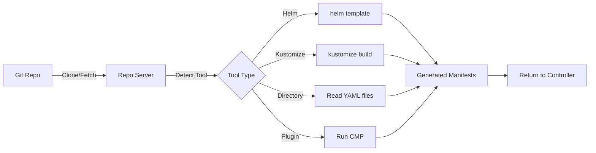

# How to Fix 'failed to generate manifests' Error in ArgoCD

Author: [nawazdhandala](https://github.com/nawazdhandala)

Tags: ArgoCD, GitOps, Kubernetes, Troubleshooting, Manifests

Description: Fix the ArgoCD failed to generate manifests error by resolving repo server issues, fixing source configuration, addressing tool detection problems, and handling timeout failures.

---

The "failed to generate manifests" error in ArgoCD is a broad error that means the repo server could not produce Kubernetes YAML from your application source. This is the step where ArgoCD takes your Git repository contents and turns them into concrete Kubernetes resources - regardless of whether you are using Helm, Kustomize, plain YAML, or a custom plugin.

The error usually appears as:

```text
ComparisonError: failed to generate manifests for source 1 of 1:
rpc error: code = Unknown desc = <specific reason>
```

This guide covers all the common reasons and provides targeted solutions.

## Understanding Manifest Generation

ArgoCD's manifest generation pipeline looks like this:



The failure can happen at any stage: cloning the repo, detecting the tool type, or running the specific tool.

## Cause 1: Repository Cannot Be Cloned

If ArgoCD cannot clone or fetch from Git:

```text
failed to generate manifests: failed to ls-remote: authentication required
```

**Check repo server connectivity:**

```bash
kubectl logs -n argocd deployment/argocd-repo-server --tail=100 | \
  grep -i "error\|fail\|auth"
```

**Verify repository credentials:**

```bash
argocd repo list
argocd repo get https://github.com/org/repo
```

See our guide on [fixing repository not accessible errors](https://oneuptime.com/blog/post/2026-02-26-argocd-fix-repository-not-accessible/view) for detailed solutions.

## Cause 2: Path Not Found in Repository

The application points to a directory that does not exist in the repo:

```text
failed to generate manifests: path 'deploy/kubernetes' does not exist in repository
```

**Check the path in the application spec:**

```bash
argocd app get my-app -o yaml | grep path
```

**Verify the path exists in the correct branch:**

```bash
git ls-tree -d HEAD deploy/kubernetes
```

**Fix by updating the path:**

```bash
argocd app set my-app --path correct/path
```

## Cause 3: Tool Detection Failed

ArgoCD cannot determine whether to use Helm, Kustomize, or plain YAML:

```text
failed to generate manifests: tool detection failed
```

ArgoCD detects the tool type by looking for:
- `Chart.yaml` - Helm
- `kustomization.yaml`, `kustomization.yml`, or `Kustomization` - Kustomize
- `.yaml`/`.json` files - Directory (plain YAML)

**If the detection is wrong or ambiguous, force the tool type:**

```yaml
apiVersion: argoproj.io/v1alpha1
kind: Application
spec:
  source:
    repoURL: https://github.com/org/repo
    path: deploy/
    # Explicitly set the directory type
    directory:
      recurse: true
```

Or for Helm:

```yaml
spec:
  source:
    repoURL: https://github.com/org/repo
    path: charts/my-chart
    helm:
      valueFiles:
        - values.yaml
```

## Cause 4: Empty Directory

The specified path exists but contains no YAML files:

```text
failed to generate manifests: no YAML or JSON files found
```

**Check what is in the directory:**

```bash
git ls-tree HEAD deploy/
```

**Fix:** Add YAML files to the directory or update the path.

## Cause 5: Repo Server Out of Memory

The repo server pod does not have enough memory to process the manifests:

```text
failed to generate manifests: signal: killed
```

**Check repo server resource usage:**

```bash
kubectl top pods -n argocd -l app.kubernetes.io/name=argocd-repo-server

# Check for OOMKilled events
kubectl describe pod -n argocd -l app.kubernetes.io/name=argocd-repo-server | \
  grep -A5 "Last State"
```

**Increase resources:**

```yaml
# In the repo server deployment
resources:
  requests:
    cpu: "500m"
    memory: "1Gi"
  limits:
    cpu: "2"
    memory: "4Gi"
```

## Cause 6: Manifest Generation Timeout

Large repos or complex charts can exceed the default timeout:

```text
failed to generate manifests: context deadline exceeded
```

**Increase the exec timeout:**

```yaml
# Repo server deployment
env:
  - name: ARGOCD_EXEC_TIMEOUT
    value: "300s"
```

See our detailed guide on [fixing context deadline exceeded errors](https://oneuptime.com/blog/post/2026-02-26-argocd-fix-context-deadline-exceeded/view) for more solutions.

## Cause 7: Config Management Plugin (CMP) Failure

If using a custom plugin, the plugin process might fail:

```text
failed to generate manifests: plugin error: exit status 1
```

**Check the plugin sidecar logs:**

```bash
# Find the CMP sidecar container
kubectl get pods -n argocd -l app.kubernetes.io/name=argocd-repo-server -o jsonpath='{.items[0].spec.containers[*].name}'

# Check the plugin container logs
kubectl logs -n argocd deployment/argocd-repo-server -c my-plugin
```

**Common plugin issues:**
- Plugin binary not found
- Missing environment variables
- Permission denied on the plugin executable
- Plugin returned invalid YAML

**Debug by testing the plugin locally:**

```bash
# Run the plugin command manually
cd /path/to/your/source
your-plugin-command generate ./
```

## Cause 8: Multiple Sources Configuration Error

When using multiple sources, one of the sources might fail:

```text
failed to generate manifests for source 2 of 3: <error>
```

The error message tells you which source failed. Check the configuration for that specific source:

```yaml
spec:
  sources:
    - repoURL: https://github.com/org/repo1  # Source 1
      path: base/
    - repoURL: https://github.com/org/repo2  # Source 2 - this one failed
      path: overlays/
      targetRevision: main
    - repoURL: https://charts.example.com      # Source 3
      chart: my-chart
      targetRevision: 1.0.0
```

Verify each source independently:

```bash
# Check each repository is accessible
argocd repo get https://github.com/org/repo2
```

## Cause 9: Invalid JSON or YAML in Source Directory

When using the directory source type, invalid files will cause generation failure:

```text
failed to generate manifests: error unmarshaling JSON:
json: cannot unmarshal string into Go value
```

**Find and fix invalid files:**

```bash
# Validate all YAML files in the directory
for f in deploy/*.yaml; do
  echo "Checking $f..."
  python3 -c "import yaml; yaml.safe_load(open('$f'))" || echo "INVALID: $f"
done
```

**Exclude non-manifest files from the directory:**

```yaml
spec:
  source:
    directory:
      include: '*.yaml'
      exclude: 'README.md,scripts/*'
```

## Cause 10: Repo Server Pod Not Ready

The repo server itself might be in a bad state:

```bash
# Check repo server health
kubectl get pods -n argocd -l app.kubernetes.io/name=argocd-repo-server

# If stuck or crashing, restart it
kubectl rollout restart deployment argocd-repo-server -n argocd
```

## Quick Debug Workflow

```bash
# 1. Get the full error message
argocd app get my-app

# 2. Check repo server logs
kubectl logs -n argocd deployment/argocd-repo-server --tail=200 | \
  grep "my-app" | tail -20

# 3. Try a hard refresh
argocd app get my-app --hard-refresh

# 4. Check if the repo is accessible
argocd repo get https://github.com/org/repo

# 5. Verify the path and revision exist
# (check in Git directly)

# 6. Test manifest generation locally
# For Helm: helm template . --values values.yaml
# For Kustomize: kustomize build .
# For plain YAML: kubectl apply --dry-run=client -f .
```

## Summary

The "failed to generate manifests" error indicates a breakdown in ArgoCD's manifest generation pipeline. Start by reading the full error message in the application status or repo server logs - it usually contains the specific reason. Common causes include repository access failures, incorrect paths, tool detection issues, resource exhaustion on the repo server, and timeout exceeded for complex charts. Fix the underlying issue, push to Git if needed, and ArgoCD will retry on the next reconciliation.
