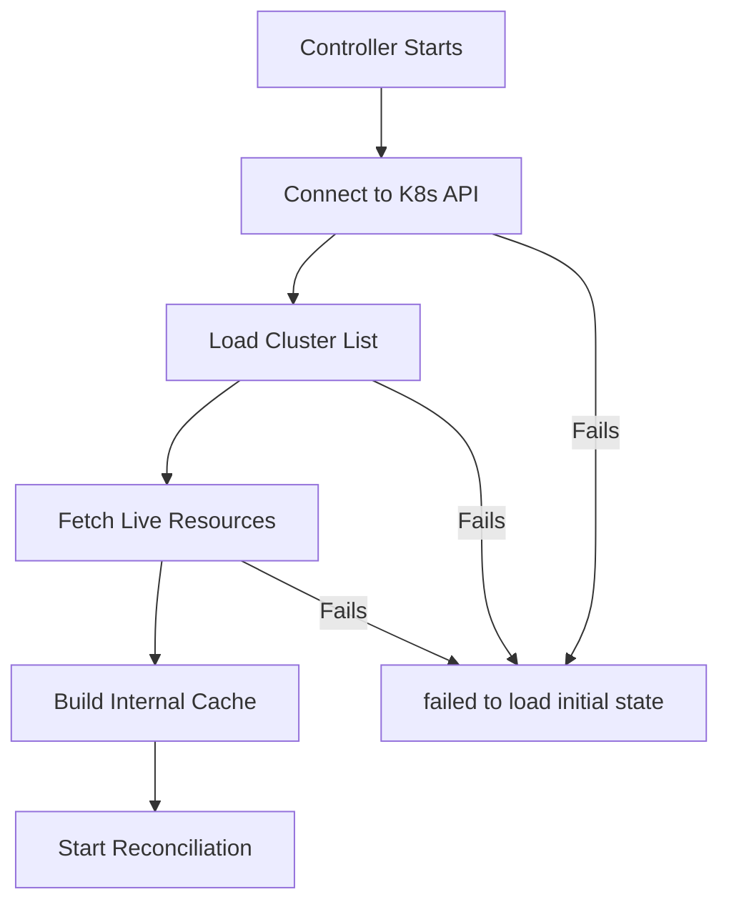

# How to Fix 'failed to load initial state' in ArgoCD

Author: [nawazdhandala](https://github.com/nawazdhandala)

Tags: ArgoCD, GitOps, Kubernetes, Troubleshooting, Controllers

Description: Resolve the ArgoCD failed to load initial state error by fixing Kubernetes API connectivity, RBAC permissions, etcd health issues, and controller startup problems.

---

The "failed to load initial state" error in ArgoCD occurs during the application controller's startup or reconciliation loop. It means the controller could not load the current state of resources from the Kubernetes API server. Without this initial state, ArgoCD cannot compare desired state against live state, and all applications will appear as Unknown or show errors.

The error typically appears in the application controller logs:

```text
level=error msg="failed to load initial state of resource <resource>: the server could not find the requested resource"
```

Or:

```text
FATA[0001] failed to load initial state: <various reasons>
```

This guide explains the causes and provides step-by-step solutions.

## Understanding the Initial State Load

When the ArgoCD application controller starts up, it needs to:

1. Connect to the Kubernetes API server
2. List all registered clusters
3. Load the current state of all managed resources from each cluster
4. Build an internal cache of the live state
5. Begin the reconciliation loop

If any of these steps fail, you get the "failed to load initial state" error.



## Cause 1: Kubernetes API Server Unreachable

The most fundamental cause - the controller cannot talk to the Kubernetes API.

**Check if the API server is healthy:**

```bash
# Check the API server from within the cluster
kubectl get --raw /healthz

# Check from the controller pod specifically
kubectl exec -n argocd deployment/argocd-application-controller -- \
  wget -qO- https://kubernetes.default.svc/healthz --no-check-certificate
```

**Check if the controller's service account has proper access:**

```bash
# Check the service account
kubectl get sa argocd-application-controller -n argocd

# Check the cluster role binding
kubectl get clusterrolebinding | grep argocd
```

If the RBAC bindings are missing, recreate them:

```yaml
apiVersion: rbac.authorization.k8s.io/v1
kind: ClusterRoleBinding
metadata:
  name: argocd-application-controller
roleRef:
  apiGroup: rbac.authorization.k8s.io
  kind: ClusterRole
  name: argocd-application-controller
subjects:
  - kind: ServiceAccount
    name: argocd-application-controller
    namespace: argocd
```

## Cause 2: CRDs Not Yet Installed

If ArgoCD tries to load resources for a CRD that does not exist in the cluster, the API call fails:

```text
failed to load initial state of resource: the server could not find the requested resource (get certificates.cert-manager.io)
```

**Fix by installing the missing CRDs:**

```bash
# Check which CRD is missing from the error message
kubectl get crd certificates.cert-manager.io

# If missing, install the CRD first
kubectl apply -f https://github.com/cert-manager/cert-manager/releases/download/v1.14.0/cert-manager.crds.yaml
```

**Or exclude the resource type from ArgoCD's watch:**

```yaml
# argocd-cm ConfigMap
apiVersion: v1
kind: ConfigMap
metadata:
  name: argocd-cm
  namespace: argocd
data:
  resource.exclusions: |
    - apiGroups:
        - "cert-manager.io"
      kinds:
        - "Certificate"
        - "Issuer"
      clusters:
        - "*"
```

## Cause 3: etcd Performance Issues

If the Kubernetes cluster's etcd is under heavy load or has storage issues, API responses can be slow or fail:

**Check etcd health (if you have access):**

```bash
# Check etcd pods
kubectl get pods -n kube-system | grep etcd

# Check etcd metrics if available
kubectl exec -n kube-system etcd-master-node -- \
  etcdctl endpoint health --endpoints=https://127.0.0.1:2379
```

**Symptoms of etcd issues:**
- Slow kubectl responses across the cluster
- Timeouts on List operations
- "etcdserver: request timed out" in API server logs

**Mitigate by reducing ArgoCD's API load:**

```yaml
# argocd-cmd-params-cm ConfigMap
data:
  # Increase reconciliation interval to reduce API load
  timeout.reconciliation: "300s"
  # Limit concurrent reconciliations
  controller.status.processors: "10"
  controller.operation.processors: "5"
```

## Cause 4: Too Many Resources to Load

If ArgoCD manages thousands of resources across many applications, the initial state load can overwhelm the controller:

**Check the controller's resource usage:**

```bash
kubectl top pods -n argocd -l app.kubernetes.io/name=argocd-application-controller
```

**Increase controller memory limits:**

```yaml
# In the controller deployment
resources:
  requests:
    cpu: "1"
    memory: "2Gi"
  limits:
    cpu: "4"
    memory: "8Gi"
```

**Enable controller sharding to distribute the load:**

```yaml
# argocd-cmd-params-cm ConfigMap
data:
  controller.sharding.algorithm: "round-robin"
```

Then scale the controller:

```bash
# Scale to multiple replicas with sharding
kubectl scale statefulset argocd-application-controller -n argocd --replicas=3
```

## Cause 5: Network Policies Blocking API Access

If network policies are in place, the controller pod might be blocked from reaching the API server:

```bash
# Check network policies in the argocd namespace
kubectl get networkpolicies -n argocd

# Test API connectivity from the controller
kubectl exec -n argocd deployment/argocd-application-controller -- \
  wget -qO- --timeout=5 https://kubernetes.default.svc/api --no-check-certificate
```

**Add a network policy to allow API access:**

```yaml
apiVersion: networking.k8s.io/v1
kind: NetworkPolicy
metadata:
  name: argocd-controller-api-access
  namespace: argocd
spec:
  podSelector:
    matchLabels:
      app.kubernetes.io/name: argocd-application-controller
  policyTypes:
    - Egress
  egress:
    # Allow access to Kubernetes API
    - to:
        - ipBlock:
            cidr: 0.0.0.0/0
      ports:
        - port: 443
          protocol: TCP
        - port: 6443
          protocol: TCP
    # Allow DNS
    - to: []
      ports:
        - port: 53
          protocol: UDP
        - port: 53
          protocol: TCP
```

## Cause 6: Remote Cluster Credentials Invalid

If the error mentions a specific remote cluster, the credentials for that cluster may be invalid:

```bash
# Check cluster connection status
argocd cluster list

# Look for clusters with "Unknown" or error status
```

**Fix by updating cluster credentials:**

```bash
# Remove and re-add the cluster
argocd cluster rm https://remote-cluster.example.com
argocd cluster add remote-context --name remote-cluster
```

## Cause 7: Controller Restart During Heavy Load

If the controller was killed (OOMKilled or evicted) and restarts during a period of heavy activity, the initial state load can fail due to resource contention:

**Check for OOMKilled events:**

```bash
kubectl describe pod -n argocd -l app.kubernetes.io/name=argocd-application-controller | \
  grep -A5 "Last State"
```

**Check events:**

```bash
kubectl get events -n argocd --sort-by='.lastTimestamp' | grep controller
```

**Fix by increasing memory and using progressive loading:**

```yaml
# Increase resources significantly
resources:
  requests:
    cpu: "2"
    memory: "4Gi"
  limits:
    cpu: "4"
    memory: "8Gi"
```

## Recovery Steps

After addressing the root cause, follow these steps to recover:

```bash
# 1. Restart the controller
kubectl rollout restart deployment argocd-application-controller -n argocd

# 2. Wait for it to become ready
kubectl rollout status deployment argocd-application-controller -n argocd

# 3. Check controller logs for successful startup
kubectl logs -n argocd deployment/argocd-application-controller --tail=50

# 4. Verify applications are loading
argocd app list

# 5. If specific apps are stuck, force refresh them
argocd app get my-app --hard-refresh
```

## Monitoring for Prevention

Set up monitoring to catch issues before they cause state load failures:

```yaml
# PrometheusRule for ArgoCD controller health
apiVersion: monitoring.coreos.com/v1
kind: PrometheusRule
metadata:
  name: argocd-controller-alerts
spec:
  groups:
    - name: argocd.controller
      rules:
        - alert: ArgoCDControllerNotReady
          expr: |
            kube_pod_container_status_ready{
              namespace="argocd",
              container="argocd-application-controller"
            } == 0
          for: 5m
          labels:
            severity: critical
          annotations:
            summary: "ArgoCD controller is not ready"
```

## Summary

The "failed to load initial state" error indicates the ArgoCD controller cannot read the current state of Kubernetes resources. Start by checking Kubernetes API connectivity and RBAC permissions. Then look for missing CRDs, resource exhaustion on the controller pod, and network policy restrictions. For large-scale deployments, consider controller sharding and increased resource limits. Always check the controller logs for the specific resource or cluster that is causing the failure.
