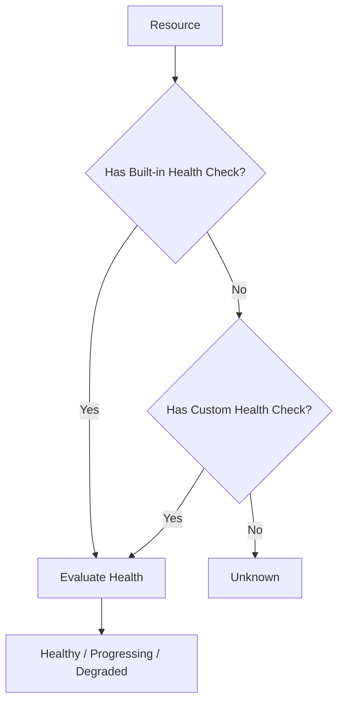

# How to Fix ArgoCD Application Health 'Unknown'

Author: [nawazdhandala](https://github.com/nawazdhandala)

Tags: ArgoCD, GitOps, Kubernetes, Troubleshooting, Health Checks

Description: Resolve ArgoCD applications showing Unknown health status by configuring custom health checks for CRDs, fixing health assessment scripts, and troubleshooting missing resource types.

---

When an ArgoCD application shows a health status of "Unknown," it means ArgoCD cannot determine the health of one or more resources in the application. The application will appear with a grey question mark in the UI, and any automation that depends on health status will not work properly.

The Unknown status is distinct from Progressing or Degraded - it means ArgoCD has no way to evaluate the resource's health at all, not that the resource is unhealthy.

## Why Health Status Shows Unknown

ArgoCD has built-in health checks for standard Kubernetes resources like Deployments, Services, StatefulSets, and Jobs. For resources it does not recognize - particularly Custom Resource Definitions (CRDs) - it defaults to Unknown.



## Step 1: Identify the Unknown Resources

```bash
# List resources with their health status
argocd app resources my-app

# Filter for Unknown health
argocd app resources my-app | grep Unknown
```

Output might look like:

```
GROUP                 KIND             NAMESPACE   NAME           STATUS  HEALTH   MESSAGE
cert-manager.io       Certificate      production  my-cert        Synced  Unknown
monitoring.coreos.com ServiceMonitor   production  my-monitor     Synced  Unknown
```

## Step 2: Determine the Resource Type

The resources showing Unknown are typically CRDs. Check what resource types are involved:

```bash
# Get the API resource info
kubectl api-resources | grep certificate
kubectl api-resources | grep servicemonitor
```

## Fix 1: Add Custom Health Checks in Lua

ArgoCD uses Lua scripts for health assessment. You can add custom health checks for your CRDs in the `argocd-cm` ConfigMap.

**Example: Health check for cert-manager Certificates:**

```yaml
apiVersion: v1
kind: ConfigMap
metadata:
  name: argocd-cm
  namespace: argocd
data:
  resource.customizations.health.cert-manager.io_Certificate: |
    hs = {}
    if obj.status ~= nil then
      if obj.status.conditions ~= nil then
        for i, condition in ipairs(obj.status.conditions) do
          if condition.type == "Ready" and condition.status == "True" then
            hs.status = "Healthy"
            hs.message = condition.message
            return hs
          end
          if condition.type == "Ready" and condition.status == "False" then
            hs.status = "Degraded"
            hs.message = condition.message
            return hs
          end
        end
      end
    end
    hs.status = "Progressing"
    hs.message = "Waiting for certificate to be issued"
    return hs
```

**Example: Health check for Prometheus ServiceMonitors:**

```yaml
data:
  resource.customizations.health.monitoring.coreos.com_ServiceMonitor: |
    hs = {}
    hs.status = "Healthy"
    hs.message = "ServiceMonitor is configured"
    return hs
```

ServiceMonitors do not have a status field, so they are always healthy if they exist.

**Example: Health check for External Secrets:**

```yaml
data:
  resource.customizations.health.external-secrets.io_ExternalSecret: |
    hs = {}
    if obj.status ~= nil then
      if obj.status.conditions ~= nil then
        for i, condition in ipairs(obj.status.conditions) do
          if condition.type == "Ready" then
            if condition.status == "True" then
              hs.status = "Healthy"
              hs.message = condition.message
              return hs
            else
              hs.status = "Degraded"
              hs.message = condition.message
              return hs
            end
          end
        end
      end
    end
    hs.status = "Progressing"
    hs.message = "Waiting for secret to be synced"
    return hs
```

## Fix 2: Use Wildcard Health Checks

For resources that do not have a status field and are always healthy when they exist:

```yaml
data:
  # Mark all resources of this type as healthy
  resource.customizations.health.mygroup.io_MyResource: |
    hs = {}
    hs.status = "Healthy"
    return hs
```

## Fix 3: Use the Built-in Health Check Library

ArgoCD has an extensive library of health checks. Before writing your own, check if one already exists in a newer ArgoCD version. Upgrading ArgoCD might add built-in health checks for the CRDs you use.

Common CRDs with built-in health checks in recent ArgoCD versions:
- cert-manager Certificate, ClusterIssuer, Issuer
- Argo Rollouts Rollout, AnalysisRun
- Istio VirtualService, DestinationRule
- Sealed Secrets SealedSecret
- Crossplane resources
- Knative Service

```bash
# Check your ArgoCD version
argocd version
```

## Fix 4: Health Check for Generic Status Conditions

Many CRDs follow the Kubernetes convention of using `status.conditions` with a `Ready` type. Here is a generic health check that works for most of them:

```yaml
data:
  resource.customizations.health.mygroup.io_MyResource: |
    hs = {}
    if obj.status ~= nil then
      if obj.status.conditions ~= nil then
        for i, condition in ipairs(obj.status.conditions) do
          if condition.type == "Ready" or condition.type == "Available" then
            if condition.status == "True" then
              hs.status = "Healthy"
              hs.message = condition.message or "Resource is ready"
              return hs
            end
          end
        end
        -- Check for error conditions
        for i, condition in ipairs(obj.status.conditions) do
          if condition.type == "Failed" or condition.type == "Error" then
            if condition.status == "True" then
              hs.status = "Degraded"
              hs.message = condition.message or "Resource has failed"
              return hs
            end
          end
        end
      end
      -- Check for phase field
      if obj.status.phase ~= nil then
        if obj.status.phase == "Active" or obj.status.phase == "Ready" or obj.status.phase == "Running" then
          hs.status = "Healthy"
          hs.message = "Phase: " .. obj.status.phase
          return hs
        elseif obj.status.phase == "Failed" or obj.status.phase == "Error" then
          hs.status = "Degraded"
          hs.message = "Phase: " .. obj.status.phase
          return hs
        end
      end
    end
    hs.status = "Progressing"
    hs.message = "Waiting for resource to become ready"
    return hs
```

## Fix 5: Override Built-in Health Checks

If ArgoCD's built-in health check is wrong for your use case, you can override it:

```yaml
data:
  # Override the built-in Deployment health check
  resource.customizations.health.apps_Deployment: |
    hs = {}
    -- Your custom logic here
    if obj.status ~= nil and obj.status.readyReplicas ~= nil then
      if obj.status.readyReplicas == obj.status.replicas then
        hs.status = "Healthy"
      else
        hs.status = "Progressing"
      end
    else
      hs.status = "Progressing"
    end
    return hs
```

## Fix 6: Ignore Health for Specific Resources

If a resource type does not need health monitoring, you can tell ArgoCD to ignore it entirely:

```yaml
data:
  resource.customizations.health.mygroup.io_MyResource: |
    hs = {}
    hs.status = "Healthy"
    return hs
```

Or exclude the resource from the application entirely:

```yaml
# argocd-cm ConfigMap
data:
  resource.exclusions: |
    - apiGroups:
        - "mygroup.io"
      kinds:
        - "MyResource"
      clusters:
        - "*"
```

## Fix 7: Health Status Unknown for Standard Resources

If standard Kubernetes resources like Deployments show Unknown health, the problem might be with the controller:

```bash
# Check controller logs for health assessment errors
kubectl logs -n argocd deployment/argocd-application-controller | \
  grep -i "health\|unknown" | tail -20

# Check if the resource has a status field
kubectl get deployment my-app -n production -o yaml | grep -A20 "status:"
```

Possible causes:
- Controller cannot access the cluster API
- Resource status has an unexpected format
- The resource was just created and status has not been populated yet

## Testing Custom Health Checks

Before deploying a health check to production, test it:

```bash
# Get the resource YAML
kubectl get certificate my-cert -n production -o yaml > resource.yaml

# The health check should work with this data
# Test by applying the ConfigMap and checking the app
kubectl apply -f argocd-cm-configmap.yaml

# Restart the controller to pick up changes
kubectl rollout restart deployment argocd-application-controller -n argocd

# Check the health status
argocd app get my-app
```

## Debugging Health Check Lua Scripts

Common Lua script issues:

```lua
-- WRONG: Trying to access a nil nested field
if obj.status.conditions[1].type == "Ready" then  -- Crashes if conditions is nil

-- CORRECT: Check each level
if obj.status ~= nil and obj.status.conditions ~= nil then
  for i, condition in ipairs(obj.status.conditions) do
    if condition.type == "Ready" then
      -- Safe to access
    end
  end
end
```

Enable debug logging on the controller to see health check errors:

```yaml
# argocd-cmd-params-cm
data:
  controller.log.level: "debug"
```

## Summary

ArgoCD shows Unknown health when it does not have a health check for a resource type. This almost always happens with Custom Resource Definitions. Fix it by adding Lua-based health checks to the `argocd-cm` ConfigMap using the `resource.customizations.health.<group>_<kind>` pattern. For resources without a status field, simply return Healthy. For resources with standard status conditions, check for Ready/True conditions. Restart the application controller after adding health checks to pick up the changes.
