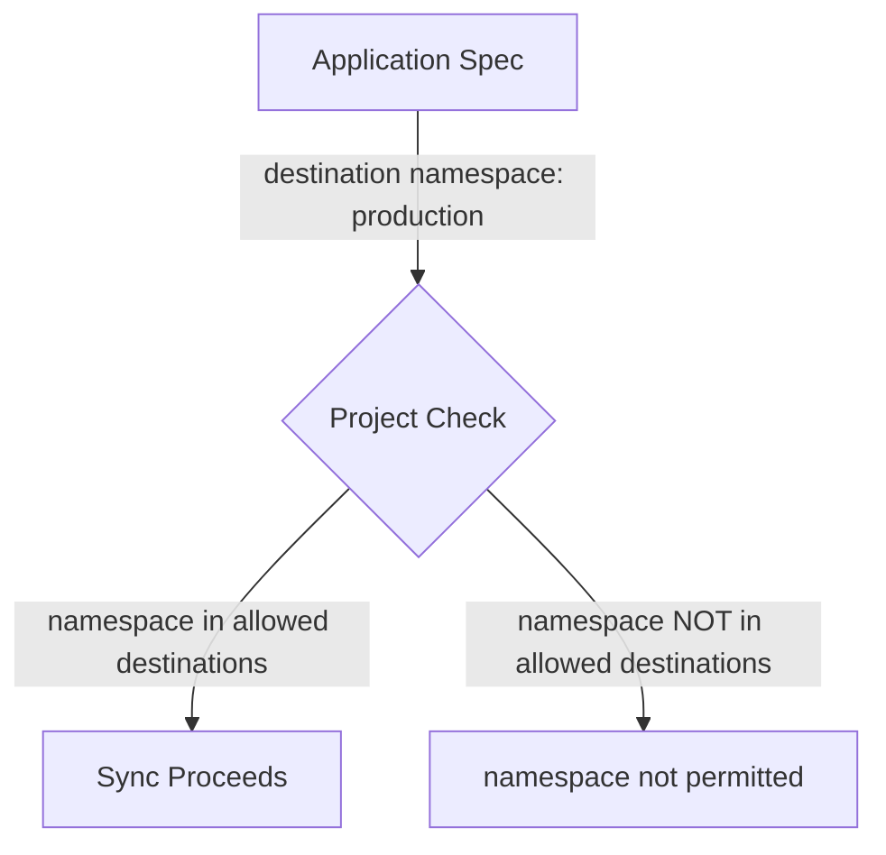

# How to Fix 'namespace not permitted' Error in ArgoCD

Author: [nawazdhandala](https://github.com/nawazdhandala)

Tags: ArgoCD, GitOps, Kubernetes, Troubleshooting, Security

Description: Resolve the ArgoCD namespace not permitted error by updating AppProject destination configurations, understanding namespace restrictions, and configuring proper access controls.

---

The "namespace not permitted" error in ArgoCD occurs when an application tries to deploy resources to a Kubernetes namespace that is not allowed by the application's ArgoCD Project. This is a security feature designed to prevent applications from deploying outside their designated boundaries.

The error message usually looks like:

```text
application destination {https://kubernetes.default.svc production} is not permitted in project 'my-project'
```

Or when syncing:

```text
namespace "production" is not permitted in project "team-a"
```

This guide explains why this error occurs and the different ways to fix it depending on your use case.

## How ArgoCD Namespace Restrictions Work

Every ArgoCD application belongs to a Project. Each project defines a list of allowed destinations, where a destination is a combination of a cluster server URL and a namespace. If the application's destination namespace is not in the project's allowed list, ArgoCD rejects the operation.



## Fix 1: Add the Namespace to the Project Destinations

The most direct fix is to add the missing namespace to the project's destination list.

**Using the CLI:**

```bash
# Add a specific namespace on the local cluster
argocd proj add-destination my-project https://kubernetes.default.svc production

# Verify it was added
argocd proj get my-project
```

**Declaratively in the AppProject:**

```yaml
apiVersion: argoproj.io/v1alpha1
kind: AppProject
metadata:
  name: my-project
  namespace: argocd
spec:
  destinations:
    - server: https://kubernetes.default.svc
      namespace: staging
    - server: https://kubernetes.default.svc
      namespace: production  # Add this line
```

Apply the change:

```bash
kubectl apply -f appproject.yaml
```

## Fix 2: Use Namespace Wildcards

If your team needs access to multiple namespaces, use wildcards instead of listing each one:

```yaml
apiVersion: argoproj.io/v1alpha1
kind: AppProject
metadata:
  name: team-a
  namespace: argocd
spec:
  destinations:
    # Allow all namespaces on the local cluster
    - server: https://kubernetes.default.svc
      namespace: '*'
```

Or use pattern matching for more controlled access:

```yaml
spec:
  destinations:
    # Allow all namespaces starting with team-a-
    - server: https://kubernetes.default.svc
      namespace: 'team-a-*'
    # Allow all namespaces starting with shared-
    - server: https://kubernetes.default.svc
      namespace: 'shared-*'
```

**Note:** Wildcard patterns use glob-style matching. The `*` character matches any sequence of characters.

## Fix 3: Fix the Application Destination

Sometimes the fix is not in the project but in the application itself. If the application is targeting the wrong namespace:

```bash
# Check the current destination
argocd app get my-app | grep Namespace

# Update the destination namespace
argocd app set my-app --dest-namespace correct-namespace
```

Or edit the application YAML:

```yaml
apiVersion: argoproj.io/v1alpha1
kind: Application
metadata:
  name: my-app
  namespace: argocd
spec:
  destination:
    server: https://kubernetes.default.svc
    namespace: correct-namespace  # Fix this to match an allowed namespace
```

## Fix 4: Handle the CreateNamespace Sync Option

If you are using the `CreateNamespace=true` sync option, ArgoCD will try to create the namespace during sync. The namespace must still be permitted in the project:

```yaml
apiVersion: argoproj.io/v1alpha1
kind: Application
metadata:
  name: my-app
  namespace: argocd
spec:
  destination:
    server: https://kubernetes.default.svc
    namespace: new-namespace
  syncPolicy:
    syncOptions:
      - CreateNamespace=true  # This creates the namespace
```

The project must allow this namespace:

```yaml
apiVersion: argoproj.io/v1alpha1
kind: AppProject
metadata:
  name: my-project
spec:
  destinations:
    - server: https://kubernetes.default.svc
      namespace: new-namespace  # Must be listed even if it does not exist yet
```

## Fix 5: Handle Resources Deployed to Different Namespaces

Some Helm charts or Kustomize overlays deploy resources to multiple namespaces. For example, a monitoring stack might create resources in both `monitoring` and `kube-system` namespaces. Each target namespace must be permitted:

```yaml
spec:
  destinations:
    - server: https://kubernetes.default.svc
      namespace: monitoring
    - server: https://kubernetes.default.svc
      namespace: kube-system  # If the chart creates resources here too
```

**Identify which namespaces your application deploys to:**

```bash
# Render manifests locally and check namespaces
helm template my-release ./chart --values values.yaml | grep "namespace:" | sort -u

# Or for kustomize
kustomize build overlays/production | grep "namespace:" | sort -u
```

## Fix 6: Remote Cluster Namespace Permissions

If deploying to a remote cluster, you need to specify both the cluster and namespace:

```yaml
spec:
  destinations:
    # Local cluster namespaces
    - server: https://kubernetes.default.svc
      namespace: staging
    # Remote cluster namespaces
    - server: https://remote-cluster.example.com
      namespace: production
    # Or use cluster name instead of server URL
    - name: production-cluster
      namespace: production
```

**Common mistake with remote clusters:**

```yaml
# This allows the namespace on the LOCAL cluster only
destinations:
  - server: https://kubernetes.default.svc
    namespace: production

# If your app targets a REMOTE cluster, this will not match!
# You need:
destinations:
  - server: https://remote-cluster.example.com
    namespace: production
```

## Fix 7: The Default Project

If your application uses the `default` project, check if someone has modified its defaults:

```bash
# Check the default project configuration
argocd proj get default -o yaml
```

By default, the `default` project allows all destinations:

```yaml
spec:
  destinations:
    - server: '*'
      namespace: '*'
```

If this has been restricted, either add your namespace back or move the application to a different project.

## Fix 8: Namespace-Scoped ArgoCD Installation

If ArgoCD is installed in namespace-scoped mode (not cluster-wide), it can only manage resources in specific namespaces. This is different from project restrictions:

```bash
# Check if ArgoCD is namespace-scoped
kubectl get deployment argocd-application-controller -n argocd -o yaml | \
  grep ARGOCD_APPLICATION_NAMESPACES
```

If namespace-scoped, update the allowed namespaces:

```yaml
# On the controller deployment
env:
  - name: ARGOCD_APPLICATION_NAMESPACES
    value: "namespace1,namespace2,production"
```

## Debugging the Error

**Step 1: Identify the project:**

```bash
argocd app get my-app | grep Project
```

**Step 2: View project destinations:**

```bash
argocd proj get my-project
```

Look at the "Destinations" section in the output.

**Step 3: Compare with the application destination:**

```bash
argocd app get my-app | grep -A2 Destination
```

**Step 4: Check for exact matches:**

The server URL and namespace must match. Watch for these gotchas:

- `https://kubernetes.default.svc` vs `https://kubernetes.default.svc:443` - different!
- Namespace names are case-sensitive
- Leading/trailing whitespace in namespace names

## Multi-Tenant Configuration Example

Here is a complete example of a well-configured multi-tenant project with namespace restrictions:

```yaml
apiVersion: argoproj.io/v1alpha1
kind: AppProject
metadata:
  name: team-backend
  namespace: argocd
spec:
  description: "Backend team project"
  sourceRepos:
    - 'https://github.com/company/backend-*'
  destinations:
    # Dev environment
    - server: https://kubernetes.default.svc
      namespace: backend-dev
    # Staging environment
    - server: https://kubernetes.default.svc
      namespace: backend-staging
    # Production environment (remote cluster)
    - name: production-cluster
      namespace: backend-prod
  # Deny cluster-scoped resources
  clusterResourceWhitelist: []
  # Allow common namespace-scoped resources
  namespaceResourceWhitelist:
    - group: ''
      kind: ConfigMap
    - group: ''
      kind: Secret
    - group: ''
      kind: Service
    - group: apps
      kind: Deployment
    - group: apps
      kind: StatefulSet
    - group: networking.k8s.io
      kind: Ingress
```

## Summary

The "namespace not permitted" error is a project-level restriction that prevents applications from deploying to unauthorized namespaces. Fix it by adding the required namespace to the project's destination list using `argocd proj add-destination`, wildcards for flexible patterns, or by correcting the application's destination to target an already-permitted namespace. Always verify both the cluster server URL and namespace match between the application spec and the project destinations.
