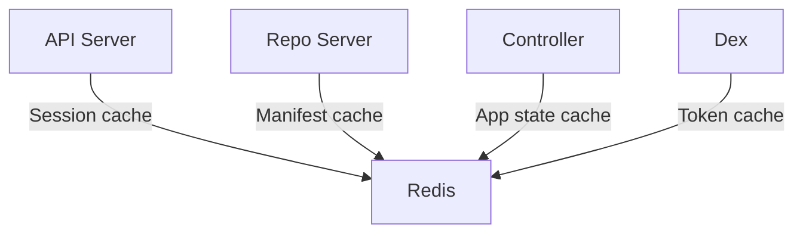

# How to Fix ArgoCD Redis Connection Errors

Author: [nawazdhandala](https://github.com/nawazdhandala)

Tags: ArgoCD, GitOps, Kubernetes, Troubleshooting, Redis

Description: Resolve ArgoCD Redis connection errors by fixing service endpoints, memory configuration, password authentication, network policies, and HA Redis sentinel setups.

---

Redis is a critical dependency for ArgoCD. It serves as the caching layer for the API server, repo server, and application controller. When ArgoCD cannot connect to Redis, you will see a cascade of failures: the UI becomes unresponsive, application status updates stop, and manifest caching breaks.

The errors typically look like:

```text
ERRO[0001] Failed to get connection from Redis: dial tcp 10.96.x.x:6379: connect: connection refused
```

Or:

```text
redis: connection pool timeout
```

Or:

```text
NOAUTH Authentication required
```

This guide covers all the common Redis connection issues in ArgoCD and how to fix them.

## Understanding ArgoCD's Redis Dependency



All ArgoCD components connect to Redis. If Redis is down:
- The API server cannot cache responses (slow UI)
- The repo server cannot cache manifests (slow reconciliation)
- The controller recalculates state from scratch (high CPU)

## Step 1: Check Redis Pod Health

```bash
# Check if Redis is running
kubectl get pods -n argocd -l app.kubernetes.io/name=argocd-redis

# Check for restarts
kubectl describe pod -n argocd -l app.kubernetes.io/name=argocd-redis

# Check Redis logs
kubectl logs -n argocd deployment/argocd-redis --tail=100
```

If the pod is not running, check why:

```bash
# Check events
kubectl get events -n argocd --sort-by='.lastTimestamp' | grep redis

# Check if the pod can be scheduled
kubectl describe pod -n argocd -l app.kubernetes.io/name=argocd-redis | \
  grep -A10 "Conditions:"
```

## Fix 1: Redis Pod Not Running

**If Redis is OOMKilled:**

```bash
# Check termination reason
kubectl describe pod -n argocd -l app.kubernetes.io/name=argocd-redis | \
  grep -A5 "Last State"
```

Increase memory limits:

```yaml
apiVersion: apps/v1
kind: Deployment
metadata:
  name: argocd-redis
  namespace: argocd
spec:
  template:
    spec:
      containers:
        - name: redis
          resources:
            requests:
              cpu: "100m"
              memory: "128Mi"
            limits:
              cpu: "500m"
              memory: "512Mi"
```

**Configure Redis maxmemory to prevent OOMKill:**

```yaml
containers:
  - name: redis
    args:
      - "--maxmemory"
      - "256mb"
      - "--maxmemory-policy"
      - "allkeys-lru"
```

This tells Redis to evict least-recently-used keys when memory reaches 256MB, instead of growing unbounded.

**If Redis pod is stuck in Pending:**

```bash
# Check scheduling constraints
kubectl describe pod -n argocd -l app.kubernetes.io/name=argocd-redis | \
  grep -A10 "Events:"
```

Fix node affinity, resource requests, or PVC bindings as needed.

## Fix 2: Service or Endpoint Mismatch

ArgoCD components connect to Redis through a Kubernetes Service. If the service is misconfigured:

```bash
# Check the Redis service
kubectl get svc argocd-redis -n argocd

# Check if endpoints exist
kubectl get endpoints argocd-redis -n argocd

# If endpoints are empty, the service selector does not match the pod labels
kubectl get svc argocd-redis -n argocd -o jsonpath='{.spec.selector}'
kubectl get pods -n argocd -l app.kubernetes.io/name=argocd-redis --show-labels
```

**Fix by verifying service labels match:**

```yaml
apiVersion: v1
kind: Service
metadata:
  name: argocd-redis
  namespace: argocd
spec:
  selector:
    app.kubernetes.io/name: argocd-redis
  ports:
    - port: 6379
      targetPort: 6379
```

## Fix 3: Authentication Errors

If Redis is configured with a password but ArgoCD does not know it (or vice versa):

```text
NOAUTH Authentication required
```

Or:

```text
ERR Client sent AUTH, but no password is set
```

**Check if Redis requires authentication:**

```bash
# Try connecting without password
kubectl exec -n argocd deployment/argocd-redis -- redis-cli ping

# If it returns "NOAUTH", a password is needed
```

**Configure the Redis password in ArgoCD:**

```yaml
# argocd-cmd-params-cm ConfigMap
apiVersion: v1
kind: ConfigMap
metadata:
  name: argocd-cmd-params-cm
  namespace: argocd
data:
  redis.server: "argocd-redis:6379"
```

If using a password:

```bash
# Create a secret for the Redis password
kubectl create secret generic argocd-redis-password \
  -n argocd \
  --from-literal=auth=your-redis-password
```

Then configure ArgoCD to use it:

```yaml
# In ArgoCD component deployments
env:
  - name: REDIS_PASSWORD
    valueFrom:
      secretKeyRef:
        name: argocd-redis-password
        key: auth
```

And pass it to Redis:

```yaml
containers:
  - name: redis
    args:
      - "--requirepass"
      - "$(REDIS_PASSWORD)"
    env:
      - name: REDIS_PASSWORD
        valueFrom:
          secretKeyRef:
            name: argocd-redis-password
            key: auth
```

## Fix 4: Network Policy Blocking Redis

If network policies are enabled, ArgoCD components might be blocked from reaching Redis:

```bash
# Check network policies
kubectl get networkpolicies -n argocd
```

**Add a policy to allow Redis traffic:**

```yaml
apiVersion: networking.k8s.io/v1
kind: NetworkPolicy
metadata:
  name: allow-argocd-redis
  namespace: argocd
spec:
  podSelector:
    matchLabels:
      app.kubernetes.io/name: argocd-redis
  policyTypes:
    - Ingress
  ingress:
    - from:
        - podSelector:
            matchLabels:
              app.kubernetes.io/part-of: argocd
      ports:
        - port: 6379
          protocol: TCP
```

## Fix 5: Redis Connection Pool Exhaustion

When ArgoCD creates more connections than Redis can handle:

```text
redis: connection pool timeout
```

**Increase Redis connection limit:**

```yaml
containers:
  - name: redis
    args:
      - "--maxclients"
      - "1000"
```

**Check current connection count:**

```bash
kubectl exec -n argocd deployment/argocd-redis -- redis-cli info clients
```

If `connected_clients` is near `maxclients`, you need to increase the limit or reduce the number of ArgoCD replicas competing for connections.

## Fix 6: External Redis Configuration

If you are using an external Redis (e.g., AWS ElastiCache, Redis Cloud):

```yaml
# argocd-cmd-params-cm ConfigMap
data:
  redis.server: "my-redis.xxxxxx.ng.0001.use1.cache.amazonaws.com:6379"
```

**Common issues with external Redis:**

1. **TLS required but not configured:**

```yaml
data:
  redis.server: "rediss://my-redis.xxxxxx.cache.amazonaws.com:6380"
  # Note: 'rediss://' (with double s) means TLS
```

Or set the TLS flag:

```yaml
data:
  redis.server: "my-redis.xxxxxx.cache.amazonaws.com:6379"
  redis.tls.enabled: "true"
```

2. **VPC or security group blocking access:**

Ensure the Kubernetes nodes can reach the Redis endpoint on port 6379 (or 6380 for TLS).

3. **Authentication with external Redis:**

```yaml
data:
  redis.server: "my-redis.xxxxxx.cache.amazonaws.com:6379"
```

Set the password via environment variable or secret.

## Fix 7: Redis HA / Sentinel Issues

If running Redis in HA mode with Sentinel:

```yaml
# argocd-cmd-params-cm
data:
  redis.server: "argocd-redis-ha-haproxy:6379"
  # Or for Sentinel
  redis.sentinels: "argocd-redis-ha-announce-0:26379,argocd-redis-ha-announce-1:26379,argocd-redis-ha-announce-2:26379"
  redis.sentinel.master: "argocd"
```

**Common Sentinel issues:**

```bash
# Check sentinel status
kubectl exec -n argocd argocd-redis-ha-server-0 -- redis-cli -p 26379 sentinel masters

# Check which node is the master
kubectl exec -n argocd argocd-redis-ha-server-0 -- redis-cli -p 26379 sentinel get-master-addr-by-name argocd
```

If the Sentinel configuration is wrong, ArgoCD cannot find the Redis master.

## Fix 8: Redis Data Corruption

In rare cases, Redis data corruption can cause connection issues:

```bash
# Flush the Redis cache (this is safe - ArgoCD rebuilds the cache)
kubectl exec -n argocd deployment/argocd-redis -- redis-cli FLUSHALL
```

After flushing:

```bash
# Restart ArgoCD components to rebuild the cache
kubectl rollout restart deployment argocd-server -n argocd
kubectl rollout restart deployment argocd-repo-server -n argocd
kubectl rollout restart deployment argocd-application-controller -n argocd
```

## Fix 9: DNS Resolution Failure

If ArgoCD components cannot resolve the Redis service hostname:

```bash
# Test DNS from an ArgoCD pod
kubectl exec -n argocd deployment/argocd-server -- \
  nslookup argocd-redis.argocd.svc.cluster.local
```

If DNS fails, check CoreDNS:

```bash
kubectl get pods -n kube-system -l k8s-app=kube-dns
kubectl logs -n kube-system -l k8s-app=kube-dns
```

## Monitoring Redis Health

Set up monitoring to catch Redis issues early:

```bash
# Check Redis health metrics
kubectl exec -n argocd deployment/argocd-redis -- redis-cli info | grep -E "used_memory|connected_clients|rejected_connections|keyspace"
```

**Prometheus monitoring:**

```yaml
groups:
  - name: argocd.redis
    rules:
      - alert: ArgoCDRedisDown
        expr: |
          up{job="argocd-redis"} == 0
        for: 1m
        labels:
          severity: critical
        annotations:
          summary: "ArgoCD Redis is down"
      - alert: ArgoCDRedisHighMemory
        expr: |
          redis_memory_used_bytes / redis_memory_max_bytes > 0.9
        for: 5m
        labels:
          severity: warning
```

## Quick Recovery Checklist

1. Is the Redis pod running? `kubectl get pods -n argocd -l app.kubernetes.io/name=argocd-redis`
2. Does the service have endpoints? `kubectl get endpoints argocd-redis -n argocd`
3. Can ArgoCD pods reach Redis? Test with `redis-cli ping` from an ArgoCD pod
4. Is authentication configured correctly? Check for NOAUTH errors
5. Are network policies blocking traffic? Check `kubectl get networkpolicies -n argocd`
6. Is Redis out of memory? Check `redis-cli info memory`

## Summary

Redis connection errors in ArgoCD break caching and degrade the performance of all components. Start by verifying the Redis pod is running and the service has valid endpoints. Check for authentication mismatches, network policy blocks, and connection pool exhaustion. For production environments, consider Redis HA or an external managed Redis service. When all else fails, `redis-cli FLUSHALL` is safe because ArgoCD automatically rebuilds its cache.
