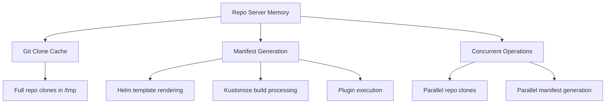

# How to Fix ArgoCD Repo Server Out of Memory

Author: [nawazdhandala](https://github.com/nawazdhandala)

Tags: ArgoCD, GitOps, Kubernetes, Troubleshooting, Performance

Description: Fix ArgoCD repo server out of memory crashes by optimizing manifest generation, tuning resource limits, managing Git clone sizes, and configuring parallelism settings.

---

The ArgoCD repo server is responsible for cloning Git repositories and generating Kubernetes manifests from Helm charts, Kustomize overlays, or plain YAML. When it runs out of memory, manifest generation fails for all applications, causing ComparisonErrors and sync failures across your entire ArgoCD deployment.

You will see the repo server pod in OOMKilled or CrashLoopBackOff state:

```bash
$ kubectl get pods -n argocd -l app.kubernetes.io/name=argocd-repo-server
NAME                                    READY   STATUS      RESTARTS   AGE
argocd-repo-server-7f8b5c9d6-xxxxx      0/1     OOMKilled   8          1h
```

And applications will show errors like:

```text
ComparisonError: failed to generate manifests: rpc error: code = Unavailable
```

This guide explains why the repo server runs out of memory and how to fix it.

## Why the Repo Server Uses So Much Memory

The repo server's memory usage comes from several sources:



The biggest memory consumers are:
1. Large Git repositories being cloned
2. Complex Helm charts being rendered
3. Multiple concurrent manifest generation operations

## Step 1: Confirm the Problem

```bash
# Check pod status and restart count
kubectl get pods -n argocd -l app.kubernetes.io/name=argocd-repo-server

# Check termination reason
kubectl describe pod -n argocd -l app.kubernetes.io/name=argocd-repo-server | \
  grep -A5 "Last State"

# Check current memory usage
kubectl top pods -n argocd -l app.kubernetes.io/name=argocd-repo-server

# Check current memory limits
kubectl get deployment argocd-repo-server -n argocd \
  -o jsonpath='{.spec.template.spec.containers[0].resources}'
```

## Fix 1: Increase Memory Limits

The most direct fix:

```yaml
apiVersion: apps/v1
kind: Deployment
metadata:
  name: argocd-repo-server
  namespace: argocd
spec:
  template:
    spec:
      containers:
        - name: argocd-repo-server
          resources:
            requests:
              cpu: "500m"
              memory: "1Gi"
            limits:
              cpu: "2"
              memory: "4Gi"
```

**Memory sizing guidelines for the repo server:**

| Scenario | Recommended Memory |
|----------|-------------------|
| Small repos, few apps | 256Mi to 512Mi |
| Medium repos, 50-200 apps | 512Mi to 2Gi |
| Large repos or monorepos | 2Gi to 4Gi |
| Many concurrent operations | 4Gi to 8Gi |
| Very complex Helm charts | 4Gi+ |

Apply:

```bash
kubectl patch deployment argocd-repo-server -n argocd \
  --type json \
  -p '[{"op":"replace","path":"/spec/template/spec/containers/0/resources/limits/memory","value":"4Gi"}]'
```

## Fix 2: Limit Concurrent Operations

The repo server processes multiple manifest generation requests in parallel. Each request clones a repo and runs the tool, consuming memory. Limiting parallelism reduces peak memory usage:

```yaml
# argocd-cmd-params-cm ConfigMap
apiVersion: v1
kind: ConfigMap
metadata:
  name: argocd-cmd-params-cm
  namespace: argocd
data:
  # Limit concurrent manifest generation operations
  reposerver.parallelism.limit: "2"
```

Alternatively, set it as an environment variable:

```yaml
containers:
  - name: argocd-repo-server
    env:
      - name: ARGOCD_REPO_SERVER_PARALLELISM_LIMIT
        value: "2"
```

The default has no limit, meaning the repo server will handle as many requests as it receives simultaneously. Setting a limit queues excess requests.

## Fix 3: Scale Horizontally

Instead of giving one repo server more memory, run multiple instances:

```bash
kubectl scale deployment argocd-repo-server -n argocd --replicas=3
```

This distributes the load across instances. Each instance handles fewer concurrent requests, reducing per-pod memory usage.

**Combine with parallelism limits for best results:**

```yaml
# 3 replicas, each limited to 2 concurrent operations = 6 total concurrent
reposerver.parallelism.limit: "2"
```

## Fix 4: Reduce Git Repository Size

Large Git repositories are the primary memory hog. When the repo server clones a repo, it holds the entire clone in memory and on disk.

**Enable shallow cloning:**

ArgoCD clones repos by default with limited depth. You can control this:

```yaml
# argocd-cmd-params-cm
data:
  # Set fetch depth (lower = less memory, but may miss some refs)
  reposerver.git.fetch.depth: "1"
```

**Optimize your Git repositories:**
- Remove large binary files from history using `git filter-repo`
- Use `.gitignore` to prevent large files from being committed
- Consider splitting monorepos into smaller repos
- Use Git LFS for large files (though ArgoCD LFS support has limitations)

**Check repo size:**

```bash
# Check the size of a cloned repo
git clone --depth 1 https://github.com/org/repo /tmp/test-repo
du -sh /tmp/test-repo
```

## Fix 5: Optimize Helm Chart Rendering

Complex Helm charts with many templates, large values files, or deeply nested dependencies consume significant memory during rendering:

**Reduce chart complexity:**

```bash
# Check how much memory Helm uses for your chart
time helm template my-release ./chart --values values.yaml 2>&1
```

**Increase the exec timeout (to prevent premature kills during rendering):**

```yaml
containers:
  - name: argocd-repo-server
    env:
      - name: ARGOCD_EXEC_TIMEOUT
        value: "300s"
```

**Pre-render and cache:**

Consider using a CI pipeline to pre-render Helm templates and store plain YAML in Git, eliminating the need for Helm rendering in ArgoCD.

## Fix 6: Configure Manifest Caching

The repo server caches generated manifests. Optimize cache settings:

```yaml
# argocd-cmd-params-cm
data:
  # Cache expiration (default: 24h)
  reposerver.default.cache.expiration: "24h"
```

With proper caching, the repo server only regenerates manifests when the Git revision changes, not on every reconciliation cycle.

## Fix 7: Use Volumes for Temporary Storage

The repo server uses `/tmp` for Git clones. If this is backed by an emptyDir, it uses the pod's memory:

```yaml
# Add an explicit volume for tmp
volumes:
  - name: tmp
    emptyDir:
      sizeLimit: 5Gi  # Limit the disk usage
containers:
  - name: argocd-repo-server
    volumeMounts:
      - name: tmp
        mountPath: /tmp
```

**For high-performance setups, use a PVC:**

```yaml
volumes:
  - name: tmp
    persistentVolumeClaim:
      claimName: argocd-repo-server-tmp
```

This moves temporary files off the pod's memory-backed storage.

## Fix 8: Set GOMEMLIMIT

Help Go's garbage collector manage memory more effectively:

```yaml
containers:
  - name: argocd-repo-server
    env:
      - name: GOMEMLIMIT
        value: "3500MiB"  # ~87% of 4Gi limit
    resources:
      limits:
        memory: "4Gi"
```

## Fix 9: Monitor and Profile

Set up monitoring to understand memory patterns:

```bash
# Check repo server metrics
kubectl port-forward -n argocd deployment/argocd-repo-server 8084:8084
curl localhost:8084/metrics | grep -E "process_resident|go_memstats"
```

**Key metrics to watch:**

```text
# Current memory usage
process_resident_memory_bytes

# Heap memory (Go allocations)
go_memstats_heap_alloc_bytes

# Number of goroutines (indicates concurrent operations)
go_goroutines

# Git operation durations
argocd_git_request_duration_seconds
```

**Set up Prometheus alerts:**

```yaml
groups:
  - name: argocd.reposerver
    rules:
      - alert: ArgoCDRepoServerHighMemory
        expr: |
          container_memory_working_set_bytes{
            namespace="argocd",
            container="argocd-repo-server"
          } / container_spec_memory_limit_bytes{
            namespace="argocd",
            container="argocd-repo-server"
          } > 0.85
        for: 5m
        labels:
          severity: warning
        annotations:
          summary: "ArgoCD repo server using >85% memory"
```

## Fix 10: Check for CMP Sidecar Memory

If you use Config Management Plugins (CMPs), the sidecar containers also consume memory and are not covered by the main container's limits:

```bash
# Check all containers in the repo server pod
kubectl get pods -n argocd -l app.kubernetes.io/name=argocd-repo-server \
  -o jsonpath='{.items[0].spec.containers[*].name}'

# Check each container's memory usage
kubectl top pods -n argocd -l app.kubernetes.io/name=argocd-repo-server --containers
```

Set memory limits on CMP sidecars too:

```yaml
sidecars:
  - name: my-plugin
    resources:
      limits:
        memory: "512Mi"
```

## Recovery After OOMKill

After fixing the configuration:

```bash
# Apply the new configuration
kubectl apply -f repo-server-deployment.yaml

# Wait for the new pod to be ready
kubectl rollout status deployment argocd-repo-server -n argocd

# Verify it is running
kubectl get pods -n argocd -l app.kubernetes.io/name=argocd-repo-server

# Applications should automatically recover on the next reconciliation
# Force refresh specific apps if needed
argocd app get my-app --hard-refresh
```

## Summary

ArgoCD repo server OOMKilled is caused by concurrent Git operations and manifest generation exceeding memory limits. The immediate fix is increasing memory limits. For sustainable solutions, limit parallelism with `reposerver.parallelism.limit`, scale horizontally with multiple replicas, reduce Git repository sizes, and set GOMEMLIMIT for better garbage collection. Monitor memory usage with Prometheus to catch issues before they cause crashes.
