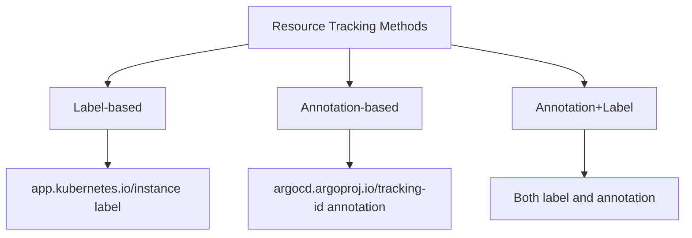

# How to Fix 'resource is not managed' Error in ArgoCD

Author: [nawazdhandala](https://github.com/nawazdhandala)

Tags: ArgoCD, GitOps, Kubernetes, Troubleshooting, Resource Tracking

Description: Resolve the ArgoCD resource is not managed error by understanding resource tracking methods, adoption workflows, and resolving tracking label or annotation conflicts.

---

The "resource is not managed" error in ArgoCD means you are trying to perform an action on a Kubernetes resource that ArgoCD does not recognize as part of any application. ArgoCD tracks which resources it manages using labels or annotations, and if a resource does not have the correct tracking information, ArgoCD considers it unmanaged.

The error typically appears when:

```
resource Deployment/my-deployment is not managed by any ArgoCD application
```

Or when trying to perform actions from the UI:

```
Unable to perform action: resource is not managed
```

This guide explains the resource tracking system and how to resolve this error.

## How ArgoCD Tracks Resources

ArgoCD uses a tracking mechanism to associate Kubernetes resources with ArgoCD Applications. There are three tracking methods:



**Check which method your ArgoCD uses:**

```bash
kubectl get configmap argocd-cm -n argocd -o yaml | grep resourceTrackingMethod
```

If not set, ArgoCD defaults to label-based tracking using the `app.kubernetes.io/instance` label.

## Cause 1: Resource Was Created Outside ArgoCD

If a resource was created manually with `kubectl apply` or by another tool, it will not have ArgoCD tracking labels:

```bash
# Check if the resource has ArgoCD tracking labels
kubectl get deployment my-deployment -n production -o yaml | \
  grep "app.kubernetes.io/instance"
```

**Fix by adding the resource to your Git manifests:**

1. Add the resource definition to your application's Git source
2. Sync the application

ArgoCD will adopt the resource and add tracking labels during the sync.

**If you want to adopt the resource without recreating it, use ServerSideApply:**

```yaml
apiVersion: argoproj.io/v1alpha1
kind: Application
metadata:
  name: my-app
spec:
  syncPolicy:
    syncOptions:
      - ServerSideApply=true
```

This allows ArgoCD to take ownership of existing resources without deleting them first.

## Cause 2: Tracking Labels Were Removed

Another application or process might have removed the ArgoCD tracking labels:

```bash
# Check the resource's labels
kubectl get deployment my-deployment -n production --show-labels
```

**Fix by re-syncing the application:**

```bash
# Force a sync to re-apply tracking labels
argocd app sync my-app --force
```

## Cause 3: Resource Tracking Method Changed

If you changed the tracking method (e.g., from label to annotation), existing resources might not have the new tracking identifiers:

**Migrate resources to the new tracking method:**

```bash
# After changing the tracking method, force sync all applications
argocd app sync my-app --force
```

Or use the migration tool:

```bash
# Check current tracking method
kubectl get configmap argocd-cm -n argocd -o jsonpath='{.data.application\.resourceTrackingMethod}'

# If switching methods, update the ConfigMap
kubectl patch configmap argocd-cm -n argocd \
  --type merge \
  -p '{"data":{"application.resourceTrackingMethod":"annotation"}}'

# Then force sync applications to update tracking info
argocd app sync my-app --force
```

## Cause 4: Application Name Does Not Match Tracking Label

The `app.kubernetes.io/instance` label value must match the ArgoCD application name:

```bash
# Check the label value
kubectl get deployment my-deployment -n production \
  -o jsonpath='{.metadata.labels.app\.kubernetes\.io/instance}'
```

If the label says `old-app-name` but your application is `new-app-name`, ArgoCD will not recognize the resource.

**Fix by updating the application name or the labels:**

```bash
# Option 1: Rename the ArgoCD application
argocd app set my-app --name old-app-name

# Option 2: Force sync to update the labels
argocd app sync my-app --force
```

## Cause 5: Resource Created by an Operator

Many Kubernetes operators create resources dynamically. These operator-created resources will not have ArgoCD tracking labels because ArgoCD did not create them.

**For operator-managed resources, you have several options:**

1. **Exclude them from ArgoCD tracking:**

```yaml
# argocd-cm ConfigMap
data:
  resource.exclusions: |
    - apiGroups:
        - "apps"
      kinds:
        - "ReplicaSet"
      clusters:
        - "*"
```

2. **Ignore differences on operator-managed fields:**

```yaml
spec:
  ignoreDifferences:
    - group: apps
      kind: Deployment
      jsonPointers:
        - /spec/replicas  # Managed by HPA
```

3. **Let the operator manage the resource entirely** and do not include it in your ArgoCD application source

## Cause 6: Resource in a Different Namespace

ArgoCD applications target specific namespaces. If a resource exists in a different namespace than what the application manages, it will not be tracked:

```bash
# Check which namespace the app targets
argocd app get my-app | grep Namespace

# Check which namespace the resource is in
kubectl get deployment my-deployment --all-namespaces
```

**Fix by ensuring the resource is in the correct namespace or adding the namespace to the application:**

```yaml
spec:
  destination:
    server: https://kubernetes.default.svc
    namespace: correct-namespace
```

## Cause 7: Shared Resources Between Applications

If two applications try to manage the same resource, only one can "own" it through tracking:

```bash
# Check which app currently tracks the resource
kubectl get deployment my-deployment -n production \
  -o jsonpath='{.metadata.annotations.argocd\.argoproj\.io/tracking-id}'
```

**Fix by designating one application as the owner:**

1. Remove the resource from one application's source
2. Use `FailOnSharedResource=true` to prevent future conflicts:

```yaml
syncPolicy:
  syncOptions:
    - FailOnSharedResource=true
```

## Adopting Existing Resources

To bring existing cluster resources under ArgoCD management:

### Method 1: Add to Git and Sync

```bash
# Export the existing resource
kubectl get deployment my-deployment -n production -o yaml > deployment.yaml

# Clean up the exported YAML (remove status, resourceVersion, uid, etc.)
# Add to your Git repo
git add deployment.yaml
git commit -m "Add existing deployment to ArgoCD management"
git push

# Sync the application
argocd app sync my-app
```

### Method 2: Use ServerSideApply

```yaml
spec:
  syncPolicy:
    syncOptions:
      - ServerSideApply=true
```

This is the cleanest approach as it does not require deleting the resource.

### Method 3: Label the Resource Manually

```bash
# Add the tracking label manually
kubectl label deployment my-deployment -n production \
  app.kubernetes.io/instance=my-app

# If using annotation-based tracking
kubectl annotate deployment my-deployment -n production \
  argocd.argoproj.io/tracking-id="my-app:apps/Deployment:production/my-deployment"
```

**Warning:** Manual labeling is fragile. Prefer adding the resource to Git and syncing.

## Viewing Managed Resources

To see what resources an application currently manages:

```bash
# List all resources managed by an application
argocd app resources my-app

# Get detailed resource info
argocd app resources my-app --output tree
```

## Summary

The "resource is not managed" error means ArgoCD's tracking system does not associate the resource with any application. Fix it by ensuring the resource is defined in your application's Git source and syncing the application. For existing resources you want to adopt, use ServerSideApply to take ownership without recreation. If you changed the tracking method, force sync applications to update tracking identifiers. Always verify resource tracking with `kubectl get <resource> -o yaml | grep argocd`.
