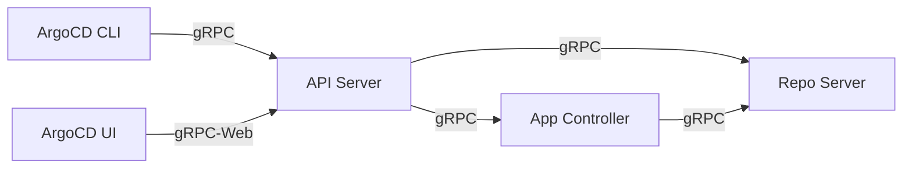

# How to Fix 'rpc error: code = Unavailable' in ArgoCD

Author: [nawazdhandala](https://github.com/nawazdhandala)

Tags: ArgoCD, GitOps, Kubernetes, Troubleshooting, gRPC

Description: Resolve the gRPC Unavailable error in ArgoCD caused by server connectivity issues, TLS misconfigurations, load balancer problems, and service mesh conflicts.

---

The `rpc error: code = Unavailable` message in ArgoCD is a gRPC-level error indicating that the client could not establish a connection to the server. You will typically see this when using the ArgoCD CLI, but it can also surface in the API server logs or the application controller logs. The error looks something like this:

```text
rpc error: code = Unavailable desc = connection error: desc = "transport: Error while dialing: dial tcp 10.96.x.x:8083: connect: connection refused"
```

Or sometimes more cryptically:

```text
rpc error: code = Unavailable desc = transport is closing
```

This guide walks you through the common causes and fixes for this error.

## Understanding gRPC Unavailable

ArgoCD's components communicate with each other using gRPC. The main communication paths are:



A `code = Unavailable` error means the gRPC client could not reach the server on the other end. The exact cause depends on which component is throwing the error and which component it is trying to reach.

## Cause 1: ArgoCD Server Pod is Down

The most straightforward cause - the target pod is not running.

```bash
# Check all ArgoCD pods
kubectl get pods -n argocd

# Look for pods that are not in Running state
kubectl get pods -n argocd | grep -v Running
```

If the API server, repo server, or controller is in a crash loop:

```bash
# Check logs for the crashing component
kubectl logs -n argocd deployment/argocd-server --previous
kubectl logs -n argocd deployment/argocd-repo-server --previous
kubectl logs -n argocd deployment/argocd-application-controller --previous
```

Restart the affected component:

```bash
kubectl rollout restart deployment argocd-server -n argocd
```

## Cause 2: TLS Configuration Mismatch

ArgoCD components communicate over TLS by default. If there is a mismatch between what the client expects and what the server provides, the connection will be refused.

**Check if TLS is properly configured:**

```bash
# Check the server's TLS configuration
kubectl get configmap argocd-cmd-params-cm -n argocd -o yaml
```

**If you are running ArgoCD in insecure mode but the CLI expects TLS:**

```bash
# Connect with --plaintext flag
argocd login argocd.example.com --plaintext

# Or with --insecure to skip TLS verification
argocd login argocd.example.com --insecure
```

**If you are running ArgoCD behind a load balancer with TLS termination:**

```yaml
# argocd-cmd-params-cm
apiVersion: v1
kind: ConfigMap
metadata:
  name: argocd-cmd-params-cm
  namespace: argocd
data:
  # Run server in insecure mode since LB handles TLS
  server.insecure: "true"
```

**For internal component-to-component communication, configure TLS settings:**

```yaml
# argocd-cmd-params-cm
apiVersion: v1
kind: ConfigMap
metadata:
  name: argocd-cmd-params-cm
  namespace: argocd
data:
  # Disable TLS for repo server (internal communication)
  reposerver.disable.tls: "false"
  # Set custom TLS cert if needed
  reposerver.tls.cert: "/path/to/cert"
  reposerver.tls.key: "/path/to/key"
```

## Cause 3: Service Not Reachable

The Kubernetes service that fronts the ArgoCD component might be misconfigured:

```bash
# Check services
kubectl get svc -n argocd

# Verify endpoints exist for each service
kubectl get endpoints -n argocd
```

If endpoints are empty, it means no pods match the service's label selector:

```bash
# Check the service selector
kubectl get svc argocd-server -n argocd -o yaml | grep -A5 selector

# Verify pods have matching labels
kubectl get pods -n argocd --show-labels
```

## Cause 4: Network Policy Blocking Traffic

If you have network policies in the `argocd` namespace, they might be blocking inter-component communication:

```bash
# List network policies
kubectl get networkpolicies -n argocd
```

Ensure your network policies allow traffic between ArgoCD components:

```yaml
apiVersion: networking.k8s.io/v1
kind: NetworkPolicy
metadata:
  name: allow-argocd-internal
  namespace: argocd
spec:
  podSelector: {}
  policyTypes:
    - Ingress
    - Egress
  ingress:
    - from:
        - podSelector: {}
  egress:
    - to:
        - podSelector: {}
    # Allow DNS resolution
    - to: []
      ports:
        - port: 53
          protocol: UDP
        - port: 53
          protocol: TCP
```

## Cause 5: Load Balancer or Ingress Issues

When accessing ArgoCD through a load balancer, gRPC connections need special handling because gRPC uses HTTP/2:

**For AWS ALB:**

```yaml
apiVersion: networking.k8s.io/v1
kind: Ingress
metadata:
  annotations:
    # ALB needs specific settings for gRPC
    alb.ingress.kubernetes.io/backend-protocol-version: "GRPC"
    alb.ingress.kubernetes.io/target-type: "ip"
    alb.ingress.kubernetes.io/listen-ports: '[{"HTTPS":443}]'
```

**For Nginx Ingress:**

```yaml
apiVersion: networking.k8s.io/v1
kind: Ingress
metadata:
  annotations:
    nginx.ingress.kubernetes.io/backend-protocol: "GRPC"
    nginx.ingress.kubernetes.io/ssl-passthrough: "true"
```

**For Traefik:**

```yaml
apiVersion: traefik.containo.us/v1alpha1
kind: IngressRoute
metadata:
  name: argocd-server
  namespace: argocd
spec:
  entryPoints:
    - websecure
  routes:
    - match: Host(`argocd.example.com`)
      kind: Rule
      services:
        - name: argocd-server
          port: 443
          scheme: h2c
  tls:
    passthrough: true
```

## Cause 6: Service Mesh Interference

If you are running Istio, Linkerd, or another service mesh, the sidecar proxy might interfere with gRPC connections:

**For Istio, ensure proper destination rules:**

```yaml
apiVersion: networking.istio.io/v1beta1
kind: DestinationRule
metadata:
  name: argocd-server
  namespace: argocd
spec:
  host: argocd-server.argocd.svc.cluster.local
  trafficPolicy:
    tls:
      mode: DISABLE
```

**Or exclude ArgoCD from the mesh entirely:**

```yaml
# Add annotation to ArgoCD deployments
metadata:
  annotations:
    sidecar.istio.io/inject: "false"
```

## Cause 7: Port Conflicts

Make sure the ports match between the service definition and what the server is actually listening on:

```bash
# Check what port the API server is listening on
kubectl get svc argocd-server -n argocd -o jsonpath='{.spec.ports[*]}'

# Default ports:
# API Server: 8080 (HTTP), 8083 (gRPC)
# Repo Server: 8081
# Controller: 8082
```

If you have customized ports, make sure all references are consistent.

## Cause 8: DNS Resolution Failure

The gRPC client might not be able to resolve the service hostname:

```bash
# Test DNS from within the cluster
kubectl run dns-test --rm -it --image=busybox --restart=Never -- \
  nslookup argocd-server.argocd.svc.cluster.local
```

If DNS resolution fails, check your cluster's DNS service (typically CoreDNS):

```bash
kubectl get pods -n kube-system -l k8s-app=kube-dns
kubectl logs -n kube-system -l k8s-app=kube-dns
```

## Quick Fix: Use Port-Forward to Bypass Network Issues

To quickly determine whether the problem is network-related or server-related, bypass the network entirely with port-forward:

```bash
# Port-forward directly to the API server
kubectl port-forward svc/argocd-server -n argocd 8080:443

# Then try the CLI against localhost
argocd login localhost:8080 --insecure
```

If this works, the problem is in your network path (ingress, load balancer, DNS, or service mesh). If it fails, the problem is with the ArgoCD server itself.

## Summary

The `rpc error: code = Unavailable` is a connectivity error at the gRPC layer. Work through the troubleshooting steps systematically: verify the target pod is running, check TLS configuration, verify service endpoints, review network policies, and test with port-forward to isolate whether it is a network issue or a server issue. Most of the time, the fix involves aligning TLS settings between the client and server or correcting ingress configuration for HTTP/2 support.
