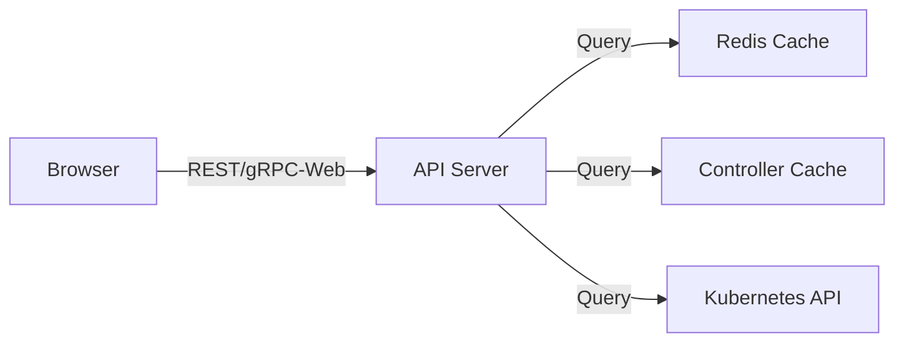

# How to Fix ArgoCD Slow UI Loading

Author: [nawazdhandala](https://github.com/nawazdhandala)

Tags: ArgoCD, GitOps, Kubernetes, Troubleshooting, UI

Description: Speed up ArgoCD UI loading times by optimizing API server performance, reducing application resource counts, configuring caching, and tuning frontend settings.

---

A slow ArgoCD UI is one of the most common complaints from teams scaling their GitOps workflows. The dashboard takes forever to load, clicking on an application hangs for seconds, and the resource tree renders painfully slowly. When you have hundreds or thousands of applications, the default ArgoCD configuration simply cannot keep up.

This guide covers every optimization you can make to speed up the ArgoCD UI, from quick fixes to architectural changes.

## Understanding Why the UI Is Slow

The ArgoCD UI is a React single-page application that communicates with the API server over REST and gRPC-Web. When you open the UI:



Slow loading usually comes from:
1. The API server being overwhelmed with requests
2. Large payloads (applications with many resources)
3. Redis cache misses forcing expensive recalculations
4. Network latency between browser and API server
5. Browser struggling to render large resource trees

## Quick Fix: Check the Basics

Before diving into optimizations, verify the infrastructure is not the bottleneck:

```bash
# Check API server resource usage
kubectl top pods -n argocd -l app.kubernetes.io/name=argocd-server

# Check Redis health
kubectl top pods -n argocd -l app.kubernetes.io/name=argocd-redis

# Check API server response time
time argocd app list

# Check if the API server is CPU or memory constrained
kubectl describe pod -n argocd -l app.kubernetes.io/name=argocd-server | \
  grep -A10 "Limits\|Requests"
```

## Fix 1: Scale the API Server

The API server handles all UI requests. A single replica becomes a bottleneck with multiple users:

```bash
# Scale the API server
kubectl scale deployment argocd-server -n argocd --replicas=3
```

Set appropriate resources:

```yaml
apiVersion: apps/v1
kind: Deployment
metadata:
  name: argocd-server
  namespace: argocd
spec:
  replicas: 3
  template:
    spec:
      containers:
        - name: argocd-server
          resources:
            requests:
              cpu: "500m"
              memory: "512Mi"
            limits:
              cpu: "2"
              memory: "2Gi"
```

## Fix 2: Optimize Redis Performance

Redis is critical for UI performance. It caches application state, user sessions, and computed diffs:

```bash
# Check Redis memory usage
kubectl exec -n argocd deployment/argocd-redis -- redis-cli info memory

# Check Redis connection count
kubectl exec -n argocd deployment/argocd-redis -- redis-cli info clients
```

**Increase Redis resources:**

```yaml
apiVersion: apps/v1
kind: Deployment
metadata:
  name: argocd-redis
  namespace: argocd
spec:
  template:
    spec:
      containers:
        - name: redis
          resources:
            requests:
              cpu: "200m"
              memory: "256Mi"
            limits:
              cpu: "1"
              memory: "1Gi"
```

**For production, use Redis HA or an external Redis:**

```yaml
# argocd-cmd-params-cm ConfigMap
data:
  # Use an external Redis
  redis.server: "redis.external.svc.cluster.local:6379"
```

## Fix 3: Reduce Application List Payload Size

When the UI loads the application list, it fetches data for all applications. With many applications, this payload is huge.

**Use server-side filtering:**

The ArgoCD UI supports filtering applications. Use project-based filtering to load only relevant apps:

```
# In the UI, use the search bar with project: prefix
project:team-a
```

**Use the CLI for large-scale operations** instead of the UI:

```bash
# Faster than the UI for listing applications
argocd app list --project team-a
```

## Fix 4: Reduce Resource Tree Size

The resource tree is the biggest performance killer in the UI. Applications with hundreds of resources cause the browser to struggle:

**Exclude unnecessary resources from the tree:**

```yaml
# argocd-cm ConfigMap
data:
  resource.exclusions: |
    - apiGroups:
        - ""
      kinds:
        - "Event"
      clusters:
        - "*"
    - apiGroups:
        - "discovery.k8s.io"
      kinds:
        - "EndpointSlice"
      clusters:
        - "*"
```

Removing Events and EndpointSlices from the resource tree significantly reduces rendering time.

**Hide managed resources that are not useful to display:**

```yaml
data:
  resource.exclusions: |
    - apiGroups:
        - ""
      kinds:
        - "Endpoints"
      clusters:
        - "*"
    - apiGroups:
        - "apps"
      kinds:
        - "ReplicaSet"
      clusters:
        - "*"
```

## Fix 5: Enable Server-Side Diff

By default, the UI computes diffs client-side, which can be slow for large manifests:

```yaml
# argocd-cmd-params-cm ConfigMap
data:
  server.diff.server.side: "true"
```

This offloads diff computation to the server, making the UI more responsive.

## Fix 6: Configure API Server Caching

Optimize how the API server caches responses:

```yaml
# argocd-cmd-params-cm ConfigMap
data:
  # Cache application list (reduces repeated queries)
  server.app.state.cache.expiration: "1h"
```

## Fix 7: Optimize Ingress and Network

Network configuration significantly affects UI responsiveness:

**Enable compression in your ingress:**

```yaml
apiVersion: networking.k8s.io/v1
kind: Ingress
metadata:
  name: argocd-server
  annotations:
    nginx.ingress.kubernetes.io/proxy-body-size: "10m"
    nginx.ingress.kubernetes.io/proxy-buffer-size: "8k"
    # Enable gzip compression
    nginx.ingress.kubernetes.io/configuration-snippet: |
      gzip on;
      gzip_types application/json text/plain;
```

**Increase timeout settings:**

```yaml
annotations:
  nginx.ingress.kubernetes.io/proxy-read-timeout: "600"
  nginx.ingress.kubernetes.io/proxy-send-timeout: "600"
  nginx.ingress.kubernetes.io/proxy-connect-timeout: "30"
```

**Use HTTP/2 for multiplexed connections:**

```yaml
annotations:
  nginx.ingress.kubernetes.io/use-http2: "true"
```

## Fix 8: Browser-Side Optimizations

If the UI is slow specifically in the browser:

1. **Use Chrome or Firefox** - these have the best JavaScript performance
2. **Close other tabs** that consume memory
3. **Clear the ArgoCD local storage** if it has grown large:
   - Open DevTools (F12)
   - Application tab
   - Local Storage
   - Delete ArgoCD entries
4. **Use the compact view** instead of the tree view for applications with many resources

## Fix 9: Split Large Applications

If a single application has hundreds of resources, consider splitting it:

```yaml
# Instead of one huge application
# Split by component
- name: my-app-frontend
  path: deploy/frontend
- name: my-app-backend
  path: deploy/backend
- name: my-app-database
  path: deploy/database
- name: my-app-monitoring
  path: deploy/monitoring
```

Each smaller application loads faster in the UI.

## Fix 10: Use the CLI for Heavy Operations

For operations that are slow in the UI, use the CLI instead:

```bash
# List all applications (much faster than UI)
argocd app list

# Get application details
argocd app get my-app

# Sync an application
argocd app sync my-app

# View resource tree
argocd app resources my-app --output tree
```

The CLI communicates directly with the API server without the overhead of rendering in a browser.

## Fix 11: Monitor API Server Latency

Set up monitoring to track UI performance:

```bash
# Check API server metrics
kubectl port-forward -n argocd deployment/argocd-server 8083:8083
curl localhost:8083/metrics | grep argocd_app_reconcile
```

**Key metrics:**

```
# API request duration
argocd_redis_request_duration
grpc_server_handled_total
grpc_server_handling_seconds

# Application count (impacts list loading time)
argocd_app_info
```

**Set up alerts for slow API responses:**

```yaml
groups:
  - name: argocd.ui
    rules:
      - alert: ArgoCDAPIServerSlow
        expr: |
          histogram_quantile(0.95,
            rate(grpc_server_handling_seconds_bucket{
              grpc_service="application.ApplicationService"
            }[5m])
          ) > 5
        for: 10m
        labels:
          severity: warning
        annotations:
          summary: "ArgoCD API server P95 latency >5s"
```

## Performance Testing

After applying optimizations, measure the improvement:

```bash
# Time the application list API call
time argocd app list > /dev/null

# Time a specific application fetch
time argocd app get my-large-app > /dev/null

# Check API server metrics for request duration
kubectl logs -n argocd deployment/argocd-server | \
  grep "request completed" | tail -10
```

## Summary

ArgoCD UI slowness is typically caused by API server overload, large application payloads, and browser rendering bottlenecks. Start by scaling the API server, optimizing Redis, and excluding unnecessary resources from the resource tree. For organizations with many applications, use server-side filtering, split large applications into smaller ones, and use the CLI for heavy operations. Monitor API server latency with Prometheus to catch performance regressions early.
