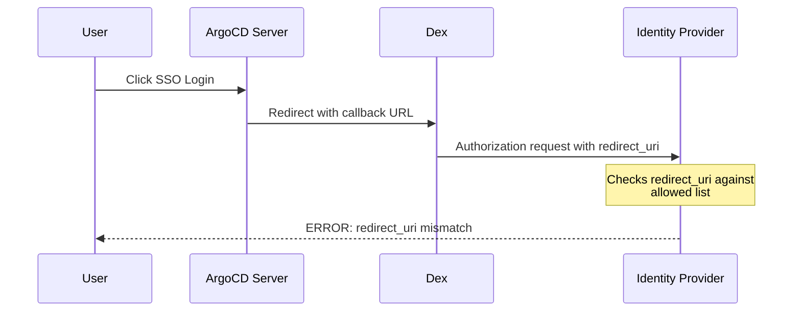

# How to Fix ArgoCD SSO Redirect URI Mismatch

Author: [nawazdhandala](https://github.com/nawazdhandala)

Tags: ArgoCD, GitOps, Kubernetes, SSO, Authentication

Description: Learn how to fix the redirect URI mismatch error in ArgoCD SSO configuration for OIDC providers like Okta, Azure AD, Google, and Keycloak with step-by-step solutions.

---

You click "Log in via SSO" in ArgoCD and your identity provider throws back a "redirect_uri mismatch" error. This is one of the most frustrating SSO issues because it blocks all user authentication, and the fix depends on getting an exact URL match between three different systems. Let us break down exactly what is happening and how to fix it.

## What Causes the Redirect URI Mismatch

During the OAuth2/OIDC flow, ArgoCD redirects users to the identity provider (IdP) with a callback URL. The IdP checks this URL against its list of allowed redirect URIs. If there is no exact match - even a trailing slash difference - the IdP rejects the request.



The three places that must agree on the redirect URI:
1. The ArgoCD server configuration (`url` in argocd-cm)
2. The Dex connector configuration (auto-derived from ArgoCD URL)
3. The identity provider's allowed redirect URIs

## Step 1: Find the Exact Redirect URI ArgoCD Is Sending

First, determine what URL ArgoCD is actually sending to the IdP:

```bash
# Get the ArgoCD base URL
kubectl get configmap argocd-cm -n argocd -o jsonpath='{.data.url}'
echo ""
```

The redirect URI that Dex uses follows this pattern:
```
<argocd-url>/auth/callback
```

For OIDC without Dex:
```
<argocd-url>/auth/callback
```

So if your ArgoCD URL is `https://argocd.example.com`, the redirect URI is:
```
https://argocd.example.com/auth/callback
```

## Step 2: Check the Identity Provider Configuration

### For Okta

Navigate to Applications > Your ArgoCD App > General Settings > Login:
- The "Sign-in redirect URIs" field must contain exactly: `https://argocd.example.com/auth/callback`

### For Azure AD (Entra ID)

Navigate to App registrations > Your App > Authentication:
- Under "Redirect URIs," add: `https://argocd.example.com/auth/callback`
- Make sure the type is "Web" (not SPA or Mobile)

### For Google Workspace

Navigate to Google Cloud Console > APIs & Services > Credentials > Your OAuth 2.0 Client:
- Under "Authorized redirect URIs," add: `https://argocd.example.com/auth/callback`

### For Keycloak

Navigate to Clients > Your ArgoCD Client:
- Set "Valid redirect URIs" to: `https://argocd.example.com/auth/callback`
- You can also use a wildcard like `https://argocd.example.com/*` for testing, but be specific in production

## Step 3: Fix Common URL Mismatches

### Mismatch 1: HTTP vs HTTPS

The most common mismatch. ArgoCD sends `https://` but the IdP has `http://`, or vice versa.

```bash
# Check if ArgoCD URL uses HTTPS
kubectl get configmap argocd-cm -n argocd -o jsonpath='{.data.url}'
```

Make sure the protocol matches exactly in both places.

### Mismatch 2: Trailing Slash

Some identity providers are strict about trailing slashes:
- `https://argocd.example.com/auth/callback` (correct)
- `https://argocd.example.com/auth/callback/` (may not match)

Remove any trailing slashes from both the ArgoCD URL and the IdP configuration.

### Mismatch 3: Port Number

If ArgoCD runs on a non-standard port:

```bash
# If ArgoCD is on port 8443
# The URL must include the port
kubectl patch configmap argocd-cm -n argocd --type merge -p '{
  "data": {
    "url": "https://argocd.example.com:8443"
  }
}'
```

And the IdP must have: `https://argocd.example.com:8443/auth/callback`

### Mismatch 4: Different Domain or Path

When ArgoCD is behind a reverse proxy with path-based routing:

```bash
# If ArgoCD is at a subpath
kubectl patch configmap argocd-cm -n argocd --type merge -p '{
  "data": {
    "url": "https://platform.example.com/argocd"
  }
}'
```

The redirect URI becomes: `https://platform.example.com/argocd/auth/callback`

## Step 4: Using OIDC Directly (Without Dex)

If you use OIDC directly instead of Dex, the configuration is slightly different:

```yaml
# argocd-cm ConfigMap for direct OIDC
apiVersion: v1
kind: ConfigMap
metadata:
  name: argocd-cm
  namespace: argocd
data:
  url: "https://argocd.example.com"
  oidc.config: |
    name: Okta
    issuer: https://your-org.okta.com
    clientID: your-client-id
    clientSecret: $oidc.okta.clientSecret
    requestedScopes:
      - openid
      - profile
      - email
      - groups
    # Explicitly set redirect URI if needed
    redirectURI: https://argocd.example.com/auth/callback
```

The `redirectURI` field in the OIDC config overrides the auto-generated one. Use this when the automatic derivation does not work correctly.

## Step 5: Using Dex with Custom Callback

For Dex-based SSO, the callback URL is derived from the ArgoCD URL. If you need to customize it:

```yaml
# argocd-cm ConfigMap with Dex
apiVersion: v1
kind: ConfigMap
metadata:
  name: argocd-cm
  namespace: argocd
data:
  url: "https://argocd.example.com"
  dex.config: |
    connectors:
      - type: oidc
        id: okta
        name: Okta
        config:
          issuer: https://your-org.okta.com
          clientID: your-client-id
          clientSecret: $dex.okta.clientSecret
          redirectURI: https://argocd.example.com/api/dex/callback
          scopes:
            - openid
            - profile
            - email
            - groups
```

Note the different callback path for Dex: `/api/dex/callback` instead of `/auth/callback`.

When using Dex, you need TWO redirect URIs registered in your IdP:
- `https://argocd.example.com/api/dex/callback` (Dex callback)

## Step 6: Debug with Browser Developer Tools

Open your browser's developer tools (Network tab) before clicking "Log in via SSO." Look at the redirect URL being sent:

```
# Example redirect URL from browser network tab
https://your-idp.com/authorize?
  client_id=your-client-id&
  redirect_uri=https%3A%2F%2Fargocd.example.com%2Fauth%2Fcallback&
  response_type=code&
  scope=openid+profile+email&
  state=random-string
```

The `redirect_uri` parameter shows exactly what ArgoCD is requesting. Copy this URL-decoded value and make sure it matches what is in your IdP.

## Step 7: Fix After ArgoCD URL Change

If you changed the ArgoCD domain name, you need to update everything:

```bash
# 1. Update ArgoCD URL
kubectl patch configmap argocd-cm -n argocd --type merge -p '{
  "data": {
    "url": "https://new-argocd.example.com"
  }
}'

# 2. Restart ArgoCD server and Dex
kubectl rollout restart deployment argocd-server -n argocd
kubectl rollout restart deployment argocd-dex-server -n argocd

# 3. Update your IdP redirect URIs to use new-argocd.example.com

# 4. Verify the change
kubectl get configmap argocd-cm -n argocd -o jsonpath='{.data.url}'
```

## Complete Checklist

Run through this checklist when debugging redirect URI mismatch:

```bash
#!/bin/bash
# sso-redirect-debug.sh

NAMESPACE="argocd"

echo "=== SSO Redirect URI Debug ==="

# Get ArgoCD URL
ARGOCD_URL=$(kubectl get configmap argocd-cm -n $NAMESPACE -o jsonpath='{.data.url}')
echo "ArgoCD URL: $ARGOCD_URL"
echo "Expected callback: ${ARGOCD_URL}/auth/callback"

# Check for Dex config
DEX_CONFIG=$(kubectl get configmap argocd-cm -n $NAMESPACE -o jsonpath='{.data.dex\.config}')
if [ -n "$DEX_CONFIG" ]; then
    echo -e "\nUsing Dex - Dex callback: ${ARGOCD_URL}/api/dex/callback"
    echo "Dex connectors:"
    echo "$DEX_CONFIG" | grep -A2 "type:"
fi

# Check for OIDC config
OIDC_CONFIG=$(kubectl get configmap argocd-cm -n $NAMESPACE -o jsonpath='{.data.oidc\.config}')
if [ -n "$OIDC_CONFIG" ]; then
    echo -e "\nUsing direct OIDC"
    echo "OIDC issuer:"
    echo "$OIDC_CONFIG" | grep "issuer:"
fi

# Check server ingress
echo -e "\n--- Ingress ---"
kubectl get ingress -n $NAMESPACE -o wide 2>/dev/null || echo "No ingress found"

# Check TLS
echo -e "\n--- TLS ---"
kubectl get ingress -n $NAMESPACE -o jsonpath='{range .items[*]}{.spec.tls[*].hosts}{"\n"}{end}' 2>/dev/null
```

## Summary

The redirect URI mismatch error in ArgoCD SSO boils down to one simple rule: the callback URL that ArgoCD sends must exactly match one of the allowed redirect URIs in your identity provider. Check the ArgoCD `url` in the ConfigMap, determine whether you are using Dex (`/api/dex/callback`) or direct OIDC (`/auth/callback`), and make sure the IdP has the exact same URI registered. Pay attention to protocol, port, domain, path, and trailing slashes - any difference will cause a mismatch.
