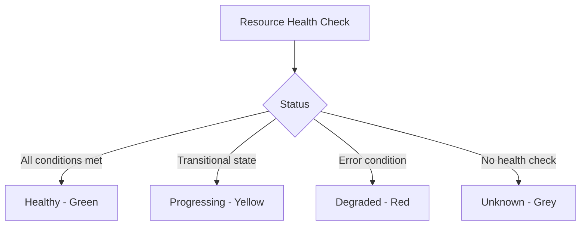

# How to Fix ArgoCD Application Stuck in 'Progressing'

Author: [nawazdhandala](https://github.com/nawazdhandala)

Tags: ArgoCD, GitOps, Kubernetes, Troubleshooting, Health Status

Description: Resolve ArgoCD applications stuck in Progressing health status by diagnosing deployment rollout issues, resource scheduling failures, and health check configuration problems.

---

When an ArgoCD application shows a health status of "Progressing" that never resolves to "Healthy," it means at least one resource in the application is in a transitional state that never reaches a final condition. The application stays yellow in the UI, and health-based automation (like notifications or progressive delivery) will not trigger.

The Progressing status is different from a failed sync. The sync itself might be complete, but the health assessment sees a resource that is still rolling out, scaling, or otherwise in transition.

## Understanding Health Status in ArgoCD

ArgoCD evaluates the health of each resource in your application:



The overall application health is the worst status among all resources. If one Deployment is Progressing, the whole application shows as Progressing.

## Step 1: Identify the Progressing Resource

```bash
# List all resources and their health status
argocd app resources my-app

# Filter for non-healthy resources
argocd app resources my-app | grep -v Healthy
```

You will see output like:

```text
GROUP  KIND        NAMESPACE   NAME       STATUS  HEALTH       MESSAGE
apps   Deployment  production  my-api     Synced  Progressing  Waiting for rollout to finish
       Service     production  my-api     Synced  Healthy
apps   Deployment  production  my-worker  Synced  Healthy
```

Now you know it is the `my-api` Deployment that is stuck.

## Step 2: Check the Deployment Rollout

```bash
# Check the deployment rollout status
kubectl rollout status deployment my-api -n production

# Get detailed deployment information
kubectl describe deployment my-api -n production

# Check the replica sets
kubectl get rs -n production -l app=my-api
```

Look at the deployment conditions:

```bash
kubectl get deployment my-api -n production \
  -o jsonpath='{.status.conditions[*]}' | python3 -m json.tool
```

## Common Cause 1: Pods Cannot Be Scheduled

The new pods from the deployment cannot be scheduled on any node:

```bash
# Check for pending pods
kubectl get pods -n production -l app=my-api | grep Pending

# Get the reason
kubectl describe pod -n production <pending-pod-name>
```

**Common scheduling failures:**

- **Insufficient resources**: No node has enough CPU or memory

```bash
# Check node resources
kubectl describe nodes | grep -A5 "Allocated resources"
```

Fix by adding nodes, reducing resource requests, or cleaning up unused workloads.

- **Node affinity not satisfied**: No node matches the affinity rules

```yaml
# Check if affinity rules are too restrictive
spec:
  affinity:
    nodeAffinity:
      requiredDuringSchedulingIgnoredDuringExecution:
        nodeSelectorTerms:
          - matchExpressions:
              - key: node-type
                operator: In
                values:
                  - gpu  # Do you have nodes with this label?
```

- **Taints and tolerations**: Pods need tolerations for node taints

```bash
# Check node taints
kubectl get nodes -o custom-columns=NAME:.metadata.name,TAINTS:.spec.taints
```

## Common Cause 2: Image Pull Failures

The pod cannot pull the container image:

```bash
# Check for ImagePullBackOff
kubectl get pods -n production -l app=my-api | grep ImagePull

# Get the detailed error
kubectl describe pod -n production <pod-name> | grep -A5 "Events:"
```

**Fixes:**
- Verify the image tag exists in the registry
- Check image pull secrets:

```bash
kubectl get secret -n production | grep docker
kubectl get deployment my-api -n production \
  -o jsonpath='{.spec.template.spec.imagePullSecrets}'
```

- Ensure the node can reach the container registry

## Common Cause 3: Readiness Probe Failing

The new pods are running but the readiness probe keeps failing, so the Deployment never considers them ready:

```bash
# Check pod readiness
kubectl get pods -n production -l app=my-api -o wide

# Look at probe failures in events
kubectl describe pod -n production <pod-name> | grep -A10 "Events:"

# Check the actual probe endpoint
kubectl exec -n production <pod-name> -- \
  curl -s http://localhost:8080/healthz
```

**Common probe issues:**
- Wrong port number
- Wrong path
- Application takes too long to start (increase `initialDelaySeconds`)
- Application has a dependency that is not ready

```yaml
# Adjust readiness probe
readinessProbe:
  httpGet:
    path: /healthz
    port: 8080
  initialDelaySeconds: 30   # Give the app time to start
  periodSeconds: 10
  failureThreshold: 6       # Allow more failures before marking unready
  timeoutSeconds: 5
```

## Common Cause 4: PodDisruptionBudget Blocking Rollout

A PDB can prevent old pods from being terminated, blocking the rollout:

```bash
# Check PDBs
kubectl get pdb -n production

# See if the PDB is blocking
kubectl describe pdb my-api-pdb -n production
```

**Fix:** Temporarily adjust the PDB or perform the rollout during a maintenance window:

```yaml
# Ensure PDB allows at least one pod to be unavailable
spec:
  maxUnavailable: 1
  # OR
  minAvailable: 1  # If you have 2+ replicas
```

## Common Cause 5: Deployment Strategy Deadlock

The `RollingUpdate` strategy can deadlock if there are not enough resources:

```yaml
spec:
  strategy:
    type: RollingUpdate
    rollingUpdate:
      maxSurge: 1        # Creates 1 extra pod
      maxUnavailable: 0  # Does not terminate old pods until new ones are ready
```

If the cluster does not have room for the extra pod (`maxSurge: 1`), the rollout stalls because:
- Old pods cannot be removed (`maxUnavailable: 0`)
- New pod cannot be created (no resources)

**Fix:**

```yaml
strategy:
  type: RollingUpdate
  rollingUpdate:
    maxSurge: 1
    maxUnavailable: 1  # Allow removing one old pod to make room
```

## Common Cause 6: Init Container Stuck

An init container that never completes blocks the main container from starting:

```bash
# Check init container status
kubectl get pods -n production -l app=my-api \
  -o jsonpath='{.items[*].status.initContainerStatuses[*]}'
```

**Common init container issues:**
- Waiting for a database to be available
- Waiting for a secret to exist
- DNS resolution failure

## Common Cause 7: StatefulSet OrderedReady

StatefulSets roll out pods one at a time. If one pod fails to become ready, the entire rollout stalls:

```bash
# Check StatefulSet status
kubectl get statefulset -n production
kubectl rollout status statefulset my-statefulset -n production
```

Fix the pod issue first, then the rollout will continue automatically.

## Common Cause 8: Custom Resource Health Check Missing

If your application includes custom resources (CRDs), ArgoCD might not know how to assess their health, defaulting to "Progressing":

```bash
# Check if the CRD resource has health defined
argocd app resources my-app | grep -i "unknown\|progressing"
```

**Define a custom health check:**

```yaml
# argocd-cm ConfigMap
data:
  resource.customizations.health.mygroup.io_MyResource: |
    hs = {}
    if obj.status ~= nil then
      if obj.status.phase == "Ready" then
        hs.status = "Healthy"
        hs.message = "Resource is ready"
      elseif obj.status.phase == "Failed" then
        hs.status = "Degraded"
        hs.message = obj.status.message
      else
        hs.status = "Progressing"
        hs.message = "Resource is being provisioned"
      end
    end
    return hs
```

## Force Resolution

If you need the application to move past the Progressing state urgently:

```bash
# Option 1: Roll back the deployment
kubectl rollout undo deployment my-api -n production

# Option 2: Scale down and back up
kubectl scale deployment my-api -n production --replicas=0
kubectl scale deployment my-api -n production --replicas=3

# Option 3: Delete the stuck pods
kubectl delete pods -n production -l app=my-api
```

**Warning:** These manual interventions will cause ArgoCD to show the application as OutOfSync until the next sync.

## Monitoring for Stuck Progressing State

Set up alerts for applications that stay in Progressing too long:

```yaml
# PrometheusRule
groups:
  - name: argocd
    rules:
      - alert: ArgoCDAppStuckProgressing
        expr: |
          argocd_app_info{health_status="Progressing"} == 1
        for: 30m
        labels:
          severity: warning
        annotations:
          summary: "ArgoCD app {{ $labels.name }} stuck in Progressing for 30+ minutes"
```

## Summary

An ArgoCD application stuck in Progressing means a resource is in a transitional state that never resolves. Use `argocd app resources` to identify the specific resource, then investigate with `kubectl describe` and `kubectl get events`. The most common causes are pod scheduling failures, image pull errors, failing readiness probes, PDB conflicts, and deployment strategy deadlocks. Fix the underlying Kubernetes issue and the health status will automatically update.
