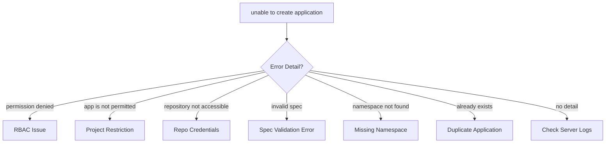

# How to Fix ArgoCD 'unable to create application' Error

Author: [nawazdhandala](https://github.com/nawazdhandala)

Tags: ArgoCD, GitOps, Kubernetes, Troubleshooting, Applications

Description: Learn how to diagnose and fix the ArgoCD unable to create application error including permission issues, project restrictions, invalid specs, and namespace problems.

---

You try to create an application in ArgoCD - through the UI, CLI, or declarative YAML - and get the dreaded "unable to create application" error. The error message sometimes includes helpful details, but often it is maddeningly vague. This guide covers every known cause and shows you how to fix each one.

## Common Causes Overview



## Cause 1: RBAC Permission Denied

The user or service account does not have permission to create applications.

```bash
# Check what the current user can do
argocd account can-i create applications '*'

# Check the RBAC policy
kubectl get configmap argocd-rbac-cm -n argocd -o yaml
```

Fix the RBAC policy to allow application creation:

```yaml
# argocd-rbac-cm ConfigMap
apiVersion: v1
kind: ConfigMap
metadata:
  name: argocd-rbac-cm
  namespace: argocd
data:
  policy.csv: |
    # Allow developers to create applications in the dev project
    p, role:developer, applications, create, dev/*, allow
    p, role:developer, applications, get, dev/*, allow
    p, role:developer, applications, sync, dev/*, allow

    # Map SSO groups to roles
    g, dev-team, role:developer
  policy.default: role:readonly
```

After updating RBAC, the changes take effect immediately - no restart needed.

## Cause 2: Project Restrictions

ArgoCD projects restrict which repositories, destinations, and resource types an application can use. If the application spec violates any project restriction, creation fails.

```bash
# Check project restrictions
argocd proj get your-project

# List allowed source repos
argocd proj get your-project -o json | jq '.spec.sourceRepos'

# List allowed destinations
argocd proj get your-project -o json | jq '.spec.destinations'
```

### Fix: Source Repository Not Permitted

```yaml
# Update the project to allow the repository
apiVersion: argoproj.io/v1alpha1
kind: AppProject
metadata:
  name: your-project
  namespace: argocd
spec:
  sourceRepos:
    # Allow all repos (less secure)
    - '*'
    # Or allow specific repos
    - 'https://github.com/your-org/your-repo.git'
    - 'https://github.com/your-org/another-repo.git'
```

### Fix: Destination Not Permitted

```yaml
apiVersion: argoproj.io/v1alpha1
kind: AppProject
metadata:
  name: your-project
  namespace: argocd
spec:
  destinations:
    # Allow specific cluster and namespace
    - server: https://kubernetes.default.svc
      namespace: my-app
    # Allow all namespaces on default cluster
    - server: https://kubernetes.default.svc
      namespace: '*'
    # Allow all destinations (less secure)
    - server: '*'
      namespace: '*'
```

### Fix: Resource Kind Not Permitted

```yaml
apiVersion: argoproj.io/v1alpha1
kind: AppProject
metadata:
  name: your-project
  namespace: argocd
spec:
  # Allow cluster-scoped resources
  clusterResourceWhitelist:
    - group: '*'
      kind: '*'
  # Allow namespace-scoped resources
  namespaceResourceWhitelist:
    - group: '*'
      kind: '*'
```

## Cause 3: Invalid Application Spec

The application YAML has validation errors that prevent creation.

### Missing Required Fields

Every ArgoCD application needs at minimum:

```yaml
apiVersion: argoproj.io/v1alpha1
kind: Application
metadata:
  name: my-app
  namespace: argocd  # Applications must be in the argocd namespace by default
spec:
  project: default  # Required - must reference an existing project
  source:
    repoURL: https://github.com/your-org/your-repo.git  # Required
    path: manifests  # Required for Git sources
    targetRevision: HEAD  # Required
  destination:
    server: https://kubernetes.default.svc  # Required
    namespace: my-app  # Required
```

### Common Spec Errors

```bash
# Validate your application YAML before applying
kubectl apply --dry-run=client -f application.yaml

# Check for YAML syntax errors
python3 -c "import yaml; yaml.safe_load(open('application.yaml'))"
```

Common mistakes:
- `spec.destination.server` set to a cluster that has not been registered
- `spec.source.path` pointing to a non-existent directory in the repo
- Using `spec.source` and `spec.sources` together (they are mutually exclusive)
- Wrong `targetRevision` format (use `HEAD` for default branch, not `main` unless you want to pin)

## Cause 4: Repository Not Accessible

ArgoCD cannot reach the Git repository referenced in the application.

```bash
# Test repository access
argocd repo list

# Add the repository if it is not registered
argocd repo add https://github.com/your-org/your-repo.git \
  --username your-username \
  --password your-token

# For SSH repos
argocd repo add git@github.com:your-org/your-repo.git \
  --ssh-private-key-path ~/.ssh/id_rsa
```

Check if the repository is accessible from ArgoCD:

```bash
# Check repo server logs for access errors
kubectl logs -n argocd deploy/argocd-repo-server --tail=50 | grep -i "error\|fail"
```

## Cause 5: Application Already Exists

If an application with the same name already exists in the same namespace:

```bash
# Check for existing application
argocd app get my-app 2>/dev/null && echo "App exists" || echo "App does not exist"

# Or with kubectl
kubectl get application my-app -n argocd 2>/dev/null
```

If a previous deletion left a finalizer stuck:

```bash
# Check for stuck finalizers
kubectl get application my-app -n argocd -o jsonpath='{.metadata.finalizers}'

# Remove stuck finalizers if needed
kubectl patch application my-app -n argocd --type json \
  -p '[{"op": "remove", "path": "/metadata/finalizers"}]'

# Then delete the remnant
kubectl delete application my-app -n argocd
```

## Cause 6: Namespace Does Not Exist

If the destination namespace does not exist and `CreateNamespace=true` is not set:

```yaml
apiVersion: argoproj.io/v1alpha1
kind: Application
metadata:
  name: my-app
  namespace: argocd
spec:
  project: default
  source:
    repoURL: https://github.com/your-org/your-repo.git
    path: manifests
    targetRevision: HEAD
  destination:
    server: https://kubernetes.default.svc
    namespace: my-new-namespace
  syncPolicy:
    syncOptions:
      - CreateNamespace=true  # This creates the namespace automatically
```

Or create the namespace manually:

```bash
kubectl create namespace my-new-namespace
```

## Cause 7: Application Name Validation

ArgoCD application names must follow Kubernetes naming conventions:

```bash
# Valid names
my-app
my-app-v2
frontend-production

# Invalid names (will cause creation failure)
My_App          # Uppercase and underscores not allowed
my app          # Spaces not allowed
my.app.v2      # Periods may cause issues
-my-app         # Cannot start with hyphen
```

Application names must:
- Be lowercase
- Contain only letters, numbers, and hyphens
- Start with a letter or number
- Be no longer than 253 characters

## Cause 8: Server or Cluster Not Registered

If the destination cluster is not the in-cluster default and has not been registered:

```bash
# List registered clusters
argocd cluster list

# Add a new cluster
argocd cluster add your-context-name

# Or add declaratively
kubectl apply -f - <<EOF
apiVersion: v1
kind: Secret
metadata:
  name: my-cluster-secret
  namespace: argocd
  labels:
    argocd.argoproj.io/secret-type: cluster
stringData:
  name: my-cluster
  server: https://my-cluster-api.example.com
  config: |
    {
      "bearerToken": "your-token",
      "tlsClientConfig": {
        "insecure": false,
        "caData": "base64-encoded-ca-cert"
      }
    }
EOF
```

## Debugging: Check Server Logs

When the error message is vague, the ArgoCD server logs always have the full details:

```bash
# Watch server logs while trying to create the application
kubectl logs -n argocd deploy/argocd-server -f | grep -i "create\|error\|denied\|fail"
```

You can also increase log verbosity temporarily:

```bash
kubectl patch configmap argocd-cmd-params-cm -n argocd --type merge -p '{
  "data": {
    "server.log.level": "debug"
  }
}'
kubectl rollout restart deployment argocd-server -n argocd
```

## Quick Fix Checklist

```bash
#!/bin/bash
# create-app-debug.sh - Debug application creation failures

APP_NAME=${1:-"my-app"}
NAMESPACE="argocd"

echo "=== Application Creation Debug for: $APP_NAME ==="

# Check if app already exists
echo -e "\n--- Existing Application Check ---"
kubectl get application $APP_NAME -n $NAMESPACE 2>&1

# Check RBAC
echo -e "\n--- RBAC Check ---"
argocd account can-i create applications '*' 2>&1

# Check project
echo -e "\n--- Project Info ---"
argocd proj list 2>&1

# Check repos
echo -e "\n--- Repository List ---"
argocd repo list 2>&1

# Check clusters
echo -e "\n--- Cluster List ---"
argocd cluster list 2>&1

# Check server logs for recent errors
echo -e "\n--- Recent Server Errors ---"
kubectl logs -n $NAMESPACE deploy/argocd-server --tail=20 2>&1 | grep -i "error\|fail\|denied"
```

## Summary

The "unable to create application" error in ArgoCD has many possible causes, but they all fall into predictable categories: RBAC denying the operation, project restrictions blocking the source or destination, invalid YAML in the application spec, repository access issues, or namespace/cluster problems. Always check the ArgoCD server logs for the detailed error message - it is almost always more informative than what the UI or CLI shows. For tracking application creation failures across your team, consider monitoring ArgoCD API errors with [OneUptime](https://oneuptime.com).
