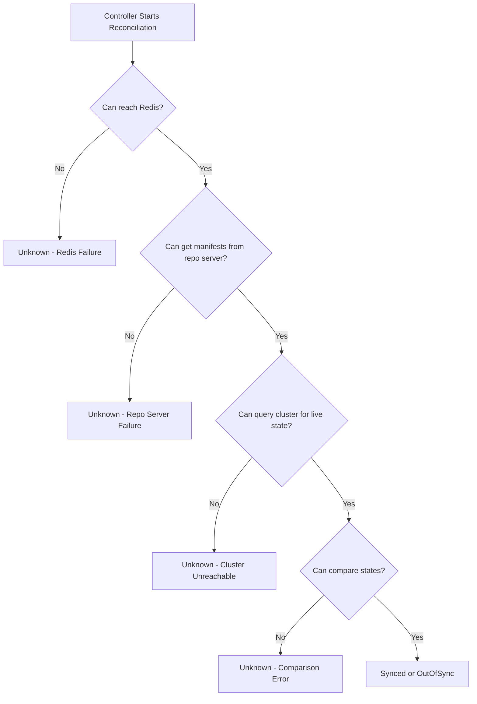
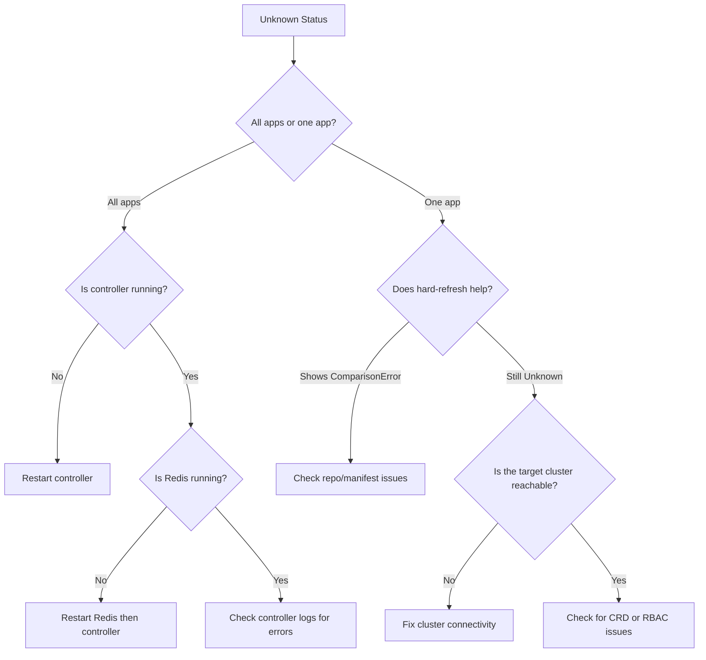

# How to Fix ArgoCD 'Unknown' Sync Status

Author: [nawazdhandala](https://github.com/nawazdhandala)

Tags: ArgoCD, GitOps, Kubernetes, Troubleshooting, Sync Status

Description: Learn how to diagnose and fix the 'Unknown' sync status in ArgoCD applications, covering controller issues, Redis connectivity, cluster problems, and resource tracking failures.

---

The "Unknown" sync status in ArgoCD means that ArgoCD cannot determine the state of the application. It does not know whether the application is in sync or out of sync. This is different from "OutOfSync" (which means ArgoCD knows the state and it does not match desired) or "Synced" (which means everything matches). "Unknown" means ArgoCD has lost the ability to evaluate the application entirely. This guide covers every cause and how to fix each one.

## What Causes Unknown Status

The "Unknown" status occurs when the ArgoCD application controller cannot successfully complete the comparison between the desired state (from Git) and the live state (from the cluster). This can happen at multiple points in the pipeline.



## Cause 1: Controller Not Running or Overloaded

The most common cause of all applications showing "Unknown" is a controller that is not processing applications.

```bash
# Check controller health
kubectl get pods -n argocd -l app.kubernetes.io/name=argocd-application-controller

# Check if the controller is processing
kubectl logs -n argocd deployment/argocd-application-controller --tail=100

# If the controller is OOMKilled or CrashLooping:
kubectl get events -n argocd --field-selector reason=OOMKilling

# Fix: restart the controller
kubectl rollout restart deployment/argocd-application-controller -n argocd

# If OOMKilled, increase memory first
kubectl patch deployment argocd-application-controller -n argocd --type='json' \
  -p='[{"op": "replace", "path": "/spec/template/spec/containers/0/resources/limits/memory", "value": "4Gi"}]'
```

If only some applications show "Unknown" while others are fine, the controller is probably running but overwhelmed. It processes applications in a queue and has not reached the "Unknown" ones yet.

```bash
# Increase status processors to handle more apps concurrently
kubectl patch deployment argocd-application-controller -n argocd --type='json' \
  -p='[{"op": "add", "path": "/spec/template/spec/containers/0/args/-", "value": "--status-processors=50"}]'
```

## Cause 2: Redis Connection Failure

The controller uses Redis to cache application state. If Redis is down, the controller cannot function properly.

```bash
# Check Redis
kubectl get pods -n argocd -l app.kubernetes.io/name=argocd-redis
kubectl exec -n argocd deployment/argocd-redis -- redis-cli ping

# If Redis is not responding:
kubectl rollout restart deployment/argocd-redis -n argocd
kubectl rollout status deployment/argocd-redis -n argocd

# Then restart the controller
kubectl rollout restart deployment/argocd-application-controller -n argocd
```

## Cause 3: Repo Server Failure

If the repo server cannot generate manifests, the controller has nothing to compare against.

```bash
# Check repo server
kubectl get pods -n argocd -l app.kubernetes.io/name=argocd-repo-server
kubectl logs -n argocd deployment/argocd-repo-server --tail=100

# Test manifest generation for a specific app
argocd app get <app-name> --hard-refresh

# If the app shows a ComparisonError instead of Unknown after hard refresh,
# the issue is with the repo, not the controller

# Restart repo server if needed
kubectl rollout restart deployment/argocd-repo-server -n argocd
```

## Cause 4: Cluster Connectivity Lost

If ArgoCD cannot reach the target cluster's API server, it cannot query live state.

```bash
# Check cluster connectivity
argocd cluster list

# If the cluster shows an error, see the cluster disconnected runbook
# Test connectivity
kubectl exec -n argocd deployment/argocd-application-controller -- \
  wget -qO- --timeout=5 <cluster-api-url>/healthz 2>&1
```

For the in-cluster deployment (where ArgoCD manages the same cluster it runs on), this is rarely the issue. For remote clusters, check network connectivity and credentials.

## Cause 5: Custom Resource Definition Missing

If an application references a CustomResourceDefinition (CRD) that does not exist in the cluster, the comparison fails.

```bash
# Check the app for comparison errors
argocd app get <app-name>
# Look for messages like "could not find resource" or "no matches for kind"

# List the CRDs the app expects
argocd app manifests <app-name> --source git | grep "^kind:" | sort -u

# Check which CRDs exist in the cluster
kubectl get crd | grep <expected-crd-name>

# Fix: install the missing CRD
# Often this means syncing the CRD-providing app first
argocd app sync <crd-app-name>
```

## Cause 6: Resource Tracking Annotation Conflict

If two ArgoCD applications claim the same resource, one or both may show "Unknown".

```bash
# Check if the resource has conflicting tracking annotations
kubectl get <resource-type> <resource-name> -n <namespace> -o yaml | grep argocd

# Look for:
# argocd.argoproj.io/tracking-id
# app.kubernetes.io/instance
# If these point to a different application than expected, there's a conflict

# Fix: ensure each resource is managed by only one ArgoCD application
# Remove the resource from one of the conflicting applications
```

## Cause 7: Invalid Application Spec

A misconfigured Application resource can prevent the controller from processing it.

```bash
# Validate the Application spec
argocd app get <app-name> -o yaml

# Check for common misconfigurations:
# - Invalid repoURL
# - Non-existent path in the repo
# - Invalid targetRevision
# - Missing destination server or namespace

# Fix: update the Application spec
argocd app set <app-name> --repo <correct-repo> --path <correct-path>
```

## Cause 8: Large Application Timeout

Applications with many resources may time out during comparison.

```bash
# Check controller logs for timeout messages
kubectl logs -n argocd deployment/argocd-application-controller --tail=500 | grep -i "timeout\|deadline"

# Increase the controller's comparison timeout
# This is controlled by ARGOCD_RECONCILIATION_TIMEOUT environment variable
kubectl set env deployment/argocd-application-controller -n argocd \
  ARGOCD_RECONCILIATION_TIMEOUT=300
```

## Quick Resolution Flowchart

Follow this flowchart to quickly narrow down the cause.



## Verification

After applying a fix, verify the application status has resolved.

```bash
# Force a refresh
argocd app get <app-name> --refresh

# Wait a minute, then check status
argocd app get <app-name>
# Should show "Synced" or "OutOfSync" instead of "Unknown"

# Check that all apps have resolved
argocd app list | grep Unknown
# Should return empty if all apps are resolved
```

## Prevention

1. Monitor the `argocd_app_info` metric - alert when applications show Unknown status for more than 5 minutes
2. Set appropriate resource limits on the controller to prevent OOMKills
3. For large deployments, use controller sharding to distribute the load
4. Set up health checks for Redis and the repo server
5. Install CRDs before deploying applications that depend on them (use sync waves)

For detailed runbooks on specific component failures, see our guides on [controller not processing](https://oneuptime.com/blog/post/2026-02-26-argocd-runbook-controller-not-processing/view) and [Redis memory full](https://oneuptime.com/blog/post/2026-02-26-argocd-runbook-redis-memory-full/view).
