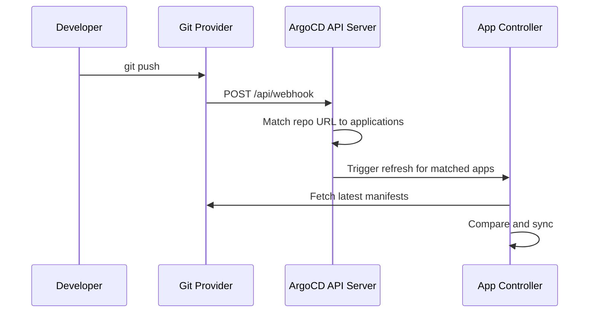

# How to Fix ArgoCD Webhook Not Triggering Sync

Author: [nawazdhandala](https://github.com/nawazdhandala)

Tags: ArgoCD, GitOps, Kubernetes, Webhooks, CI/CD

Description: Learn how to diagnose and fix ArgoCD webhook issues where Git pushes do not trigger automatic sync, including configuration, networking, and secret validation problems.

---

You push a commit to your Git repository, but ArgoCD does not react. The application stays OutOfSync until you manually refresh it, or you wait for the default 3-minute polling interval. This means your webhook is broken. Here is how to find and fix the problem.

## How ArgoCD Webhooks Work

ArgoCD supports webhooks from GitHub, GitLab, Bitbucket, and generic Git providers. When configured correctly, a push event hits the ArgoCD API server, which immediately triggers a refresh of any application that references the changed repository.



## Step 1: Verify the Webhook Is Configured in Your Git Provider

First, make sure the webhook actually exists on the Git provider side.

For GitHub, navigate to your repository Settings > Webhooks and verify:
- **Payload URL**: `https://argocd.example.com/api/webhook`
- **Content type**: `application/json`
- **Secret**: Must match what is in ArgoCD
- **Events**: At minimum, "Just the push event"

For GitLab, go to Settings > Webhooks:
- **URL**: `https://argocd.example.com/api/webhook`
- **Secret token**: Must match ArgoCD configuration
- **Trigger**: Push events

## Step 2: Check Webhook Delivery History

Most Git providers show webhook delivery history. Check for failed deliveries.

On GitHub, go to your webhook settings and click "Recent Deliveries." Look for:
- HTTP status codes (should be 200)
- Response body for error messages
- Request payload to confirm format

Common HTTP responses and what they mean:

| Status Code | Meaning |
|------------|---------|
| 200 | Webhook received successfully |
| 404 | ArgoCD webhook endpoint not found |
| 403 | Secret mismatch or authentication failure |
| 502/503 | ArgoCD server not reachable |

## Step 3: Verify ArgoCD Can Receive Webhooks

The ArgoCD API server must be accessible from your Git provider. If ArgoCD is behind a firewall or in a private network, webhooks from GitHub/GitLab will never arrive.

```bash
# Check if the webhook endpoint is reachable
curl -X POST https://argocd.example.com/api/webhook \
  -H "Content-Type: application/json" \
  -d '{"test": true}' \
  -v
```

If you get a connection timeout, the issue is networking - not ArgoCD configuration.

For clusters behind firewalls, consider:
- Using a reverse proxy or tunnel (Cloudflare Tunnel, ngrok for testing)
- Deploying a webhook relay in a DMZ
- Using Git polling instead of webhooks

## Step 4: Verify the Webhook Secret

ArgoCD validates webhook payloads using a shared secret. If the secret does not match, the webhook is silently rejected.

Check the current webhook secret in ArgoCD:

```bash
# Check if webhook secrets are configured
kubectl get secret argocd-secret -n argocd -o jsonpath='{.data.webhook\.github\.secret}' | base64 -d
kubectl get secret argocd-secret -n argocd -o jsonpath='{.data.webhook\.gitlab\.secret}' | base64 -d
kubectl get secret argocd-secret -n argocd -o jsonpath='{.data.webhook\.bitbucket\.secret}' | base64 -d
```

If the secret is empty or wrong, update it:

```bash
# Set the webhook secret for GitHub
kubectl patch secret argocd-secret -n argocd --type merge -p '{
  "stringData": {
    "webhook.github.secret": "your-webhook-secret-here"
  }
}'

# Restart the API server to pick up the new secret
kubectl rollout restart deployment argocd-server -n argocd
```

Make sure the same secret is configured in your Git provider's webhook settings.

## Step 5: Check ArgoCD Server Logs

The ArgoCD server logs webhook processing. Look for webhook-related entries:

```bash
# Check for webhook events in argocd-server logs
kubectl logs -n argocd deploy/argocd-server --tail=200 | grep -i "webhook\|received push"
```

If you see no webhook entries at all, the request is not reaching ArgoCD. If you see errors, they will tell you exactly what is wrong.

Common log entries and their meanings:

```
# Successful webhook
level=info msg="Received push event repo: https://github.com/org/repo"

# Secret mismatch
level=warning msg="Hook signature mismatch"

# Repo not matched to any application
level=info msg="Ignoring webhook event" reason="no matching applications"
```

## Step 6: Verify Repository URL Matching

ArgoCD matches the webhook payload's repository URL against application source URLs. If they do not match exactly, the webhook is ignored.

```bash
# List all application source repos
kubectl get applications -n argocd -o jsonpath='{range .items[*]}{.metadata.name}{"\t"}{.spec.source.repoURL}{"\n"}{end}'
```

Common mismatches:
- `https://github.com/org/repo.git` vs `https://github.com/org/repo` (trailing `.git`)
- `git@github.com:org/repo.git` vs `https://github.com/org/repo.git` (SSH vs HTTPS)
- Case differences in the organization or repository name

ArgoCD normalizes URLs, but edge cases can still cause mismatches. Make sure the repo URL in your Application spec matches the format your Git provider sends in webhook payloads.

## Step 7: Check If Webhooks Are Disabled

Webhooks can be globally disabled in ArgoCD configuration:

```bash
# Check if webhooks are disabled
kubectl get configmap argocd-cm -n argocd -o jsonpath='{.data.webhook\.disable}'
```

If the output is `"true"`, webhooks are disabled. Remove the setting:

```bash
kubectl patch configmap argocd-cm -n argocd --type json \
  -p '[{"op": "remove", "path": "/data/webhook.disable"}]'
```

## Step 8: Handle Ingress and TLS Issues

If ArgoCD is behind an ingress controller, the webhook endpoint might not be properly exposed.

```yaml
# Example Nginx ingress for ArgoCD with webhook support
apiVersion: networking.k8s.io/v1
kind: Ingress
metadata:
  name: argocd-server
  namespace: argocd
  annotations:
    nginx.ingress.kubernetes.io/ssl-redirect: "true"
    nginx.ingress.kubernetes.io/backend-protocol: "HTTPS"
spec:
  rules:
    - host: argocd.example.com
      http:
        paths:
          - path: /
            pathType: Prefix
            backend:
              service:
                name: argocd-server
                port:
                  number: 443
  tls:
    - hosts:
        - argocd.example.com
      secretName: argocd-tls
```

Verify the ingress is routing correctly:

```bash
# Test the webhook endpoint through ingress
curl -X POST https://argocd.example.com/api/webhook \
  -H "Content-Type: application/json" \
  -H "X-GitHub-Event: push" \
  -d '{}' \
  -w "HTTP Status: %{http_code}\n"
```

## Step 9: Use Webhook Debug Mode

For deeper debugging, increase the ArgoCD server log level:

```bash
# Temporarily increase log verbosity
kubectl patch configmap argocd-cmd-params-cm -n argocd --type merge -p '{
  "data": {
    "server.log.level": "debug"
  }
}'

# Restart server to pick up changes
kubectl rollout restart deployment argocd-server -n argocd

# Watch logs while triggering a webhook
kubectl logs -n argocd deploy/argocd-server -f | grep -i webhook
```

Remember to lower the log level after debugging to avoid excessive log volume.

## Fallback: Using Git Polling

If webhooks simply cannot work in your environment (strict firewall, no public endpoint), rely on Git polling instead:

```bash
# Configure faster polling (default is 3 minutes)
kubectl patch configmap argocd-cm -n argocd --type merge -p '{
  "data": {
    "timeout.reconciliation": "60s"
  }
}'
```

This reduces the reconciliation interval to 60 seconds, which is a reasonable compromise when webhooks are not available.

## Summary

Webhook issues in ArgoCD usually come down to one of three things: the request never reaches ArgoCD (networking/firewall), the secret does not match (authentication), or the repository URL does not match any application (routing). Start from the Git provider's delivery history, work your way through each step, and the problem will usually reveal itself within a few minutes. For ongoing webhook monitoring, consider tracking webhook success rates with [OneUptime](https://oneuptime.com).
