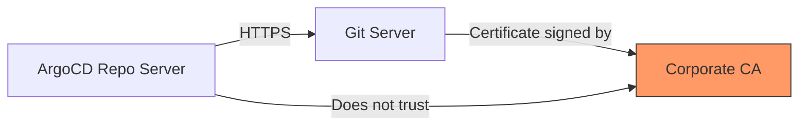

# How to Fix x509 Certificate Signed by Unknown Authority in ArgoCD

Author: [nawazdhandala](https://github.com/nawazdhandala)

Tags: ArgoCD, GitOps, Kubernetes, TLS, Troubleshooting

Description: Step-by-step guide to diagnosing and fixing the x509 certificate signed by unknown authority error in ArgoCD for Git repos and API connections.

---

The "x509: certificate signed by unknown authority" error is one of the most common TLS issues in ArgoCD. It happens when ArgoCD tries to connect to a server whose certificate is signed by a CA that ArgoCD does not trust. This guide covers every scenario where this error occurs and how to fix each one.

## Understanding the Error

This error means ArgoCD is making an HTTPS connection to some server - typically a Git repository, Helm registry, or OIDC provider - and the server's TLS certificate was signed by a Certificate Authority that is not in ArgoCD's trusted certificate store.

Common scenarios include:

- Connecting to a self-hosted GitLab, GitHub Enterprise, or Bitbucket Server that uses a corporate CA
- Connecting to a Helm repository behind a corporate proxy with TLS inspection
- Connecting to an OIDC provider (like Keycloak) with a self-signed or internal certificate
- ArgoCD components communicating with each other using self-signed certificates



## Fix 1: Adding CA Certificates for Git Repositories

The most common case is connecting to a Git repository with a custom CA. ArgoCD stores trusted CA certificates in the `argocd-tls-certs-cm` ConfigMap.

First, get the CA certificate from your Git server:

```bash
# Extract the CA certificate from the server
openssl s_client -connect git.example.com:443 -showcerts < /dev/null 2>/dev/null | \
  awk '/BEGIN CERTIFICATE/,/END CERTIFICATE/{print}' > git-ca.crt

# Verify you have the right certificate
openssl x509 -in git-ca.crt -noout -subject -issuer
```

If the server uses a certificate chain, you need the root CA (the last certificate in the chain):

```bash
# Extract all certificates in the chain
openssl s_client -connect git.example.com:443 -showcerts < /dev/null 2>/dev/null | \
  awk 'BEGIN{c=0} /BEGIN CERTIFICATE/{c++} c>0{print > "cert-" c ".pem"} /END CERTIFICATE/{}'

# The last cert file is usually the root CA
```

Now add it to ArgoCD:

```bash
# Add the CA certificate to ArgoCD's trust store
kubectl create configmap argocd-tls-certs-cm \
  --from-file=git.example.com=git-ca.crt \
  -n argocd \
  --dry-run=client -o yaml | kubectl apply -f -
```

The key in the ConfigMap must be the hostname of the server. ArgoCD watches this ConfigMap and picks up changes automatically - no restart needed.

You can also add it via the ArgoCD CLI:

```bash
# Add certificate using the CLI
argocd cert add-tls git.example.com --from git-ca.crt
```

## Fix 2: Adding CA Certificates for Helm Repositories

For Helm repositories with custom CAs, the process is the same. The CA certificate goes into `argocd-tls-certs-cm`:

```bash
# Get the Helm repo CA certificate
openssl s_client -connect charts.example.com:443 -showcerts < /dev/null 2>/dev/null | \
  awk '/BEGIN CERTIFICATE/,/END CERTIFICATE/{print}' > helm-ca.crt

# Add it to the ConfigMap
kubectl create configmap argocd-tls-certs-cm \
  --from-file=charts.example.com=helm-ca.crt \
  -n argocd \
  --dry-run=client -o yaml | kubectl apply -f -
```

If you already have certificates for other servers in the ConfigMap, make sure to include all of them:

```bash
# Get current ConfigMap data, add new cert, then apply
kubectl get configmap argocd-tls-certs-cm -n argocd -o yaml > tls-certs-cm.yaml
# Edit to add the new certificate data, then:
kubectl apply -f tls-certs-cm.yaml
```

## Fix 3: Adding CA Certificates for OIDC/SSO Providers

If the error occurs during SSO login, you need to add the OIDC provider's CA certificate differently. ArgoCD uses the Dex server for OIDC, and Dex reads certificates from a specific location.

Mount the CA certificate as a volume in the ArgoCD Dex server deployment:

```yaml
apiVersion: apps/v1
kind: Deployment
metadata:
  name: argocd-dex-server
  namespace: argocd
spec:
  template:
    spec:
      volumes:
        - name: custom-ca
          configMap:
            name: argocd-tls-certs-cm
      containers:
        - name: dex
          volumeMounts:
            - name: custom-ca
              mountPath: /etc/ssl/certs/custom-ca.crt
              subPath: keycloak.example.com
```

For the ArgoCD server itself (which also makes OIDC calls), add the `--oidc-ca` flag or set it in the ConfigMap:

```yaml
apiVersion: v1
kind: ConfigMap
metadata:
  name: argocd-cmd-params-cm
  namespace: argocd
data:
  server.oidc.tls.insecure: "false"  # Keep this false for security
```

You can also add the CA to the ArgoCD server's trust store by mounting it:

```yaml
# In the argocd-server deployment
spec:
  template:
    spec:
      volumes:
        - name: custom-ca
          secret:
            secretName: oidc-ca-cert
      containers:
        - name: argocd-server
          volumeMounts:
            - name: custom-ca
              mountPath: /etc/ssl/certs/oidc-ca.crt
              subPath: ca.crt
```

## Fix 4: System-Wide CA Certificate Bundle

If you have multiple services with custom CAs, you can replace the entire CA certificate bundle in ArgoCD containers. This is done by mounting a custom CA bundle:

```yaml
apiVersion: apps/v1
kind: Deployment
metadata:
  name: argocd-repo-server
  namespace: argocd
spec:
  template:
    spec:
      volumes:
        - name: custom-ca-bundle
          configMap:
            name: custom-ca-bundle
      containers:
        - name: argocd-repo-server
          env:
            - name: SSL_CERT_DIR
              value: /etc/ssl/custom-certs
          volumeMounts:
            - name: custom-ca-bundle
              mountPath: /etc/ssl/custom-certs
```

Create the ConfigMap with your full CA bundle:

```bash
# Combine system CAs with your custom CAs
cat /etc/ssl/certs/ca-certificates.crt custom-ca.crt > combined-ca-bundle.crt

kubectl create configmap custom-ca-bundle \
  --from-file=ca-certificates.crt=combined-ca-bundle.crt \
  -n argocd
```

## Fix 5: Internal Component Communication

If the error occurs between ArgoCD components (API server to repo server, for example), the issue is with the internal TLS certificates:

```bash
# Check the repo server's TLS certificate
kubectl get secret argocd-repo-server-tls -n argocd -o jsonpath='{.data.tls\.crt}' | \
  base64 -d | openssl x509 -noout -subject -issuer -dates

# If the certificate is expired or invalid, delete and restart
kubectl delete secret argocd-repo-server-tls -n argocd
kubectl rollout restart deployment argocd-repo-server -n argocd
```

## The Nuclear Option: Skip TLS Verification

For development environments only, you can skip TLS verification. Never do this in production:

```bash
# Add a repository with TLS verification disabled
argocd repo add https://git.example.com/org/repo.git \
  --insecure-skip-server-verification \
  --username admin \
  --password secret
```

Or in the repository secret:

```yaml
apiVersion: v1
kind: Secret
metadata:
  name: my-repo
  namespace: argocd
  labels:
    argocd.argoproj.io/secret-type: repository
stringData:
  type: git
  url: https://git.example.com/org/repo.git
  insecure: "true"  # Skips TLS verification - NOT for production
```

## Debugging Steps

When you encounter this error, follow this systematic debugging approach:

```bash
# 1. Identify which connection is failing
kubectl logs deployment/argocd-repo-server -n argocd | grep x509

# 2. Get the server's certificate chain
openssl s_client -connect git.example.com:443 -showcerts < /dev/null

# 3. Check what CAs ArgoCD currently trusts
kubectl get configmap argocd-tls-certs-cm -n argocd -o yaml

# 4. Verify the CA certificate matches
openssl verify -CAfile your-ca.crt server-cert.crt
```

## Conclusion

The x509 unknown authority error always comes down to one thing: ArgoCD does not trust the CA that signed the server's certificate. The fix is always to add the correct CA certificate to ArgoCD's trust store. Use the `argocd-tls-certs-cm` ConfigMap for Git and Helm repositories, volume mounts for OIDC providers, and environment variables for system-wide trust. Avoid skipping TLS verification in production - it defeats the entire purpose of certificate-based security.

For more TLS configuration options, see our guide on [configuring ArgoCD with external certificate managers](https://oneuptime.com/blog/post/2026-02-26-argocd-external-certificate-managers/view).
