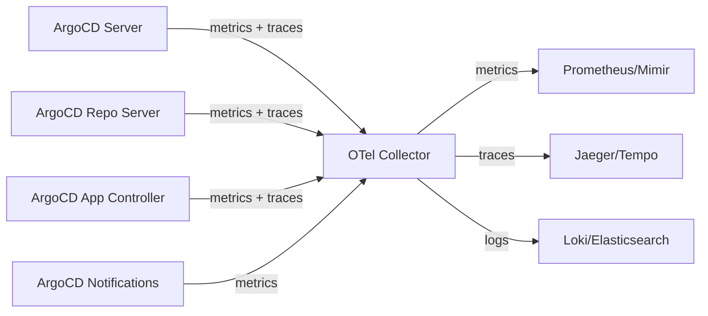

# How to Set Up Full Observability for ArgoCD with OpenTelemetry

Author: [nawazdhandala](https://github.com/nawazdhandala)

Tags: ArgoCD, GitOps, Kubernetes, OpenTelemetry, Observability

Description: A comprehensive guide to setting up full observability for ArgoCD using OpenTelemetry, covering metrics, traces, and logs for complete GitOps pipeline visibility.

---

Running ArgoCD in production without observability is like flying blind. You know deployments are happening, but you have no idea how fast, how reliably, or where bottlenecks are hiding. OpenTelemetry gives you a vendor-neutral way to instrument ArgoCD with metrics, traces, and logs so you can see everything that matters.

This guide walks through setting up a complete observability stack for ArgoCD using OpenTelemetry, from collector configuration to dashboards.

## Why OpenTelemetry for ArgoCD

ArgoCD already exposes Prometheus metrics on its components. But metrics alone only tell part of the story. You need:

- **Metrics** for aggregate health and trends (sync duration, error rates, queue depth)
- **Traces** for understanding the lifecycle of individual sync operations
- **Logs** for debugging failures and auditing changes

OpenTelemetry unifies all three signals under one framework, making correlation between them straightforward.

## Architecture Overview

The observability setup consists of the OpenTelemetry Collector receiving signals from ArgoCD components and forwarding them to your backends.



## Step 1: Deploy the OpenTelemetry Collector

First, deploy the OpenTelemetry Collector in the same namespace as ArgoCD. Use the OpenTelemetry Operator for a clean setup.

Install the operator:

```bash
# Install cert-manager (required by the operator)
kubectl apply -f https://github.com/cert-manager/cert-manager/releases/download/v1.14.0/cert-manager.yaml

# Install the OpenTelemetry Operator
kubectl apply -f https://github.com/open-telemetry/opentelemetry-operator/releases/latest/download/opentelemetry-operator.yaml
```

Create the collector configuration:

```yaml
# otel-collector.yaml
apiVersion: opentelemetry.io/v1alpha1
kind: OpenTelemetryCollector
metadata:
  name: argocd-otel
  namespace: argocd
spec:
  mode: deployment
  config: |
    receivers:
      # Scrape Prometheus metrics from ArgoCD components
      prometheus:
        config:
          scrape_configs:
            - job_name: 'argocd-server'
              scrape_interval: 30s
              kubernetes_sd_configs:
                - role: pod
                  namespaces:
                    names: [argocd]
              relabel_configs:
                - source_labels: [__meta_kubernetes_pod_label_app_kubernetes_io_name]
                  regex: argocd-server
                  action: keep
                - source_labels: [__meta_kubernetes_pod_ip]
                  target_label: __address__
                  replacement: '$1:8083'

            - job_name: 'argocd-repo-server'
              scrape_interval: 30s
              kubernetes_sd_configs:
                - role: pod
                  namespaces:
                    names: [argocd]
              relabel_configs:
                - source_labels: [__meta_kubernetes_pod_label_app_kubernetes_io_name]
                  regex: argocd-repo-server
                  action: keep
                - source_labels: [__meta_kubernetes_pod_ip]
                  target_label: __address__
                  replacement: '$1:8084'

            - job_name: 'argocd-application-controller'
              scrape_interval: 30s
              kubernetes_sd_configs:
                - role: pod
                  namespaces:
                    names: [argocd]
              relabel_configs:
                - source_labels: [__meta_kubernetes_pod_label_app_kubernetes_io_name]
                  regex: argocd-application-controller
                  action: keep
                - source_labels: [__meta_kubernetes_pod_ip]
                  target_label: __address__
                  replacement: '$1:8082'

      # Receive OTLP traces and logs
      otlp:
        protocols:
          grpc:
            endpoint: 0.0.0.0:4317
          http:
            endpoint: 0.0.0.0:4318

    processors:
      # Add resource attributes for ArgoCD identification
      resource:
        attributes:
          - key: service.namespace
            value: argocd
            action: upsert
      # Batch telemetry for efficiency
      batch:
        send_batch_size: 1000
        timeout: 10s
      # Filter out noisy health check metrics
      filter:
        metrics:
          exclude:
            match_type: strict
            metric_names:
              - go_memstats_alloc_bytes_total

    exporters:
      # Export metrics to Prometheus
      prometheusremotewrite:
        endpoint: "http://prometheus:9090/api/v1/write"
      # Export traces to Jaeger
      otlp/jaeger:
        endpoint: "jaeger-collector.observability:4317"
        tls:
          insecure: true
      # Export logs to Loki
      loki:
        endpoint: "http://loki.observability:3100/loki/api/v1/push"

    service:
      pipelines:
        metrics:
          receivers: [prometheus]
          processors: [resource, batch]
          exporters: [prometheusremotewrite]
        traces:
          receivers: [otlp]
          processors: [resource, batch]
          exporters: [otlp/jaeger]
        logs:
          receivers: [otlp]
          processors: [resource, batch]
          exporters: [loki]
```

Apply it:

```bash
kubectl apply -f otel-collector.yaml
```

## Step 2: Enable ArgoCD Metrics

ArgoCD components expose Prometheus metrics by default, but you need to ensure the metrics ports are accessible. Update your ArgoCD ConfigMap if needed:

```yaml
# argocd-cm patch
apiVersion: v1
kind: ConfigMap
metadata:
  name: argocd-cm
  namespace: argocd
data:
  # Enable server-side metrics
  server.enable.proxy.extension: "true"
```

Verify metrics are being scraped:

```bash
# Check the OTel collector logs
kubectl logs -n argocd deployment/argocd-otel-collector -f

# Verify metrics are flowing
kubectl port-forward -n argocd svc/argocd-otel-collector 8888:8888
curl http://localhost:8888/metrics
```

## Step 3: Configure Distributed Tracing

ArgoCD supports OpenTelemetry tracing natively since v2.8. Enable it in the ArgoCD ConfigMap:

```yaml
apiVersion: v1
kind: ConfigMap
metadata:
  name: argocd-cm
  namespace: argocd
data:
  # Enable OTLP tracing
  otlp.address: "argocd-otel-collector.argocd:4317"
```

You can also set environment variables on ArgoCD components for finer control:

```yaml
# Patch for argocd-server deployment
env:
  - name: OTEL_EXPORTER_OTLP_ENDPOINT
    value: "http://argocd-otel-collector.argocd:4317"
  - name: OTEL_TRACES_SAMPLER
    value: "parentbased_traceidratio"
  - name: OTEL_TRACES_SAMPLER_ARG
    value: "0.1"  # Sample 10% of traces
```

## Step 4: Collect Logs with OpenTelemetry

For log collection, use the OpenTelemetry Collector's filelog receiver or rely on a DaemonSet collector to tail ArgoCD pod logs:

```yaml
# otel-collector-daemonset.yaml
apiVersion: opentelemetry.io/v1alpha1
kind: OpenTelemetryCollector
metadata:
  name: argocd-log-collector
  namespace: argocd
spec:
  mode: daemonset
  config: |
    receivers:
      filelog:
        include:
          - /var/log/pods/argocd_*/*/*.log
        operators:
          - type: json_parser
            timestamp:
              parse_from: attributes.time
              layout: '%Y-%m-%dT%H:%M:%S.%LZ'
          - type: move
            from: attributes.msg
            to: body
          - type: move
            from: attributes.level
            to: attributes.log.level

    processors:
      resource:
        attributes:
          - key: k8s.namespace.name
            value: argocd
            action: upsert
      batch:
        send_batch_size: 500
        timeout: 5s

    exporters:
      loki:
        endpoint: "http://loki.observability:3100/loki/api/v1/push"

    service:
      pipelines:
        logs:
          receivers: [filelog]
          processors: [resource, batch]
          exporters: [loki]
```

## Step 5: Key Metrics to Watch

Once everything is wired up, here are the critical ArgoCD metrics to monitor:

| Metric | Description | Alert Threshold |
|--------|-------------|-----------------|
| `argocd_app_info` | Application health/sync status | health != Healthy |
| `argocd_app_sync_total` | Total sync operations | Sudden drops |
| `argocd_app_reconcile_duration` | Reconciliation time | > 5 minutes |
| `argocd_git_request_total` | Git operations | High error rate |
| `argocd_repo_server_queue_depth` | Repo server queue | > 10 |
| `argocd_cluster_api_resource_objects` | Cluster resource count | Sudden changes |

## Step 6: Correlate Across Signals

The power of full observability comes from correlating metrics, traces, and logs. When you see a spike in `argocd_app_reconcile_duration`:

1. Look at traces for that time window to find slow sync operations
2. Check logs for the specific application that was syncing
3. Correlate with cluster metrics to see if resource pressure caused the slowdown

With OpenTelemetry, you can add trace IDs to logs and exemplars to metrics, making this correlation automatic in tools like Grafana.

```yaml
# Enable exemplars in the collector
processors:
  transform:
    metric_statements:
      - context: datapoint
        statements:
          - set(attributes["trace_id"], SpanID())
```

## Verifying the Setup

Run a quick validation to make sure all signals are flowing:

```bash
# Trigger a sync to generate telemetry
argocd app sync my-app

# Check metrics
curl -s http://prometheus:9090/api/v1/query?query=argocd_app_sync_total | jq .

# Check traces
curl -s http://jaeger:16686/api/traces?service=argocd-server | jq '.data | length'

# Check logs
curl -s http://loki:3100/loki/api/v1/query?query={namespace="argocd"} | jq .
```

## Summary

Setting up full observability for ArgoCD with OpenTelemetry gives you unified visibility into your GitOps pipeline. You get metrics for trends and alerting, traces for debugging individual operations, and logs for detailed forensics. The OpenTelemetry Collector acts as the central hub, receiving all signals and routing them to your preferred backends. With this setup, you will never be caught off guard by a deployment issue again.

For monitoring specific DORA metrics from this observability data, see our guide on [creating DORA metrics dashboards with ArgoCD](https://oneuptime.com/blog/post/2026-02-26-argocd-dora-metrics-dashboard/view).
