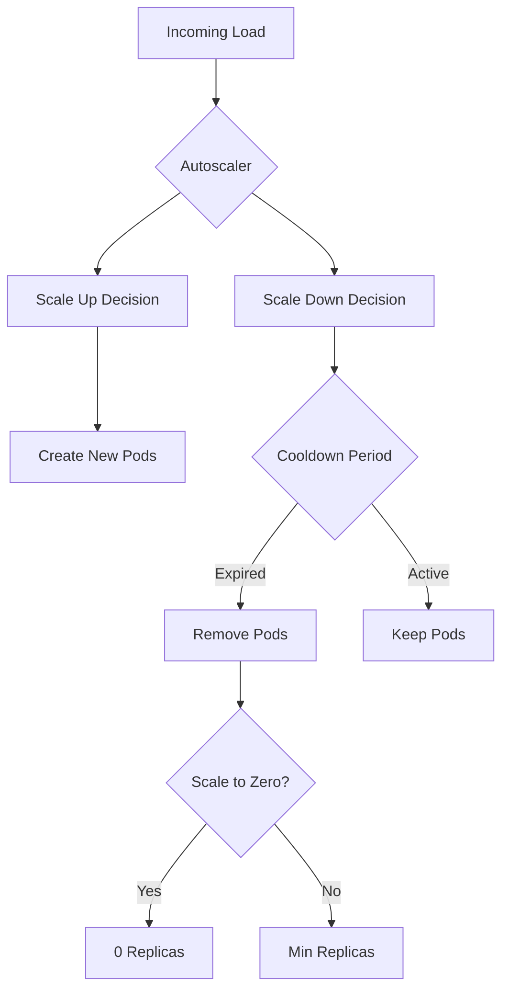

# How to Handle Function Scaling Configuration with ArgoCD

Author: [nawazdhandala](https://github.com/nawazdhandala)

Tags: ArgoCD, GitOps, Kubernetes, Serverless, Autoscaling

Description: Learn how to manage serverless function scaling configuration using ArgoCD including scale-to-zero, KEDA triggers, HPA settings, and burst handling strategies.

---

Scaling is the core promise of serverless - your functions should handle one request or ten thousand without manual intervention. But getting scaling right requires careful configuration of autoscalers, concurrency limits, cooldown periods, and resource boundaries. Managing this configuration through ArgoCD ensures your scaling policies are consistent, reviewable, and recoverable.

This guide covers scaling configuration for Knative, KEDA, and native Kubernetes HPA, all managed through ArgoCD.

## Scaling Configuration Overview

Function scaling involves multiple interacting components:



## Knative Autoscaler Configuration

Knative has two autoscaler implementations: the Knative Pod Autoscaler (KPA) and the Kubernetes HPA. KPA supports scale-to-zero, HPA does not.

Global autoscaler settings managed through ArgoCD:

```yaml
# scaling/knative/config-autoscaler.yaml
apiVersion: v1
kind: ConfigMap
metadata:
  name: config-autoscaler
  namespace: knative-serving
data:
  # Default autoscaler class
  pod-autoscaler-class: "kpa.autoscaling.knative.dev"

  # Scale-to-zero settings
  enable-scale-to-zero: "true"
  scale-to-zero-grace-period: "30s"
  scale-to-zero-pod-retention-period: "0s"

  # Scaling windows
  stable-window: "60s"
  panic-window-percentage: "10.0"
  panic-threshold-percentage: "200.0"

  # Concurrency targets
  container-concurrency-target-percentage: "70"
  container-concurrency-target-default: "100"

  # Scale bounds
  max-scale-limit: "0"  # 0 means unlimited
  initial-scale: "1"
  allow-zero-initial-scale: "true"

  # Scaling rates
  max-scale-up-rate: "1000.0"
  max-scale-down-rate: "2.0"

  # Activation scale (minimum when scaling from zero)
  activation-scale: "1"
```

Per-service scaling overrides:

```yaml
# scaling/services/high-traffic-api.yaml
apiVersion: serving.knative.dev/v1
kind: Service
metadata:
  name: high-traffic-api
  namespace: production
spec:
  template:
    metadata:
      annotations:
        # Use concurrency-based scaling
        autoscaling.knative.dev/class: "kpa.autoscaling.knative.dev"
        autoscaling.knative.dev/metric: "concurrency"
        autoscaling.knative.dev/target: "50"

        # Never scale to zero for this service
        autoscaling.knative.dev/min-scale: "5"
        autoscaling.knative.dev/max-scale: "200"

        # Shorter stable window for faster scaling
        autoscaling.knative.dev/window: "30s"

        # Scale up aggressively during panic mode
        autoscaling.knative.dev/panic-window-percentage: "5.0"
        autoscaling.knative.dev/panic-threshold-percentage: "150.0"
    spec:
      containerConcurrency: 100
      containers:
        - image: ghcr.io/myorg/high-traffic-api:v2.0.0
          ports:
            - containerPort: 8080
          resources:
            requests:
              cpu: 500m
              memory: 512Mi
            limits:
              cpu: "2"
              memory: 1Gi
```

For a background batch processor that should scale to zero:

```yaml
# scaling/services/batch-processor.yaml
apiVersion: serving.knative.dev/v1
kind: Service
metadata:
  name: batch-processor
  namespace: production
spec:
  template:
    metadata:
      annotations:
        # Use RPS-based scaling
        autoscaling.knative.dev/metric: "rps"
        autoscaling.knative.dev/target: "10"

        # Scale to zero after 10 minutes of inactivity
        autoscaling.knative.dev/min-scale: "0"
        autoscaling.knative.dev/max-scale: "20"
        autoscaling.knative.dev/scale-to-zero-pod-retention-period: "10m"

        # Longer stable window to avoid flapping
        autoscaling.knative.dev/window: "120s"
    spec:
      containerConcurrency: 1  # Process one request at a time
      timeoutSeconds: 600
      containers:
        - image: ghcr.io/myorg/batch-processor:v1.5.0
          resources:
            requests:
              cpu: "1"
              memory: 1Gi
```

## KEDA-Based Scaling

KEDA provides event-driven scaling from external sources like message queues, databases, and custom metrics. Manage ScaledObjects through ArgoCD:

```yaml
# scaling/keda/order-processor-scaler.yaml
apiVersion: keda.sh/v1alpha1
kind: ScaledObject
metadata:
  name: order-processor-scaler
  namespace: production
  annotations:
    argocd.argoproj.io/sync-wave: "1"
spec:
  scaleTargetRef:
    name: order-processor
    kind: Deployment
  pollingInterval: 10
  cooldownPeriod: 120
  idleReplicaCount: 0
  minReplicaCount: 0
  maxReplicaCount: 50
  fallback:
    failureThreshold: 3
    replicas: 5
  triggers:
    # Scale based on RabbitMQ queue depth
    - type: rabbitmq
      metadata:
        protocol: amqp
        queueName: orders
        mode: QueueLength
        value: "5"
      authenticationRef:
        name: rabbitmq-auth
    # Also scale based on CPU during business hours
    - type: cpu
      metricType: Utilization
      metadata:
        value: "70"
```

```yaml
# scaling/keda/kafka-consumer-scaler.yaml
apiVersion: keda.sh/v1alpha1
kind: ScaledObject
metadata:
  name: kafka-consumer-scaler
  namespace: production
spec:
  scaleTargetRef:
    name: kafka-consumer
  pollingInterval: 15
  cooldownPeriod: 300
  minReplicaCount: 1
  maxReplicaCount: 100
  triggers:
    - type: kafka
      metadata:
        bootstrapServers: kafka.default.svc.cluster.local:9092
        consumerGroup: my-consumer-group
        topic: events
        lagThreshold: "100"
        offsetResetPolicy: latest
```

Authentication for KEDA triggers:

```yaml
# scaling/keda/auth/rabbitmq-auth.yaml
apiVersion: keda.sh/v1alpha1
kind: TriggerAuthentication
metadata:
  name: rabbitmq-auth
  namespace: production
spec:
  secretTargetRef:
    - parameter: host
      name: rabbitmq-credentials
      key: connection-string
```

## HPA with Custom Metrics

For functions that need standard HPA with custom metrics:

```yaml
# scaling/hpa/api-function-hpa.yaml
apiVersion: autoscaling/v2
kind: HorizontalPodAutoscaler
metadata:
  name: api-function-hpa
  namespace: production
spec:
  scaleTargetRef:
    apiVersion: apps/v1
    kind: Deployment
    name: api-function
  minReplicas: 3
  maxReplicas: 50
  behavior:
    scaleUp:
      stabilizationWindowSeconds: 30
      policies:
        - type: Percent
          value: 100
          periodSeconds: 15
        - type: Pods
          value: 10
          periodSeconds: 15
      selectPolicy: Max
    scaleDown:
      stabilizationWindowSeconds: 300
      policies:
        - type: Percent
          value: 10
          periodSeconds: 60
      selectPolicy: Min
  metrics:
    - type: Resource
      resource:
        name: cpu
        target:
          type: Utilization
          averageUtilization: 70
    - type: Pods
      pods:
        metric:
          name: http_requests_per_second
        target:
          type: AverageValue
          averageValue: "100"
```

## ArgoCD Application for Scaling Config

```yaml
# scaling-config-app.yaml
apiVersion: argoproj.io/v1alpha1
kind: Application
metadata:
  name: function-scaling-config
  namespace: argocd
spec:
  project: platform
  source:
    repoURL: https://github.com/myorg/k8s-scaling.git
    path: scaling
    targetRevision: main
    directory:
      recurse: true
  destination:
    server: https://kubernetes.default.svc
  syncPolicy:
    automated:
      selfHeal: true
      prune: true
    syncOptions:
      - ServerSideApply=true
```

## Burst Handling Strategy

For functions that experience sudden traffic bursts, configure a pre-warming strategy:

```yaml
# scaling/services/burst-handler.yaml
apiVersion: serving.knative.dev/v1
kind: Service
metadata:
  name: burst-handler
  namespace: production
spec:
  template:
    metadata:
      annotations:
        # High initial scale when coming from zero
        autoscaling.knative.dev/initial-scale: "5"

        # Aggressive panic scaling
        autoscaling.knative.dev/panic-window-percentage: "5.0"
        autoscaling.knative.dev/panic-threshold-percentage: "110.0"

        # Fast scale-up rate
        autoscaling.knative.dev/max-scale-up-rate: "2000.0"

        autoscaling.knative.dev/min-scale: "0"
        autoscaling.knative.dev/max-scale: "500"
    spec:
      containers:
        - image: ghcr.io/myorg/burst-handler:v1.0.0
          resources:
            requests:
              cpu: 250m
              memory: 256Mi
```

## Monitoring Scaling Behavior

Deploy Prometheus rules to alert on scaling issues:

```yaml
# scaling/monitoring/scaling-alerts.yaml
apiVersion: monitoring.coreos.com/v1
kind: PrometheusRule
metadata:
  name: function-scaling-alerts
  namespace: monitoring
spec:
  groups:
    - name: function-scaling
      rules:
        - alert: FunctionAtMaxScale
          expr: |
            kube_deployment_status_replicas{namespace="production"}
            ==
            kube_deployment_spec_replicas{namespace="production"}
            and
            kube_deployment_spec_replicas{namespace="production"} >= 45
          for: 10m
          labels:
            severity: warning
          annotations:
            summary: "Function {{ $labels.deployment }} is near max scale"

        - alert: FunctionScaleFlapping
          expr: |
            changes(kube_deployment_status_replicas{namespace="production"}[10m]) > 10
          for: 5m
          labels:
            severity: warning
          annotations:
            summary: "Function {{ $labels.deployment }} is scaling up and down rapidly"

        - alert: KEDAScalerErrors
          expr: |
            keda_scaler_errors_total > 0
          for: 5m
          labels:
            severity: critical
          annotations:
            summary: "KEDA scaler errors detected for {{ $labels.scaledObject }}"
```

## Summary

Function scaling configuration managed through ArgoCD gives you predictable, reviewable autoscaling behavior. Whether you use Knative's KPA for concurrency-based scaling with scale-to-zero, KEDA for event-driven scaling from queues and custom metrics, or standard HPA with custom metrics, every scaling parameter lives in Git. Changes go through pull requests, ArgoCD self-heals unauthorized modifications, and you have a complete audit trail of every scaling adjustment.
