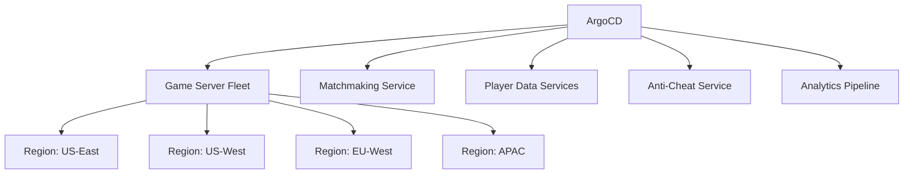

# ArgoCD for Gaming: High-Performance Deployment Pipelines

Author: [nawazdhandala](https://github.com/nawazdhandala)

Tags: ArgoCD, GitOps, Kubernetes, Gaming, Performance

Description: Build high-performance deployment pipelines for gaming infrastructure using ArgoCD, covering game server management, live updates, and multi-region deployments.

---

Gaming infrastructure demands a unique set of deployment capabilities. Game servers must handle massive concurrent player loads, updates need to roll out without disrupting active sessions, and multi-region deployments are essential for low-latency player experiences. ArgoCD provides the GitOps foundation for managing these complex deployments, but gaming-specific patterns require careful configuration. This guide covers how to use ArgoCD effectively for game server infrastructure, live service updates, and the operational challenges unique to the gaming industry.

## Gaming Deployment Challenges

Gaming infrastructure differs from typical web applications in several critical ways:

- **Stateful sessions.** Players are connected to specific game server instances. Killing a pod means disconnecting players mid-game.
- **Massive scale variance.** A game launch might require 10x normal capacity within hours.
- **Multi-region requirements.** Players need sub-50ms latency, requiring servers in multiple geographic regions.
- **Rapid iteration.** Game patches and hotfixes need to deploy fast, sometimes multiple times per day.
- **Zero-tolerance for downtime.** Downtime during peak hours directly translates to revenue loss and player churn.



## Game Server Fleet Management

Game servers are typically deployed as individual pods, each hosting a game session. Agones (an open source game server orchestrator) is commonly used alongside ArgoCD.

### Deploying Agones with ArgoCD

```yaml
# ArgoCD Application for Agones game server infrastructure
apiVersion: argoproj.io/v1alpha1
kind: Application
metadata:
  name: agones
  namespace: argocd
spec:
  project: gaming-infrastructure
  source:
    repoURL: https://agones.dev/chart/stable
    chart: agones
    targetRevision: 1.38.0
    helm:
      values: |
        agones:
          featureGates: "PlayerTracking=true&CountsAndLists=true"
          controller:
            resources:
              requests:
                cpu: 500m
                memory: 512Mi
          allocator:
            replicas: 3
            resources:
              requests:
                cpu: 1000m
                memory: 1Gi
  destination:
    server: https://kubernetes.default.svc
    namespace: agones-system
  syncPolicy:
    automated:
      prune: true
      selfHeal: true
```

### Managing Game Server Fleets

```yaml
# Game server fleet deployed via ArgoCD
apiVersion: agones.dev/v1
kind: Fleet
metadata:
  name: battle-royale-server
  namespace: game-servers
  annotations:
    argocd.argoproj.io/sync-wave: "2"
spec:
  replicas: 50
  scheduling: Packed  # Pack servers on fewer nodes for cost efficiency
  strategy:
    type: RollingUpdate
    rollingUpdate:
      maxSurge: 25%
      maxUnavailable: 0  # Never kill servers with active players
  template:
    spec:
      ports:
        - name: game
          containerPort: 7654
          protocol: UDP
      health:
        initialDelaySeconds: 30
        periodSeconds: 10
      players:
        initialCapacity: 100
      template:
        spec:
          containers:
            - name: game-server
              image: myregistry/battle-royale-server:v2.14.3
              resources:
                requests:
                  cpu: 2000m
                  memory: 4Gi
                limits:
                  cpu: 4000m
                  memory: 8Gi
              env:
                - name: SERVER_REGION
                  valueFrom:
                    fieldRef:
                      fieldPath: metadata.labels['topology.kubernetes.io/region']
```

## Rolling Updates Without Player Disruption

The biggest challenge in gaming deployments is updating game servers without disconnecting active players. ArgoCD sync waves combined with Agones fleet allocation strategies handle this.

### Graceful Update Strategy

```yaml
# Fleet autoscaler that prevents scaling down servers with active players
apiVersion: autoscaling.agones.dev/v1
kind: FleetAutoscaler
metadata:
  name: battle-royale-autoscaler
  namespace: game-servers
spec:
  fleetName: battle-royale-server
  policy:
    type: Buffer
    buffer:
      # Always keep 10 ready servers for new matches
      bufferSize: 10
      minReplicas: 20
      maxReplicas: 500
```

When deploying a new version, follow this pattern:

```yaml
# Step 1: Deploy new fleet version alongside the old one
# ArgoCD manages both fleet versions via sync waves

# New version fleet (sync wave 1 - deploy first)
apiVersion: agones.dev/v1
kind: Fleet
metadata:
  name: battle-royale-server-v2-15
  annotations:
    argocd.argoproj.io/sync-wave: "1"
spec:
  replicas: 50
  template:
    spec:
      template:
        spec:
          containers:
            - name: game-server
              image: myregistry/battle-royale-server:v2.15.0

---
# Update allocation policy to route new matches to new version (sync wave 2)
apiVersion: allocation.agones.dev/v1
kind: GameServerAllocation
metadata:
  name: default-allocation
  annotations:
    argocd.argoproj.io/sync-wave: "2"
spec:
  required:
    matchLabels:
      agones.dev/fleet: battle-royale-server-v2-15
  scheduling: Packed

# Old version fleet scales down naturally as matches end
# ArgoCD manages the lifecycle through the GitOps repo
```

## Multi-Region Deployment with ApplicationSets

Gaming requires servers in multiple regions for low latency. Use ApplicationSets to manage multi-region deployments.

```yaml
# ApplicationSet for multi-region game server deployment
apiVersion: argoproj.io/v1alpha1
kind: ApplicationSet
metadata:
  name: game-servers-global
  namespace: argocd
spec:
  generators:
    - list:
        elements:
          - region: us-east-1
            cluster: https://us-east-gaming.example.com
            minReplicas: "30"
            maxReplicas: "200"
          - region: us-west-2
            cluster: https://us-west-gaming.example.com
            minReplicas: "20"
            maxReplicas: "150"
          - region: eu-west-1
            cluster: https://eu-west-gaming.example.com
            minReplicas: "40"
            maxReplicas: "300"
          - region: ap-northeast-1
            cluster: https://apac-gaming.example.com
            minReplicas: "25"
            maxReplicas: "200"
  template:
    metadata:
      name: 'game-servers-{{region}}'
    spec:
      project: gaming-infrastructure
      source:
        repoURL: https://github.com/org/gaming-gitops.git
        path: game-servers/overlays/{{region}}
        targetRevision: main
      destination:
        server: '{{cluster}}'
        namespace: game-servers
      syncPolicy:
        automated:
          selfHeal: true
```

### Region-Specific Configuration

```yaml
# overlays/us-east-1/kustomization.yaml
apiVersion: kustomize.config.k8s.io/v1beta1
kind: Kustomization
resources:
  - ../../base
patches:
  - target:
      kind: Fleet
      name: battle-royale-server
    patch: |
      - op: replace
        path: /spec/replicas
        value: 30
  - target:
      kind: FleetAutoscaler
    patch: |
      - op: replace
        path: /spec/policy/buffer/minReplicas
        value: 30
      - op: replace
        path: /spec/policy/buffer/maxReplicas
        value: 200
```

## Live Service Updates and Hot Patches

Games often need to push configuration changes without restarting servers. Use ConfigMaps and dynamic configuration.

```yaml
# Game configuration that can be updated without server restart
apiVersion: v1
kind: ConfigMap
metadata:
  name: game-config
  namespace: game-servers
data:
  game-config.json: |
    {
      "matchmaking": {
        "max_players_per_match": 100,
        "matchmaking_timeout_seconds": 60,
        "skill_based_matching": true
      },
      "gameplay": {
        "zone_shrink_rate": 1.5,
        "loot_spawn_rate": 0.8,
        "event_active": "lunar_new_year"
      },
      "maintenance": {
        "message": "",
        "enabled": false
      }
    }
```

ArgoCD syncs ConfigMap changes quickly. Game servers can watch for ConfigMap updates and apply them dynamically.

## Scaling for Game Launches

Game launches require rapid scaling. Prepare your ArgoCD configuration for launch day.

```yaml
# Pre-launch configuration - scale up in advance
apiVersion: agones.dev/v1
kind: Fleet
metadata:
  name: battle-royale-server
spec:
  replicas: 500  # Pre-provision for launch
  template:
    spec:
      template:
        spec:
          # Use node affinity to spread across availability zones
          affinity:
            podAntiAffinity:
              preferredDuringSchedulingIgnoredDuringExecution:
                - weight: 100
                  podAffinityTerm:
                    topologyKey: topology.kubernetes.io/zone
          # Tolerations for dedicated game server node pools
          tolerations:
            - key: "dedicated"
              operator: "Equal"
              value: "game-servers"
              effect: "NoSchedule"
          nodeSelector:
            node-type: game-server
```

```yaml
# Cluster autoscaler configuration for rapid node provisioning
apiVersion: v1
kind: ConfigMap
metadata:
  name: cluster-autoscaler-config
data:
  # Aggressive scaling for game launches
  scan-interval: "10s"
  scale-down-delay-after-add: "10m"
  scale-down-unneeded-time: "5m"
  max-node-provision-time: "5m"
```

## Monitoring Game Server Deployments

Game server monitoring requires tracking both infrastructure and game-specific metrics.

```yaml
# Prometheus ServiceMonitor for game servers
apiVersion: monitoring.coreos.com/v1
kind: ServiceMonitor
metadata:
  name: game-server-metrics
  namespace: game-servers
spec:
  selector:
    matchLabels:
      app: game-server
  endpoints:
    - port: metrics
      interval: 15s
      path: /metrics

---
# PrometheusRule for game-specific alerts
apiVersion: monitoring.coreos.com/v1
kind: PrometheusRule
metadata:
  name: game-server-alerts
spec:
  groups:
    - name: game-server-health
      rules:
        - alert: HighPlayerDisconnectRate
          expr: rate(game_player_disconnects_total[5m]) > 10
          for: 2m
          labels:
            severity: critical
          annotations:
            summary: "High player disconnect rate detected"

        - alert: LowReadyServerCount
          expr: agones_fleets_replicas_count{type="ready"} < 5
          for: 1m
          labels:
            severity: critical
          annotations:
            summary: "Low ready game server count - players may not be able to join"

        - alert: HighServerLatency
          expr: game_server_tick_duration_seconds{quantile="0.99"} > 0.05
          for: 5m
          labels:
            severity: warning
          annotations:
            summary: "Game server tick rate degraded"
```

## Sync Windows for Maintenance

Schedule game updates around player activity patterns.

```yaml
# Sync windows based on player activity
spec:
  syncWindows:
    # Allow updates during lowest player activity (3 AM to 7 AM UTC)
    - kind: allow
      schedule: '0 3 * * *'
      duration: 4h
      applications:
        - 'game-servers-*'
    # Block updates during peak hours
    - kind: deny
      schedule: '0 18 * * *'  # 6 PM UTC (evening in US/EU)
      duration: 6h
      applications:
        - 'game-servers-*'
    # Emergency hotfixes always allowed
    - kind: allow
      schedule: '* * * * *'
      duration: 24h
      applications:
        - 'game-servers-*'
      manualSync: true
```

ArgoCD provides the deployment backbone that gaming infrastructure needs - consistent multi-region deployments, traceable changes, and automated drift correction. Combined with game-specific tools like Agones, it creates a robust platform for delivering seamless player experiences at any scale. For monitoring your gaming infrastructure end-to-end, explore how [OneUptime](https://oneuptime.com/blog/post/2026-02-26-argocd-ecommerce-zero-downtime/view) can provide real-time visibility across your entire game server fleet.
