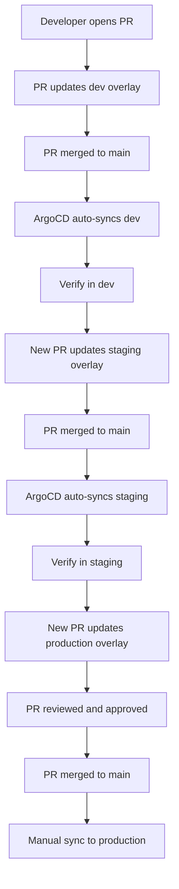

# How to Implement Git Branching Strategy for GitOps

Author: [nawazdhandala](https://github.com/nawazdhandala)

Tags: ArgoCD, GitOps, Kubernetes, Git Branching, CI/CD

Description: Learn how to implement effective Git branching strategies for GitOps workflows with ArgoCD, including trunk-based development, environment branches, and promotion patterns.

---

Your Git branching strategy determines how changes flow from development to production in a GitOps workflow. Get it wrong and you will fight merge conflicts, broken environments, and deployment confusion. Get it right and deployments become predictable and auditable.

This guide covers the branching strategies that work best with ArgoCD and when to use each one.

## The Core Question: Branches vs Directories

Before diving into branching strategies, understand that ArgoCD supports two ways to represent environments:

1. **Branch-based:** Each environment tracks a different branch (dev branch, staging branch, production branch)
2. **Directory-based:** All environments live on a single branch in different directories

Most experienced GitOps practitioners prefer directory-based separation over branch-based. Here is why, and when each approach makes sense.

## Strategy 1: Trunk-Based Development with Directory Overlays

This is the recommended approach for most teams. All environments are defined on the `main` branch using directory-based separation.

```text
config-repo/
  apps/
    my-service/
      base/
        deployment.yaml
        service.yaml
        kustomization.yaml
      overlays/
        dev/
          kustomization.yaml
        staging/
          kustomization.yaml
        production/
          kustomization.yaml
```

ArgoCD Applications for each environment point to different directories on the same branch:

```yaml
# Dev application - auto-sync enabled
apiVersion: argoproj.io/v1alpha1
kind: Application
metadata:
  name: my-service-dev
spec:
  source:
    repoURL: https://github.com/myorg/config-repo.git
    targetRevision: main
    path: apps/my-service/overlays/dev
  syncPolicy:
    automated:
      prune: true
      selfHeal: true

---
# Production application - manual sync
apiVersion: argoproj.io/v1alpha1
kind: Application
metadata:
  name: my-service-production
spec:
  source:
    repoURL: https://github.com/myorg/config-repo.git
    targetRevision: main
    path: apps/my-service/overlays/production
  syncPolicy: {}  # Manual sync only
```

### How Changes Flow

The promotion workflow looks like this:



### Why This Works Well

- Every change goes through a pull request with review
- The main branch always represents the desired state of all environments
- No merge conflicts between branches
- Git history shows the complete story of what changed and when
- Easy to diff between environments: `git diff -- apps/my-service/overlays/dev apps/my-service/overlays/production`

## Strategy 2: Environment Branches

Some teams prefer separate branches for each environment. This can work, but comes with significant trade-offs.

```text
main branch (dev)
  apps/my-service/
    deployment.yaml
    service.yaml

staging branch
  apps/my-service/
    deployment.yaml
    service.yaml

production branch
  apps/my-service/
    deployment.yaml
    service.yaml
```

ArgoCD Applications track different branches:

```yaml
apiVersion: argoproj.io/v1alpha1
kind: Application
metadata:
  name: my-service-dev
spec:
  source:
    repoURL: https://github.com/myorg/config-repo.git
    targetRevision: main
    path: apps/my-service

---
apiVersion: argoproj.io/v1alpha1
kind: Application
metadata:
  name: my-service-staging
spec:
  source:
    repoURL: https://github.com/myorg/config-repo.git
    targetRevision: staging
    path: apps/my-service

---
apiVersion: argoproj.io/v1alpha1
kind: Application
metadata:
  name: my-service-production
spec:
  source:
    repoURL: https://github.com/myorg/config-repo.git
    targetRevision: production
    path: apps/my-service
```

### Promotion with Environment Branches

Promotion happens by merging from one branch to another:

```bash
# Promote dev to staging
git checkout staging
git merge main
git push origin staging

# Promote staging to production
git checkout production
git merge staging
git push origin production
```

### Why Environment Branches Are Problematic

**Merge conflicts.** If dev and staging diverge (different resource limits, different replica counts), merging creates conflicts on every promotion.

**Drift accumulation.** Environment-specific changes accumulate on each branch, making it hard to know what the actual differences between environments are.

**Cherry-pick headaches.** Sometimes you need a hotfix in production without promoting everything in staging. This leads to cherry-picking, which creates tracking nightmares.

## Strategy 3: Feature Branches with Pull Requests

Regardless of your environment strategy, use feature branches for making changes:

```bash
# Create a feature branch for your config change
git checkout -b update-backend-resources

# Make your changes
vim apps/backend-api/overlays/production/kustomization.yaml

# Push and create a PR
git push origin update-backend-resources
```

Configure branch protection rules on the main branch:

- Require pull request reviews (at least 1 reviewer, 2 for production changes)
- Require status checks to pass (linting, validation)
- Require linear history (no merge commits)
- Do not allow force pushes

Add a CI check that validates manifests before merge:

```yaml
# .github/workflows/validate.yaml
name: Validate Manifests
on:
  pull_request:
    branches: [main]

jobs:
  validate:
    runs-on: ubuntu-latest
    steps:
      - uses: actions/checkout@v4

      - name: Install tools
        run: |
          curl -s https://raw.githubusercontent.com/kubernetes-sigs/kustomize/master/hack/install_kustomize.sh | bash
          curl -LO https://github.com/yannh/kubeconform/releases/download/v0.6.4/kubeconform-linux-amd64.tar.gz
          tar xzf kubeconform-linux-amd64.tar.gz

      - name: Validate all overlays
        run: |
          for overlay in apps/*/overlays/*/; do
            echo "Validating $overlay"
            kustomize build "$overlay" | ./kubeconform -strict -summary
          done
```

## Strategy 4: Tag-Based Releases

For teams that want explicit versioning of their config, use tags:

```bash
# Tag a release after verifying in staging
git tag -a v1.5.0 -m "Release v1.5.0: updated backend resources"
git push origin v1.5.0
```

Point production ArgoCD Applications at a tag pattern:

```yaml
apiVersion: argoproj.io/v1alpha1
kind: Application
metadata:
  name: my-service-production
spec:
  source:
    repoURL: https://github.com/myorg/config-repo.git
    targetRevision: v1.5.0    # Pin to specific tag
    path: apps/my-service/overlays/production
```

This gives you an explicit, versioned release that you can roll back to by simply changing the tag reference.

## Recommended Strategy by Team Size

**Small teams (1 to 5 engineers):**
- Trunk-based development with directory overlays
- Auto-sync for dev and staging
- Manual sync for production
- Simple PR reviews

**Medium teams (5 to 20 engineers):**
- Trunk-based with directory overlays
- CODEOWNERS for production directories
- Required PR reviews with at least 2 approvers for production changes
- CI validation of manifests
- Consider tag-based releases for production

**Large teams (20+ engineers):**
- Hybrid approach with team-owned repos
- Trunk-based within each repo
- ApplicationSets for auto-discovery
- Automated promotion pipelines
- Tag-based releases for production
- Audit logging and compliance checks

## Summary

For most teams, trunk-based development with directory-based environment separation is the best Git branching strategy for ArgoCD. It avoids the merge conflicts and drift problems of environment branches while giving you clear promotion paths and audit trails. Use feature branches for changes, require pull request reviews, and validate manifests in CI before merging.
