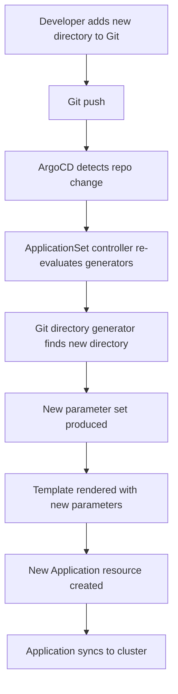

# How to Use Git Directory Generator in ArgoCD ApplicationSets

Author: [nawazdhandala](https://github.com/nawazdhandala)

Tags: ArgoCD, GitOps, Kubernetes, ApplicationSet, Automation

Description: Learn how to use the ArgoCD ApplicationSet Git directory generator to automatically discover and deploy applications from directory structures in your Git repository.

---

The Git directory generator is one of the most powerful ApplicationSet generators because it eliminates manual application registration. You structure your Git repository with one directory per application, and the generator automatically discovers those directories and creates ArgoCD Applications for each one. When you add a new directory, a new Application appears. When you remove a directory, the Application gets cleaned up. Zero manual intervention.

## How the Git Directory Generator Works

The Git directory generator scans a Git repository for directories matching a specified glob pattern. For each matching directory, it produces a parameter set containing:

- `path` - the full path to the matched directory
- `path.basename` - the last component of the path (the directory name)
- `path[n]` - individual path segments (path[0], path[1], etc.)

These parameters feed into the ApplicationSet template to create Applications.

## Basic Usage

Here is the simplest form - one Application per subdirectory:

```yaml
apiVersion: argoproj.io/v1alpha1
kind: ApplicationSet
metadata:
  name: microservices
  namespace: argocd
spec:
  generators:
    - git:
        repoURL: https://github.com/company/k8s-manifests.git
        revision: main
        directories:
          - path: 'services/*'
  template:
    metadata:
      name: '{{path.basename}}'
    spec:
      project: default
      source:
        repoURL: https://github.com/company/k8s-manifests.git
        targetRevision: main
        path: '{{path}}'
      destination:
        server: https://kubernetes.default.svc
        namespace: '{{path.basename}}'
```

If your repo has this structure:

```text
services/
  api-gateway/
    deployment.yaml
    service.yaml
  user-service/
    deployment.yaml
    service.yaml
  payment-service/
    deployment.yaml
    service.yaml
```

The generator creates three Applications: `api-gateway`, `user-service`, and `payment-service`.

## Path Parameters Explained

Each matched directory produces these parameters:

```text
Directory: services/api-gateway
  path          = "services/api-gateway"
  path.basename = "api-gateway"
  path[0]       = "services"
  path[1]       = "api-gateway"
```

Use these in your template:

```yaml
  template:
    metadata:
      name: '{{path.basename}}'
      labels:
        category: '{{path[0]}}'
    spec:
      source:
        path: '{{path}}'
      destination:
        namespace: '{{path.basename}}'
```

## Excluding Directories

You can exclude specific directories from generation:

```yaml
  generators:
    - git:
        repoURL: https://github.com/company/k8s-manifests.git
        revision: main
        directories:
          - path: 'services/*'
          - path: 'services/deprecated-service'
            exclude: true
```

The exclude directive takes precedence. You can use glob patterns in exclusions too:

```yaml
  generators:
    - git:
        repoURL: https://github.com/company/k8s-manifests.git
        revision: main
        directories:
          - path: 'services/*'
          - path: 'services/*-legacy'
            exclude: true
          - path: 'services/test-*'
            exclude: true
```

## Nested Directory Structures

For repositories with deeper nesting, use multi-level glob patterns:

```yaml
  generators:
    - git:
        repoURL: https://github.com/company/k8s-manifests.git
        revision: main
        directories:
          - path: 'teams/*/services/*'
```

Given this repo structure:

```text
teams/
  backend/
    services/
      api/
      auth/
  frontend/
    services/
      web/
      mobile-bff/
```

The generator produces:

| path | path.basename | path[0] | path[1] | path[2] | path[3] |
|------|--------------|---------|---------|---------|---------|
| teams/backend/services/api | api | teams | backend | services | api |
| teams/backend/services/auth | auth | teams | backend | services | auth |
| teams/frontend/services/web | web | teams | frontend | services | web |
| teams/frontend/services/mobile-bff | mobile-bff | teams | frontend | services | mobile-bff |

Use path segments to add context:

```yaml
  template:
    metadata:
      name: '{{path[1]}}-{{path.basename}}'
      labels:
        team: '{{path[1]}}'
    spec:
      source:
        path: '{{path}}'
      destination:
        namespace: '{{path[1]}}-{{path.basename}}'
```

This generates Applications named `backend-api`, `backend-auth`, `frontend-web`, and `frontend-mobile-bff`.

## Multi-Environment Directory Structure

A common pattern is organizing directories by environment:

```text
envs/
  dev/
    api-gateway/
    user-service/
  staging/
    api-gateway/
    user-service/
  production/
    api-gateway/
    user-service/
```

Create an ApplicationSet per environment:

```yaml
apiVersion: argoproj.io/v1alpha1
kind: ApplicationSet
metadata:
  name: production-apps
  namespace: argocd
spec:
  generators:
    - git:
        repoURL: https://github.com/company/k8s-manifests.git
        revision: main
        directories:
          - path: 'envs/production/*'
  template:
    metadata:
      name: 'prod-{{path.basename}}'
      labels:
        environment: production
    spec:
      project: production
      source:
        repoURL: https://github.com/company/k8s-manifests.git
        targetRevision: main
        path: '{{path}}'
      destination:
        server: https://production-cluster.example.com
        namespace: '{{path.basename}}'
      syncPolicy:
        automated:
          prune: true
          selfHeal: true
```

Or use a single ApplicationSet with the Matrix generator to cover all environments:

```yaml
apiVersion: argoproj.io/v1alpha1
kind: ApplicationSet
metadata:
  name: all-envs
  namespace: argocd
spec:
  generators:
    - matrix:
        generators:
          - list:
              elements:
                - env: dev
                  cluster: https://dev-cluster.example.com
                - env: staging
                  cluster: https://staging-cluster.example.com
                - env: production
                  cluster: https://prod-cluster.example.com
          - git:
              repoURL: https://github.com/company/k8s-manifests.git
              revision: main
              directories:
                - path: 'envs/{{env}}/*'
  template:
    metadata:
      name: '{{env}}-{{path.basename}}'
    spec:
      source:
        path: '{{path}}'
      destination:
        server: '{{cluster}}'
        namespace: '{{path.basename}}'
```

## Using with Kustomize Overlays

The Git directory generator works well with Kustomize overlay structures:

```text
base/
  api-gateway/
    kustomization.yaml
overlays/
  production/
    api-gateway/
      kustomization.yaml
    user-service/
      kustomization.yaml
  staging/
    api-gateway/
      kustomization.yaml
    user-service/
      kustomization.yaml
```

```yaml
  generators:
    - git:
        repoURL: https://github.com/company/k8s-manifests.git
        revision: main
        directories:
          - path: 'overlays/production/*'
  template:
    metadata:
      name: 'prod-{{path.basename}}'
    spec:
      source:
        repoURL: https://github.com/company/k8s-manifests.git
        targetRevision: main
        path: '{{path}}'
      destination:
        server: https://kubernetes.default.svc
        namespace: '{{path.basename}}'
```

ArgoCD automatically detects the `kustomization.yaml` and uses Kustomize to render the manifests.

## Monorepo Patterns

For monorepos where each team has their own directory:

```yaml
apiVersion: argoproj.io/v1alpha1
kind: ApplicationSet
metadata:
  name: monorepo-apps
  namespace: argocd
spec:
  generators:
    - git:
        repoURL: https://github.com/company/monorepo.git
        revision: main
        directories:
          - path: 'deploy/k8s/*'
          - path: 'deploy/k8s/shared-*'
            exclude: true
  template:
    metadata:
      name: '{{path.basename}}'
      annotations:
        notifications.argoproj.io/subscribe.on-sync-failed.slack: deployments
    spec:
      project: default
      source:
        repoURL: https://github.com/company/monorepo.git
        targetRevision: main
        path: '{{path}}'
      destination:
        server: https://kubernetes.default.svc
        namespace: '{{path.basename}}'
```

## Automatic Discovery Flow

Here is how the end-to-end flow works:



## Debugging Directory Discovery

If a directory is not being picked up:

```bash
# Check the ApplicationSet status
kubectl get applicationset microservices -n argocd -o json | jq '.status'

# Check controller logs for directory discovery
kubectl logs -n argocd -l app.kubernetes.io/component=applicationset-controller | \
  grep "directory\|microservices"

# Verify the directory exists in the repo at the specified revision
git ls-tree -d --name-only HEAD services/
```

Common issues:
- The directory path does not match the glob pattern
- The directory is empty (Git does not track empty directories)
- The revision specified in the generator does not contain the directory
- The directory is matched by an exclude pattern

## Best Practices

**Keep directory names DNS-compatible**: Since directory names often become Application names and namespaces, stick to lowercase alphanumeric characters and hyphens.

**Use exclude patterns proactively**: Exclude test directories, documentation directories, and any directory that should not become an Application.

**Add a README or .gitkeep convention**: Document that adding a directory under the scanned path will automatically create an ArgoCD Application. This avoids surprises for new team members.

**Pair with notification subscriptions**: Add notification annotations in the template so every generated Application automatically gets alerting.

The Git directory generator turns your repository structure into your application inventory. For file-based configuration instead of directory-based, see the [Git file generator guide](https://oneuptime.com/blog/post/2026-02-26-argocd-git-file-generator/view).
