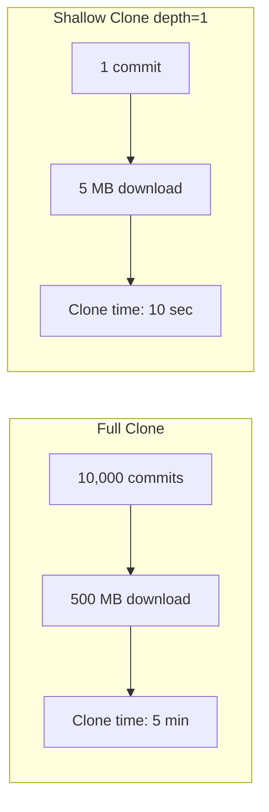

# How to Configure Git Fetch Depth for Performance in ArgoCD

Author: [nawazdhandala](https://github.com/nawazdhandala)

Tags: ArgoCD, GitOps, Kubernetes, Git, Performance

Description: Learn how to configure Git fetch depth in ArgoCD to speed up repository cloning, reduce network bandwidth, and improve repo server performance for large repositories.

---

When ArgoCD clones a Git repository, it fetches the entire commit history by default. For repositories with thousands of commits and years of history, this means downloading megabytes or gigabytes of data that ArgoCD never actually uses. ArgoCD only needs the manifests at a specific revision, not the entire history of how those manifests evolved over time.

Configuring a shallow fetch depth tells Git to only download a limited number of recent commits. This reduces clone time, network bandwidth, and disk usage on the repo server, especially for large or long-lived repositories.

## Why Full Clones Are Wasteful

Consider a repository with 10,000 commits over 5 years. Every file ever added, modified, or deleted is stored in the Git history. When ArgoCD performs a full clone:

- It downloads all 10,000 commits with their full diffs
- It stores the complete object database on disk
- It transfers far more data than needed over the network
- The clone operation can take minutes on large repos

ArgoCD only needs the files at the target revision. A shallow clone with depth 1 gives it exactly that.



## Configuring Fetch Depth in ArgoCD

ArgoCD does not have a built-in flag specifically for fetch depth in its Application spec. However, you can configure Git behavior at the repo server level through environment variables and Git configuration.

Set the GIT_DEPTH environment variable on the repo server:

```yaml
apiVersion: apps/v1
kind: Deployment
metadata:
  name: argocd-repo-server
  namespace: argocd
spec:
  template:
    spec:
      containers:
      - name: argocd-repo-server
        env:
        # Enable shallow clones
        - name: ARGOCD_GIT_SHALLOW_CLONE
          value: "true"
```

For more explicit control, configure Git defaults:

```yaml
apiVersion: v1
kind: ConfigMap
metadata:
  name: argocd-repo-server-gitconfig
  namespace: argocd
data:
  gitconfig: |
    [clone]
      defaultRemoteName = origin
    [fetch]
      # Configure default fetch behavior
      prune = true
    [advice]
      detachedHead = false
```

Mount this into the repo server:

```yaml
apiVersion: apps/v1
kind: Deployment
metadata:
  name: argocd-repo-server
  namespace: argocd
spec:
  template:
    spec:
      containers:
      - name: argocd-repo-server
        volumeMounts:
        - name: gitconfig
          mountPath: /home/argocd/.gitconfig
          subPath: gitconfig
      volumes:
      - name: gitconfig
        configMap:
          name: argocd-repo-server-gitconfig
```

## Using Helm Values for Fetch Depth Configuration

If you manage ArgoCD via Helm:

```yaml
# values.yaml
repoServer:
  env:
    - name: ARGOCD_GIT_SHALLOW_CLONE
      value: "true"

  volumes:
    - name: gitconfig
      configMap:
        name: argocd-repo-server-gitconfig

  volumeMounts:
    - name: gitconfig
      mountPath: /home/argocd/.gitconfig
      subPath: gitconfig
```

## Understanding Fetch Depth Trade-offs

Shallow clones have trade-offs you need to understand before enabling them universally.

**Benefits:**
- Dramatically faster initial clones
- Lower network bandwidth usage
- Less disk space on the repo server
- Faster reconciliation cycles

**Limitations:**
- Cannot resolve Git tags that reference old commits
- Some diff operations may fail if the target commit is outside the shallow depth
- Tracking specific commit SHAs older than the depth will fail

### When Shallow Clones Work Well

Shallow clones work perfectly when your ArgoCD applications track:
- A branch HEAD (main, develop, staging)
- Recent tags
- Recent commit SHAs

```yaml
# These work fine with shallow clones
spec:
  source:
    targetRevision: main
    # or
    targetRevision: HEAD
    # or
    targetRevision: v1.5.0  # Recent tag
```

### When Shallow Clones Cause Problems

Shallow clones can fail when applications track:
- Old commit SHAs that fall outside the depth
- Tags pointing to old commits
- Semantic version constraints that resolve to old tags

```yaml
# These might fail with depth=1
spec:
  source:
    targetRevision: abc123def  # Old commit SHA
    # or
    targetRevision: v0.1.0  # Very old tag
```

## Using Depth Greater Than 1

For applications that might reference slightly older commits, use a depth greater than 1 but still much less than the full history:

```yaml
apiVersion: v1
kind: ConfigMap
metadata:
  name: argocd-repo-server-gitconfig
  namespace: argocd
data:
  gitconfig: |
    [fetch]
      # Fetch the last 10 commits
      depth = 10
```

A depth of 10 to 50 covers most use cases while still providing significant performance improvement over full clones.

## Combining Fetch Depth with Local Caching

Fetch depth becomes even more effective when combined with local repository caching. After the initial shallow clone, subsequent fetches only download new commits:

```yaml
apiVersion: v1
kind: ConfigMap
metadata:
  name: argocd-cmd-params-cm
  namespace: argocd
data:
  # Keep the repo cache for 24 hours
  reposerver.default.cache.expiration: "24h"
```

With persistent caching (PVC-backed storage), the repo server retains its local clones across restarts:

```yaml
apiVersion: apps/v1
kind: Deployment
metadata:
  name: argocd-repo-server
  namespace: argocd
spec:
  template:
    spec:
      containers:
      - name: argocd-repo-server
        volumeMounts:
        - name: repo-cache
          mountPath: /tmp
      volumes:
      - name: repo-cache
        persistentVolumeClaim:
          claimName: argocd-repo-cache
---
apiVersion: v1
kind: PersistentVolumeClaim
metadata:
  name: argocd-repo-cache
  namespace: argocd
spec:
  accessModes:
    - ReadWriteOnce
  resources:
    requests:
      storage: 10Gi
```

## Measuring the Performance Impact

Before and after configuring fetch depth, measure the impact:

```promql
# Git request duration - should decrease with shallow clones
histogram_quantile(0.99,
  rate(argocd_git_request_duration_seconds_bucket[10m])
)

# Average Git fetch time
rate(argocd_git_request_duration_seconds_sum{request_type="fetch"}[5m])
  / rate(argocd_git_request_duration_seconds_count{request_type="fetch"}[5m])
```

Check disk usage on the repo server:

```bash
# Check current disk usage for cached repositories
kubectl exec -n argocd deployment/argocd-repo-server -- du -sh /tmp/

# Check individual repository sizes
kubectl exec -n argocd deployment/argocd-repo-server -- du -sh /tmp/*/
```

## Fetch Depth Recommendations by Scenario

**Small teams, few repositories, fast networks:**
No need to configure fetch depth. The default full clone works fine.

**Medium teams, 50-200 applications, mixed repository sizes:**

```yaml
env:
  - name: ARGOCD_GIT_SHALLOW_CLONE
    value: "true"
```

Shallow cloning provides noticeable improvement with minimal risk.

**Large teams, 500+ applications, monorepos:**

Combine shallow clones with persistent caching, webhook-based reconciliation, and consider repository splitting. See our guide on [handling sparse checkout in ArgoCD](https://oneuptime.com/blog/post/2026-02-26-argocd-git-sparse-checkout/view) for additional techniques.

**Applications tracking specific old commits:**
Use a moderate depth (10-50) instead of depth 1. Monitor for fetch failures and increase the depth if needed.

## Troubleshooting Fetch Depth Issues

**"fatal: couldn't find remote ref" errors:**

The target revision is outside the shallow depth. Increase the depth or switch to tracking a branch instead of a specific commit:

```bash
# Check if the commit exists in the shallow clone
kubectl exec -n argocd deployment/argocd-repo-server -- \
  git -C /tmp/<repo-hash> log --oneline
```

**Repository size not decreasing:**

The repo server might be converting shallow clones to full clones during fetch operations. Check the Git configuration:

```bash
kubectl exec -n argocd deployment/argocd-repo-server -- \
  git -C /tmp/<repo-hash> rev-parse --is-shallow-repository
```

If this returns `false`, the repository has been unshallowed. This can happen if Git needs to resolve references outside the shallow depth.

Configuring Git fetch depth is one of the simplest and most effective performance optimizations for ArgoCD. Start with shallow clones for all repositories, monitor for any issues with specific applications, and adjust the depth as needed for those edge cases.
