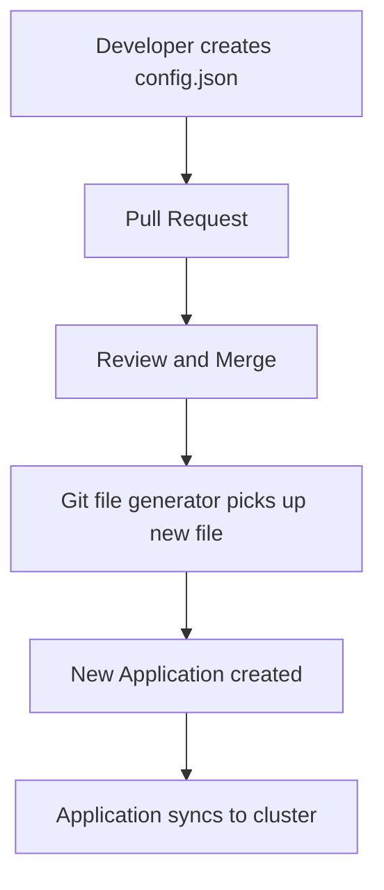

# How to Use Git File Generator in ArgoCD ApplicationSets

Author: [nawazdhandala](https://github.com/nawazdhandala)

Tags: ArgoCD, GitOps, Kubernetes, ApplicationSet, Automation

Description: Learn how to use the ArgoCD ApplicationSet Git file generator to create applications dynamically from JSON or YAML configuration files stored in your Git repository.

---

The Git file generator reads configuration files from a Git repository and uses their contents as parameters for generating ArgoCD Applications. Unlike the directory generator which uses directory structure, the file generator gives you explicit control over every parameter through structured configuration files. This makes it ideal for complex deployment configurations where you need more metadata than a directory name can provide.

## How the Git File Generator Works

The generator scans a Git repository for files matching a glob pattern, reads each file, and extracts key-value pairs from the file contents. Each file produces one parameter set, which the controller uses to render one Application from the template.

The files can be JSON or YAML format. Every key in the file becomes a template parameter.

## Basic JSON File Generator

Here is a simple example using JSON configuration files:

```yaml
apiVersion: argoproj.io/v1alpha1
kind: ApplicationSet
metadata:
  name: apps-from-config
  namespace: argocd
spec:
  generators:
    - git:
        repoURL: https://github.com/company/app-configs.git
        revision: main
        files:
          - path: 'apps/*/config.json'
  template:
    metadata:
      name: '{{name}}'
    spec:
      project: '{{project}}'
      source:
        repoURL: '{{repoURL}}'
        targetRevision: '{{targetRevision}}'
        path: '{{path}}'
      destination:
        server: '{{destServer}}'
        namespace: '{{destNamespace}}'
```

Each config file provides all the parameter values:

```json
// apps/api-gateway/config.json
{
  "name": "api-gateway",
  "project": "production",
  "repoURL": "https://github.com/company/k8s-manifests.git",
  "targetRevision": "main",
  "path": "services/api-gateway",
  "destServer": "https://kubernetes.default.svc",
  "destNamespace": "api-gateway"
}
```

```json
// apps/user-service/config.json
{
  "name": "user-service",
  "project": "production",
  "repoURL": "https://github.com/company/k8s-manifests.git",
  "targetRevision": "main",
  "path": "services/user-service",
  "destServer": "https://kubernetes.default.svc",
  "destNamespace": "user-service"
}
```

## Using YAML Configuration Files

YAML files work the same way:

```yaml
# apps/api-gateway/config.yaml
name: api-gateway
project: production
repoURL: https://github.com/company/k8s-manifests.git
targetRevision: main
path: services/api-gateway
destServer: https://kubernetes.default.svc
destNamespace: api-gateway
team: backend
criticality: high
```

The ApplicationSet generator spec is identical - just change the file path pattern:

```yaml
  generators:
    - git:
        repoURL: https://github.com/company/app-configs.git
        revision: main
        files:
          - path: 'apps/*/config.yaml'
```

## Nested Values in Configuration Files

Configuration files can contain nested objects. Access nested values using dot notation in Go templates:

```json
// apps/payment-service/config.json
{
  "name": "payment-service",
  "source": {
    "repoURL": "https://github.com/company/k8s-manifests.git",
    "revision": "main",
    "path": "services/payment"
  },
  "destination": {
    "server": "https://kubernetes.default.svc",
    "namespace": "payments"
  },
  "helm": {
    "values": {
      "replicas": "3",
      "image.tag": "v2.1.0"
    }
  }
}
```

With Go templates enabled:

```yaml
apiVersion: argoproj.io/v1alpha1
kind: ApplicationSet
metadata:
  name: apps-from-config
  namespace: argocd
spec:
  goTemplate: true
  generators:
    - git:
        repoURL: https://github.com/company/app-configs.git
        revision: main
        files:
          - path: 'apps/*/config.json'
  template:
    metadata:
      name: '{{ .name }}'
    spec:
      project: default
      source:
        repoURL: '{{ .source.repoURL }}'
        targetRevision: '{{ .source.revision }}'
        path: '{{ .source.path }}'
      destination:
        server: '{{ .destination.server }}'
        namespace: '{{ .destination.namespace }}'
```

## Multi-Environment Configurations

The file generator excels at multi-environment setups where each environment has different settings:

```text
config/
  production/
    api-gateway.json
    user-service.json
    payment-service.json
  staging/
    api-gateway.json
    user-service.json
    payment-service.json
```

Each file has environment-specific values:

```json
// config/production/api-gateway.json
{
  "name": "prod-api-gateway",
  "environment": "production",
  "repoURL": "https://github.com/company/k8s-manifests.git",
  "targetRevision": "v1.5.0",
  "path": "services/api-gateway/overlays/production",
  "clusterURL": "https://prod-cluster.example.com",
  "namespace": "api-gateway",
  "replicas": "5",
  "resources_cpu": "500m",
  "resources_memory": "512Mi"
}
```

```json
// config/staging/api-gateway.json
{
  "name": "staging-api-gateway",
  "environment": "staging",
  "repoURL": "https://github.com/company/k8s-manifests.git",
  "targetRevision": "main",
  "path": "services/api-gateway/overlays/staging",
  "clusterURL": "https://staging-cluster.example.com",
  "namespace": "api-gateway",
  "replicas": "2",
  "resources_cpu": "250m",
  "resources_memory": "256Mi"
}
```

Create an ApplicationSet that spans all environments:

```yaml
apiVersion: argoproj.io/v1alpha1
kind: ApplicationSet
metadata:
  name: all-services
  namespace: argocd
spec:
  generators:
    - git:
        repoURL: https://github.com/company/app-configs.git
        revision: main
        files:
          - path: 'config/*/**.json'
  template:
    metadata:
      name: '{{name}}'
      labels:
        environment: '{{environment}}'
    spec:
      project: '{{environment}}'
      source:
        repoURL: '{{repoURL}}'
        targetRevision: '{{targetRevision}}'
        path: '{{path}}'
      destination:
        server: '{{clusterURL}}'
        namespace: '{{namespace}}'
```

## Using File Generator with Helm Values

The file generator is particularly useful for Helm-based applications where each deployment needs different values:

```json
// apps/api-gateway/config.json
{
  "name": "api-gateway",
  "chart": "api-gateway",
  "chartVersion": "2.3.1",
  "helmRepoURL": "https://charts.company.com",
  "namespace": "api",
  "values": {
    "replicas": "3",
    "image.tag": "v1.5.0",
    "ingress.enabled": "true",
    "ingress.host": "api.company.com"
  }
}
```

```yaml
apiVersion: argoproj.io/v1alpha1
kind: ApplicationSet
metadata:
  name: helm-apps
  namespace: argocd
spec:
  goTemplate: true
  generators:
    - git:
        repoURL: https://github.com/company/app-configs.git
        revision: main
        files:
          - path: 'apps/*/config.json'
  template:
    metadata:
      name: '{{ .name }}'
    spec:
      project: default
      source:
        repoURL: '{{ .helmRepoURL }}'
        chart: '{{ .chart }}'
        targetRevision: '{{ .chartVersion }}'
        helm:
          parameters:
            - name: replicaCount
              value: '{{ index .values "replicas" }}'
            - name: image.tag
              value: '{{ index .values "image.tag" }}'
      destination:
        server: https://kubernetes.default.svc
        namespace: '{{ .namespace }}'
```

## Built-in Parameters

In addition to the file contents, the Git file generator provides built-in parameters about the file itself:

- `path` - the full path of the matched file (e.g., `apps/api-gateway/config.json`)
- `path.basename` - the filename without directory (e.g., `config.json`)
- `path[n]` - individual path segments
- `path.basenameNormalized` - the filename normalized for Kubernetes naming
- `path.filenameNormalized` - filename without extension, normalized

These are useful when file location conveys meaning:

```yaml
  template:
    metadata:
      # Use the parent directory name as the app name
      name: '{{path[1]}}'
```

## Globbing Patterns

The file generator supports standard glob patterns:

```yaml
  generators:
    - git:
        files:
          # All JSON files one level deep
          - path: 'apps/*/config.json'

          # All JSON files at any depth
          - path: 'apps/**/config.json'

          # Multiple file patterns
          - path: 'apps/*/config.json'
          - path: 'apps/*/override.json'
```

Exclude specific files:

```yaml
  generators:
    - git:
        files:
          - path: 'apps/*/config.json'
          - path: 'apps/deprecated-service/config.json'
            exclude: true
```

## Self-Service Application Onboarding

The file generator enables a self-service model where teams add their own applications:



Teams simply create a configuration file following a documented schema, submit a pull request, and after approval, their application appears in ArgoCD automatically.

## Debugging File Generator Issues

If files are not generating Applications:

```bash
# Check ApplicationSet controller logs
kubectl logs -n argocd -l app.kubernetes.io/component=applicationset-controller | \
  grep "file\|error\|apps-from-config"

# Verify files exist at the expected paths in the repo
git ls-files 'apps/*/config.json'

# Verify JSON/YAML syntax in config files
for f in apps/*/config.json; do
  echo "Checking $f"
  jq . "$f" > /dev/null 2>&1 || echo "INVALID JSON: $f"
done
```

Common issues:
- Invalid JSON or YAML syntax in configuration files
- File path does not match the glob pattern
- Missing required keys that the template references
- Revision does not exist or does not contain the files

## Best Practices

**Validate configuration files in CI**: Add a CI check that validates every config file against a JSON schema before merge. This prevents broken ApplicationSets from invalid files.

**Use a consistent schema**: Document the expected keys and types. Provide a template file that teams copy when onboarding new applications.

**Keep configuration files small**: Each file should describe one application. Do not try to encode complex logic in the config files - that is what the template is for.

**Version pin where possible**: Use specific Git tags or commits as `targetRevision` in config files rather than branch names, especially for production.

The Git file generator gives you maximum flexibility in how you define application parameters. For directory-structure-based generation instead, see the [Git directory generator](https://oneuptime.com/blog/post/2026-02-26-argocd-git-directory-generator/view). For combining file generation with other generators, check the [Matrix generator guide](https://oneuptime.com/blog/post/2026-01-30-argocd-matrix-generator/view).
