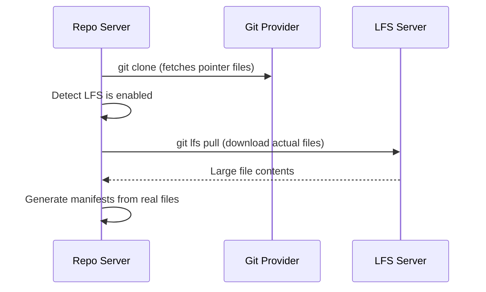

# How to Configure Git LFS Support in ArgoCD

Author: [nawazdhandala](https://github.com/nawazdhandala)

Tags: ArgoCD, GitOps, Kubernetes, Git LFS, Repository Management

Description: Learn how to configure ArgoCD to work with Git Large File Storage for repositories containing binary assets, machine learning models, and large configuration files.

---

Git Large File Storage (LFS) replaces large files in your Git repository with text pointers while storing the actual file content on a remote server. Some GitOps repositories use LFS for binary configuration files, machine learning model definitions, or large dataset files that are part of deployment configurations. ArgoCD supports Git LFS, but you need to enable it explicitly.

## When You Need Git LFS with ArgoCD

LFS is relevant for ArgoCD in several scenarios:

- Repositories containing large Jsonnet libraries or configuration bundles
- ML model deployment manifests that include serialized model metadata files
- Repositories with large binary helm chart packages stored alongside manifests
- Configuration repositories that include certificate bundles or key stores
- Terraform state files or large infrastructure definition files

If your repository uses Git LFS and you do not enable LFS support in ArgoCD, the repo-server will clone the repository but only get the LFS pointer files instead of the actual content. This causes manifest generation to fail with cryptic errors because ArgoCD tries to parse pointer files as YAML.

## Enabling Git LFS Globally

To enable LFS support for all repositories, set the environment variable on the ArgoCD repo-server:

```yaml
# argocd-repo-server-patch.yaml
apiVersion: apps/v1
kind: Deployment
metadata:
  name: argocd-repo-server
  namespace: argocd
spec:
  template:
    spec:
      containers:
        - name: argocd-repo-server
          env:
            - name: ARGOCD_GIT_LFS_ENABLED
              value: "true"
```

Apply the patch:

```bash
kubectl patch deployment argocd-repo-server -n argocd --type json -p '[
  {
    "op": "add",
    "path": "/spec/template/spec/containers/0/env/-",
    "value": {
      "name": "ARGOCD_GIT_LFS_ENABLED",
      "value": "true"
    }
  }
]'
```

After applying this, the repo-server pod will restart and begin pulling LFS objects during repository clones.

## Enabling LFS Per Repository

If only some of your repositories use LFS, you can enable it per repository:

```yaml
# lfs-repo-secret.yaml
apiVersion: v1
kind: Secret
metadata:
  name: repo-with-lfs
  namespace: argocd
  labels:
    argocd.argoproj.io/secret-type: repository
stringData:
  type: git
  url: https://github.com/my-org/config-repo-with-lfs.git
  username: argocd
  password: ghp_your_token
  enableLfs: "true"
```

```bash
kubectl apply -f lfs-repo-secret.yaml
```

The `enableLfs: "true"` field tells ArgoCD to run `git lfs pull` after cloning this specific repository.

## How LFS Works in ArgoCD

Understanding the flow helps with troubleshooting:



The LFS server is usually the same as the Git hosting provider (GitHub, GitLab, etc.), but it can be a separate LFS server.

## LFS Authentication

LFS uses the same credentials as the Git repository for authentication. If you have configured HTTPS credentials or SSH keys for your repository, LFS will use those same credentials to download large files.

However, some LFS servers require separate authentication. In those cases, you need to ensure the credentials have access to both Git and LFS endpoints:

```yaml
apiVersion: v1
kind: Secret
metadata:
  name: repo-with-custom-lfs
  namespace: argocd
  labels:
    argocd.argoproj.io/secret-type: repository
stringData:
  type: git
  url: https://github.com/my-org/repo.git
  username: argocd
  password: ghp_token_with_lfs_scope
  enableLfs: "true"
```

For GitHub, the token needs the `repo` scope, which includes LFS access. For GitLab, `read_repository` includes LFS by default.

## Practical Example: ML Model Deployment

Here is a realistic example where LFS is useful. An ML team stores model metadata as large JSON files tracked by LFS:

```
ml-deployments/
  .gitattributes
  models/
    recommendation-engine/
      model-metadata.json  # 50MB file tracked by LFS
      deployment.yaml
      service.yaml
      kustomization.yaml
```

The `.gitattributes` file configures LFS tracking:

```
models/**/*.json filter=lfs diff=lfs merge=lfs -text
```

The Kubernetes manifests reference the model metadata:

```yaml
# deployment.yaml
apiVersion: apps/v1
kind: Deployment
metadata:
  name: recommendation-engine
spec:
  replicas: 3
  selector:
    matchLabels:
      app: recommendation-engine
  template:
    metadata:
      labels:
        app: recommendation-engine
    spec:
      containers:
        - name: inference
          image: ml-team/recommendation-engine:v2.1
          volumeMounts:
            - name: model-config
              mountPath: /app/config
      volumes:
        - name: model-config
          configMap:
            name: model-metadata
```

A ConfigMapGenerator in Kustomize can turn the LFS-tracked JSON into a ConfigMap:

```yaml
# kustomization.yaml
apiVersion: kustomize.config.k8s.io/v1beta1
kind: Kustomization
resources:
  - deployment.yaml
  - service.yaml
configMapGenerator:
  - name: model-metadata
    files:
      - model-metadata.json
```

Without LFS enabled in ArgoCD, the ConfigMap would contain the LFS pointer text instead of the actual model metadata.

## Performance Considerations

LFS adds overhead to repository cloning because ArgoCD must make additional HTTP requests to download large files. Consider these optimizations:

### Limit LFS Objects

Only track files that actually need LFS. Small configuration files should stay as regular Git objects:

```
# .gitattributes - be specific about what needs LFS
*.bin filter=lfs diff=lfs merge=lfs -text
*.model filter=lfs diff=lfs merge=lfs -text
models/**/*.json filter=lfs diff=lfs merge=lfs -text
```

### Increase Repo Server Resources

If LFS files are large, the repo-server may need more memory and disk space:

```yaml
apiVersion: apps/v1
kind: Deployment
metadata:
  name: argocd-repo-server
  namespace: argocd
spec:
  template:
    spec:
      containers:
        - name: argocd-repo-server
          resources:
            requests:
              memory: "512Mi"
              cpu: "250m"
            limits:
              memory: "2Gi"
              cpu: "1"
          # Increase the volume size for LFS content
          volumeMounts:
            - name: tmp
              mountPath: /tmp
      volumes:
        - name: tmp
          emptyDir:
            sizeLimit: 10Gi
```

### Cache Configuration

ArgoCD caches repository content. For LFS repositories, the cache helps avoid repeated downloads:

```yaml
apiVersion: v1
kind: ConfigMap
metadata:
  name: argocd-cm
  namespace: argocd
data:
  # Increase cache time for repos with large LFS objects
  timeout.reconciliation: 600s
```

## Troubleshooting

### Pointer Files Instead of Actual Content

If you see LFS pointer content in your manifests:

```
version https://git-lfs.github.com/spec/v1
oid sha256:abc123...
size 52428800
```

This means LFS is not enabled. Check:

```bash
# Verify LFS is enabled globally
kubectl get deployment argocd-repo-server -n argocd -o yaml | grep LFS

# Or check the repository secret
kubectl get secret repo-with-lfs -n argocd -o yaml | grep enableLfs
```

### LFS Download Failures

```bash
# Check repo-server logs for LFS errors
kubectl logs -n argocd deployment/argocd-repo-server --tail=100 | grep -i "lfs"

# Verify LFS endpoint is accessible from the pod
kubectl exec -n argocd deployment/argocd-repo-server -- \
  git lfs env 2>&1
```

### Bandwidth Limits

Git hosting providers impose bandwidth limits on LFS downloads. GitHub offers 1 GB per month on free plans. If you hit limits, consider hosting your own LFS server or using a Git provider with higher limits for your usage pattern.

## Alternatives to LFS

If LFS adds too much complexity, consider these alternatives:

- Store large files in object storage (S3, GCS) and reference them in manifests
- Use init containers to download large files at pod startup
- Use ArgoCD config management plugins to fetch files from external sources

For most teams, LFS works well for files under a few hundred megabytes. Beyond that, an external storage approach is usually better.
