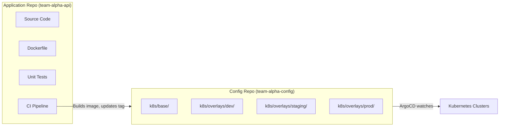

# How to Structure Git Repos for Multi-Environment with ArgoCD

Author: [nawazdhandala](https://github.com/nawazdhandala)

Tags: ArgoCD, GitOps, Kubernetes, Repository Structure, DevOps

Description: Learn how to structure Git repositories for multi-environment ArgoCD deployments including monorepo vs multi-repo strategies, directory layouts, and separation of concerns.

---

The biggest question teams face when adopting ArgoCD is how to organize their Git repositories. Get it wrong and you end up with duplicated YAML, painful promotions, and confusion about which configuration is deployed where. Get it right and environment management becomes a clean, reviewable, auditable process.

This guide covers the most common repository structures for multi-environment ArgoCD deployments, with practical examples showing how each structure works in practice.

## The Two Repository Model

The recommended approach separates application source code from deployment configuration into two repositories.



**Application repository** contains source code, Dockerfile, tests, and CI pipeline. It does not contain Kubernetes manifests.

**Configuration repository** contains Kubernetes manifests, Kustomize overlays, Helm values, and ArgoCD Application definitions. ArgoCD watches this repository.

Why separate them? Because application code changes frequently (multiple times per day) but deployment configuration changes less often. Mixing them means every code change triggers an ArgoCD reconciliation, even if the deployment configuration has not changed.

## Monorepo Structure

Some organizations prefer a monorepo where all teams' configurations live together. This works well with a strong platform team that manages the overall structure.

```text
cluster-config/
  argocd/
    applications/                # ArgoCD Application manifests
      team-alpha/
        payment-service-dev.yaml
        payment-service-staging.yaml
        payment-service-prod.yaml
      team-beta/
        user-service-dev.yaml
        user-service-staging.yaml
        user-service-prod.yaml
    projects/                    # ArgoCD AppProject definitions
      team-alpha.yaml
      team-beta.yaml
      platform.yaml
  services/
    payment-service/
      base/
        deployment.yaml
        service.yaml
        kustomization.yaml
      overlays/
        dev/
          kustomization.yaml
          patches/
            replicas.yaml
            resources.yaml
        staging/
          kustomization.yaml
          patches/
            replicas.yaml
            resources.yaml
        prod/
          kustomization.yaml
          patches/
            replicas.yaml
            resources.yaml
            hpa.yaml
    user-service/
      base/
        deployment.yaml
        service.yaml
        kustomization.yaml
      overlays/
        dev/
        staging/
        prod/
  infrastructure/
    cert-manager/
    ingress-nginx/
    monitoring/
    storage-classes/
```

**Advantages**: Single place to see all configuration. Easy to enforce standards. Simple CODEOWNERS file.

**Disadvantages**: Repository grows large. All teams need access. A bad merge affects everyone.

### CODEOWNERS for Monorepo

```text
# .github/CODEOWNERS
/argocd/projects/       @platform-team
/infrastructure/        @platform-team
/services/payment-*/    @team-alpha
/services/user-*/       @team-beta
```

## Multi-Repo Structure

Each team manages their own configuration repository. The platform team manages infrastructure and ArgoCD configuration in a separate repo.

```text
# Platform team's repo: platform-config
platform-config/
  argocd/
    projects/
    applicationsets/
  infrastructure/
    cert-manager/
    monitoring/
    namespaces/

# Team Alpha's repo: team-alpha-config
team-alpha-config/
  services/
    payment-service/
      base/
      overlays/
        dev/
        staging/
        prod/
    order-service/
      base/
      overlays/

# Team Beta's repo: team-beta-config
team-beta-config/
  services/
    user-service/
      base/
      overlays/
```

**Advantages**: Team autonomy. Smaller repositories. Independent access control.

**Disadvantages**: Harder to enforce standards. More repos to manage. Cross-cutting changes require multiple PRs.

## The Kustomize Overlay Layout

The most popular directory layout for multi-environment uses Kustomize base and overlays.

```text
payment-service/
  base/
    deployment.yaml
    service.yaml
    configmap.yaml
    kustomization.yaml
  overlays/
    dev/
      kustomization.yaml        # References base, applies dev patches
      replica-patch.yaml
      env-config.yaml
    staging/
      kustomization.yaml
      replica-patch.yaml
      env-config.yaml
    prod/
      kustomization.yaml
      replica-patch.yaml
      env-config.yaml
      hpa.yaml                  # Only prod has autoscaling
      pdb.yaml                  # Only prod has PodDisruptionBudget
```

The base contains the common resources:

```yaml
# base/kustomization.yaml
apiVersion: kustomize.config.k8s.io/v1beta1
kind: Kustomization
resources:
  - deployment.yaml
  - service.yaml
  - configmap.yaml
```

```yaml
# base/deployment.yaml
apiVersion: apps/v1
kind: Deployment
metadata:
  name: payment-service
spec:
  replicas: 1  # Default, overridden per environment
  selector:
    matchLabels:
      app: payment-service
  template:
    metadata:
      labels:
        app: payment-service
    spec:
      containers:
        - name: payment-service
          image: myorg/payment-service:latest
          ports:
            - containerPort: 8080
          resources:
            requests:
              cpu: 100m
              memory: 128Mi
```

Each overlay customizes the base:

```yaml
# overlays/prod/kustomization.yaml
apiVersion: kustomize.config.k8s.io/v1beta1
kind: Kustomization
resources:
  - ../../base
  - hpa.yaml
  - pdb.yaml
patches:
  - path: replica-patch.yaml
  - path: resource-patch.yaml
images:
  - name: myorg/payment-service
    newTag: v2.3.1
commonLabels:
  environment: production
```

```yaml
# overlays/prod/replica-patch.yaml
apiVersion: apps/v1
kind: Deployment
metadata:
  name: payment-service
spec:
  replicas: 5
```

```yaml
# overlays/prod/resource-patch.yaml
apiVersion: apps/v1
kind: Deployment
metadata:
  name: payment-service
spec:
  template:
    spec:
      containers:
        - name: payment-service
          resources:
            requests:
              cpu: 500m
              memory: 512Mi
            limits:
              cpu: 2
              memory: 2Gi
```

## The Helm Values Layout

For Helm-based deployments, use a values file per environment.

```text
payment-service/
  Chart.yaml
  values.yaml              # Default values
  values-dev.yaml          # Dev overrides
  values-staging.yaml      # Staging overrides
  values-prod.yaml         # Production overrides
  templates/
    deployment.yaml
    service.yaml
    hpa.yaml
    pdb.yaml
```

ArgoCD Application for each environment:

```yaml
apiVersion: argoproj.io/v1alpha1
kind: Application
metadata:
  name: payment-service-prod
spec:
  source:
    repoURL: https://github.com/myorg/team-alpha-config.git
    path: services/payment-service
    targetRevision: main
    helm:
      valueFiles:
        - values.yaml
        - values-prod.yaml
  destination:
    namespace: team-alpha-prod
```

The `values-prod.yaml` overrides the defaults:

```yaml
# values-prod.yaml
replicaCount: 5
image:
  tag: v2.3.1
resources:
  requests:
    cpu: 500m
    memory: 512Mi
  limits:
    cpu: 2
    memory: 2Gi
autoscaling:
  enabled: true
  minReplicas: 5
  maxReplicas: 20
podDisruptionBudget:
  enabled: true
  minAvailable: 3
```

## App-of-Apps Repository Layout

When using the app-of-apps pattern, organize Application manifests by environment.

```text
argocd-apps/
  bootstrap.yaml              # Root app that watches this directory
  environments/
    dev/
      payment-service.yaml
      order-service.yaml
      user-service.yaml
    staging/
      payment-service.yaml
      order-service.yaml
      user-service.yaml
    prod/
      payment-service.yaml
      order-service.yaml
      user-service.yaml
```

The bootstrap application:

```yaml
apiVersion: argoproj.io/v1alpha1
kind: Application
metadata:
  name: argocd-apps
spec:
  project: default
  source:
    repoURL: https://github.com/myorg/argocd-apps.git
    path: environments
    directory:
      recurse: true
  destination:
    server: https://kubernetes.default.svc
    namespace: argocd
```

## Best Practices

**Keep environment differences minimal.** If your prod overlay has 50 patches and dev has 2, something is wrong. Environments should be as similar as possible, differing only in resource sizes, replicas, and connection strings.

**Use consistent naming.** Whether it is `dev/staging/prod` or `development/qa/production`, pick one convention and stick with it across all repositories.

**Version pin everything.** Image tags, Helm chart versions, and Git revisions should all be explicit. Never use `latest` in staging or production.

**Separate config from secrets.** Environment-specific secrets should not be in the config repo. Use External Secrets Operator, Sealed Secrets, or a similar tool.

**Review all environment changes.** Even dev environment changes should go through PR review. This catches issues before they propagate to production.

The repository structure you choose for multi-environment ArgoCD sets the foundation for your entire GitOps workflow. Start with the Kustomize overlay pattern if you are unsure - it scales well, is easy to understand, and works with ArgoCD's diff view to show exactly what changes between environments.
