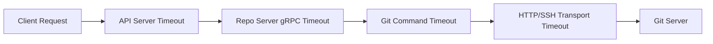

# How to Configure Git Request Timeout in ArgoCD

Author: [nawazdhandala](https://github.com/nawazdhandala)

Tags: ArgoCD, GitOps, Kubernetes, Git, Performance

Description: Learn how to configure Git request timeouts in ArgoCD to prevent stuck operations, handle slow repositories, and optimize the repo server for various network conditions.

---

ArgoCD's repo server fetches manifests from Git repositories during every reconciliation cycle. When a Git server is slow or a repository is large, these fetch operations can take longer than expected. If the timeout is too short, ArgoCD prematurely aborts legitimate operations. If the timeout is too long, stuck connections block the entire reconciliation pipeline.

Getting the Git request timeout right is a balancing act that depends on your repository sizes, network latency, and Git provider performance.

## Default Timeout Behavior

Out of the box, ArgoCD sets a default timeout for Git operations. The repo server has an internal timeout that applies to all Git commands it executes. For most small to medium repositories on fast networks, the default is adequate. But it becomes a problem in several scenarios:

- Large monorepos with deep history
- Repositories hosted in different geographic regions
- Git servers behind VPNs or corporate proxies
- Self-hosted GitLab or Bitbucket instances with limited resources
- Repositories with large binary files or Git LFS objects

## Configuring the Repo Server Timeout

The primary timeout setting lives in the argocd-cmd-params-cm ConfigMap:

```yaml
apiVersion: v1
kind: ConfigMap
metadata:
  name: argocd-cmd-params-cm
  namespace: argocd
data:
  # Git request timeout in seconds (default: 60)
  reposerver.git.request.timeout: "90"
```

After updating this ConfigMap, restart the repo server to apply the change:

```bash
# Apply the ConfigMap
kubectl apply -f argocd-cmd-params-cm.yaml

# Restart the repo server
kubectl rollout restart deployment/argocd-repo-server -n argocd

# Watch the rollout
kubectl rollout status deployment/argocd-repo-server -n argocd
```

## Configuring Timeout via Helm Values

If you installed ArgoCD using Helm, configure the timeout in your values file:

```yaml
# values.yaml for ArgoCD Helm chart
repoServer:
  extraArgs:
    - --git-request-timeout=90s

  # Or via environment variables
  env:
    - name: ARGOCD_EXEC_TIMEOUT
      value: "120s"
```

Apply with:

```bash
helm upgrade argocd argo/argo-cd \
  -n argocd \
  -f values.yaml
```

## Understanding the Different Timeout Layers

ArgoCD has multiple timeout layers that affect Git operations. Understanding each one helps you configure them correctly:



Each layer has its own timeout configuration:

**API Server timeout** - Controls how long the API server waits for responses from the repo server:

```yaml
# argocd-cmd-params-cm
data:
  server.repo.server.timeout.seconds: "120"
```

**Repo Server gRPC timeout** - Controls the internal gRPC timeout for repo server operations:

```yaml
# argocd-cmd-params-cm
data:
  reposerver.git.request.timeout: "90"
```

**Git command execution timeout** - Controls the overall timeout for the Git process:

```yaml
# Environment variable on repo server
env:
  - name: ARGOCD_EXEC_TIMEOUT
    value: "2m0s"
```

**HTTP transport timeout** - Controls the low-level HTTP connection settings:

```yaml
# Custom .gitconfig mounted in repo server
[http]
  lowSpeedLimit = 1000
  lowSpeedTime = 30
  connectTimeout = 30
```

## Setting Timeouts for Manifest Generation

Beyond Git fetch timeouts, ArgoCD also has timeouts for manifest generation. This matters when you use Helm, Kustomize, or custom plugins that take time to render manifests:

```yaml
# argocd-cmd-params-cm
apiVersion: v1
kind: ConfigMap
metadata:
  name: argocd-cmd-params-cm
  namespace: argocd
data:
  # Timeout for Git requests
  reposerver.git.request.timeout: "90"
  # Timeout for generating manifests (Helm template, Kustomize build, etc.)
  reposerver.default.cache.expiration: "24h"
```

For Helm-based applications that use large charts with many dependencies, the manifest generation timeout can be a bottleneck. You can set the overall exec timeout to accommodate this:

```yaml
apiVersion: apps/v1
kind: Deployment
metadata:
  name: argocd-repo-server
  namespace: argocd
spec:
  template:
    spec:
      containers:
      - name: argocd-repo-server
        env:
        # Overall execution timeout for repo server operations
        - name: ARGOCD_EXEC_TIMEOUT
          value: "3m"
```

## Diagnosing Timeout Issues

When Git operations time out, ArgoCD logs the failures in the repo server. Here is how to identify and diagnose timeout issues:

```bash
# Check repo server logs for timeout errors
kubectl logs -n argocd deployment/argocd-repo-server --tail=200 | grep -i "timeout\|deadline"

# Check application events for sync failures
kubectl get events -n argocd --sort-by='.lastTimestamp' | grep -i timeout

# Check the application status for error messages
argocd app get my-app --show-operation
```

Common timeout error messages include:

- `context deadline exceeded` - The operation exceeded the configured timeout
- `dial tcp: i/o timeout` - Network-level connection timeout
- `TLS handshake timeout` - SSL negotiation took too long
- `git fetch: signal: killed` - The Git process was killed after exceeding the exec timeout

## Timeout Configuration for Different Scenarios

Here are recommended timeout configurations for common environments:

**Small teams with fast Git providers (GitHub, GitLab SaaS):**

```yaml
data:
  reposerver.git.request.timeout: "60"
```

**Enterprise with self-hosted Git and large repos:**

```yaml
data:
  reposerver.git.request.timeout: "120"
  server.repo.server.timeout.seconds: "180"
```

**Cross-region deployments or VPN connections:**

```yaml
data:
  reposerver.git.request.timeout: "180"
  server.repo.server.timeout.seconds: "240"
```

**Monorepos with complex manifest generation:**

```yaml
data:
  reposerver.git.request.timeout: "120"
  server.repo.server.timeout.seconds: "300"
```

## Monitoring Timeout Metrics

ArgoCD exposes metrics that help you understand Git operation durations and identify when timeouts are becoming a problem:

```promql
# 99th percentile Git request duration
histogram_quantile(0.99,
  rate(argocd_git_request_duration_seconds_bucket[5m])
)

# Average Git request duration by request type
rate(argocd_git_request_duration_seconds_sum[5m])
  / rate(argocd_git_request_duration_seconds_count[5m])

# Count of timed-out requests
rate(argocd_git_request_total{grpc_code="DeadlineExceeded"}[5m])
```

Create a Prometheus alerting rule to catch timeouts before they become a persistent problem:

```yaml
groups:
- name: argocd-git-timeouts
  rules:
  - alert: ArgocdGitRequestSlow
    expr: |
      histogram_quantile(0.95,
        rate(argocd_git_request_duration_seconds_bucket[10m])
      ) > 30
    for: 15m
    labels:
      severity: warning
    annotations:
      summary: "ArgoCD Git requests are slow"
      description: "95th percentile Git request duration is above 30 seconds."
```

## Reducing the Need for Long Timeouts

Instead of increasing timeouts indefinitely, consider these approaches to make Git operations faster:

1. **Use shallow clones** - Configure Git fetch depth to reduce the amount of data transferred. See our guide on [configuring Git fetch depth for performance](https://oneuptime.com/blog/post/2026-02-26-argocd-git-fetch-depth-performance/view).

2. **Enable Git webhooks** - Reduce polling frequency so ArgoCD only fetches when changes are detected.

3. **Use repo server caching** - ArgoCD caches Git repositories locally. Ensure the cache is persistent across restarts.

4. **Split monorepos** - If a single repository is consistently slow, consider splitting it into smaller repositories.

5. **Deploy ArgoCD closer to your Git server** - Network latency is often the biggest contributor to slow Git operations.

Timeout configuration is not something you set once and forget. As your repositories grow and your team adds more applications, revisit these settings periodically. Use the Prometheus metrics to track trends and adjust before timeouts start causing sync failures.
