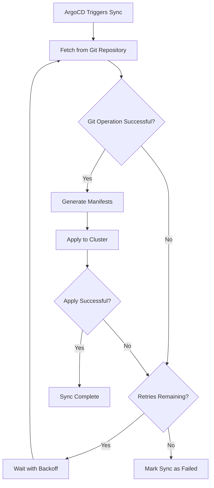

# How to Configure Git Retry Logic in ArgoCD

Author: [nawazdhandala](https://github.com/nawazdhandala)

Tags: ArgoCD, GitOps, Kubernetes, Git, Reliability

Description: Learn how to configure Git retry logic in ArgoCD to handle transient network failures, Git server timeouts, and intermittent connectivity issues during repository operations.

---

Git operations in ArgoCD are the backbone of the entire GitOps workflow. Every time ArgoCD needs to check for changes, fetch manifests, or reconcile application state, it reaches out to your Git repositories. When those operations fail due to transient network issues, temporary Git server outages, or rate limiting, your entire deployment pipeline stalls.

Configuring proper retry logic ensures that ArgoCD recovers gracefully from these temporary failures instead of immediately marking your applications as errored.

## Understanding Why Git Operations Fail

Before diving into retry configuration, it helps to understand the common failure modes. Git operations in ArgoCD fail for several reasons:

- Network timeouts when reaching remote Git servers
- DNS resolution failures during brief connectivity issues
- Git server returning HTTP 500 or 503 during rolling updates
- Rate limiting from hosted Git providers like GitHub or GitLab
- SSH connection drops during peak traffic periods
- TLS handshake failures when certificate authorities are temporarily unreachable

Most of these are transient. They resolve themselves within seconds or minutes. Without retry logic, ArgoCD treats them as hard failures and you end up with red sync statuses across your dashboard.

## Configuring Repo Server Retry Behavior

The ArgoCD repo server is the component responsible for all Git operations. You can configure its retry behavior through the argocd-cmd-params-cm ConfigMap:

```yaml
# argocd-cmd-params-cm ConfigMap
apiVersion: v1
kind: ConfigMap
metadata:
  name: argocd-cmd-params-cm
  namespace: argocd
data:
  # Maximum number of retries for Git operations
  reposerver.git.request.timeout: "60"
```

For more granular control over Git retry behavior, you can configure environment variables on the repo server deployment:

```yaml
apiVersion: apps/v1
kind: Deployment
metadata:
  name: argocd-repo-server
  namespace: argocd
spec:
  template:
    spec:
      containers:
      - name: argocd-repo-server
        env:
        # Set Git HTTP low speed limit (bytes/sec)
        - name: GIT_HTTP_LOW_SPEED_LIMIT
          value: "1000"
        # Set Git HTTP low speed time (seconds)
        - name: GIT_HTTP_LOW_SPEED_TIME
          value: "10"
        # Retry count for Git operations
        - name: ARGOCD_GIT_ATTEMPTS_COUNT
          value: "5"
```

The `ARGOCD_GIT_ATTEMPTS_COUNT` environment variable controls how many times ArgoCD will retry a failed Git operation before giving up. The default value is usually 1, which means no retries. Setting it to 5 gives ArgoCD up to 4 additional attempts after the initial failure.

## Configuring Application-Level Sync Retries

While the above settings handle Git-level retries within the repo server, you can also configure retry behavior at the application sync level. This is different from Git retries - it retries the entire sync operation, which includes Git fetch, manifest generation, and Kubernetes apply steps.

```yaml
apiVersion: argoproj.io/v1alpha1
kind: Application
metadata:
  name: my-app
  namespace: argocd
spec:
  source:
    repoURL: https://github.com/myorg/myapp.git
    targetRevision: main
    path: k8s/
  destination:
    server: https://kubernetes.default.svc
    namespace: my-app
  syncPolicy:
    automated:
      prune: true
      selfHeal: true
    retry:
      limit: 5
      backoff:
        duration: 5s
        factor: 2
        maxDuration: 3m
```

This retry configuration creates an exponential backoff pattern:

- First retry: after 5 seconds
- Second retry: after 10 seconds
- Third retry: after 20 seconds
- Fourth retry: after 40 seconds
- Fifth retry: after 80 seconds (capped at maxDuration of 3 minutes)

## How the Retry Flow Works

Here is a visualization of the retry flow when a Git operation fails:



## Configuring Git Client Behavior

ArgoCD uses the standard Git client under the hood. You can influence its behavior through Git configuration settings. Create a ConfigMap with custom Git settings:

```yaml
apiVersion: v1
kind: ConfigMap
metadata:
  name: argocd-repo-server-config
  namespace: argocd
data:
  gitconfig: |
    [http]
      lowSpeedLimit = 1000
      lowSpeedTime = 20
    [transfer]
      retryCount = 3
    [core]
      compression = 0
```

Mount this ConfigMap into the repo server:

```yaml
apiVersion: apps/v1
kind: Deployment
metadata:
  name: argocd-repo-server
  namespace: argocd
spec:
  template:
    spec:
      containers:
      - name: argocd-repo-server
        volumeMounts:
        - name: git-config
          mountPath: /home/argocd/.gitconfig
          subPath: gitconfig
      volumes:
      - name: git-config
        configMap:
          name: argocd-repo-server-config
```

The `transfer.retryCount` setting tells Git itself to retry pack transfers. The `http.lowSpeedLimit` and `http.lowSpeedTime` settings define when a connection is considered too slow and should be dropped, triggering a retry.

## Handling Rate Limiting from Git Providers

GitHub, GitLab, and Bitbucket all impose rate limits on API and Git operations. When ArgoCD hits these limits, it receives HTTP 429 responses. Without proper retry logic, these appear as sync failures.

For GitHub specifically, you can increase your rate limit by using a GitHub App or personal access token instead of unauthenticated access. But even with authentication, large ArgoCD installations can hit limits.

To mitigate rate limiting:

```yaml
# argocd-cm ConfigMap
apiVersion: v1
kind: ConfigMap
metadata:
  name: argocd-cm
  namespace: argocd
data:
  # Increase the timeout between reconciliation loops
  timeout.reconciliation: "180s"
  # Use webhooks instead of polling to reduce Git API calls
  # This reduces the frequency of Git operations significantly
```

Webhooks are the best solution for rate limiting. Instead of ArgoCD polling your Git server every few minutes, the Git server notifies ArgoCD when changes occur. This dramatically reduces the number of Git operations. See our post on [configuring Git webhooks for GitHub in ArgoCD](https://oneuptime.com/blog/post/2026-02-26-argocd-git-webhook-github/view) for a detailed walkthrough.

## Monitoring Git Retry Behavior

Once you have retries configured, you want to monitor how often they trigger. ArgoCD exposes Prometheus metrics for Git operations:

```promql
# Count of Git fetch requests
argocd_git_request_total

# Duration of Git operations
argocd_git_request_duration_seconds_bucket

# Failed Git requests
argocd_git_request_total{request_type="fetch", grpc_code!="OK"}
```

Set up alerts when retry counts exceed normal thresholds:

```yaml
groups:
- name: argocd-git-retries
  rules:
  - alert: ArgocdGitRequestFailures
    expr: |
      rate(argocd_git_request_total{grpc_code!="OK"}[5m]) > 0.1
    for: 10m
    labels:
      severity: warning
    annotations:
      summary: "ArgoCD Git request failures detected"
      description: "ArgoCD is experiencing elevated Git request failures."
```

## Best Practices for Git Retry Configuration

After running ArgoCD in production across multiple environments, here are the practices that work well:

1. Always set retry limits on automated syncs. The default of no retries is too aggressive for production use.

2. Use exponential backoff with reasonable caps. A maxDuration of 3 to 5 minutes prevents retries from overwhelming a recovering Git server.

3. Combine Git-level retries (ARGOCD_GIT_ATTEMPTS_COUNT) with application-level retries (syncPolicy.retry). They work at different layers and complement each other.

4. Use webhooks instead of aggressive polling. This reduces overall Git operations and makes rate limiting less likely.

5. Monitor Git operation metrics and set up alerts for sustained failures. Transient failures are normal, but persistent failures indicate configuration or infrastructure issues.

6. Consider separate ArgoCD instances for teams with different Git providers. This isolates rate limiting impacts between teams.

## Troubleshooting Failed Retries

When retries are exhausted and syncs still fail, check these common causes:

```bash
# Check repo server logs for Git errors
kubectl logs -n argocd deployment/argocd-repo-server | grep -i "error\|fail\|retry"

# Verify Git connectivity from within the repo server pod
kubectl exec -n argocd deployment/argocd-repo-server -- git ls-remote https://github.com/myorg/myapp.git

# Check if the repository credential secret is correct
argocd repo list
```

If the issue is persistent rather than transient, no amount of retry configuration will fix it. Focus on resolving the underlying connectivity or authentication problem first.

Git retry logic is a straightforward configuration that prevents a large class of annoying false-positive failures in your ArgoCD deployment. Set it up early and adjust the parameters based on your monitoring data over time.
