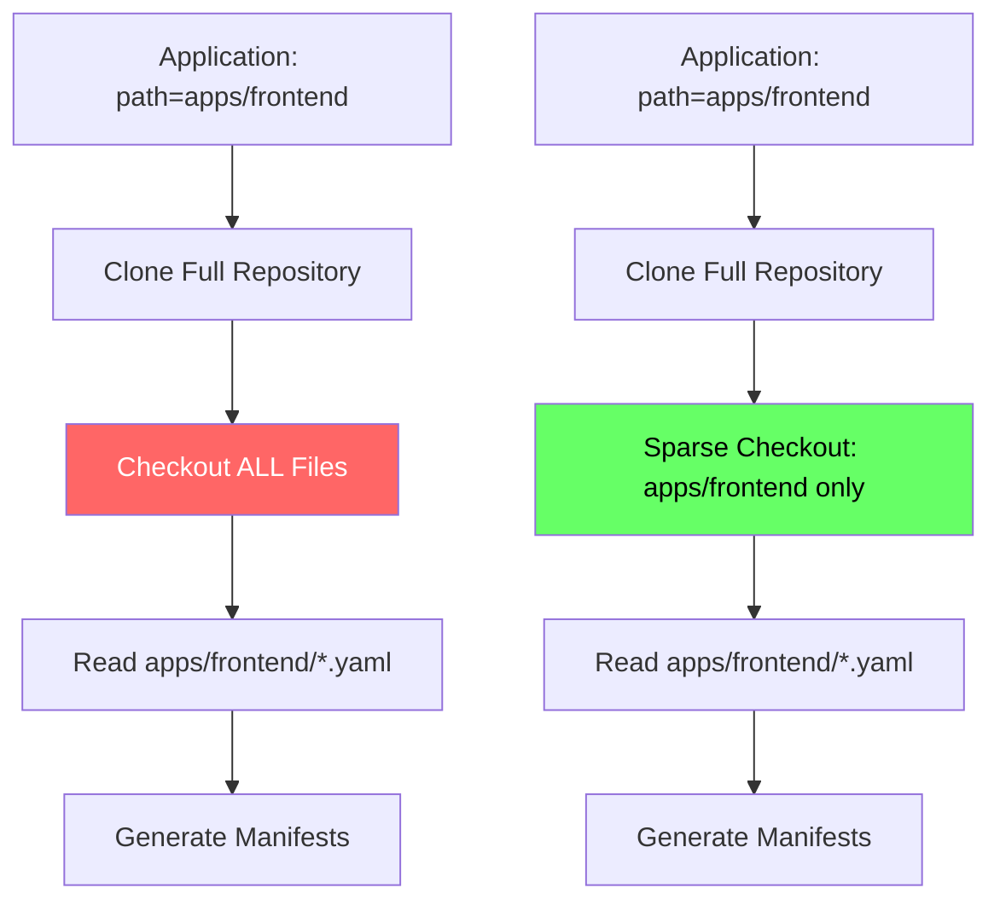

# How to Handle Git Sparse Checkout in ArgoCD

Author: [nawazdhandala](https://github.com/nawazdhandala)

Tags: ArgoCD, GitOps, Kubernetes, Git, Performance

Description: Learn how to use Git sparse checkout with ArgoCD to reduce clone sizes, speed up sync operations, and efficiently manage monorepos with many applications.

---

Monorepos are popular in organizations that want to keep all their Kubernetes manifests in a single repository. But as these repositories grow to contain hundreds of applications, tens of thousands of files, and gigabytes of history, ArgoCD's repo server struggles. It clones the entire repository even when a single application only needs a small subdirectory.

Git sparse checkout solves this by telling Git to only check out specific directories or files from the repository. This dramatically reduces disk usage, network transfer, and clone time for large repositories.

## Understanding the Problem

Consider a monorepo with this structure:

```text
infrastructure-repo/
  apps/
    frontend/
      deployment.yaml
      service.yaml
    backend/
      deployment.yaml
      service.yaml
    database/
      statefulset.yaml
      service.yaml
  platform/
    monitoring/
      ... (thousands of files)
    logging/
      ... (thousands of files)
  ml-models/
    ... (large binary files)
  docs/
    ... (documentation)
```

When ArgoCD syncs the `apps/frontend` application, it clones the entire repository, including the ML models, documentation, and every other directory. This is wasteful and slow.

## How ArgoCD Uses Git Repositories

ArgoCD's repo server clones repositories and caches them locally. When an application specifies a `path` in its source, ArgoCD:

1. Clones or fetches the entire repository
2. Checks out the specified revision
3. Reads only the files in the specified path
4. Generates manifests from those files

Steps 1 and 2 are where the overhead lives. Sparse checkout optimizes step 2 by only materializing the files that ArgoCD actually needs.



## Configuring Sparse Checkout in ArgoCD

ArgoCD does not have native sparse checkout support in its Application spec. However, you can configure sparse checkout at the repo server level using Git configuration and environment variables.

Create a custom gitconfig that enables sparse checkout:

```yaml
apiVersion: v1
kind: ConfigMap
metadata:
  name: argocd-repo-server-gitconfig
  namespace: argocd
data:
  gitconfig: |
    [core]
      sparseCheckout = true
      sparseCheckoutCone = true

    [index]
      sparse = true
```

Mount it into the repo server:

```yaml
apiVersion: apps/v1
kind: Deployment
metadata:
  name: argocd-repo-server
  namespace: argocd
spec:
  template:
    spec:
      containers:
      - name: argocd-repo-server
        volumeMounts:
        - name: gitconfig
          mountPath: /home/argocd/.gitconfig
          subPath: gitconfig
      volumes:
      - name: gitconfig
        configMap:
          name: argocd-repo-server-gitconfig
```

## Using Config Management Plugins for Sparse Checkout

A more practical approach is to use an ArgoCD Config Management Plugin (CMP) that performs sparse checkout before manifest generation:

```yaml
apiVersion: v1
kind: ConfigMap
metadata:
  name: cmp-sparse-checkout
  namespace: argocd
data:
  plugin.yaml: |
    apiVersion: argoproj.io/v1alpha1
    kind: ConfigManagementPlugin
    metadata:
      name: sparse-checkout
    spec:
      init:
        command: ["/bin/sh", "-c"]
        args:
          - |
            echo "Sparse checkout initialized"
      generate:
        command: ["/bin/sh", "-c"]
        args:
          - |
            # Generate manifests from the sparse checkout path
            if [ -f kustomization.yaml ] || [ -f kustomization.yml ]; then
              kustomize build .
            else
              cat *.yaml *.yml 2>/dev/null || true
            fi
```

## Splitting Monorepos as an Alternative

While sparse checkout reduces the impact of monorepos, the cleanest solution is often to split your repository. If sparse checkout is too complex to maintain, consider these alternatives:

**Multiple small repositories:**

```yaml
# Application pointing to a dedicated repo
apiVersion: argoproj.io/v1alpha1
kind: Application
metadata:
  name: frontend
spec:
  source:
    repoURL: https://github.com/myorg/frontend-k8s.git
    path: .
    targetRevision: main
```

**ApplicationSets with directory generator on a lean repo:**

```yaml
apiVersion: argoproj.io/v1alpha1
kind: ApplicationSet
metadata:
  name: apps
spec:
  generators:
  - git:
      repoURL: https://github.com/myorg/k8s-apps.git
      revision: main
      directories:
      - path: apps/*
  template:
    metadata:
      name: '{{path.basename}}'
    spec:
      source:
        repoURL: https://github.com/myorg/k8s-apps.git
        path: '{{path}}'
        targetRevision: main
      destination:
        server: https://kubernetes.default.svc
        namespace: '{{path.basename}}'
```

## Using Git Partial Clone with ArgoCD

Git partial clone (also called blobless or treeless clone) is a related technique that reduces initial clone size without sparse checkout's complexity. It downloads Git objects on demand:

```yaml
apiVersion: v1
kind: ConfigMap
metadata:
  name: argocd-repo-server-gitconfig
  namespace: argocd
data:
  gitconfig: |
    [protocol "version"]
      # Enable Git protocol v2 for partial clone support
    [fetch]
      # Enable partial clone filters
      promisor = true
    [remote "origin"]
      promisor = true
      partialclonefilter = blob:none
```

Partial clone with `blob:none` downloads the commit history and tree objects but skips file contents until they are needed. This means the initial clone only fetches metadata, and file contents are downloaded on demand.

## Configuring Fetch Depth as a Simpler Alternative

For most monorepo scenarios, configuring a shallow fetch depth provides 80% of the benefit with 20% of the complexity. See our detailed guide on [configuring Git fetch depth for performance](https://oneuptime.com/blog/post/2026-02-26-argocd-git-fetch-depth-performance/view).

Shallow clones limit the number of commits fetched:

```yaml
apiVersion: v1
kind: ConfigMap
metadata:
  name: argocd-cmd-params-cm
  namespace: argocd
data:
  # Use shallow clones with depth 1
  controller.repo.server.timeout.seconds: "180"
```

Combined with ArgoCD's local caching, this means subsequent fetches only download new commits since the last sync, regardless of repository size.

## Performance Comparison

Here is a rough comparison of clone times for a monorepo with 10,000 files and 5GB of content:

| Method | Initial Clone | Subsequent Fetch | Disk Usage |
|--------|--------------|-------------------|------------|
| Full clone | 5-10 minutes | 10-30 seconds | 5 GB |
| Shallow clone (depth=1) | 1-2 minutes | 5-15 seconds | 500 MB |
| Sparse checkout | 30-60 seconds | 5-10 seconds | 50-200 MB |
| Partial clone (blobless) | 30-60 seconds | 5-10 seconds | On-demand |

The actual numbers depend on your network speed, repository structure, and Git server performance. But the relative improvements are consistent.

## Monitoring Repository Performance

Track how your Git optimization affects ArgoCD performance:

```promql
# Git clone/fetch duration
histogram_quantile(0.95,
  rate(argocd_git_request_duration_seconds_bucket{request_type="fetch"}[10m])
)

# Repo server memory usage
container_memory_working_set_bytes{
  container="argocd-repo-server"
}

# Repo server disk usage
kubelet_volume_stats_used_bytes{
  persistentvolumeclaim=~"argocd-repo.*"
}
```

## Best Practices for Monorepo Management with ArgoCD

1. Start with shallow clones (fetch depth) as the simplest optimization
2. Use persistent volumes for the repo server cache to avoid re-cloning on restarts
3. Configure webhook-based reconciliation instead of polling to reduce unnecessary fetches
4. Consider sparse checkout for very large repositories where shallow clones are not enough
5. Evaluate whether splitting the monorepo would be simpler than maintaining sparse checkout configurations
6. Monitor Git operation durations and repo server resource usage to identify when optimization is needed

Sparse checkout is a powerful tool for managing large repositories in ArgoCD, but it adds operational complexity. Always start with simpler optimizations like fetch depth and caching before reaching for sparse checkout. If your repository is so large that simpler methods do not help, it might be time to reconsider the monorepo strategy itself.
