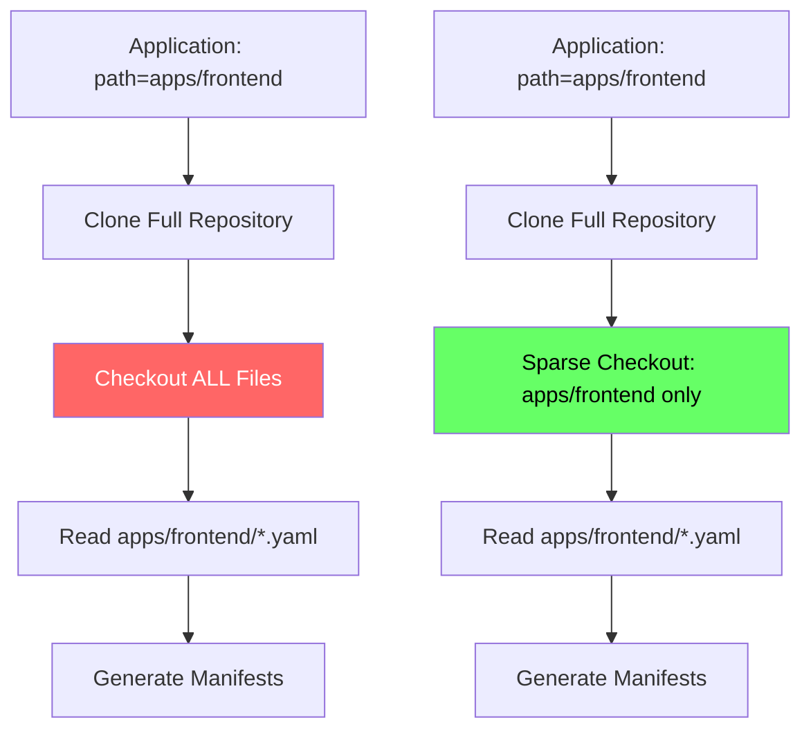

# How to Handle Git Sparse Checkout in ArgoCD

Author: [nawazdhandala](https://github.com/nawazdhandala)

Tags: ArgoCD, GitOps, Kubernetes, Git, Performance

Description: Learn how to use Git sparse checkout with ArgoCD to reduce clone sizes, speed up sync operations, and efficiently manage monorepos with many applications.

---

Monorepos are popular in organizations that want to keep all their Kubernetes manifests in a single repository. But as these repositories grow to contain hundreds of applications, tens of thousands of files, and gigabytes of history, ArgoCD's repo server struggles. It clones the entire repository even when a single application only needs a small subdirectory.

Git sparse checkout tells Git to only materialize specific directories or files in the working tree. This can reduce working-tree disk usage and checkout time, but by itself it does not reduce the Git objects fetched from the remote. In ArgoCD, sparse checkout also needs special care because the repo server owns the clone and checkout workflow.

## Understanding the Problem

Consider a monorepo with this structure:

```text
infrastructure-repo/
  apps/
    frontend/
      deployment.yaml
      service.yaml
    backend/
      deployment.yaml
      service.yaml
    database/
      statefulset.yaml
      service.yaml
  platform/
    monitoring/
      ... (thousands of files)
    logging/
      ... (thousands of files)
  ml-models/
    ... (large binary files)
  docs/
    ... (documentation)
```

When ArgoCD syncs the `apps/frontend` application, it clones the entire repository, including the ML models, documentation, and every other directory. This is wasteful and slow.

## How ArgoCD Uses Git Repositories

ArgoCD's repo server clones repositories and caches them locally. When an application specifies a `path` in its source, ArgoCD:

1. Clones or fetches the entire repository
2. Checks out the specified revision
3. Reads only the files in the specified path
4. Generates manifests from those files

Steps 1 and 2 are where the overhead lives. Sparse checkout can optimize the working-tree part of step 2 by only materializing selected files, but ArgoCD does not currently expose sparse checkout as an Application-level setting.


```mermaid
flowchart TD
    A[Application: path=apps/frontend] --> B[Clone Full Repository]
    B --> C[Checkout ALL Files]
    C --> D[Read apps/frontend/*.yaml]
    D --> E[Generate Manifests]

    A2[Application: path=apps/frontend] --> B2[Clone Full Repository]
    B2 --> C2[Sparse Checkout: apps/frontend only]
    C2 --> D2[Read apps/frontend/*.yaml]
    D2 --> E2[Generate Manifests]

    style C fill:#f66,color:#fff
    style C2 fill:#6f6,color:#000
```

## Configuring Sparse Checkout in ArgoCD

ArgoCD does not have native sparse checkout support in its Application spec, and setting `core.sparseCheckout` globally on the repo server is not enough. Git also needs sparse-checkout patterns for each repository, and ArgoCD's repo server controls repository checkout and cache maintenance.

If you need true sparse checkout, treat it as a custom repo-server change that must set both the Git configuration and the repository-specific sparse-checkout paths before checkout. For example, the underlying Git operations look like this:

```sh
git clone --no-checkout https://github.com/myorg/infrastructure-repo.git
cd infrastructure-repo
git sparse-checkout init --cone
git sparse-checkout set apps/frontend
git checkout main
```

That workflow is easy to run in a CI job, but it is not a supported ArgoCD Application configuration knob.

## Using Config Management Plugins for Sparse Checkout

A more practical ArgoCD-native optimization is to reduce the files sent to manifest generation. Config Management Plugins run after ArgoCD has prepared the application source directory, so a CMP does not make the repo-server clone sparse. For CMPs and monorepos, use the `argocd.argoproj.io/manifest-generate-paths` annotation to tell ArgoCD which paths affect manifest generation:

```yaml
apiVersion: argoproj.io/v1alpha1
kind: Application
metadata:
  name: frontend
  namespace: argocd
  annotations:
    argocd.argoproj.io/manifest-generate-paths: .
spec:
  project: default
  source:
    repoURL: https://github.com/myorg/infrastructure-repo.git
    path: apps/frontend
    targetRevision: main
  destination:
    server: https://kubernetes.default.svc
    namespace: frontend
```

This is not the same as Git sparse checkout, but it can avoid unnecessary manifest regeneration when unrelated files change. When the annotation is used with a CMP, ArgoCD sends only the relevant resources to the CMP server instead of the entire repository.

## Splitting Monorepos as an Alternative

While supported Git and manifest-generation optimizations reduce the impact of monorepos, the cleanest solution is often to split your repository. If custom sparse checkout behavior is too complex to maintain, consider these alternatives:

**Multiple small repositories:**

```yaml
# Application pointing to a dedicated repo

apiVersion: argoproj.io/v1alpha1
kind: Application
metadata:
  name: frontend
  namespace: argocd
spec:
  project: default
  source:
    repoURL: https://github.com/myorg/frontend-k8s.git
    path: .
    targetRevision: main
  destination:
    server: https://kubernetes.default.svc
    namespace: frontend
```

**ApplicationSets with directory generator on a lean repo:**

```yaml
apiVersion: argoproj.io/v1alpha1
kind: ApplicationSet
metadata:
  name: apps
spec:
  generators:
  - git:
      repoURL: https://github.com/myorg/k8s-apps.git
      revision: main
      directories:
      - path: apps/*
  template:
    metadata:
      name: '{{path.basename}}'
    spec:
      project: default
      source:
        repoURL: https://github.com/myorg/k8s-apps.git
        path: '{{path}}'
        targetRevision: main
      destination:
        server: https://kubernetes.default.svc
        namespace: '{{path.basename}}'
```

## Using Git Partial Clone with ArgoCD

Git partial clone is a related technique that reduces initial clone size without sparse checkout's complexity. It downloads Git objects on demand:

```sh
git clone --filter=blob:none https://github.com/myorg/infrastructure-repo.git
```

Partial clone with `blob:none` downloads the commit and tree objects but skips file contents until they are needed. This means the initial clone fetches metadata, and file contents are downloaded on demand. ArgoCD does not currently provide a documented repo-server setting equivalent to `git clone --filter=blob:none`, so do not rely on a mounted gitconfig alone to enable partial clones.

## Configuring Fetch Depth as a Simpler Alternative

For most monorepo scenarios, configuring a shallow fetch depth provides 80% of the benefit with 20% of the complexity. See our detailed guide on [configuring Git fetch depth for performance](https://oneuptime.com/blog/post/2026-02-26-argocd-git-fetch-depth-performance/view).

Shallow clones limit the number of commits fetched. Configure this with the repository `depth` option:

```yaml
apiVersion: v1
kind: Secret
metadata:
  name: infrastructure-repo
  namespace: argocd
  labels:
    argocd.argoproj.io/secret-type: repository
  annotations:
    managed-by: argocd.argoproj.io
type: Opaque
stringData:
  type: git
  url: https://github.com/myorg/infrastructure-repo.git
  depth: "1"
```

Combined with ArgoCD's local caching, this means subsequent fetches only download new commits since the last sync, regardless of repository size.

## Performance Comparison

Here is a rough comparison of clone times for a monorepo with 10,000 files and 5GB of content:

| Method | Initial Clone | Subsequent Fetch | Disk Usage |
|--------|--------------|-------------------|------------|
| Full clone | 5-10 minutes | 10-30 seconds | 5 GB |
| Shallow clone (depth=1) | 1-2 minutes | 5-15 seconds | 500 MB |
| Sparse checkout | 30-60 seconds | 5-10 seconds | Smaller working tree, full Git object database unless combined with partial clone |
| Partial clone (blobless) | 30-60 seconds | 5-10 seconds | Blobs fetched on demand |

The actual numbers depend on your network speed, repository structure, Git server support, and ArgoCD version. Treat these as directional examples rather than guaranteed ratios.

## Monitoring Repository Performance

Track how your Git optimization affects ArgoCD performance:

```promql
# Git clone/fetch duration
histogram_quantile(0.95,
  rate(argocd_git_request_duration_seconds_bucket{request_type="fetch"}[10m])
)

# Repo server memory usage
container_memory_working_set_bytes{
  container="argocd-repo-server"
}

# Repo server disk usage
kubelet_volume_stats_used_bytes{
  persistentvolumeclaim=~"argocd-repo.*"
}
```

## Best Practices for Monorepo Management with ArgoCD

1. Start with shallow clones (fetch depth) as the simplest optimization
2. Use persistent volumes for the repo server cache to avoid re-cloning on restarts
3. Configure webhook-based reconciliation instead of polling to reduce unnecessary fetches
4. Use manifest generation path annotations for monorepos where unrelated changes invalidate too many application caches
5. Evaluate whether splitting the monorepo would be simpler than maintaining custom sparse checkout behavior
6. Monitor Git operation durations and repo server resource usage to identify when optimization is needed

Sparse checkout is a powerful Git feature, but ArgoCD does not expose it as a first-class Application setting. Always start with supported optimizations like fetch depth, caching, webhooks, and manifest path annotations before reaching for custom repo-server behavior. If your repository is so large that simpler methods do not help, it might be time to reconsider the monorepo strategy itself.
