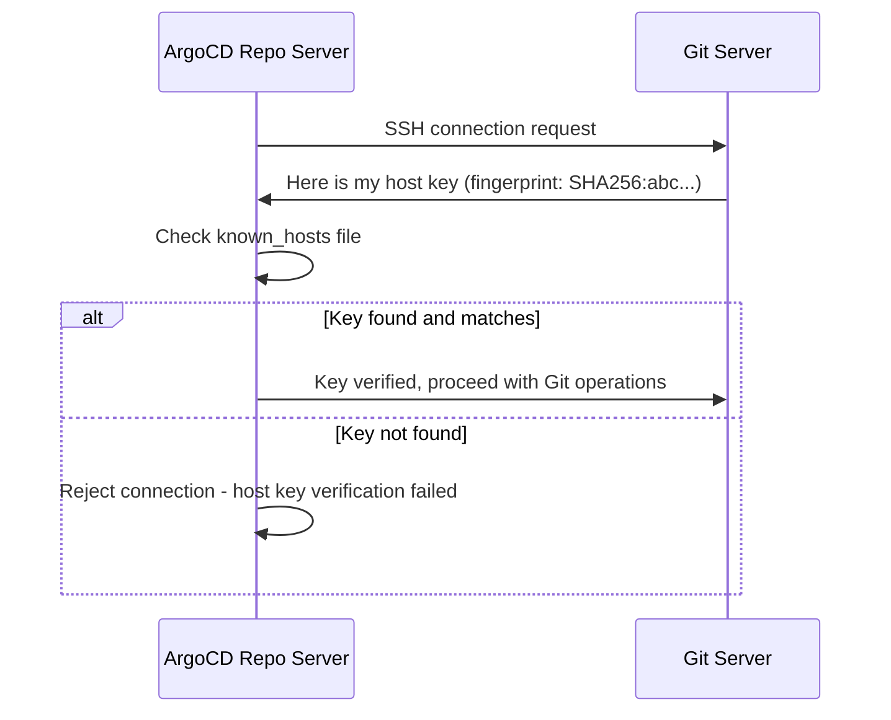

# How to Handle Git SSH Host Key Verification in ArgoCD

Author: [nawazdhandala](https://github.com/nawazdhandala)

Tags: ArgoCD, GitOps, Kubernetes, SSH, Security

Description: Learn how to configure SSH host key verification in ArgoCD for secure Git operations, including adding known hosts, managing host keys, and troubleshooting verification failures.

---

When ArgoCD connects to Git repositories over SSH, the SSH client verifies the server's host key to prevent man-in-the-middle attacks. If the host key is not in ArgoCD's known_hosts file, the connection is rejected and your sync operations fail with cryptic error messages about host key verification.

This is a security feature you should not blindly disable. Instead, you need to properly configure ArgoCD with the correct SSH host keys for your Git servers. This guide covers how to manage SSH host key verification in ArgoCD for both public and private Git servers.

## How SSH Host Key Verification Works

Every SSH server has a unique host key pair. When a client connects for the first time, the server presents its public key. The client checks this key against its known_hosts file:



ArgoCD stores SSH known hosts in a ConfigMap called `argocd-ssh-known-hosts-cm`. This ConfigMap is mounted into the repo server pod and used for all SSH-based Git operations.

## Viewing Current Known Hosts

Check what host keys ArgoCD currently has configured:

```bash
# View the known hosts ConfigMap
kubectl get configmap argocd-ssh-known-hosts-cm -n argocd -o yaml

# Or use the ArgoCD CLI
argocd cert list --cert-type ssh
```

By default, ArgoCD ships with known hosts entries for popular Git hosting services including GitHub, GitLab, Bitbucket, Azure DevOps, and a few others.

## Adding Host Keys for Public Git Services

If your ArgoCD installation is missing entries for common Git providers, you can add them. First, fetch the current host keys:

```bash
# Fetch GitHub's SSH host keys
ssh-keyscan github.com 2>/dev/null

# Fetch GitLab's SSH host keys
ssh-keyscan gitlab.com 2>/dev/null

# Fetch Bitbucket's SSH host keys
ssh-keyscan bitbucket.org 2>/dev/null

# Fetch Azure DevOps SSH host keys
ssh-keyscan ssh.dev.azure.com 2>/dev/null
```

Add them using the ArgoCD CLI:

```bash
# Add a host key using the CLI
argocd cert add-ssh --batch <<EOF
github.com ssh-ed25519 AAAAC3NzaC1lZDI1NTE5AAAAIOMqqnkVzrm0SdG6UOoqKLsabgH5C9okWi0dh2l9GKJl
gitlab.com ssh-ed25519 AAAAC3NzaC1lZDI1NTE5AAAAIAfuCHKVTjquxvt6CM6tdG4SLp1Btn/nOeHHE5UOzRdf
bitbucket.org ssh-ed25519 AAAAC3NzaC1lZDI1NTE5AAAAIIazEu89wgQZ4bqs3d63QSMzYVa0MuJ2e2gKTKqu+UUO
EOF
```

## Adding Host Keys for Private Git Servers

For self-hosted Git servers (GitLab CE/EE, Bitbucket Server, Gitea, etc.), you need to fetch and add the host key manually:

```bash
# Fetch the host key from your private Git server
ssh-keyscan -p 22 git.internal.example.com 2>/dev/null

# If your Git server uses a non-standard SSH port
ssh-keyscan -p 2222 git.internal.example.com 2>/dev/null
```

Add the key to ArgoCD:

```bash
# Add the private server's host key
argocd cert add-ssh --batch <<EOF
git.internal.example.com ssh-rsa AAAAB3NzaC1yc2EAAA... (your key)
git.internal.example.com ssh-ed25519 AAAAC3NzaC1lZDI1NTE5AAAA... (your key)
EOF
```

## Configuring Known Hosts Declaratively

For a GitOps-friendly approach, configure the known hosts directly in the ConfigMap:

```yaml
apiVersion: v1
kind: ConfigMap
metadata:
  name: argocd-ssh-known-hosts-cm
  namespace: argocd
  labels:
    app.kubernetes.io/name: argocd-ssh-known-hosts-cm
    app.kubernetes.io/part-of: argocd
data:
  ssh_known_hosts: |
    # GitHub
    github.com ssh-ed25519 AAAAC3NzaC1lZDI1NTE5AAAAIOMqqnkVzrm0SdG6UOoqKLsabgH5C9okWi0dh2l9GKJl
    github.com ecdsa-sha2-nistp256 AAAAE2VjZHNhLXNoYTItbmlzdHAyNTYAAAAIbmlzdHAyNTYAAABBBEmKSENjQEezOmxkZMy7opKgwFB9nkt5YRrYMjNuG5N87uRgg6CLrbo5wAdT/y6v0mKV0U2w0WZ2YB/++Tpockg=
    github.com ssh-rsa AAAAB3NzaC1yc2EAAAADAQABAAABgQCj7ndNxQowgcQnjshcLrqPEiiphnt+VTTvDP6mHBL9j1aNUkY4Ue1gvwnGLVlOhGeYrnZaMgRK6+PKCUXaDbC7qtbW8gIkhL7aGCsOr/C56SJMy/BCZfxd1nWzAOxSDPgVsmerOBYfNqltV9/hWCqBywINIR+5dIg6JTJ72pcEpEjcYgXkE2YEFXV1JHnsKgbLWNlhScqb2UmyRkQyytRLtL+38TGxkxCflmO+5Z8CSSNY7GidjMIZ7Q4zMjA2n1nGrlTDkzwDCsw+wqFPGQA179cnfGWOWRVruj16z6XyvxvjJwbz0wQZ75XK5tKSb7FNyeIEs4TT4jk+S4dhPeAUC5y+bDYirYgM4GC7uEnztnZyaVWQ7B381AK4Qdrwt51ZqExKbQpTUNn+EjqoTwvqNj4kqx5QUCI0ThS/YkOxJCXmPUWZbhjpCg56i+2aB6CmK2JGhn57K5mj0MNdBXA4/WnwH6XoPWJzK5Nyu2zB3nAZp+S5hpQs+p1vN1/wsjk=

    # GitLab
    gitlab.com ssh-ed25519 AAAAC3NzaC1lZDI1NTE5AAAAIAfuCHKVTjquxvt6CM6tdG4SLp1Btn/nOeHHE5UOzRdf
    gitlab.com ecdsa-sha2-nistp256 AAAAE2VjZHNhLXNoYTItbmlzdHAyNTYAAAAIbmlzdHAyNTYAAABBBFSMqzJeV9rUzU4kWitGjeR4PWSa29SPqJ1fVkhtj3Hw9xjLVXVYrU9QlYWrOLXBpQ6KWjbjTDTdDkoohFzgbEY=

    # Bitbucket
    bitbucket.org ssh-ed25519 AAAAC3NzaC1lZDI1NTE5AAAAIIazEu89wgQZ4bqs3d63QSMzYVa0MuJ2e2gKTKqu+UUO

    # Internal Git server
    git.internal.example.com ssh-ed25519 AAAAC3NzaC1lZDI1NTE5AAAA... (your key here)
```

Apply with:

```bash
kubectl apply -f argocd-ssh-known-hosts-cm.yaml
```

The repo server picks up changes to this ConfigMap automatically without requiring a restart.

## Handling Host Key Changes

Git servers occasionally rotate their SSH host keys. GitHub did this in March 2023 when they rotated their RSA SSH key. When this happens, ArgoCD rejects connections because the stored key no longer matches.

To update a host key:

```bash
# Remove the old key
argocd cert rm-ssh --cert-type ssh github.com

# Fetch and add the new key
ssh-keyscan github.com 2>/dev/null | argocd cert add-ssh --batch

# Verify the new key is in place
argocd cert list --cert-type ssh | grep github.com
```

## Verifying Host Key Fingerprints

When adding host keys, always verify the fingerprints against the Git provider's official documentation. Never blindly trust the output of ssh-keyscan. Here is how to check the fingerprint:

```bash
# Fetch the key and display its fingerprint
ssh-keyscan github.com 2>/dev/null | ssh-keygen -lf -

# Compare against GitHub's published fingerprints:
# SHA256:+DiY3wvvV6TuJJhbpZisF/zLDA0zPMSvHdkr4UvCOqU (ED25519)
# SHA256:p2QAMXNIC1TJYWeIOttrVc98/R1BUFWu3/LiyKgUfQM (ECDSA)
# SHA256:uNiVztksCsDhcc0u9e8BujQXVUpKZIDTMczCvj3tD2s (RSA)
```

Most Git hosting providers publish their SSH host key fingerprints on their documentation sites. Always cross-reference before adding keys to your ArgoCD configuration.

## Disabling Host Key Verification (Not Recommended)

In development or testing environments, you might want to skip host key verification entirely. This is insecure and should never be used in production:

```yaml
apiVersion: v1
kind: ConfigMap
metadata:
  name: argocd-ssh-known-hosts-cm
  namespace: argocd
data:
  ssh_known_hosts: |
    # Wildcard entry - INSECURE, development only
```

A slightly better approach for development is to set the SSH option in the Git configuration:

```yaml
apiVersion: v1
kind: ConfigMap
metadata:
  name: argocd-repo-server-gitconfig
  namespace: argocd
data:
  gitconfig: |
    [core]
      sshCommand = ssh -o StrictHostKeyChecking=no -o UserKnownHostsFile=/dev/null
```

Again, do not use this in production. It defeats the purpose of SSH host key verification and leaves you vulnerable to man-in-the-middle attacks.

## Handling Custom SSH Ports

If your Git server runs SSH on a non-standard port, the known_hosts entry format changes:

```bash
# Fetch key from a server on port 2222
ssh-keyscan -p 2222 git.internal.example.com 2>/dev/null
```

The output format for non-standard ports uses square brackets:

```
[git.internal.example.com]:2222 ssh-ed25519 AAAAC3NzaC1lZDI1NTE5AAAA...
```

Add this to your known hosts ConfigMap with the brackets and port included.

## Automating Host Key Management

For organizations managing many Git servers, automate host key updates with a CronJob:

```yaml
apiVersion: batch/v1
kind: CronJob
metadata:
  name: update-ssh-known-hosts
  namespace: argocd
spec:
  schedule: "0 0 * * 0"  # Weekly on Sunday
  jobTemplate:
    spec:
      template:
        spec:
          serviceAccountName: argocd-server
          containers:
          - name: update-keys
            image: bitnami/kubectl:latest
            command:
            - /bin/sh
            - -c
            - |
              # Fetch current host keys
              KEYS=$(ssh-keyscan github.com gitlab.com bitbucket.org git.internal.example.com 2>/dev/null)

              # Update the ConfigMap
              kubectl create configmap argocd-ssh-known-hosts-cm \
                --from-literal="ssh_known_hosts=$KEYS" \
                -n argocd \
                --dry-run=client -o yaml | kubectl apply -f -
          restartPolicy: OnFailure
```

This keeps your SSH host keys up to date automatically. Combine this with monitoring and alerting to catch any host key rotation events.

SSH host key verification is a critical security mechanism. Take the time to configure it properly rather than disabling it. Once set up, it requires minimal maintenance unless your Git providers rotate their keys.
