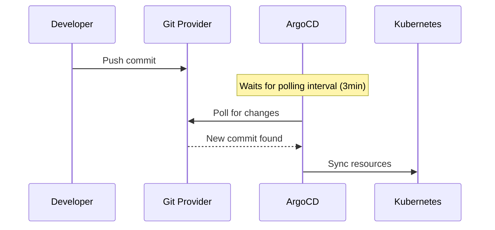
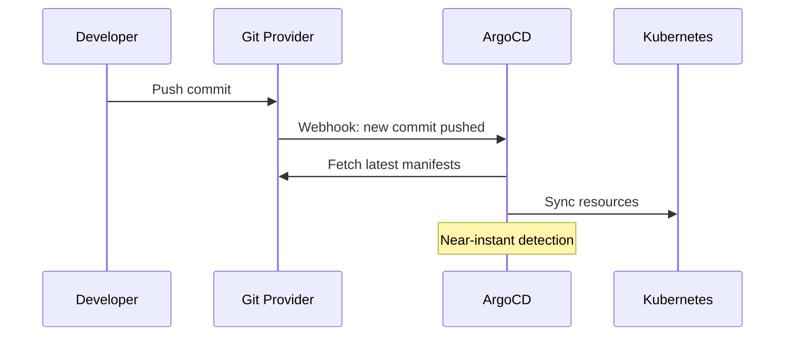

# How to Use Git Webhooks to Speed Up Reconciliation in ArgoCD

Author: [nawazdhandala](https://github.com/nawazdhandala)

Tags: ArgoCD, GitOps, Kubernetes, Webhook, Performance

Description: Learn how to configure Git webhooks in ArgoCD to trigger immediate reconciliation on push events instead of waiting for the default polling interval.

---

By default, ArgoCD polls your Git repositories every 3 minutes to check for changes. This means after you push a commit, you could wait up to 3 minutes before ArgoCD notices the change and starts syncing. Git webhooks eliminate this delay by telling ArgoCD about changes the moment they happen. This guide covers how webhooks work in ArgoCD, how to set them up, and how to troubleshoot common issues.

## How ArgoCD Webhook Reconciliation Works

Without webhooks, ArgoCD's reconciliation loop looks like this:



With webhooks, the flow becomes:



## ArgoCD Webhook Architecture

ArgoCD's API server exposes a webhook endpoint at `/api/webhook`. This endpoint accepts webhook payloads from GitHub, GitLab, Bitbucket, and other Git providers. When a webhook is received:

1. ArgoCD parses the webhook payload to extract the repository URL and branch
2. It finds all applications that reference that repository and branch
3. It triggers an immediate refresh for those applications
4. The normal reconciliation loop handles the rest

The webhook endpoint does not require authentication by default, but you can configure a webhook secret for verification.

## Configuring the Webhook Secret

Set up a shared secret so ArgoCD can verify webhook payloads are legitimate:

```yaml
# argocd-secret Secret
apiVersion: v1
kind: Secret
metadata:
  name: argocd-secret
  namespace: argocd
type: Opaque
stringData:
  # GitHub webhook secret
  webhook.github.secret: "your-github-webhook-secret"

  # GitLab webhook secret
  webhook.gitlab.secret: "your-gitlab-webhook-secret"

  # Bitbucket webhook secret
  webhook.bitbucket.uuid: "your-bitbucket-uuid"

  # Bitbucket Server webhook secret
  webhook.bitbucketserver.secret: "your-bitbucket-server-secret"

  # Gogs webhook secret
  webhook.gogs.secret: "your-gogs-secret"
```

Generate a secure webhook secret:

```bash
# Generate a random webhook secret
openssl rand -hex 32
```

## Exposing the Webhook Endpoint

The ArgoCD API server needs to be reachable from your Git provider. If ArgoCD is behind a firewall, you need to expose the webhook endpoint.

### Option 1: Ingress with Webhook Path

```yaml
apiVersion: networking.k8s.io/v1
kind: Ingress
metadata:
  name: argocd-server-webhook
  namespace: argocd
  annotations:
    nginx.ingress.kubernetes.io/ssl-redirect: "true"
spec:
  rules:
    - host: argocd.example.com
      http:
        paths:
          - path: /api/webhook
            pathType: Prefix
            backend:
              service:
                name: argocd-server
                port:
                  number: 443
  tls:
    - hosts:
        - argocd.example.com
      secretName: argocd-tls
```

### Option 2: Dedicated Webhook Service

If you do not want to expose the full ArgoCD API, create a service that only exposes the webhook path:

```yaml
apiVersion: v1
kind: Service
metadata:
  name: argocd-webhook
  namespace: argocd
spec:
  selector:
    app.kubernetes.io/name: argocd-server
  ports:
    - port: 443
      targetPort: 8080
      protocol: TCP
---
apiVersion: networking.k8s.io/v1
kind: Ingress
metadata:
  name: argocd-webhook
  namespace: argocd
  annotations:
    nginx.ingress.kubernetes.io/ssl-redirect: "true"
    # Only allow POST to /api/webhook
    nginx.ingress.kubernetes.io/configuration-snippet: |
      if ($request_method != POST) {
        return 405;
      }
spec:
  rules:
    - host: argocd-webhook.example.com
      http:
        paths:
          - path: /api/webhook
            pathType: Exact
            backend:
              service:
                name: argocd-webhook
                port:
                  number: 443
```

## Combining Webhooks with Longer Polling Intervals

Once webhooks are configured and reliable, you can increase the polling interval to reduce load:

```yaml
# argocd-cm ConfigMap
apiVersion: v1
kind: ConfigMap
metadata:
  name: argocd-cm
  namespace: argocd
data:
  # Increase from 3 minutes to 10 minutes
  # Webhooks handle immediate detection
  timeout.reconciliation: "600"
```

This reduces the number of Git fetches by more than 3x while maintaining instant change detection through webhooks.

## Testing Webhook Delivery

After configuring webhooks, verify they are working:

```bash
# Simulate a GitHub webhook payload
curl -X POST https://argocd.example.com/api/webhook \
  -H "Content-Type: application/json" \
  -H "X-GitHub-Event: push" \
  -H "X-Hub-Signature-256: sha256=$(echo -n '{"ref":"refs/heads/main","repository":{"clone_url":"https://github.com/org/repo.git"}}' | openssl dgst -sha256 -hmac 'your-github-webhook-secret' | cut -d' ' -f2)" \
  -d '{"ref":"refs/heads/main","repository":{"clone_url":"https://github.com/org/repo.git"}}'

# Check ArgoCD API server logs for webhook receipt
kubectl logs -n argocd deployment/argocd-server | grep -i webhook
```

## Troubleshooting Webhook Issues

### Webhooks Not Triggering Reconciliation

```bash
# Check if the API server is receiving webhooks
kubectl logs -n argocd deployment/argocd-server --tail=100 | grep webhook

# Common log messages:
# "Received webhook event" - Good, webhook received
# "Ignoring webhook event" - ArgoCD received it but could not match to an app
# No webhook logs - Webhook is not reaching ArgoCD
```

### Repository URL Mismatch

ArgoCD matches webhook payloads to applications by comparing the repository URL. The URL in the webhook payload must match the `repoURL` in your application spec exactly.

```bash
# Check how your application references the repo
argocd app get my-app -o json | jq '.spec.source.repoURL'

# Common mismatches:
# Application uses: https://github.com/org/repo.git
# Webhook sends:    https://github.com/org/repo (no .git suffix)
# Fix: Add both URL formats in ArgoCD or standardize
```

### Webhook Secret Mismatch

```bash
# Check if the secret is set correctly
kubectl get secret argocd-secret -n argocd -o jsonpath='{.data.webhook\.github\.secret}' | base64 -d

# Verify it matches what is configured in GitHub
```

### Firewall Issues

If ArgoCD is behind a firewall, ensure your Git provider's webhook IP ranges can reach the ArgoCD webhook endpoint:

```bash
# GitHub webhook IPs (check GitHub docs for current ranges)
# Add to your firewall allowlist
# 140.82.112.0/20
# 185.199.108.0/22

# Test connectivity from outside
curl -v https://argocd.example.com/api/webhook
```

## Webhook Reliability Considerations

Webhooks are not guaranteed delivery. Network issues, Git provider outages, or ArgoCD downtime can cause missed webhooks. Always keep the polling interval as a fallback:

```yaml
# Never disable polling entirely - use it as a safety net
timeout.reconciliation: "600"  # 10 minutes, not "0"
```

Monitor webhook delivery in your Git provider's webhook settings. Most providers show delivery history with success/failure status and response codes.

## Performance Impact of Webhooks

Webhooks can cause a thundering herd problem if many applications reference the same repository. A single push triggers refresh on all of them simultaneously.

```yaml
# Add jitter to spread out webhook-triggered reconciliations
# argocd-cmd-params-cm ConfigMap
apiVersion: v1
kind: ConfigMap
metadata:
  name: argocd-cmd-params-cm
  namespace: argocd
data:
  # Add random jitter to reconciliation (in seconds)
  controller.reconciliation.jitter: "30"
```

For monitoring webhook delivery reliability and ArgoCD reconciliation performance, [OneUptime](https://oneuptime.com) can help you track the end-to-end latency from Git push to cluster deployment.

## Key Takeaways

- Git webhooks reduce change detection time from minutes to seconds
- Configure webhook secrets for security
- Keep polling as a fallback - never rely solely on webhooks
- Increase the polling interval once webhooks are reliable to reduce load
- Monitor webhook delivery in your Git provider's settings
- Add reconciliation jitter to prevent thundering herd on busy repositories
- Test webhooks with curl to verify end-to-end delivery
