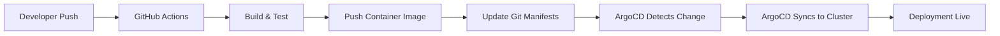

# How to Integrate ArgoCD with GitHub Actions

Author: [nawazdhandala](https://github.com/nawazdhandala)

Tags: ArgoCD, GitOps, Kubernetes, GitHub Actions, CI/CD

Description: Learn how to integrate ArgoCD with GitHub Actions for a complete GitOps CI/CD pipeline including automated image updates, sync triggering, deployment verification, and status reporting.

---

GitHub Actions handles CI (building, testing, pushing images) while ArgoCD handles CD (deploying to Kubernetes). Integrating the two creates a complete GitOps pipeline where code changes flow automatically from pull request to production. This guide covers every integration pattern, from basic image tag updates to advanced deployment verification workflows.

## The GitOps CI/CD Architecture

In a GitOps workflow, GitHub Actions and ArgoCD each handle a specific part of the pipeline:



GitHub Actions never talks to Kubernetes directly. It updates the Git repository, and ArgoCD picks up the change.

## Pattern 1: Image Tag Update Workflow

The most common pattern is having GitHub Actions update the image tag in your deployment manifests after a successful build:

```yaml
# .github/workflows/deploy.yml
name: Build and Deploy

on:
  push:
    branches: [main]

env:
  IMAGE_NAME: ghcr.io/myorg/my-app
  DEPLOY_REPO: myorg/k8s-manifests

jobs:
  build:
    runs-on: ubuntu-latest
    outputs:
      image_tag: ${{ steps.meta.outputs.tags }}
    steps:
      - name: Checkout source
        uses: actions/checkout@v4

      - name: Set up Docker Buildx
        uses: docker/setup-buildx-action@v3

      - name: Login to GitHub Container Registry
        uses: docker/login-action@v3
        with:
          registry: ghcr.io
          username: ${{ github.actor }}
          password: ${{ secrets.GITHUB_TOKEN }}

      - name: Extract metadata
        id: meta
        uses: docker/metadata-action@v5
        with:
          images: ${{ env.IMAGE_NAME }}
          tags: |
            type=sha,prefix=

      - name: Build and push
        uses: docker/build-push-action@v5
        with:
          context: .
          push: true
          tags: ${{ steps.meta.outputs.tags }}
          cache-from: type=gha
          cache-to: type=gha,mode=max

  update-manifests:
    needs: build
    runs-on: ubuntu-latest
    steps:
      - name: Checkout deployment repo
        uses: actions/checkout@v4
        with:
          repository: ${{ env.DEPLOY_REPO }}
          token: ${{ secrets.DEPLOY_TOKEN }}

      - name: Update image tag
        run: |
          # Update the image tag in the deployment manifest
          cd apps/my-app/production
          kustomize edit set image ${{ env.IMAGE_NAME }}=${{ needs.build.outputs.image_tag }}

      - name: Commit and push
        run: |
          git config user.name "github-actions[bot]"
          git config user.email "github-actions[bot]@users.noreply.github.com"
          git add .
          git commit -m "Deploy my-app: ${{ needs.build.outputs.image_tag }}"
          git push
```

ArgoCD watches the deployment repository and automatically syncs when it detects the new commit.

## Pattern 2: Direct ArgoCD API Integration

For workflows that need to trigger sync or check status, you can call the ArgoCD API directly:

```yaml
# .github/workflows/deploy-and-verify.yml
name: Deploy and Verify

on:
  push:
    branches: [main]

jobs:
  deploy:
    runs-on: ubuntu-latest
    steps:
      - name: Checkout
        uses: actions/checkout@v4

      # ... build and push steps ...

      - name: Update manifests
        run: |
          # Update image tag in manifests repo
          # (Same as Pattern 1)

      - name: Install ArgoCD CLI
        run: |
          curl -sSL -o argocd https://github.com/argoproj/argo-cd/releases/latest/download/argocd-linux-amd64
          chmod +x argocd
          sudo mv argocd /usr/local/bin/

      - name: Login to ArgoCD
        run: |
          argocd login ${{ secrets.ARGOCD_SERVER }} \
            --username ${{ secrets.ARGOCD_USERNAME }} \
            --password ${{ secrets.ARGOCD_PASSWORD }} \
            --grpc-web

      - name: Trigger sync
        run: |
          # Trigger a sync for the application
          argocd app sync my-app --grpc-web

      - name: Wait for sync to complete
        run: |
          # Wait up to 5 minutes for the sync to finish
          argocd app wait my-app \
            --sync \
            --health \
            --timeout 300 \
            --grpc-web

      - name: Verify deployment health
        run: |
          # Check that the application is healthy
          STATUS=$(argocd app get my-app -o json --grpc-web | jq -r '.status.health.status')
          if [ "$STATUS" != "Healthy" ]; then
            echo "Application is not healthy: $STATUS"
            exit 1
          fi
          echo "Application is healthy!"
```

## Pattern 3: Token-Based Authentication

Instead of username/password, use an ArgoCD API token for CI authentication:

```bash
# Generate an API token (run once, manually)
argocd account generate-token --account ci-bot
```

Store the token as a GitHub secret and use it:

```yaml
      - name: Login to ArgoCD with token
        run: |
          argocd login ${{ secrets.ARGOCD_SERVER }} \
            --auth-token ${{ secrets.ARGOCD_TOKEN }} \
            --grpc-web
```

For project-scoped tokens:

```bash
# Create a project role for CI
argocd proj role create my-project ci-role

# Add necessary permissions
argocd proj role add-policy my-project ci-role \
  -a sync -p allow -o "applications"
argocd proj role add-policy my-project ci-role \
  -a get -p allow -o "applications"

# Generate a token
argocd proj role create-token my-project ci-role
```

## Pattern 4: Pull Request Preview Environments

Create temporary environments for each pull request:

```yaml
# .github/workflows/preview.yml
name: Preview Environment

on:
  pull_request:
    types: [opened, synchronize, reopened]

jobs:
  preview:
    runs-on: ubuntu-latest
    steps:
      - name: Checkout
        uses: actions/checkout@v4

      - name: Build preview image
        run: |
          docker build -t ghcr.io/myorg/my-app:pr-${{ github.event.pull_request.number }} .
          docker push ghcr.io/myorg/my-app:pr-${{ github.event.pull_request.number }}

      - name: Create ArgoCD Application for PR
        run: |
          argocd login ${{ secrets.ARGOCD_SERVER }} \
            --auth-token ${{ secrets.ARGOCD_TOKEN }} \
            --grpc-web

          # Create a preview application
          argocd app create my-app-pr-${{ github.event.pull_request.number }} \
            --repo https://github.com/myorg/k8s-manifests \
            --path apps/my-app/preview \
            --dest-server https://kubernetes.default.svc \
            --dest-namespace preview-pr-${{ github.event.pull_request.number }} \
            --project preview \
            --sync-option CreateNamespace=true \
            --parameter image.tag=pr-${{ github.event.pull_request.number }} \
            --grpc-web

          # Sync the preview
          argocd app sync my-app-pr-${{ github.event.pull_request.number }} --grpc-web

      - name: Comment PR with preview URL
        uses: actions/github-script@v7
        with:
          script: |
            const prNumber = context.payload.pull_request.number;
            github.rest.issues.createComment({
              issue_number: prNumber,
              owner: context.repo.owner,
              repo: context.repo.repo,
              body: `Preview environment deployed!\n\nURL: https://pr-${prNumber}.preview.example.com\nArgoCD: https://argocd.example.com/applications/my-app-pr-${prNumber}`
            });
```

Clean up when the PR is closed:

```yaml
# .github/workflows/preview-cleanup.yml
name: Cleanup Preview

on:
  pull_request:
    types: [closed]

jobs:
  cleanup:
    runs-on: ubuntu-latest
    steps:
      - name: Delete preview application
        run: |
          argocd login ${{ secrets.ARGOCD_SERVER }} \
            --auth-token ${{ secrets.ARGOCD_TOKEN }} \
            --grpc-web

          argocd app delete my-app-pr-${{ github.event.pull_request.number }} \
            --cascade \
            --grpc-web \
            --yes
```

## Pattern 5: Deployment Status as GitHub Commit Status

Report ArgoCD deployment status back to GitHub:

```yaml
      - name: Report deployment status to GitHub
        if: always()
        uses: actions/github-script@v7
        with:
          script: |
            const status = '${{ job.status }}' === 'success' ? 'success' : 'failure';
            await github.rest.repos.createCommitStatus({
              owner: context.repo.owner,
              repo: context.repo.repo,
              sha: context.sha,
              state: status,
              target_url: 'https://argocd.example.com/applications/my-app',
              description: status === 'success' ? 'Deployment successful' : 'Deployment failed',
              context: 'ArgoCD/deploy'
            });
```

## Pattern 6: Promotion Workflow

Promote a deployment from staging to production:

```yaml
# .github/workflows/promote.yml
name: Promote to Production

on:
  workflow_dispatch:
    inputs:
      version:
        description: 'Version to promote'
        required: true

jobs:
  promote:
    runs-on: ubuntu-latest
    environment: production  # Requires approval
    steps:
      - name: Checkout deployment repo
        uses: actions/checkout@v4
        with:
          repository: myorg/k8s-manifests
          token: ${{ secrets.DEPLOY_TOKEN }}

      - name: Update production manifests
        run: |
          cd apps/my-app/production
          kustomize edit set image ghcr.io/myorg/my-app=ghcr.io/myorg/my-app:${{ github.event.inputs.version }}

      - name: Commit and push
        run: |
          git config user.name "github-actions[bot]"
          git config user.email "github-actions[bot]@users.noreply.github.com"
          git add .
          git commit -m "Promote my-app ${{ github.event.inputs.version }} to production"
          git push

      - name: Wait for ArgoCD sync
        run: |
          argocd login ${{ secrets.ARGOCD_SERVER }} \
            --auth-token ${{ secrets.ARGOCD_TOKEN }} \
            --grpc-web

          # Trigger and wait for sync
          argocd app sync my-app-prod --grpc-web
          argocd app wait my-app-prod --health --timeout 300 --grpc-web
```

## Security Best Practices

**Use dedicated service accounts**: Create a specific ArgoCD account for CI/CD with minimum required permissions:

```yaml
# argocd-cm ConfigMap
data:
  accounts.ci-bot: apiKey
  accounts.ci-bot.enabled: "true"
```

```yaml
# argocd-rbac-cm ConfigMap
data:
  policy.csv: |
    p, ci-bot, applications, sync, */*, allow
    p, ci-bot, applications, get, */*, allow
```

**Use GitHub Environments**: Require approval for production deployments:

```yaml
jobs:
  deploy-production:
    environment: production  # Requires reviewer approval
```

**Rotate tokens regularly**: Set up automated token rotation for CI/CD service accounts.

**Use OIDC where possible**: GitHub Actions supports OIDC token exchange, which avoids storing long-lived credentials.

## Troubleshooting

**Sync not triggering after manifest update**: If auto-sync is disabled, you need to trigger it manually via the API or CLI. If auto-sync is enabled, ArgoCD polls Git every 3 minutes by default. Configure a webhook for faster detection.

**Permission denied**: Verify the CI account has the correct RBAC permissions for the application's project.

**Timeout waiting for sync**: Increase the timeout or check if the sync is stuck on a health check. Large deployments may need more time.

## Conclusion

Integrating ArgoCD with GitHub Actions creates a robust GitOps pipeline where CI and CD are cleanly separated. The image tag update pattern is the purest GitOps approach, while direct API integration provides more control for advanced workflows like preview environments and deployment verification. For integrating ArgoCD with other CI systems, check our guides on [GitLab CI integration](https://oneuptime.com/blog/post/2026-02-26-argocd-gitlab-cicd-integration/view) and [Jenkins pipeline integration](https://oneuptime.com/blog/post/2026-02-26-argocd-jenkins-pipeline-integration/view).
