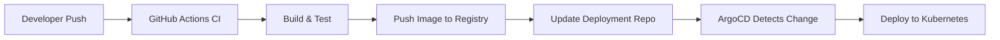

# How to Create a Complete GitHub Actions + ArgoCD Pipeline

Author: [nawazdhandala](https://github.com/nawazdhandala)

Tags: ArgoCD, GitOps, Kubernetes, GitHub Actions, CI/CD

Description: Learn how to build a complete CI/CD pipeline using GitHub Actions for continuous integration and ArgoCD for continuous deployment to Kubernetes clusters.

---

GitHub Actions and ArgoCD form one of the most popular CI/CD combinations for Kubernetes. GitHub Actions handles the CI side - building, testing, and pushing container images - while ArgoCD handles the CD side - deploying those images to your clusters. The bridge between them is a Git commit that updates the image tag in your deployment manifests.

This guide walks through building a production-ready pipeline from scratch.

## Architecture Overview

The pipeline follows the standard GitOps pattern with separate repositories for application code and deployment configuration:



## Repository Structure

You need two repositories:

1. **Application repo** (`myorg/api-service`) - contains source code and GitHub Actions workflow
2. **Deployment repo** (`myorg/k8s-deployments`) - contains Kubernetes manifests managed by ArgoCD

This separation ensures ArgoCD only watches for deployment changes, not code changes.

## GitHub Actions Workflow

Here is the complete CI workflow for the application repository:

```yaml
# .github/workflows/ci-cd.yaml
name: CI/CD Pipeline

on:
  push:
    branches: [main]
  pull_request:
    branches: [main]

env:
  REGISTRY: ghcr.io
  IMAGE_NAME: ${{ github.repository }}

jobs:
  test:
    runs-on: ubuntu-latest
    steps:
      - uses: actions/checkout@v4

      - name: Set up Go
        uses: actions/setup-go@v5
        with:
          go-version: '1.22'

      - name: Run tests
        run: |
          go test ./... -v -coverprofile=coverage.out

      - name: Run linter
        uses: golangci/golangci-lint-action@v4
        with:
          version: latest

  build-and-push:
    needs: test
    runs-on: ubuntu-latest
    if: github.event_name == 'push' && github.ref == 'refs/heads/main'
    permissions:
      contents: read
      packages: write
    outputs:
      image-tag: ${{ steps.meta.outputs.version }}
    steps:
      - uses: actions/checkout@v4

      - name: Log in to Container Registry
        uses: docker/login-action@v3
        with:
          registry: ${{ env.REGISTRY }}
          username: ${{ github.actor }}
          password: ${{ secrets.GITHUB_TOKEN }}

      - name: Extract metadata
        id: meta
        uses: docker/metadata-action@v5
        with:
          images: ${{ env.REGISTRY }}/${{ env.IMAGE_NAME }}
          tags: |
            type=sha,prefix=
            type=raw,value=latest

      - name: Build and push
        uses: docker/build-push-action@v5
        with:
          context: .
          push: true
          tags: ${{ steps.meta.outputs.tags }}
          cache-from: type=gha
          cache-to: type=gha,mode=max

  update-deployment:
    needs: build-and-push
    runs-on: ubuntu-latest
    if: github.event_name == 'push' && github.ref == 'refs/heads/main'
    steps:
      - name: Checkout deployment repo
        uses: actions/checkout@v4
        with:
          repository: myorg/k8s-deployments
          token: ${{ secrets.DEPLOYMENT_REPO_TOKEN }}
          path: k8s-deployments

      - name: Update image tag
        run: |
          cd k8s-deployments
          SHORT_SHA=$(echo "${{ github.sha }}" | cut -c1-7)

          # Update the image tag in the deployment manifest
          sed -i "s|image: ghcr.io/myorg/api-service:.*|image: ghcr.io/myorg/api-service:${SHORT_SHA}|" \
            apps/api-service/deployment.yaml

          # Or if using Kustomize
          cd apps/api-service
          kustomize edit set image \
            "ghcr.io/myorg/api-service=ghcr.io/myorg/api-service:${SHORT_SHA}"

      - name: Commit and push
        run: |
          cd k8s-deployments
          git config user.name "github-actions[bot]"
          git config user.email "github-actions[bot]@users.noreply.github.com"
          git add .
          git commit -m "Update api-service to ${{ github.sha }}"
          git push
```

## Deployment Repository Manifests

The deployment repository contains the Kubernetes manifests that ArgoCD watches:

```yaml
# apps/api-service/deployment.yaml
apiVersion: apps/v1
kind: Deployment
metadata:
  name: api-service
  namespace: production
spec:
  replicas: 3
  selector:
    matchLabels:
      app: api-service
  template:
    metadata:
      labels:
        app: api-service
    spec:
      containers:
        - name: api-service
          image: ghcr.io/myorg/api-service:abc1234
          ports:
            - containerPort: 8080
          resources:
            requests:
              cpu: 200m
              memory: 256Mi
            limits:
              cpu: "1"
              memory: 512Mi
          readinessProbe:
            httpGet:
              path: /healthz
              port: 8080
          livenessProbe:
            httpGet:
              path: /healthz
              port: 8080
---
apiVersion: v1
kind: Service
metadata:
  name: api-service
  namespace: production
spec:
  selector:
    app: api-service
  ports:
    - port: 8080
      targetPort: 8080
```

## ArgoCD Application

```yaml
# argocd/api-service-app.yaml
apiVersion: argoproj.io/v1alpha1
kind: Application
metadata:
  name: api-service
  namespace: argocd
  annotations:
    notifications.argoproj.io/subscribe.on-sync-succeeded.github: ""
    notifications.argoproj.io/subscribe.on-sync-failed.github: ""
spec:
  project: applications
  source:
    repoURL: https://github.com/myorg/k8s-deployments.git
    path: apps/api-service
    targetRevision: main
  destination:
    server: https://kubernetes.default.svc
    namespace: production
  syncPolicy:
    automated:
      selfHeal: true
      prune: true
    syncOptions:
      - CreateNamespace=true
    retry:
      limit: 3
      backoff:
        duration: 5s
        factor: 2
        maxDuration: 3m
```

## GitHub Commit Status Updates

Use ArgoCD Notifications to update the GitHub commit status when a deployment succeeds or fails:

```yaml
# argocd-notifications-cm ConfigMap
apiVersion: v1
kind: ConfigMap
metadata:
  name: argocd-notifications-cm
  namespace: argocd
data:
  service.github: |
    appID: "123456"
    installationID: "789012"
    privateKey: $github-privateKey

  template.app-sync-succeeded: |
    github:
      repoURLPath: "{{.app.spec.source.repoURL}}"
      revisionPath: "{{.app.status.operationState.syncResult.revision}}"
      status:
        state: success
        label: "argocd/{{.app.metadata.name}}"
        targetURL: "https://argocd.example.com/applications/{{.app.metadata.name}}"

  template.app-sync-failed: |
    github:
      repoURLPath: "{{.app.spec.source.repoURL}}"
      revisionPath: "{{.app.status.operationState.syncResult.revision}}"
      status:
        state: failure
        label: "argocd/{{.app.metadata.name}}"
        targetURL: "https://argocd.example.com/applications/{{.app.metadata.name}}"

  trigger.on-sync-succeeded: |
    - when: app.status.operationState.phase in ['Succeeded']
      send: [app-sync-succeeded]

  trigger.on-sync-failed: |
    - when: app.status.operationState.phase in ['Error', 'Failed']
      send: [app-sync-failed]
```

## Pull Request Preview Environments

Create ephemeral environments for pull requests:

```yaml
# .github/workflows/pr-preview.yaml
name: PR Preview

on:
  pull_request:
    types: [opened, synchronize, reopened, closed]

jobs:
  preview:
    runs-on: ubuntu-latest
    if: github.event.action != 'closed'
    steps:
      - uses: actions/checkout@v4

      - name: Build and push preview image
        run: |
          docker build -t ghcr.io/myorg/api-service:pr-${{ github.event.pull_request.number }} .
          docker push ghcr.io/myorg/api-service:pr-${{ github.event.pull_request.number }}

      - name: Create preview environment
        uses: actions/checkout@v4
        with:
          repository: myorg/k8s-deployments
          token: ${{ secrets.DEPLOYMENT_REPO_TOKEN }}
          path: k8s-deployments

      - name: Generate preview manifests
        run: |
          cd k8s-deployments
          PR_NUM=${{ github.event.pull_request.number }}

          mkdir -p apps/api-service/previews/pr-${PR_NUM}
          cat > apps/api-service/previews/pr-${PR_NUM}/kustomization.yaml << EOF
          apiVersion: kustomize.config.k8s.io/v1beta1
          kind: Kustomization
          resources:
            - ../../
          namePrefix: pr-${PR_NUM}-
          namespace: preview-${PR_NUM}
          images:
            - name: ghcr.io/myorg/api-service
              newTag: pr-${PR_NUM}
          EOF

          git add .
          git commit -m "Create preview for PR #${PR_NUM}"
          git push

  cleanup:
    runs-on: ubuntu-latest
    if: github.event.action == 'closed'
    steps:
      - uses: actions/checkout@v4
        with:
          repository: myorg/k8s-deployments
          token: ${{ secrets.DEPLOYMENT_REPO_TOKEN }}

      - name: Remove preview
        run: |
          PR_NUM=${{ github.event.pull_request.number }}
          rm -rf apps/api-service/previews/pr-${PR_NUM}
          git add .
          git commit -m "Remove preview for PR #${PR_NUM}"
          git push
```

## Image Updater Alternative

Instead of having CI update the deployment repo, you can use ArgoCD Image Updater to automatically detect new images:

```yaml
apiVersion: argoproj.io/v1alpha1
kind: Application
metadata:
  name: api-service
  annotations:
    argocd-image-updater.argoproj.io/image-list: app=ghcr.io/myorg/api-service
    argocd-image-updater.argoproj.io/app.update-strategy: latest
    argocd-image-updater.argoproj.io/app.allow-tags: regexp:^[a-f0-9]{7}$
    argocd-image-updater.argoproj.io/write-back-method: git
```

This eliminates the `update-deployment` job from your GitHub Actions workflow.

## Security Considerations

Protect the deployment repository token:

```yaml
# Use a GitHub App token instead of a PAT for better security
- name: Generate token
  id: generate-token
  uses: actions/create-github-app-token@v1
  with:
    app-id: ${{ secrets.APP_ID }}
    private-key: ${{ secrets.APP_PRIVATE_KEY }}
    repositories: k8s-deployments
```

## Summary

GitHub Actions + ArgoCD creates a clean separation between CI and CD. GitHub Actions builds, tests, and pushes images, then updates the deployment repository. ArgoCD watches the deployment repository and syncs changes to Kubernetes. The entire pipeline is transparent - every deployment is traceable to a Git commit in both the application and deployment repositories.
