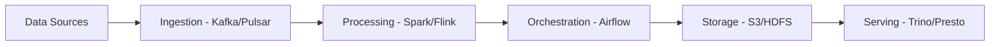

# How to Implement GitOps for Data Pipelines with ArgoCD

Author: [nawazdhandala](https://github.com/nawazdhandala)

Tags: ArgoCD, GitOps, Kubernetes, Data Engineering, DevOps

Description: Learn how to manage data pipeline infrastructure with ArgoCD, covering Apache Spark, Airflow, Kafka, and Flink deployments using GitOps patterns on Kubernetes.

---

Data pipelines are notoriously difficult to manage. They involve multiple components - schedulers, compute engines, message brokers, and storage systems - all of which need to work together. When these components run on Kubernetes, ArgoCD provides a consistent way to deploy, configure, and manage the entire stack through Git.

This guide shows you how to implement GitOps for data pipeline infrastructure using ArgoCD.

## The Data Pipeline Stack

A typical Kubernetes-based data pipeline includes:



Each of these components runs on Kubernetes and can be managed by ArgoCD.

## Repository Structure

```
data-platform-config/
  infrastructure/
    kafka/
      base/
        kafka-cluster.yaml
        kafka-topics.yaml
        kustomization.yaml
      overlays/
        dev/
        production/
    spark/
      base/
        spark-operator.yaml
        kustomization.yaml
    airflow/
      base/
        values.yaml
        kustomization.yaml
      overlays/
        dev/
        production/
    flink/
      base/
        flink-operator.yaml
        kustomization.yaml
  pipelines/
    etl-orders/
      spark-application.yaml
    etl-users/
      spark-application.yaml
    streaming-events/
      flink-job.yaml
  dags/
    configmap.yaml    # Airflow DAGs as ConfigMap
```

## Deploying Apache Kafka with ArgoCD

Use the Strimzi operator to manage Kafka on Kubernetes:

```yaml
# infrastructure/kafka/base/kafka-cluster.yaml
apiVersion: kafka.strimzi.io/v1beta2
kind: Kafka
metadata:
  name: data-platform
spec:
  kafka:
    version: 3.6.1
    replicas: 3
    listeners:
      - name: plain
        port: 9092
        type: internal
        tls: false
      - name: tls
        port: 9093
        type: internal
        tls: true
    config:
      offsets.topic.replication.factor: 3
      transaction.state.log.replication.factor: 3
      transaction.state.log.min.isr: 2
      default.replication.factor: 3
      min.insync.replicas: 2
      log.retention.hours: 168
    storage:
      type: persistent-claim
      size: 500Gi
      class: gp3
    resources:
      requests:
        memory: 4Gi
        cpu: "2"
      limits:
        memory: 8Gi
        cpu: "4"
  zookeeper:
    replicas: 3
    storage:
      type: persistent-claim
      size: 100Gi
      class: gp3
  entityOperator:
    topicOperator: {}
    userOperator: {}
```

Manage Kafka topics declaratively:

```yaml
# infrastructure/kafka/base/kafka-topics.yaml
apiVersion: kafka.strimzi.io/v1beta2
kind: KafkaTopic
metadata:
  name: raw-events
  labels:
    strimzi.io/cluster: data-platform
spec:
  partitions: 12
  replicas: 3
  config:
    retention.ms: "604800000"     # 7 days
    cleanup.policy: delete
    segment.bytes: "1073741824"   # 1GB segments
---
apiVersion: kafka.strimzi.io/v1beta2
kind: KafkaTopic
metadata:
  name: processed-events
  labels:
    strimzi.io/cluster: data-platform
spec:
  partitions: 6
  replicas: 3
  config:
    retention.ms: "2592000000"    # 30 days
    cleanup.policy: compact
```

The ArgoCD Application:

```yaml
apiVersion: argoproj.io/v1alpha1
kind: Application
metadata:
  name: kafka-cluster
  namespace: argocd
  annotations:
    argocd.argoproj.io/sync-wave: "-3"  # Infrastructure deploys first
spec:
  project: data-platform
  source:
    repoURL: https://github.com/your-org/data-platform-config.git
    targetRevision: main
    path: infrastructure/kafka/overlays/production
  destination:
    server: https://kubernetes.default.svc
    namespace: kafka
  syncPolicy:
    automated:
      prune: false      # Never auto-delete Kafka resources
      selfHeal: true
    syncOptions:
      - CreateNamespace=true
      - ServerSideApply=true
```

Notice `prune: false` - you do not want ArgoCD to accidentally delete a Kafka cluster because someone removed a file from Git.

## Deploying Apache Airflow

Use the official Airflow Helm chart managed through ArgoCD:

```yaml
apiVersion: argoproj.io/v1alpha1
kind: Application
metadata:
  name: airflow
  namespace: argocd
  annotations:
    argocd.argoproj.io/sync-wave: "-1"
spec:
  project: data-platform
  source:
    repoURL: https://airflow.apache.org
    chart: airflow
    targetRevision: 1.13.0
    helm:
      values: |
        executor: KubernetesExecutor
        webserver:
          replicas: 2
          resources:
            requests:
              memory: 1Gi
              cpu: 500m
        scheduler:
          replicas: 2
          resources:
            requests:
              memory: 2Gi
              cpu: 1000m
        triggerer:
          replicas: 2
        workers:
          replicas: 0  # KubernetesExecutor - no persistent workers
        postgresql:
          enabled: true
          persistence:
            size: 50Gi
        redis:
          enabled: false  # Not needed with KubernetesExecutor
        dags:
          gitSync:
            enabled: true
            repo: https://github.com/your-org/airflow-dags.git
            branch: main
            subPath: dags
            wait: 60
        config:
          core:
            max_active_runs_per_dag: 3
          kubernetes:
            delete_worker_pods: true
            delete_worker_pods_on_failure: false
  destination:
    server: https://kubernetes.default.svc
    namespace: airflow
  syncPolicy:
    automated:
      prune: true
      selfHeal: true
    syncOptions:
      - CreateNamespace=true
```

## Managing Spark Jobs

Deploy the Spark Operator and manage Spark applications declaratively:

```yaml
# Spark Operator deployment
apiVersion: argoproj.io/v1alpha1
kind: Application
metadata:
  name: spark-operator
  namespace: argocd
  annotations:
    argocd.argoproj.io/sync-wave: "-2"
spec:
  project: data-platform
  source:
    repoURL: https://kubeflow.github.io/spark-operator
    chart: spark-operator
    targetRevision: 2.0.0
    helm:
      values: |
        webhook:
          enable: true
        resources:
          requests:
            memory: 256Mi
            cpu: 100m
  destination:
    server: https://kubernetes.default.svc
    namespace: spark-operator
  syncPolicy:
    automated:
      prune: true
      selfHeal: true
    syncOptions:
      - CreateNamespace=true
```

A Spark application managed through Git:

```yaml
# pipelines/etl-orders/spark-application.yaml
apiVersion: sparkoperator.k8s.io/v1beta2
kind: ScheduledSparkApplication
metadata:
  name: etl-orders
spec:
  schedule: "0 */6 * * *"   # Every 6 hours
  concurrencyPolicy: Forbid
  template:
    type: Python
    pythonVersion: "3"
    mode: cluster
    image: my-registry/spark-etl:v2.1.0
    mainApplicationFile: "local:///app/etl_orders.py"
    arguments:
      - "--date={{ ds }}"
      - "--output=s3a://data-lake/orders/"
    sparkVersion: "3.5.0"
    driver:
      cores: 1
      memory: "2g"
      serviceAccount: spark-sa
    executor:
      cores: 2
      instances: 4
      memory: "4g"
    sparkConf:
      "spark.hadoop.fs.s3a.impl": "org.apache.hadoop.fs.s3a.S3AFileSystem"
      "spark.sql.adaptive.enabled": "true"
      "spark.sql.adaptive.coalescePartitions.enabled": "true"
    dynamicAllocation:
      enabled: true
      initialExecutors: 2
      minExecutors: 2
      maxExecutors: 10
```

## Deploying Flink for Stream Processing

```yaml
# infrastructure/flink/base/flink-job.yaml
apiVersion: flink.apache.org/v1beta1
kind: FlinkDeployment
metadata:
  name: event-processor
spec:
  image: my-registry/flink-jobs:v1.0.0
  flinkVersion: v1_18
  flinkConfiguration:
    taskmanager.numberOfTaskSlots: "2"
    state.backend: rocksdb
    state.checkpoints.dir: s3://flink-checkpoints/event-processor/
    state.savepoints.dir: s3://flink-savepoints/event-processor/
    execution.checkpointing.interval: "60000"
    execution.checkpointing.min-pause: "30000"
  serviceAccount: flink-sa
  jobManager:
    resource:
      memory: "2048m"
      cpu: 1
  taskManager:
    resource:
      memory: "4096m"
      cpu: 2
    replicas: 4
  job:
    jarURI: local:///opt/flink/usrlib/event-processor.jar
    entryClass: com.example.EventProcessor
    parallelism: 4
    upgradeMode: savepoint
    state: running
```

The `upgradeMode: savepoint` ensures that when ArgoCD applies an updated version, Flink takes a savepoint before stopping the old job and restores from it in the new version.

## Handling Data Pipeline Dependencies

Data pipelines have complex dependencies. Use sync waves to order deployments:

```yaml
# Wave -3: Storage and messaging infrastructure
# Kafka, S3 buckets, databases

# Wave -2: Operators
# Spark Operator, Flink Operator, Strimzi Operator

# Wave -1: Platform services
# Airflow, Schema Registry, monitoring

# Wave 0: Pipeline definitions
# SparkApplications, FlinkDeployments, DAGs
```

```yaml
apiVersion: argoproj.io/v1alpha1
kind: Application
metadata:
  name: data-pipelines
  annotations:
    argocd.argoproj.io/sync-wave: "0"
spec:
  project: data-platform
  source:
    repoURL: https://github.com/your-org/data-platform-config.git
    path: pipelines
  destination:
    server: https://kubernetes.default.svc
    namespace: data-pipelines
  syncPolicy:
    automated:
      prune: true
      selfHeal: true
```

## Schema Management

Use a Schema Registry for Kafka schemas, managed through Git:

```yaml
apiVersion: apps/v1
kind: Deployment
metadata:
  name: schema-registry
spec:
  replicas: 2
  selector:
    matchLabels:
      app: schema-registry
  template:
    spec:
      containers:
        - name: schema-registry
          image: confluentinc/cp-schema-registry:7.5.0
          env:
            - name: SCHEMA_REGISTRY_KAFKASTORE_BOOTSTRAP_SERVERS
              value: "data-platform-kafka-bootstrap:9092"
            - name: SCHEMA_REGISTRY_HOST_NAME
              value: "schema-registry"
          ports:
            - containerPort: 8081
          resources:
            requests:
              memory: "512Mi"
              cpu: "250m"
```

## Monitoring Data Pipelines

Deploy monitoring alongside your data infrastructure:

```yaml
apiVersion: monitoring.coreos.com/v1
kind: PrometheusRule
metadata:
  name: data-pipeline-alerts
spec:
  groups:
    - name: kafka-alerts
      rules:
        - alert: KafkaConsumerLag
          expr: kafka_consumergroup_lag_sum > 100000
          for: 15m
          labels:
            severity: warning
          annotations:
            summary: "Consumer group {{ $labels.consumergroup }} has high lag"
    - name: spark-alerts
      rules:
        - alert: SparkJobFailed
          expr: spark_app_status{status="FAILED"} > 0
          for: 1m
          labels:
            severity: critical
          annotations:
            summary: "Spark job {{ $labels.app }} has failed"
```

## Conclusion

GitOps for data pipelines is about managing the infrastructure declaratively while letting the data platform components handle the actual data processing. ArgoCD manages the operators, clusters, and job definitions. The components themselves (Kafka, Spark, Flink, Airflow) handle the data. This separation gives you reproducible infrastructure with the flexibility that data engineering requires.

For comprehensive monitoring of your data pipeline infrastructure, [OneUptime](https://oneuptime.com) provides observability, alerting, and status pages to track the health of your entire data platform alongside ArgoCD.
