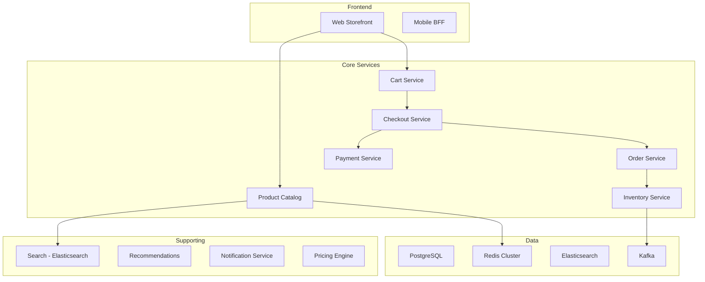

# How to Implement GitOps for E-commerce Platforms with ArgoCD

Author: [nawazdhandala](https://github.com/nawazdhandala)

Tags: ArgoCD, GitOps, Kubernetes, E-commerce, DevOps

Description: Learn how to manage e-commerce platform infrastructure with ArgoCD, covering deployment strategies for sales events, cart and checkout services, payment processing, and traffic spike handling.

---

E-commerce platforms have one critical requirement above all others: availability during peak traffic. Black Friday, flash sales, and holiday seasons generate traffic spikes that can be 10 to 50 times normal volume. A deployment gone wrong during a sale means lost revenue - sometimes millions per hour. ArgoCD's GitOps approach gives you controlled, auditable, and reversible deployments that reduce the risk of outages during these critical periods.

This guide covers GitOps patterns for e-commerce platforms using ArgoCD.

## E-commerce Architecture



## Repository Structure

```
ecommerce-config/
  infrastructure/
    postgresql/
    redis/
    elasticsearch/
    kafka/
    cdn/
  services/
    storefront/
      base/
      overlays/
    product-catalog/
      base/
      overlays/
    cart-service/
      base/
      overlays/
    checkout-service/
      base/
      overlays/
    payment-service/
      base/
      overlays/
    order-service/
      base/
      overlays/
    inventory-service/
      base/
      overlays/
    search-service/
      base/
      overlays/
  scaling/
    normal/
      kustomization.yaml
    peak/
      kustomization.yaml
    black-friday/
      kustomization.yaml
```

## Deploying Core Services

### Cart Service

The cart service must be highly available and fast:

```yaml
apiVersion: apps/v1
kind: Deployment
metadata:
  name: cart-service
spec:
  replicas: 5
  strategy:
    type: RollingUpdate
    rollingUpdate:
      maxSurge: 2
      maxUnavailable: 0
  selector:
    matchLabels:
      app: cart-service
  template:
    metadata:
      labels:
        app: cart-service
    spec:
      topologySpreadConstraints:
        - maxSkew: 1
          topologyKey: topology.kubernetes.io/zone
          whenUnsatisfiable: DoNotSchedule
          labelSelector:
            matchLabels:
              app: cart-service
      containers:
        - name: cart
          image: my-registry/cart-service:v5.3.0
          ports:
            - containerPort: 8080
          env:
            - name: REDIS_URL
              value: "redis://redis-master.redis:6379"
            - name: CART_TTL_HOURS
              value: "72"
            - name: MAX_ITEMS_PER_CART
              value: "100"
          resources:
            requests:
              memory: "256Mi"
              cpu: "250m"
            limits:
              memory: "512Mi"
              cpu: "500m"
          readinessProbe:
            httpGet:
              path: /health/ready
              port: 8080
            periodSeconds: 3
            failureThreshold: 2
          livenessProbe:
            httpGet:
              path: /health/live
              port: 8080
            periodSeconds: 10
```

### Payment Service

Payment services need extra safety:

```yaml
apiVersion: apps/v1
kind: Deployment
metadata:
  name: payment-service
  annotations:
    argocd.argoproj.io/sync-wave: "0"
spec:
  replicas: 3
  strategy:
    type: RollingUpdate
    rollingUpdate:
      maxSurge: 1
      maxUnavailable: 0   # Never have unavailable payment pods
  selector:
    matchLabels:
      app: payment-service
  template:
    metadata:
      labels:
        app: payment-service
    spec:
      terminationGracePeriodSeconds: 120  # Give time for in-flight transactions
      containers:
        - name: payment
          image: my-registry/payment-service:v3.1.0
          ports:
            - containerPort: 8080
          env:
            - name: STRIPE_API_KEY
              valueFrom:
                secretKeyRef:
                  name: payment-secrets
                  key: stripe-api-key
            - name: IDEMPOTENCY_TTL_HOURS
              value: "48"
            - name: TRANSACTION_TIMEOUT_MS
              value: "30000"
          resources:
            requests:
              memory: "512Mi"
              cpu: "500m"
            limits:
              memory: "1Gi"
              cpu: "1000m"
          lifecycle:
            preStop:
              exec:
                command: ["/bin/sh", "-c", "sleep 30"]  # Drain in-flight requests
```

ArgoCD Application for payment service with extra safety:

```yaml
apiVersion: argoproj.io/v1alpha1
kind: Application
metadata:
  name: payment-service
  namespace: argocd
spec:
  project: ecommerce-critical
  source:
    repoURL: https://github.com/your-org/ecommerce-config.git
    targetRevision: main
    path: services/payment-service/overlays/production
  destination:
    server: https://kubernetes.default.svc
    namespace: production
  syncPolicy:
    # No automated sync for payment service - always manual
    syncOptions:
      - ServerSideApply=true
```

## Handling Sales Events and Traffic Spikes

### Pre-Scaling for Known Events

Create scaling profiles that can be activated through Git:

```yaml
# scaling/normal/kustomization.yaml
apiVersion: kustomize.io/v1beta1
kind: Kustomization
patches:
  - target:
      kind: HorizontalPodAutoscaler
      name: cart-service
    patch: |
      - op: replace
        path: /spec/minReplicas
        value: 5
      - op: replace
        path: /spec/maxReplicas
        value: 20
  - target:
      kind: HorizontalPodAutoscaler
      name: checkout-service
    patch: |
      - op: replace
        path: /spec/minReplicas
        value: 3
      - op: replace
        path: /spec/maxReplicas
        value: 15

---
# scaling/black-friday/kustomization.yaml
apiVersion: kustomize.io/v1beta1
kind: Kustomization
patches:
  - target:
      kind: HorizontalPodAutoscaler
      name: cart-service
    patch: |
      - op: replace
        path: /spec/minReplicas
        value: 50     # 10x normal minimum
      - op: replace
        path: /spec/maxReplicas
        value: 200
  - target:
      kind: HorizontalPodAutoscaler
      name: checkout-service
    patch: |
      - op: replace
        path: /spec/minReplicas
        value: 30
      - op: replace
        path: /spec/maxReplicas
        value: 150
```

To activate Black Friday scaling:

```bash
# In the production overlay's kustomization.yaml, switch to black-friday scaling
# Update reference from scaling/normal to scaling/black-friday
git commit -m "Activate Black Friday scaling profile"
git push
# ArgoCD scales up to the new minimums
```

### Deployment Freezes

Use ArgoCD sync windows to prevent deployments during critical sales periods:

```yaml
apiVersion: argoproj.io/v1alpha1
kind: AppProject
metadata:
  name: ecommerce-critical
  namespace: argocd
spec:
  syncWindows:
    # Block all syncs during Black Friday weekend
    - kind: deny
      schedule: "0 0 25 11 *"     # Nov 25
      duration: 96h                 # 4 days
      applications:
        - "*"
      timeZone: "America/New_York"
    # Allow emergency patches during the freeze
    - kind: allow
      schedule: "0 0 25 11 *"
      duration: 96h
      applications:
        - "hotfix-*"
      manualSync: true
  sourceRepos:
    - "https://github.com/your-org/ecommerce-config.git"
  destinations:
    - namespace: production
      server: https://kubernetes.default.svc
```

## Inventory Service with Real-Time Updates

```yaml
apiVersion: apps/v1
kind: Deployment
metadata:
  name: inventory-service
spec:
  replicas: 5
  selector:
    matchLabels:
      app: inventory
  template:
    spec:
      containers:
        - name: inventory
          image: my-registry/inventory-service:v2.8.0
          ports:
            - containerPort: 8080
            - containerPort: 50051    # gRPC for real-time stock updates
          env:
            - name: DATABASE_URL
              valueFrom:
                secretKeyRef:
                  name: db-credentials
                  key: url
            - name: KAFKA_BROKERS
              value: "kafka-bootstrap.kafka:9092"
            - name: STOCK_CHECK_CACHE_TTL
              value: "5"   # 5-second cache for stock checks
          resources:
            requests:
              memory: "512Mi"
              cpu: "500m"
```

## Search and Product Catalog

```yaml
# Elasticsearch managed by ArgoCD
apiVersion: elasticsearch.k8s.elastic.co/v1
kind: Elasticsearch
metadata:
  name: product-search
  annotations:
    argocd.argoproj.io/sync-wave: "-2"
spec:
  version: 8.12.0
  nodeSets:
    - name: data
      count: 3
      config:
        node.store.allow_mmap: false
      volumeClaimTemplates:
        - metadata:
            name: elasticsearch-data
          spec:
            accessModes:
              - ReadWriteOnce
            resources:
              requests:
                storage: 100Gi
            storageClassName: gp3
      podTemplate:
        spec:
          containers:
            - name: elasticsearch
              resources:
                requests:
                  memory: 4Gi
                  cpu: 2
                limits:
                  memory: 4Gi
```

## Progressive Delivery for E-commerce

Use Argo Rollouts for canary deployments on critical services:

```yaml
apiVersion: argoproj.io/v1alpha1
kind: Rollout
metadata:
  name: storefront
spec:
  replicas: 10
  strategy:
    canary:
      canaryService: storefront-canary
      stableService: storefront-stable
      trafficRouting:
        nginx:
          stableIngress: storefront-ingress
      steps:
        - setWeight: 5
        - pause: {duration: 5m}
        - analysis:
            templates:
              - templateName: ecommerce-success-rate
        - setWeight: 20
        - pause: {duration: 10m}
        - analysis:
            templates:
              - templateName: ecommerce-success-rate
        - setWeight: 50
        - pause: {duration: 10m}
        - setWeight: 100
  selector:
    matchLabels:
      app: storefront
  template:
    metadata:
      labels:
        app: storefront
    spec:
      containers:
        - name: storefront
          image: my-registry/storefront:v8.1.0
```

The analysis template checks e-commerce-specific metrics:

```yaml
apiVersion: argoproj.io/v1alpha1
kind: AnalysisTemplate
metadata:
  name: ecommerce-success-rate
spec:
  metrics:
    - name: checkout-success-rate
      interval: 2m
      successCondition: result[0] >= 0.98  # 98% checkout success
      provider:
        prometheus:
          address: http://prometheus.monitoring:9090
          query: |
            sum(rate(checkout_completed_total[5m]))
            / sum(rate(checkout_initiated_total[5m]))
    - name: error-rate
      interval: 2m
      successCondition: result[0] <= 0.01  # Less than 1% errors
      provider:
        prometheus:
          address: http://prometheus.monitoring:9090
          query: |
            sum(rate(http_requests_total{status=~"5.."}[5m]))
            / sum(rate(http_requests_total[5m]))
    - name: latency-p99
      interval: 2m
      successCondition: result[0] <= 0.5  # p99 under 500ms
      provider:
        prometheus:
          address: http://prometheus.monitoring:9090
          query: |
            histogram_quantile(0.99,
              sum(rate(http_request_duration_seconds_bucket[5m])) by (le)
            )
```

## Monitoring E-commerce Health

```yaml
apiVersion: monitoring.coreos.com/v1
kind: PrometheusRule
metadata:
  name: ecommerce-alerts
spec:
  groups:
    - name: ecommerce-critical
      rules:
        - alert: CheckoutFailureRate
          expr: |
            1 - (sum(rate(checkout_completed_total[5m]))
            / sum(rate(checkout_initiated_total[5m]))) > 0.05
          for: 2m
          labels:
            severity: critical
          annotations:
            summary: "Checkout failure rate above 5%"

        - alert: PaymentServiceDown
          expr: up{job="payment-service"} == 0
          for: 30s
          labels:
            severity: critical

        - alert: CartServiceLatency
          expr: |
            histogram_quantile(0.95,
              rate(http_request_duration_seconds_bucket{service="cart"}[5m])
            ) > 1
          for: 3m
          labels:
            severity: warning
          annotations:
            summary: "Cart service p95 latency above 1 second"
```

## Conclusion

E-commerce platforms need GitOps for the same reason they need everything else: reliability and control. ArgoCD gives you deployment freezes during sales events, scaling profiles you can switch with a Git commit, progressive delivery for risk reduction, and a complete audit trail of every change. The most important pattern is separating critical services (payment, checkout) from non-critical ones and giving them different sync policies. Payment should always be manual sync. Storefront can be automated with canary analysis.

For monitoring your e-commerce platform's health, conversion rates, and availability during peak traffic, [OneUptime](https://oneuptime.com) provides real-time observability and status pages.
