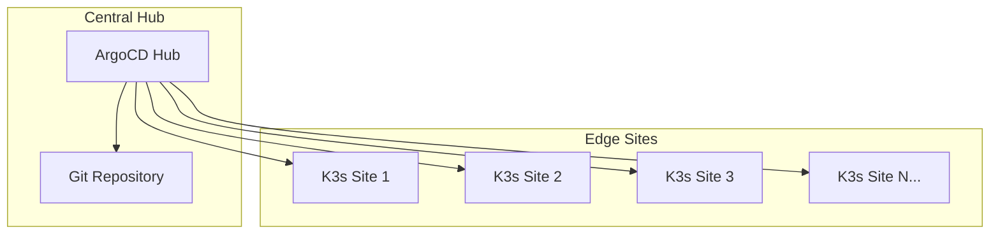

# How to Implement GitOps for Edge and IoT Deployments with ArgoCD

Author: [nawazdhandala](https://github.com/nawazdhandala)

Tags: ArgoCD, GitOps, Kubernetes, IoT, Edge Computing

Description: Learn how to manage edge and IoT Kubernetes deployments with ArgoCD, covering lightweight clusters, intermittent connectivity, fleet management, and multi-site deployment patterns.

---

Edge and IoT environments are among the hardest places to run Kubernetes. Clusters are small, connectivity is unreliable, and you might have hundreds or thousands of sites to manage. ArgoCD, combined with lightweight Kubernetes distributions, gives you a centralized way to manage all of these edge deployments from a single control plane.

This guide covers the patterns for implementing GitOps at the edge with ArgoCD.

## The Edge Architecture Challenge

Edge deployments differ from cloud deployments in several ways:

- **Limited resources** - Edge nodes may have 2 to 8 GB of RAM and 2 to 4 CPU cores
- **Intermittent connectivity** - Network links to the central site may be unreliable
- **Large fleet** - You might manage 10, 100, or 1000+ edge sites
- **Physical access is limited** - You cannot SSH in and fix things easily
- **Diverse hardware** - ARM, x86, different storage options



## Choosing a Lightweight Kubernetes for Edge

For edge sites, use lightweight Kubernetes distributions:

| Distribution | Memory Usage | Best For |
|---|---|---|
| K3s | ~512MB | General edge, IoT gateways |
| MicroK8s | ~540MB | Ubuntu-based edge devices |
| K0s | ~500MB | Minimal, single-binary |
| KubeEdge | Varies | Very constrained devices |

K3s is the most popular choice for ArgoCD-managed edge deployments.

## Hub-Spoke Architecture

The recommended pattern is a hub-spoke model:

- **Hub cluster**: Runs ArgoCD, monitoring, and management tools (in the cloud or a data center)
- **Spoke clusters**: Lightweight K3s clusters at each edge site

### Setting Up the Hub

Install ArgoCD on your central hub cluster:

```bash
kubectl create namespace argocd
kubectl apply -n argocd -f https://raw.githubusercontent.com/argoproj/argo-cd/stable/manifests/ha/install.yaml
```

Use the HA installation for the hub since it manages all your edge sites.

### Registering Edge Clusters

Each edge cluster needs to be registered with the hub ArgoCD:

```bash
# Option 1: Using argocd CLI (requires direct network access)
argocd cluster add edge-site-001 --kubeconfig /path/to/edge-site-001-kubeconfig

# Option 2: Declaratively via Secret (better for automation)
```

For edge sites with intermittent connectivity, use the declarative cluster secret approach:

```yaml
apiVersion: v1
kind: Secret
metadata:
  name: edge-site-001
  namespace: argocd
  labels:
    argocd.argoproj.io/secret-type: cluster
type: Opaque
stringData:
  name: edge-site-001
  server: https://edge-001.example.com:6443
  config: |
    {
      "bearerToken": "<service-account-token>",
      "tlsClientConfig": {
        "insecure": false,
        "caData": "<base64-ca-cert>"
      }
    }
```

## Fleet Management with ApplicationSets

With hundreds of edge sites, you need ApplicationSets to manage deployments at scale:

```yaml
apiVersion: argoproj.io/v1alpha1
kind: ApplicationSet
metadata:
  name: edge-monitoring-agent
  namespace: argocd
spec:
  generators:
    - clusters:
        selector:
          matchLabels:
            site-type: edge
  template:
    metadata:
      name: "monitoring-{{name}}"
    spec:
      project: edge-sites
      source:
        repoURL: https://github.com/your-org/edge-config.git
        targetRevision: main
        path: apps/monitoring-agent/overlays/edge
      destination:
        server: "{{server}}"
        namespace: monitoring
      syncPolicy:
        automated:
          prune: true
          selfHeal: true
        syncOptions:
          - CreateNamespace=true
        retry:
          limit: 5
          backoff:
            duration: 30s
            factor: 2
            maxDuration: 10m
```

This deploys a monitoring agent to every cluster labeled with `site-type: edge`.

### Site-Specific Configuration

Different edge sites may need different configurations. Use cluster labels and the `values` field:

```yaml
apiVersion: v1
kind: Secret
metadata:
  name: edge-site-warehouse-nyc
  namespace: argocd
  labels:
    argocd.argoproj.io/secret-type: cluster
    site-type: edge
    region: us-east
    facility-type: warehouse
type: Opaque
stringData:
  name: warehouse-nyc
  server: https://warehouse-nyc.example.com:6443
  config: |
    {"bearerToken": "..."}
```

```yaml
apiVersion: argoproj.io/v1alpha1
kind: ApplicationSet
metadata:
  name: edge-apps
  namespace: argocd
spec:
  generators:
    - clusters:
        selector:
          matchLabels:
            site-type: edge
        values:
          facility: "{{metadata.labels.facility-type}}"
          region: "{{metadata.labels.region}}"
  template:
    metadata:
      name: "edge-app-{{name}}"
    spec:
      project: edge-sites
      source:
        repoURL: https://github.com/your-org/edge-config.git
        targetRevision: main
        path: "apps/edge-gateway/overlays/{{values.facility}}"
      destination:
        server: "{{server}}"
        namespace: edge-apps
```

## Handling Intermittent Connectivity

Edge sites may lose connectivity to the hub. ArgoCD handles this gracefully:

- **During disconnection**: The edge cluster continues running its current workloads. ArgoCD on the hub will show the cluster as unreachable but will not delete anything.
- **On reconnection**: ArgoCD reconciles and applies any pending changes.

Configure ArgoCD for connectivity issues:

```yaml
apiVersion: v1
kind: ConfigMap
metadata:
  name: argocd-cm
  namespace: argocd
data:
  # Increase timeout for slow edge connections
  timeout.reconciliation: 300s

  # Increase connection timeout for edge clusters
  server.connection.timeout: 60s
```

For the ArgoCD Application, configure generous retry policies:

```yaml
syncPolicy:
  retry:
    limit: 10
    backoff:
      duration: 1m
      factor: 2
      maxDuration: 30m
```

## Edge-Optimized Manifests

Edge deployments need resource-conscious manifests:

```yaml
apiVersion: apps/v1
kind: Deployment
metadata:
  name: edge-gateway
spec:
  replicas: 1   # Single replica on edge - no HA luxury
  selector:
    matchLabels:
      app: edge-gateway
  template:
    spec:
      containers:
        - name: gateway
          image: my-registry/edge-gateway:v1.0.0-arm64  # ARM-specific image
          resources:
            requests:
              memory: "64Mi"
              cpu: "50m"
            limits:
              memory: "128Mi"
              cpu: "200m"
          env:
            - name: BUFFER_SIZE
              value: "1000"      # Small buffer for limited memory
            - name: SYNC_INTERVAL
              value: "300"       # Sync every 5 min to save bandwidth
            - name: OFFLINE_QUEUE_SIZE
              value: "10000"     # Queue messages when offline
```

## Multi-Architecture Support

Edge devices may use ARM or x86. Use multi-arch images:

```yaml
# In your CI pipeline, build multi-arch images
# docker buildx build --platform linux/amd64,linux/arm64 -t my-registry/edge-gateway:v1.0.0 --push .

# In Kustomize, you can patch per architecture
# overlays/edge-arm64/kustomization.yaml
apiVersion: kustomize.io/v1beta1
kind: Kustomization
resources:
  - ../../base
patches:
  - target:
      kind: Deployment
      name: edge-gateway
    patch: |
      - op: add
        path: /spec/template/spec/nodeSelector
        value:
          kubernetes.io/arch: arm64
```

## Progressive Edge Rollouts

Never update all edge sites at once. Use a staged rollout:

```yaml
# Stage 1: Canary sites (5% of fleet)
apiVersion: argoproj.io/v1alpha1
kind: ApplicationSet
metadata:
  name: edge-app-canary
spec:
  generators:
    - clusters:
        selector:
          matchLabels:
            site-type: edge
            rollout-group: canary
  template:
    spec:
      source:
        targetRevision: v2.0.0    # New version
      # ...

---
# Stage 2: Early adopters (25% of fleet)
apiVersion: argoproj.io/v1alpha1
kind: ApplicationSet
metadata:
  name: edge-app-early
spec:
  generators:
    - clusters:
        selector:
          matchLabels:
            site-type: edge
            rollout-group: early-adopter
  template:
    spec:
      source:
        targetRevision: v1.9.0    # Previous stable
      # ...

---
# Stage 3: General availability (remaining 70%)
apiVersion: argoproj.io/v1alpha1
kind: ApplicationSet
metadata:
  name: edge-app-ga
spec:
  generators:
    - clusters:
        selector:
          matchLabels:
            site-type: edge
            rollout-group: ga
  template:
    spec:
      source:
        targetRevision: v1.9.0    # Previous stable until canary is validated
```

To promote a new version across the fleet:
1. Update canary ApplicationSet to new version
2. Wait 24 to 48 hours, validate metrics
3. Update early-adopter ApplicationSet
4. Wait 24 to 48 hours
5. Update GA ApplicationSet

## Local Data Persistence

Edge devices often need local storage for data buffering:

```yaml
apiVersion: v1
kind: PersistentVolumeClaim
metadata:
  name: edge-data-buffer
spec:
  accessModes:
    - ReadWriteOnce
  storageClassName: local-path  # K3s default local storage
  resources:
    requests:
      storage: 10Gi
```

## Conclusion

GitOps for edge and IoT with ArgoCD is about managing a fleet of lightweight clusters from a central hub. The patterns - ApplicationSets for fleet management, cluster labels for site-specific config, staged rollouts for safety, and generous retry policies for intermittent connectivity - give you the control you need over distributed infrastructure. The key is treating each edge site as just another cluster in ArgoCD and letting the declarative model handle the complexity.

For monitoring your edge fleet's health and connectivity, [OneUptime](https://oneuptime.com) provides distributed monitoring with alerting that works across hub and edge sites.
