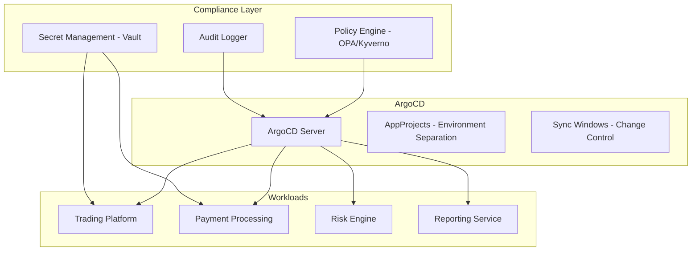
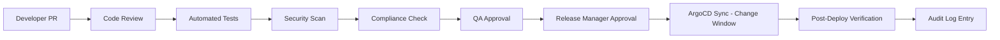

# How to Implement GitOps for Financial Services with ArgoCD

Author: [nawazdhandala](https://github.com/nawazdhandala)

Tags: ArgoCD, GitOps, Kubernetes, Financial Services, Compliance

Description: Learn how to implement GitOps with ArgoCD for financial services, covering regulatory compliance, audit trails, change management, segregation of duties, and secure deployment patterns.

---

Financial services operate under strict regulatory requirements. Every deployment must be auditable, every change must be approved, and segregation of duties must be enforced. These requirements make ArgoCD's GitOps model a natural fit - Git provides an immutable audit log, pull requests enforce approval workflows, and RBAC ensures only authorized personnel can deploy to production.

This guide covers how to implement ArgoCD for financial services workloads while meeting compliance requirements.

## Regulatory Context

Financial services deployments must comply with:

- **SOX (Sarbanes-Oxley)** - Requires segregation of duties and change management controls
- **PCI DSS** - Requires access controls, audit logs, and change management for payment systems
- **SOC 2** - Requires documented change management and monitoring
- **GDPR/CCPA** - Requires data protection controls
- **Basel III/IV** - Risk management frameworks for banking

ArgoCD helps meet these requirements through:
- Git as an immutable audit trail (who changed what, when, why)
- Pull request approvals for segregation of duties
- RBAC for access control
- Sync windows for change management
- Automated compliance policy enforcement

## Architecture for Financial Services



## Strict RBAC Configuration

Financial services need strict separation between development, QA, and production:

```yaml
apiVersion: v1
kind: ConfigMap
metadata:
  name: argocd-rbac-cm
  namespace: argocd
data:
  policy.default: ""   # No default access - deny all
  policy.csv: |
    # Developers: can view all, sync only in dev
    p, role:developer, applications, get, */*, allow
    p, role:developer, applications, sync, dev/*, allow
    p, role:developer, logs, get, */*, allow

    # QA Engineers: can sync staging
    p, role:qa, applications, get, */*, allow
    p, role:qa, applications, sync, staging/*, allow
    p, role:qa, logs, get, */*, allow

    # Release Managers: can sync production (after approval)
    p, role:release-manager, applications, get, */*, allow
    p, role:release-manager, applications, sync, production/*, allow
    p, role:release-manager, applications, override, production/*, allow
    p, role:release-manager, logs, get, */*, allow

    # Platform Engineers: full access
    p, role:platform, *, *, */*, allow

    # Auditors: read-only access to everything
    p, role:auditor, applications, get, */*, allow
    p, role:auditor, logs, get, */*, allow
    p, role:auditor, repositories, get, *, allow
    p, role:auditor, clusters, get, *, allow
    p, role:auditor, projects, get, *, allow

    # Group mappings from SSO
    g, finance-dev-team, role:developer
    g, finance-qa-team, role:qa
    g, finance-release-team, role:release-manager
    g, platform-engineering, role:platform
    g, internal-audit, role:auditor
```

## AppProject Configuration with Strict Boundaries

```yaml
apiVersion: argoproj.io/v1alpha1
kind: AppProject
metadata:
  name: production
  namespace: argocd
spec:
  description: Production financial services
  sourceRepos:
    - "https://github.com/your-org/finserv-config.git"
  destinations:
    - namespace: "prod-*"
      server: https://production-cluster.internal
  # Restrict what resources can be created
  clusterResourceWhitelist:
    - group: ""
      kind: Namespace
  namespaceResourceWhitelist:
    - group: "apps"
      kind: Deployment
    - group: ""
      kind: Service
    - group: ""
      kind: ConfigMap
    - group: "networking.k8s.io"
      kind: Ingress
    - group: "networking.k8s.io"
      kind: NetworkPolicy
  # Block dangerous resources
  namespaceResourceBlacklist:
    - group: ""
      kind: ResourceQuota    # Only platform team can change quotas
    - group: "rbac.authorization.k8s.io"
      kind: Role             # RBAC changes need separate process

  # Change windows - production changes only during business hours
  syncWindows:
    - kind: allow
      schedule: "0 6 * * 1-5"    # Mon-Fri 6am
      duration: 12h               # Until 6pm
      timeZone: "America/New_York"
      applications:
        - "*"
    # Emergency window - requires manual sync
    - kind: allow
      schedule: "* * * * *"       # Always
      duration: 24h
      applications:
        - "hotfix-*"
      manualSync: true
    # Block all other times
    - kind: deny
      schedule: "0 18 * * 1-5"   # Weekday evenings
      duration: 12h
      applications:
        - "*"
    - kind: deny
      schedule: "0 0 * * 0,6"    # Weekends
      duration: 48h
      applications:
        - "*"
```

## Audit Trail and Compliance Logging

ArgoCD provides audit logs by default. Enhance them with structured logging:

```yaml
apiVersion: v1
kind: ConfigMap
metadata:
  name: argocd-cm
  namespace: argocd
data:
  # Enable audit logging
  server.log.level: info

  # Configure notifications for audit trail
  url: https://argocd.finserv.internal
```

Set up a dedicated audit notification service:

```yaml
apiVersion: v1
kind: ConfigMap
metadata:
  name: argocd-notifications-cm
  namespace: argocd
data:
  service.webhook.audit-log: |
    url: https://audit-service.internal/api/v1/events
    headers:
      - name: Authorization
        value: Bearer $audit-token
      - name: Content-Type
        value: application/json

  trigger.on-any-change: |
    - when: "true"
      send: [audit-event]

  template.audit-event: |
    webhook:
      audit-log:
        method: POST
        body: |
          {
            "timestamp": "{{.app.status.operationState.finishedAt}}",
            "application": "{{.app.metadata.name}}",
            "project": "{{.app.spec.project}}",
            "action": "{{.app.status.operationState.operation.sync.revision}}",
            "initiator": "{{.app.status.operationState.operation.initiatedBy.username}}",
            "status": "{{.app.status.operationState.phase}}",
            "sync_status": "{{.app.status.sync.status}}",
            "health_status": "{{.app.status.health.status}}",
            "revision": "{{.app.status.sync.revision}}",
            "cluster": "{{.app.spec.destination.server}}",
            "namespace": "{{.app.spec.destination.namespace}}"
          }
```

## Policy Enforcement with OPA/Kyverno

Use policy engines to enforce compliance rules:

```yaml
# Kyverno policy: All deployments must have resource limits
apiVersion: kyverno.io/v1
kind: ClusterPolicy
metadata:
  name: require-resource-limits
spec:
  validationFailureAction: Enforce
  rules:
    - name: check-resource-limits
      match:
        resources:
          kinds:
            - Deployment
      validate:
        message: "All containers must have resource limits defined (compliance requirement)"
        pattern:
          spec:
            template:
              spec:
                containers:
                  - resources:
                      limits:
                        memory: "?*"
                        cpu: "?*"

---
# Kyverno policy: Images must come from approved registries
apiVersion: kyverno.io/v1
kind: ClusterPolicy
metadata:
  name: approved-registries-only
spec:
  validationFailureAction: Enforce
  rules:
    - name: check-registry
      match:
        resources:
          kinds:
            - Pod
      validate:
        message: "Images must come from approved registries"
        pattern:
          spec:
            containers:
              - image: "approved-registry.internal/*"

---
# Kyverno policy: All pods must have security context
apiVersion: kyverno.io/v1
kind: ClusterPolicy
metadata:
  name: require-security-context
spec:
  validationFailureAction: Enforce
  rules:
    - name: check-security-context
      match:
        resources:
          kinds:
            - Pod
      validate:
        message: "Pods must run as non-root (compliance requirement)"
        pattern:
          spec:
            containers:
              - securityContext:
                  runAsNonRoot: true
                  allowPrivilegeEscalation: false
```

## Secrets Management with Vault

Financial services must never store secrets in Git. Use HashiCorp Vault:

```yaml
# External Secrets Operator pulling from Vault
apiVersion: external-secrets.io/v1beta1
kind: ExternalSecret
metadata:
  name: trading-platform-secrets
  namespace: prod-trading
spec:
  refreshInterval: 5m
  secretStoreRef:
    name: vault-backend
    kind: ClusterSecretStore
  target:
    name: trading-platform-secrets
    template:
      type: Opaque
  data:
    - secretKey: DATABASE_URL
      remoteRef:
        key: secret/data/prod/trading/database
        property: url
    - secretKey: API_KEY
      remoteRef:
        key: secret/data/prod/trading/api
        property: key
    - secretKey: ENCRYPTION_KEY
      remoteRef:
        key: secret/data/prod/trading/encryption
        property: key
```

## Deployment Workflow for Financial Services



Enforce this workflow through branch protection rules and ArgoCD configuration:

```yaml
# Production application - no auto-sync, manual only
apiVersion: argoproj.io/v1alpha1
kind: Application
metadata:
  name: trading-platform
  namespace: argocd
spec:
  project: production
  source:
    repoURL: https://github.com/your-org/finserv-config.git
    targetRevision: main
    path: services/trading-platform/overlays/production
  destination:
    server: https://production-cluster.internal
    namespace: prod-trading
  syncPolicy:
    # NO automated sync - production requires manual trigger
    syncOptions:
      - ServerSideApply=true
      - Validate=true
      - PruneLast=true
```

## Network Segmentation

Financial workloads need strict network policies:

```yaml
apiVersion: networking.k8s.io/v1
kind: NetworkPolicy
metadata:
  name: trading-platform-netpol
  namespace: prod-trading
spec:
  podSelector:
    matchLabels:
      app: trading-platform
  policyTypes:
    - Ingress
    - Egress
  ingress:
    - from:
        - namespaceSelector:
            matchLabels:
              name: prod-api-gateway
      ports:
        - port: 8080
          protocol: TCP
  egress:
    - to:
        - namespaceSelector:
            matchLabels:
              name: prod-database
      ports:
        - port: 5432
          protocol: TCP
    - to:
        - namespaceSelector:
            matchLabels:
              name: prod-cache
      ports:
        - port: 6379
          protocol: TCP
    # Block all other egress
```

## Disaster Recovery

Financial services need documented DR procedures:

```yaml
# DR Application - points to DR cluster
apiVersion: argoproj.io/v1alpha1
kind: Application
metadata:
  name: trading-platform-dr
  namespace: argocd
  annotations:
    purpose: disaster-recovery
spec:
  project: production-dr
  source:
    repoURL: https://github.com/your-org/finserv-config.git
    targetRevision: main
    path: services/trading-platform/overlays/production
  destination:
    server: https://dr-cluster.internal   # DR cluster
    namespace: prod-trading
  syncPolicy:
    automated:
      selfHeal: true
      # Keep DR in sync automatically
    syncOptions:
      - CreateNamespace=true
```

## Conclusion

Financial services and GitOps are a natural match because both demand strong controls, auditability, and process rigor. ArgoCD's RBAC, sync windows, and Git-based audit trail satisfy the core compliance requirements. The key is configuring strict AppProjects, enforcing policy through OPA or Kyverno, using Vault for secrets, and never enabling automated sync for production without proper change windows. Every deployment must be traceable back to a Git commit, a pull request, and an approval.

For monitoring financial services application health and compliance status, [OneUptime](https://oneuptime.com) provides enterprise-grade observability, alerting, and status pages with audit-ready logging.
