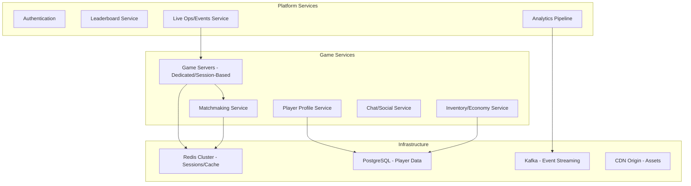

# How to Implement GitOps for Gaming Backend Infrastructure with ArgoCD

Author: [nawazdhandala](https://github.com/nawazdhandala)

Tags: ArgoCD, GitOps, Kubernetes, Gaming, DevOps

Description: Learn how to manage gaming backend infrastructure with ArgoCD, covering game server deployments, matchmaking services, live ops updates, and auto-scaling patterns for player traffic.

---

Gaming backends face unique infrastructure challenges. Player counts spike unpredictably, game servers need dedicated resources, live events require rapid deployment, and downtime means lost revenue and angry players. ArgoCD brings order to this chaos by managing your entire gaming backend through Git.

This guide covers how to implement GitOps for gaming infrastructure on Kubernetes.

## Gaming Backend Architecture

A typical gaming backend on Kubernetes includes:



ArgoCD manages all of these components declaratively through Git.

## Repository Structure

```
gaming-platform-config/
  infrastructure/
    redis/
      base/
      overlays/
        dev/
        production/
    postgresql/
      base/
      overlays/
    kafka/
      base/
      overlays/
  services/
    matchmaking/
      base/
      overlays/
    player-profile/
      base/
      overlays/
    inventory/
      base/
      overlays/
    live-ops/
      base/
      overlays/
  game-servers/
    fps-shooter/
      base/
      overlays/
    battle-royale/
      base/
      overlays/
  events/
    seasonal/
      winter-event.yaml
    tournaments/
      weekend-tournament.yaml
```

## Deploying Game Servers

Game servers are different from typical web services. They often need:
- Dedicated CPU and memory per instance
- Specific port ranges for player connections
- Fast scaling to match player demand
- Graceful shutdown to avoid kicking players mid-game

Using Agones (the Kubernetes game server framework) with ArgoCD:

```yaml
# Install Agones via ArgoCD
apiVersion: argoproj.io/v1alpha1
kind: Application
metadata:
  name: agones
  namespace: argocd
  annotations:
    argocd.argoproj.io/sync-wave: "-2"
spec:
  project: gaming-platform
  source:
    repoURL: https://agones.dev/chart/stable
    chart: agones
    targetRevision: 1.38.0
    helm:
      values: |
        agones:
          allocator:
            replicas: 3
          controller:
            resources:
              requests:
                memory: 256Mi
                cpu: 100m
        gameservers:
          namespaces:
            - game-servers
  destination:
    server: https://kubernetes.default.svc
    namespace: agones-system
  syncPolicy:
    automated:
      prune: true
      selfHeal: true
    syncOptions:
      - CreateNamespace=true
```

Define a Fleet (pool of game servers):

```yaml
# game-servers/fps-shooter/base/fleet.yaml
apiVersion: agones.dev/v1
kind: Fleet
metadata:
  name: fps-shooter
spec:
  replicas: 10     # Minimum warm servers ready for players
  scheduling: Packed  # Pack onto fewer nodes to save cost
  strategy:
    type: RollingUpdate
    rollingUpdate:
      maxSurge: "25%"
      maxUnavailable: "25%"
  template:
    spec:
      ports:
        - name: game
          containerPort: 7777
          protocol: UDP
      health:
        initialDelaySeconds: 30
        periodSeconds: 10
      template:
        spec:
          containers:
            - name: game-server
              image: my-registry/fps-shooter-server:v2.5.0
              resources:
                requests:
                  memory: "2Gi"
                  cpu: "2000m"
                limits:
                  memory: "4Gi"
                  cpu: "4000m"
              env:
                - name: MAX_PLAYERS
                  value: "64"
                - name: TICK_RATE
                  value: "128"
                - name: MAP_ROTATION
                  value: "dust2,inferno,mirage,nuke"
```

Configure auto-scaling based on player demand:

```yaml
apiVersion: autoscaling.agones.dev/v1
kind: FleetAutoscaler
metadata:
  name: fps-shooter-autoscaler
spec:
  fleetName: fps-shooter
  policy:
    type: Buffer
    buffer:
      bufferSize: 5       # Always keep 5 servers ready
      minReplicas: 10
      maxReplicas: 100
```

## Matchmaking Service

```yaml
apiVersion: apps/v1
kind: Deployment
metadata:
  name: matchmaking
spec:
  replicas: 3
  selector:
    matchLabels:
      app: matchmaking
  template:
    metadata:
      labels:
        app: matchmaking
    spec:
      containers:
        - name: matchmaker
          image: my-registry/matchmaking:v1.3.0
          ports:
            - containerPort: 8080
              name: http
            - containerPort: 50051
              name: grpc
          env:
            - name: REDIS_URL
              value: "redis://redis-master.redis:6379"
            - name: AGONES_ALLOCATOR_URL
              value: "agones-allocator.agones-system:443"
            - name: MATCH_TIMEOUT
              value: "60"
            - name: MIN_PLAYERS
              value: "8"
            - name: MAX_PLAYERS
              value: "64"
            - name: SKILL_RANGE
              value: "200"
          resources:
            requests:
              memory: "512Mi"
              cpu: "500m"
          readinessProbe:
            grpc:
              port: 50051
            periodSeconds: 5
---
apiVersion: autoscaling/v2
kind: HorizontalPodAutoscaler
metadata:
  name: matchmaking
spec:
  scaleTargetRef:
    apiVersion: apps/v1
    kind: Deployment
    name: matchmaking
  minReplicas: 3
  maxReplicas: 20
  metrics:
    - type: Pods
      pods:
        metric:
          name: matchmaking_queue_depth
        target:
          type: AverageValue
          averageValue: "100"
```

## Live Ops and Events

Gaming platforms need to push live events rapidly. Use ArgoCD with feature flags:

```yaml
# events/seasonal/winter-event.yaml
apiVersion: v1
kind: ConfigMap
metadata:
  name: live-events
  annotations:
    argocd.argoproj.io/sync-wave: "1"
data:
  events.json: |
    {
      "active_events": [
        {
          "id": "winter-2026",
          "name": "Winter Wonderland",
          "start": "2026-12-15T00:00:00Z",
          "end": "2027-01-05T00:00:00Z",
          "config": {
            "snow_map_enabled": true,
            "special_loot_table": "winter_2026",
            "xp_multiplier": 2.0,
            "seasonal_shop_items": [
              "ice_sword",
              "snow_armor",
              "frost_mount"
            ]
          }
        }
      ]
    }
```

For rapid event deployment, use a separate ArgoCD Application with faster sync:

```yaml
apiVersion: argoproj.io/v1alpha1
kind: Application
metadata:
  name: live-events
  namespace: argocd
spec:
  project: gaming-platform
  source:
    repoURL: https://github.com/your-org/gaming-platform-config.git
    targetRevision: main
    path: events
  destination:
    server: https://kubernetes.default.svc
    namespace: game-services
  syncPolicy:
    automated:
      prune: true
      selfHeal: true
```

## Handling Game Updates

Game updates need careful rollout to avoid disrupting active sessions:

```yaml
apiVersion: argoproj.io/v1alpha1
kind: Application
metadata:
  name: fps-shooter-servers
  namespace: argocd
spec:
  project: gaming-platform
  source:
    repoURL: https://github.com/your-org/gaming-platform-config.git
    targetRevision: main
    path: game-servers/fps-shooter/overlays/production
  destination:
    server: https://kubernetes.default.svc
    namespace: game-servers
  syncPolicy:
    automated:
      prune: false    # Never auto-delete game servers
      selfHeal: true
    syncOptions:
      - RespectIgnoreDifferences=true
```

The Agones Fleet rolling update handles this correctly - it only replaces servers that are in a "Ready" state (not currently hosting a game). Active game sessions finish naturally before those servers are replaced.

## Multi-Region Deployment

Games need low latency, which means multi-region deployment:

```yaml
apiVersion: argoproj.io/v1alpha1
kind: ApplicationSet
metadata:
  name: game-servers-global
  namespace: argocd
spec:
  generators:
    - clusters:
        selector:
          matchLabels:
            tier: game-region
        values:
          region: "{{metadata.labels.region}}"
  template:
    metadata:
      name: "game-servers-{{name}}"
    spec:
      project: gaming-platform
      source:
        repoURL: https://github.com/your-org/gaming-platform-config.git
        targetRevision: main
        path: "game-servers/fps-shooter/overlays/{{values.region}}"
      destination:
        server: "{{server}}"
        namespace: game-servers
      syncPolicy:
        automated:
          selfHeal: true
```

Region-specific overlays handle player capacity differences:

```yaml
# overlays/us-east/kustomization.yaml
apiVersion: kustomize.io/v1beta1
kind: Kustomization
resources:
  - ../../base
patches:
  - target:
      kind: Fleet
      name: fps-shooter
    patch: |
      - op: replace
        path: /spec/replicas
        value: 50  # More servers in US-East (larger player base)

# overlays/ap-southeast/kustomization.yaml
apiVersion: kustomize.io/v1beta1
kind: Kustomization
resources:
  - ../../base
patches:
  - target:
      kind: Fleet
      name: fps-shooter
    patch: |
      - op: replace
        path: /spec/replicas
        value: 20  # Fewer servers in APAC
```

## Player Data and Economy Services

These are critical services that need careful deployment:

```yaml
apiVersion: apps/v1
kind: Deployment
metadata:
  name: inventory-service
  annotations:
    argocd.argoproj.io/sync-wave: "0"
spec:
  replicas: 5
  strategy:
    type: RollingUpdate
    rollingUpdate:
      maxSurge: 1
      maxUnavailable: 0   # Zero downtime for player-facing services
  selector:
    matchLabels:
      app: inventory
  template:
    spec:
      containers:
        - name: inventory
          image: my-registry/inventory-service:v3.1.0
          ports:
            - containerPort: 8080
          env:
            - name: DB_HOST
              value: "postgresql-primary.postgresql:5432"
            - name: REDIS_URL
              value: "redis://redis-master.redis:6379"
            - name: TRANSACTION_TIMEOUT
              value: "5000"
          resources:
            requests:
              memory: "512Mi"
              cpu: "500m"
          readinessProbe:
            httpGet:
              path: /health/ready
              port: 8080
            periodSeconds: 3
            failureThreshold: 2
```

## Monitoring Gaming Infrastructure

Gaming infrastructure needs real-time monitoring:

```yaml
apiVersion: monitoring.coreos.com/v1
kind: PrometheusRule
metadata:
  name: gaming-alerts
spec:
  groups:
    - name: game-servers
      rules:
        - alert: NoReadyGameServers
          expr: agones_fleets_replicas_count{type="Ready"} < 3
          for: 2m
          labels:
            severity: critical
          annotations:
            summary: "Fleet {{ $labels.name }} has fewer than 3 ready servers"

        - alert: MatchmakingQueueHigh
          expr: matchmaking_queue_depth > 500
          for: 5m
          labels:
            severity: warning
          annotations:
            summary: "Matchmaking queue depth is {{ $value }}"

        - alert: HighPlayerLatency
          expr: histogram_quantile(0.95, game_server_player_latency_bucket) > 0.1
          for: 5m
          labels:
            severity: warning
          annotations:
            summary: "95th percentile player latency above 100ms"
```

## Conclusion

Gaming backends benefit enormously from GitOps because they combine rapid iteration (live events, balance patches) with critical stability requirements (active player sessions must not be interrupted). ArgoCD, combined with Agones for game server management and ApplicationSets for multi-region deployment, gives you the control and automation needed to run a gaming platform at scale. The key is treating game server fleets differently from stateless services and never allowing automatic pruning of active game servers.

For monitoring player experience and infrastructure health, [OneUptime](https://oneuptime.com) provides real-time observability and alerting for gaming platforms.
