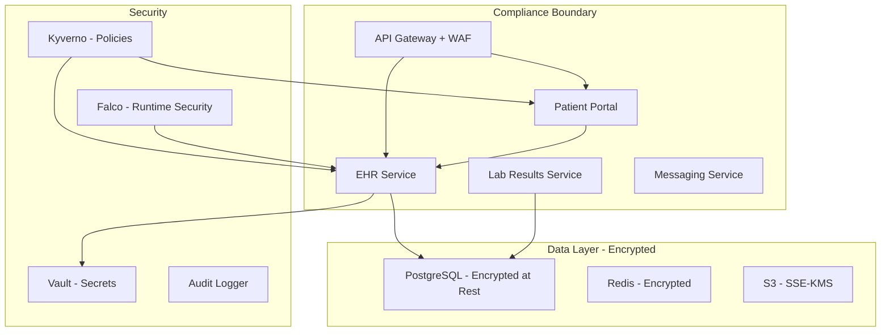

# How to Implement GitOps for Healthcare Applications with ArgoCD

Author: [nawazdhandala](https://github.com/nawazdhandala)

Tags: ArgoCD, GitOps, Kubernetes, Healthcare, HIPAA

Description: Learn how to implement GitOps with ArgoCD for healthcare applications, covering HIPAA compliance, PHI protection, audit logging, encryption requirements, and secure deployment workflows.

---

Healthcare applications handle some of the most sensitive data in any industry - Protected Health Information (PHI). Regulatory frameworks like HIPAA, HITECH, and FDA 21 CFR Part 11 impose strict requirements on how software is deployed, configured, and changed. ArgoCD's GitOps model provides the audit trail, access control, and change management that healthcare compliance demands.

This guide covers how to implement ArgoCD for healthcare workloads while maintaining regulatory compliance.

## HIPAA Requirements and How ArgoCD Helps

HIPAA's Security Rule requires:

| HIPAA Requirement | ArgoCD Implementation |
|---|---|
| Access controls (164.312(a)) | RBAC + SSO with role-based project access |
| Audit controls (164.312(b)) | Git commit history + ArgoCD audit logs |
| Integrity controls (164.312(c)) | Git signed commits + image signing |
| Transmission security (164.312(e)) | TLS everywhere + encrypted secrets |
| Change management | Pull request approvals + sync windows |
| Least privilege | AppProjects restrict access per team |

## Architecture for Healthcare Workloads



## Repository Structure

```text
healthcare-platform-config/
  infrastructure/
    vault/
    kyverno-policies/
    falco/
    cert-manager/
    monitoring/
  services/
    ehr-service/
      base/
        deployment.yaml
        service.yaml
        networkpolicy.yaml
        kustomization.yaml
      overlays/
        dev/
        staging/
        production/
    patient-portal/
      base/
      overlays/
    lab-results/
      base/
      overlays/
    messaging/
      base/
      overlays/
```

## Strict RBAC for Healthcare

```yaml
apiVersion: v1
kind: ConfigMap
metadata:
  name: argocd-rbac-cm
  namespace: argocd
data:
  policy.default: ""  # Deny all by default
  policy.csv: |
    # Clinical Application Team
    p, role:clinical-dev, applications, get, clinical/*, allow
    p, role:clinical-dev, applications, sync, clinical-dev/*, allow
    p, role:clinical-dev, logs, get, clinical/*, allow

    # Compliance/Security Team - read access to everything
    p, role:compliance, applications, get, */*, allow
    p, role:compliance, logs, get, */*, allow
    p, role:compliance, repositories, get, *, allow

    # Release Engineers - can sync to production after approval
    p, role:release-eng, applications, get, */*, allow
    p, role:release-eng, applications, sync, */*, allow

    # Platform Team - full access
    p, role:platform, *, *, */*, allow

    # SSO group mappings
    g, clinical-developers, role:clinical-dev
    g, hipaa-compliance, role:compliance
    g, release-engineering, role:release-eng
    g, platform-team, role:platform
```

## Deployment Security Requirements

Every deployment in a healthcare environment needs these security controls:

```yaml
apiVersion: apps/v1
kind: Deployment
metadata:
  name: ehr-service
spec:
  replicas: 3
  selector:
    matchLabels:
      app: ehr-service
  template:
    metadata:
      labels:
        app: ehr-service
        compliance: hipaa
        data-classification: phi
    spec:
      serviceAccountName: ehr-service-sa
      automountServiceAccountToken: false
      securityContext:
        runAsNonRoot: true
        runAsUser: 10001
        runAsGroup: 10001
        fsGroup: 10001
        seccompProfile:
          type: RuntimeDefault
      containers:
        - name: ehr
          image: approved-registry.internal/ehr-service:v4.2.0@sha256:abc123...
          # Always use digest-pinned images for PHI workloads
          securityContext:
            allowPrivilegeEscalation: false
            readOnlyRootFilesystem: true
            capabilities:
              drop:
                - ALL
          ports:
            - containerPort: 8443    # HTTPS only
              name: https
          env:
            - name: TLS_ENABLED
              value: "true"
            - name: ENCRYPTION_AT_REST
              value: "true"
            - name: AUDIT_LOGGING
              value: "true"
            - name: PHI_ACCESS_LOGGING
              value: "true"
          envFrom:
            - secretRef:
                name: ehr-service-secrets
          resources:
            requests:
              memory: "1Gi"
              cpu: "500m"
            limits:
              memory: "2Gi"
              cpu: "1000m"
          volumeMounts:
            - name: tls-certs
              mountPath: /etc/tls
              readOnly: true
            - name: tmp
              mountPath: /tmp
          readinessProbe:
            httpGet:
              path: /health/ready
              port: 8443
              scheme: HTTPS
            periodSeconds: 5
          livenessProbe:
            httpGet:
              path: /health/live
              port: 8443
              scheme: HTTPS
            periodSeconds: 10
      volumes:
        - name: tls-certs
          secret:
            secretName: ehr-service-tls
        - name: tmp
          emptyDir:
            sizeLimit: 100Mi
```

## Policy Enforcement for HIPAA

Use Kyverno to enforce HIPAA-required security controls:

```yaml
# Policy: PHI workloads must be encrypted in transit
apiVersion: kyverno.io/v1
kind: ClusterPolicy
metadata:
  name: require-tls-for-phi
spec:
  validationFailureAction: Enforce
  rules:
    - name: check-tls
      match:
        resources:
          kinds:
            - Deployment
          selector:
            matchLabels:
              data-classification: phi
      validate:
        message: "PHI workloads must use TLS. Container must expose HTTPS port."
        pattern:
          spec:
            template:
              spec:
                containers:
                  - ports:
                      - name: https

---
# Policy: PHI pods must have security context
apiVersion: kyverno.io/v1
kind: ClusterPolicy
metadata:
  name: phi-security-context
spec:
  validationFailureAction: Enforce
  rules:
    - name: check-non-root
      match:
        resources:
          kinds:
            - Pod
          selector:
            matchLabels:
              data-classification: phi
      validate:
        message: "PHI workloads must run as non-root with read-only filesystem"
        pattern:
          spec:
            securityContext:
              runAsNonRoot: true
            containers:
              - securityContext:
                  readOnlyRootFilesystem: true
                  allowPrivilegeEscalation: false

---
# Policy: Images must be signed and from approved registry
apiVersion: kyverno.io/v1
kind: ClusterPolicy
metadata:
  name: verified-images-only
spec:
  validationFailureAction: Enforce
  rules:
    - name: verify-image
      match:
        resources:
          kinds:
            - Pod
      verifyImages:
        - imageReferences:
            - "approved-registry.internal/*"
          attestors:
            - entries:
                - keys:
                    publicKeys: |-
                      -----BEGIN PUBLIC KEY-----
                      ...
                      -----END PUBLIC KEY-----
```

## Network Isolation for PHI

```yaml
# Strict network policy for PHI services
apiVersion: networking.k8s.io/v1
kind: NetworkPolicy
metadata:
  name: ehr-service-netpol
  namespace: prod-clinical
spec:
  podSelector:
    matchLabels:
      app: ehr-service
  policyTypes:
    - Ingress
    - Egress
  ingress:
    # Only API gateway can reach the EHR service
    - from:
        - namespaceSelector:
            matchLabels:
              name: prod-gateway
          podSelector:
            matchLabels:
              app: api-gateway
      ports:
        - port: 8443
          protocol: TCP
  egress:
    # Database access
    - to:
        - namespaceSelector:
            matchLabels:
              name: prod-database
      ports:
        - port: 5432
    # Vault for secrets
    - to:
        - namespaceSelector:
            matchLabels:
              name: vault
      ports:
        - port: 8200
    # DNS
    - to:
        - namespaceSelector: {}
      ports:
        - port: 53
          protocol: UDP
```

## Audit Logging

HIPAA requires comprehensive audit logging of all PHI access:

```yaml
apiVersion: v1
kind: ConfigMap
metadata:
  name: argocd-notifications-cm
  namespace: argocd
data:
  service.webhook.hipaa-audit: |
    url: https://audit-service.internal/api/v1/deployment-events
    headers:
      - name: Authorization
        value: Bearer $hipaa-audit-token
      - name: Content-Type
        value: application/json

  trigger.on-deployed: |
    - when: app.status.operationState.phase in ['Succeeded']
      send: [deployment-audit]
  trigger.on-sync-failed: |
    - when: app.status.operationState.phase in ['Error', 'Failed']
      send: [deployment-audit]

  template.deployment-audit: |
    webhook:
      hipaa-audit:
        method: POST
        body: |
          {
            "event_type": "deployment",
            "timestamp": "{{.app.status.operationState.finishedAt}}",
            "application": "{{.app.metadata.name}}",
            "namespace": "{{.app.spec.destination.namespace}}",
            "initiator": "{{.app.status.operationState.operation.initiatedBy.username}}",
            "status": "{{.app.status.operationState.phase}}",
            "revision": "{{.app.status.sync.revision}}",
            "message": "{{.app.status.operationState.message}}",
            "compliance_tags": ["hipaa", "phi-system"]
          }
```

## Secrets Management

PHI-related secrets must be managed through Vault with strict access policies:

```yaml
apiVersion: external-secrets.io/v1beta1
kind: ExternalSecret
metadata:
  name: ehr-service-secrets
  namespace: prod-clinical
spec:
  refreshInterval: 5m
  secretStoreRef:
    name: vault-hipaa
    kind: ClusterSecretStore
  target:
    name: ehr-service-secrets
    template:
      type: Opaque
  data:
    - secretKey: DATABASE_URL
      remoteRef:
        key: secret/data/hipaa/prod/ehr/database
        property: connection_string
    - secretKey: ENCRYPTION_KEY
      remoteRef:
        key: secret/data/hipaa/prod/ehr/encryption
        property: aes_key
    - secretKey: FHIR_API_KEY
      remoteRef:
        key: secret/data/hipaa/prod/ehr/fhir
        property: api_key
```

## ArgoCD Application for Healthcare Workloads

```yaml
apiVersion: argoproj.io/v1alpha1
kind: Application
metadata:
  name: ehr-service
  namespace: argocd
spec:
  project: clinical-production
  source:
    repoURL: https://github.com/your-org/healthcare-platform-config.git
    targetRevision: main
    path: services/ehr-service/overlays/production
  destination:
    server: https://hipaa-production-cluster.internal
    namespace: prod-clinical
  syncPolicy:
    # Manual sync only for PHI systems
    syncOptions:
      - Validate=true
      - ServerSideApply=true
      - PruneLast=true
    retry:
      limit: 2
      backoff:
        duration: 30s
        factor: 2
        maxDuration: 3m
```

## Change Management Windows

```yaml
apiVersion: argoproj.io/v1alpha1
kind: AppProject
metadata:
  name: clinical-production
  namespace: argocd
spec:
  description: Production clinical systems - HIPAA regulated
  syncWindows:
    # Scheduled maintenance windows only
    - kind: allow
      schedule: "0 6 * * 2,4"     # Tuesday and Thursday 6am
      duration: 4h
      timeZone: "America/New_York"
      applications:
        - "*"
    # Emergency patches
    - kind: allow
      schedule: "* * * * *"
      duration: 24h
      applications:
        - "emergency-*"
      manualSync: true
    # Deny everything else
    - kind: deny
      schedule: "0 0 * * *"
      duration: 24h
      applications:
        - "*"
  sourceRepos:
    - "https://github.com/your-org/healthcare-platform-config.git"
  destinations:
    - namespace: "prod-clinical"
      server: https://hipaa-production-cluster.internal
  namespaceResourceBlacklist:
    - group: "rbac.authorization.k8s.io"
      kind: "*"
```

## Runtime Security

Deploy Falco for runtime security monitoring alongside your applications:

```yaml
apiVersion: argoproj.io/v1alpha1
kind: Application
metadata:
  name: falco-runtime-security
  namespace: argocd
spec:
  project: security
  source:
    repoURL: https://falcosecurity.github.io/charts
    chart: falco
    targetRevision: 4.0.0
    helm:
      values: |
        falco:
          rules_file:
            - /etc/falco/falco_rules.yaml
            - /etc/falco/falco_rules.local.yaml
            - /etc/falco/rules.d
          json_output: true
          log_stderr: true
        customRules:
          hipaa-rules.yaml: |-
            - rule: PHI Data Access Outside Business Hours
              desc: Detect access to PHI databases outside business hours
              condition: >
                evt.type in (connect) and
                fd.sport in (5432, 3306) and
                container.labels.data-classification = "phi" and
                not (evt.time.hour >= 6 and evt.time.hour <= 22)
              output: >
                PHI database access outside business hours
                (user=%user.name command=%proc.cmdline container=%container.name)
              priority: WARNING
              tags: [hipaa, phi, compliance]
  destination:
    server: https://hipaa-production-cluster.internal
    namespace: falco-system
```

## Conclusion

Healthcare applications require the strictest deployment controls of any industry. ArgoCD provides the foundation - Git audit trails, RBAC, sync windows, and declarative configuration. Layer on Kyverno for policy enforcement, Vault for secrets management, Falco for runtime security, and comprehensive audit logging to meet HIPAA requirements. The most critical principle: no automated sync for production PHI systems. Every production deployment must be manually triggered by an authorized release engineer during an approved change window.

For monitoring healthcare application availability and compliance status, [OneUptime](https://oneuptime.com) provides enterprise-grade observability with audit-ready logging and status pages for stakeholder communication.
