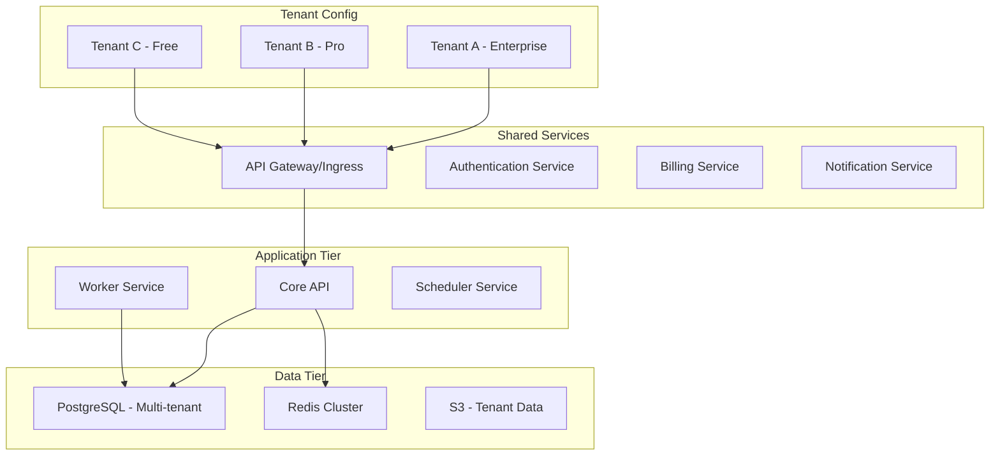
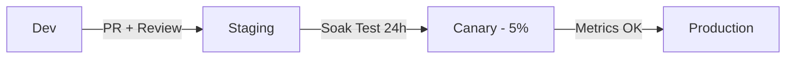

# How to Implement GitOps for SaaS Platforms with ArgoCD

Author: [nawazdhandala](https://github.com/nawazdhandala)

Tags: ArgoCD, GitOps, Kubernetes, SaaS, Multi-Tenancy

Description: Learn how to manage SaaS platform infrastructure with ArgoCD, covering multi-tenancy, tenant isolation, feature flag rollouts, and environment promotion workflows for SaaS deployments.

---

SaaS platforms present a particular set of deployment challenges. You need multi-tenancy with proper isolation, the ability to roll out features to specific tenants, environment promotion workflows, and the infrastructure to support different pricing tiers. ArgoCD handles all of this through declarative GitOps patterns.

This guide shows you how to structure and manage a SaaS platform using ArgoCD.

## SaaS Platform Architecture

A typical SaaS platform on Kubernetes:



## Repository Structure

```text
saas-platform-config/
  platform/
    shared-services/
      api-gateway/
      auth-service/
      billing-service/
      notification-service/
    core-services/
      base/
        api-deployment.yaml
        worker-deployment.yaml
        scheduler-deployment.yaml
        kustomization.yaml
      overlays/
        dev/
        staging/
        production/
    infrastructure/
      postgresql/
      redis/
      monitoring/
  tenants/
    enterprise/
      tenant-a/
        namespace.yaml
        resource-quota.yaml
        network-policy.yaml
        kustomization.yaml
      tenant-b/
    pro/
      tenant-c/
    free/
      tenant-d/
```

## Multi-Tenancy Patterns

### Pattern 1: Namespace Per Tenant

Each tenant gets their own namespace with resource quotas and network policies:

```yaml
# tenants/enterprise/tenant-a/namespace.yaml
apiVersion: v1
kind: Namespace
metadata:
  name: tenant-acme-corp
  labels:
    tenant: acme-corp
    tier: enterprise
    managed-by: argocd

---
# tenants/enterprise/tenant-a/resource-quota.yaml
apiVersion: v1
kind: ResourceQuota
metadata:
  name: tenant-quota
  namespace: tenant-acme-corp
spec:
  hard:
    requests.cpu: "8"
    requests.memory: "16Gi"
    limits.cpu: "16"
    limits.memory: "32Gi"
    persistentvolumeclaims: "10"
    services: "20"

---
# tenants/enterprise/tenant-a/network-policy.yaml
apiVersion: networking.k8s.io/v1
kind: NetworkPolicy
metadata:
  name: tenant-isolation
  namespace: tenant-acme-corp
spec:
  podSelector: {}
  policyTypes:
    - Ingress
    - Egress
  ingress:
    - from:
        - namespaceSelector:
            matchLabels:
              tenant: acme-corp
        - namespaceSelector:
            matchLabels:
              type: shared-services
  egress:
    - to:
        - namespaceSelector:
            matchLabels:
              tenant: acme-corp
        - namespaceSelector:
            matchLabels:
              type: shared-services
    - to:          # Allow DNS
        - namespaceSelector: {}
      ports:
        - port: 53
          protocol: UDP
```

### Pattern 2: Shared Cluster, Per-Tenant Config

For SaaS platforms where the application is shared but configuration varies:

```yaml
# Per-tenant configuration as ConfigMap
apiVersion: v1
kind: ConfigMap
metadata:
  name: tenant-config-acme
  namespace: production
data:
  tenant-id: "acme-corp"
  tier: "enterprise"
  features: |
    {
      "advanced_analytics": true,
      "custom_branding": true,
      "sso": true,
      "api_rate_limit": 10000,
      "storage_limit_gb": 500,
      "max_users": -1
    }
```

## Managing Tenant Onboarding with ApplicationSets

Automate tenant provisioning using ApplicationSets:

```yaml
apiVersion: argoproj.io/v1alpha1
kind: ApplicationSet
metadata:
  name: tenant-namespaces
  namespace: argocd
spec:
  generators:
    - git:
        repoURL: https://github.com/your-org/saas-platform-config.git
        revision: main
        directories:
          - path: "tenants/*/*"
  template:
    metadata:
      name: "tenant-{{path[2]}}"
      labels:
        tier: "{{path[1]}}"
    spec:
      project: tenants
      source:
        repoURL: https://github.com/your-org/saas-platform-config.git
        targetRevision: main
        path: "{{path}}"
      destination:
        server: https://kubernetes.default.svc
      syncPolicy:
        automated:
          prune: true
          selfHeal: true
        syncOptions:
          - CreateNamespace=true
```

To onboard a new tenant, just add a directory:

```bash
# Add new tenant
mkdir -p tenants/pro/new-tenant
# Add namespace.yaml, resource-quota.yaml, network-policy.yaml
git add tenants/pro/new-tenant/
git commit -m "Onboard new tenant: new-tenant (Pro tier)"
git push
# ArgoCD automatically provisions the tenant resources
```

## Platform Services Deployment

Deploy shared platform services that all tenants use:

```yaml
# platform/core-services/base/api-deployment.yaml
apiVersion: apps/v1
kind: Deployment
metadata:
  name: core-api
spec:
  replicas: 5
  strategy:
    type: RollingUpdate
    rollingUpdate:
      maxSurge: 2
      maxUnavailable: 0
  selector:
    matchLabels:
      app: core-api
  template:
    metadata:
      labels:
        app: core-api
    spec:
      containers:
        - name: api
          image: my-registry/saas-api:v4.2.0
          ports:
            - containerPort: 8080
          env:
            - name: DATABASE_URL
              valueFrom:
                secretKeyRef:
                  name: db-credentials
                  key: url
            - name: REDIS_URL
              value: "redis://redis-master.redis:6379"
            - name: MULTI_TENANT_MODE
              value: "true"
            - name: TENANT_HEADER
              value: "X-Tenant-ID"
          resources:
            requests:
              memory: "512Mi"
              cpu: "500m"
            limits:
              memory: "1Gi"
              cpu: "1000m"
          readinessProbe:
            httpGet:
              path: /health/ready
              port: 8080
            periodSeconds: 5
          livenessProbe:
            httpGet:
              path: /health/live
              port: 8080
            periodSeconds: 10
```

The ArgoCD Application for platform services:

```yaml
apiVersion: argoproj.io/v1alpha1
kind: Application
metadata:
  name: saas-core-services
  namespace: argocd
spec:
  project: platform
  source:
    repoURL: https://github.com/your-org/saas-platform-config.git
    targetRevision: main
    path: platform/core-services/overlays/production
  destination:
    server: https://kubernetes.default.svc
    namespace: production
  syncPolicy:
    automated:
      prune: true
      selfHeal: true
    syncOptions:
      - ServerSideApply=true
```

## Feature Rollouts by Tenant Tier

SaaS platforms often roll out features by tier (enterprise first, then pro, then free):

```yaml
# Feature flags per tier
apiVersion: v1
kind: ConfigMap
metadata:
  name: feature-flags
  namespace: production
data:
  features.yaml: |
    global:
      maintenance_mode: false
      api_version: "v4"
    tiers:
      enterprise:
        new_dashboard: true
        ai_assistant: true
        advanced_exports: true
        custom_webhooks: true
      pro:
        new_dashboard: true
        ai_assistant: false       # Not yet for Pro
        advanced_exports: true
        custom_webhooks: false
      free:
        new_dashboard: false      # Not yet for Free
        ai_assistant: false
        advanced_exports: false
        custom_webhooks: false
```

Roll out a feature gradually:

1. Enable for enterprise tier (merge PR updating feature flags)
2. Monitor for 1 week
3. Enable for pro tier
4. Monitor for 1 week
5. Enable for free tier

Each step is a Git commit that ArgoCD applies automatically.

## Environment Promotion

SaaS platforms need strict environment promotion:



Implement this with separate ArgoCD Applications per environment:

```yaml
# Dev - auto-sync from dev branch
apiVersion: argoproj.io/v1alpha1
kind: Application
metadata:
  name: saas-api-dev
spec:
  source:
    targetRevision: develop
    path: platform/core-services/overlays/dev
  syncPolicy:
    automated:
      prune: true
      selfHeal: true

---
# Staging - auto-sync from main
apiVersion: argoproj.io/v1alpha1
kind: Application
metadata:
  name: saas-api-staging
spec:
  source:
    targetRevision: main
    path: platform/core-services/overlays/staging
  syncPolicy:
    automated:
      prune: true
      selfHeal: true

---
# Production - manual sync only
apiVersion: argoproj.io/v1alpha1
kind: Application
metadata:
  name: saas-api-production
spec:
  source:
    targetRevision: main
    path: platform/core-services/overlays/production
  syncPolicy: {}  # Manual sync required
```

## Database Migrations for Multi-Tenant

Multi-tenant database migrations need extra care:

```yaml
apiVersion: batch/v1
kind: Job
metadata:
  name: db-migrate
  annotations:
    argocd.argoproj.io/hook: PreSync
    argocd.argoproj.io/hook-delete-policy: BeforeHookCreation
spec:
  backoffLimit: 0
  activeDeadlineSeconds: 600
  template:
    spec:
      containers:
        - name: migrate
          image: my-registry/saas-api:v4.2.0
          command:
            - /bin/sh
            - -c
            - |
              echo "Running shared schema migrations..."
              ./migrate --shared-schema

              echo "Running tenant-specific migrations..."
              for tenant in $(./list-tenants); do
                echo "Migrating tenant: $tenant"
                ./migrate --tenant=$tenant
              done

              echo "All migrations complete."
          envFrom:
            - secretRef:
                name: db-credentials
      restartPolicy: Never
```

## Monitoring SaaS Metrics

Track both platform and per-tenant metrics:

```yaml
apiVersion: monitoring.coreos.com/v1
kind: PrometheusRule
metadata:
  name: saas-alerts
spec:
  groups:
    - name: saas-platform
      rules:
        - alert: HighErrorRate
          expr: |
            sum(rate(http_requests_total{status=~"5.."}[5m])) by (tenant)
            / sum(rate(http_requests_total[5m])) by (tenant) > 0.05
          for: 5m
          labels:
            severity: critical
          annotations:
            summary: "Tenant {{ $labels.tenant }} error rate above 5%"

        - alert: TenantQuotaExhausted
          expr: |
            kube_resourcequota{type="used"} / kube_resourcequota{type="hard"} > 0.9
          for: 15m
          labels:
            severity: warning
          annotations:
            summary: "Namespace {{ $labels.namespace }} using >90% of quota"

        - alert: APILatencyHigh
          expr: |
            histogram_quantile(0.99,
              sum(rate(http_request_duration_seconds_bucket[5m])) by (le, tenant)
            ) > 2
          for: 5m
          labels:
            severity: warning
```

## Handling Tenant Offboarding

When a tenant churns, remove their resources through Git:

```bash
# Remove tenant directory
git rm -r tenants/pro/churned-tenant/
git commit -m "Offboard tenant: churned-tenant"
git push
# ArgoCD prunes the namespace and all resources
```

With `prune: true`, ArgoCD deletes the namespace and everything in it. For enterprise tenants, you might want to keep data for a retention period:

```yaml
# Instead of deleting, mark as archived
apiVersion: v1
kind: Namespace
metadata:
  name: tenant-churned
  labels:
    tenant-status: archived
  annotations:
    archive-date: "2026-02-26"
    delete-after: "2026-05-26"  # 90-day retention
```

## Conclusion

SaaS platforms benefit from GitOps because multi-tenancy adds complexity that is easier to manage declaratively. ArgoCD's ApplicationSets automate tenant provisioning, AppProjects enforce isolation, and feature flags in ConfigMaps enable tier-based rollouts. The key is separating platform services (shared by all tenants) from tenant-specific configuration, and managing both through Git with appropriate access controls.

For monitoring your SaaS platform's health and SLA compliance per tenant, [OneUptime](https://oneuptime.com) provides multi-tenant observability, status pages, and alerting.
