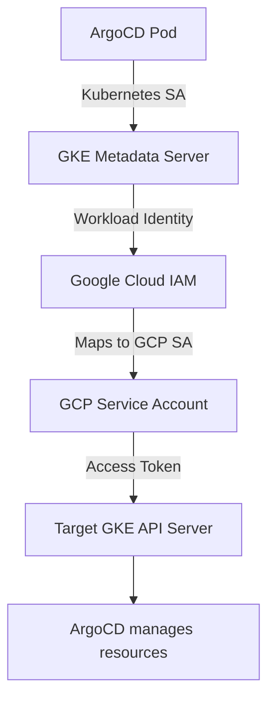

# How to Configure GKE Workload Identity for ArgoCD

Author: [nawazdhandala](https://github.com/nawazdhandala)

Tags: ArgoCD, GitOps, Kubernetes, Google GKE, Security

Description: Learn how to configure GKE Workload Identity for ArgoCD to securely authenticate with Google Kubernetes Engine clusters without static credentials, enabling passwordless multi-cluster management.

---

GKE Workload Identity is Google Cloud's recommended approach for authenticating workloads running on GKE with Google Cloud services. For ArgoCD, this means the controller can manage remote GKE clusters without storing any static service account keys. Instead, the Kubernetes ServiceAccount running the ArgoCD controller is mapped to a Google Cloud service account that has permissions to access target GKE clusters.

This guide walks through the complete setup, from enabling Workload Identity to configuring ArgoCD for multi-cluster GKE management.

## How Workload Identity Works with ArgoCD



The GKE metadata server intercepts credential requests from pods and returns Google Cloud credentials based on the Workload Identity mapping. No credential files or environment variables are needed.

## Prerequisites

- A GKE cluster running ArgoCD with Workload Identity enabled
- One or more target GKE clusters
- gcloud CLI installed and configured
- kubectl with contexts for all clusters

## Step 1: Enable Workload Identity on the ArgoCD Cluster

If your ArgoCD cluster does not already have Workload Identity enabled:

```bash
# Enable Workload Identity on the cluster
gcloud container clusters update argocd-cluster \
  --zone us-central1-a \
  --project argocd-project \
  --workload-pool=argocd-project.svc.id.goog

# Enable Workload Identity on the node pool
gcloud container node-pools update default-pool \
  --cluster argocd-cluster \
  --zone us-central1-a \
  --project argocd-project \
  --workload-metadata=GKE_METADATA
```

After enabling, existing pods need to be restarted to use the GKE metadata server instead of the compute engine metadata server.

## Step 2: Create the Google Cloud Service Account

```bash
PROJECT_ID="argocd-project"

# Create a GCP service account for ArgoCD
gcloud iam service-accounts create argocd-controller \
  --display-name="ArgoCD Controller" \
  --description="Used by ArgoCD to manage GKE clusters" \
  --project=$PROJECT_ID
```

## Step 3: Grant GKE Access to the GCP Service Account

The GCP service account needs permissions to access the target GKE clusters:

```bash
# For target clusters in the same project
gcloud projects add-iam-policy-binding $PROJECT_ID \
  --member="serviceAccount:argocd-controller@${PROJECT_ID}.iam.gserviceaccount.com" \
  --role="roles/container.developer"

# For read-only access (if you only need to view, not deploy)
gcloud projects add-iam-policy-binding $PROJECT_ID \
  --member="serviceAccount:argocd-controller@${PROJECT_ID}.iam.gserviceaccount.com" \
  --role="roles/container.viewer"
```

For target clusters in different projects:

```bash
TARGET_PROJECT="target-project"

gcloud projects add-iam-policy-binding $TARGET_PROJECT \
  --member="serviceAccount:argocd-controller@${PROJECT_ID}.iam.gserviceaccount.com" \
  --role="roles/container.developer"
```

## Step 4: Bind Kubernetes SA to GCP SA

Create the Workload Identity binding:

```bash
# Bind the ArgoCD Kubernetes service account to the GCP service account
gcloud iam service-accounts add-iam-policy-binding \
  argocd-controller@${PROJECT_ID}.iam.gserviceaccount.com \
  --role="roles/iam.workloadIdentityUser" \
  --member="serviceAccount:${PROJECT_ID}.svc.id.goog[argocd/argocd-application-controller]" \
  --project=$PROJECT_ID

# Also bind the argocd-server SA (for UI-triggered syncs)
gcloud iam service-accounts add-iam-policy-binding \
  argocd-controller@${PROJECT_ID}.iam.gserviceaccount.com \
  --role="roles/iam.workloadIdentityUser" \
  --member="serviceAccount:${PROJECT_ID}.svc.id.goog[argocd/argocd-server]" \
  --project=$PROJECT_ID
```

## Step 5: Annotate ArgoCD Kubernetes Service Accounts

```bash
# Annotate the application controller SA
kubectl annotate serviceaccount argocd-application-controller \
  -n argocd \
  iam.gke.io/gcp-service-account=argocd-controller@${PROJECT_ID}.iam.gserviceaccount.com

# Annotate the server SA
kubectl annotate serviceaccount argocd-server \
  -n argocd \
  iam.gke.io/gcp-service-account=argocd-controller@${PROJECT_ID}.iam.gserviceaccount.com

# Restart pods to pick up the Workload Identity credentials
kubectl rollout restart deployment argocd-server -n argocd
kubectl rollout restart statefulset argocd-application-controller -n argocd
```

## Step 6: Configure RBAC in Target GKE Clusters

The GCP service account needs Kubernetes RBAC in addition to GCP IAM:

```yaml
# Apply to each target GKE cluster
apiVersion: rbac.authorization.k8s.io/v1
kind: ClusterRoleBinding
metadata:
  name: argocd-controller-binding
roleRef:
  apiGroup: rbac.authorization.k8s.io
  kind: ClusterRole
  name: cluster-admin  # Or a custom role
subjects:
  - kind: User
    name: argocd-controller@argocd-project.iam.gserviceaccount.com
    apiGroup: rbac.authorization.k8s.io
```

For least-privilege access:

```yaml
apiVersion: rbac.authorization.k8s.io/v1
kind: ClusterRole
metadata:
  name: argocd-manager
rules:
  - apiGroups: ["*"]
    resources: ["*"]
    verbs: ["get", "list", "watch"]
  - apiGroups: ["", "apps", "batch", "networking.k8s.io"]
    resources: ["*"]
    verbs: ["create", "update", "patch", "delete"]

---
apiVersion: rbac.authorization.k8s.io/v1
kind: ClusterRoleBinding
metadata:
  name: argocd-controller-binding
roleRef:
  apiGroup: rbac.authorization.k8s.io
  kind: ClusterRole
  name: argocd-manager
subjects:
  - kind: User
    name: argocd-controller@argocd-project.iam.gserviceaccount.com
    apiGroup: rbac.authorization.k8s.io
```

## Step 7: Register Target Clusters

Get the cluster details:

```bash
# Get cluster endpoint
ENDPOINT=$(gcloud container clusters describe target-cluster \
  --zone us-central1-a \
  --project $TARGET_PROJECT \
  --format='get(endpoint)')

# Get CA certificate (already base64 encoded)
CA_CERT=$(gcloud container clusters describe target-cluster \
  --zone us-central1-a \
  --project $TARGET_PROJECT \
  --format='get(masterAuth.clusterCaCertificate)')
```

Register with the exec provider:

```yaml
apiVersion: v1
kind: Secret
metadata:
  name: gke-target-cluster
  namespace: argocd
  labels:
    argocd.argoproj.io/secret-type: cluster
    provider: gcp
    environment: production
    zone: us-central1-a
type: Opaque
stringData:
  name: gke-production
  server: "https://${ENDPOINT}"
  config: |
    {
      "execProviderConfig": {
        "command": "argocd-k8s-auth",
        "args": ["gcp"],
        "apiVersion": "client.authentication.k8s.io/v1beta1"
      },
      "tlsClientConfig": {
        "insecure": false,
        "caData": "${CA_CERT}"
      }
    }
```

The `argocd-k8s-auth gcp` command uses the Workload Identity credentials to obtain a GKE access token.

## Registering Multiple Clusters at Once

Automate registration for all GKE clusters in a project:

```bash
#!/bin/bash
# register-all-gke-clusters.sh

PROJECT_ID="${1:-$PROJECT_ID}"

gcloud container clusters list --project=$PROJECT_ID \
  --format='csv[no-heading](name,zone,endpoint,masterAuth.clusterCaCertificate)' | \
while IFS=, read -r name zone endpoint ca_cert; do
  echo "Registering: $name ($zone)"

  cat <<EOF | kubectl apply -f -
apiVersion: v1
kind: Secret
metadata:
  name: gke-${name}
  namespace: argocd
  labels:
    argocd.argoproj.io/secret-type: cluster
    provider: gcp
    project: ${PROJECT_ID}
    zone: ${zone}
type: Opaque
stringData:
  name: "${name}"
  server: "https://${endpoint}"
  config: |
    {
      "execProviderConfig": {
        "command": "argocd-k8s-auth",
        "args": ["gcp"],
        "apiVersion": "client.authentication.k8s.io/v1beta1"
      },
      "tlsClientConfig": {
        "insecure": false,
        "caData": "${ca_cert}"
      }
    }
EOF

done
```

## Verifying Workload Identity

```bash
# Check the service account annotation
kubectl get sa argocd-application-controller -n argocd \
  -o jsonpath='{.metadata.annotations.iam\.gke\.io/gcp-service-account}'

# Verify Workload Identity is working from inside the pod
kubectl exec -n argocd deploy/argocd-application-controller -- \
  curl -sH "Metadata-Flavor: Google" \
  "http://169.254.169.254/computeMetadata/v1/instance/service-accounts/default/email"

# Expected output: argocd-controller@argocd-project.iam.gserviceaccount.com

# Test token generation
kubectl exec -n argocd deploy/argocd-application-controller -- \
  curl -sH "Metadata-Flavor: Google" \
  "http://169.254.169.254/computeMetadata/v1/instance/service-accounts/default/token" | \
  python3 -c "import sys,json; print(json.load(sys.stdin)['token_type'])"

# Expected output: Bearer

# Verify cluster connection through ArgoCD
argocd cluster list
argocd cluster get https://${ENDPOINT}
```

## Troubleshooting

### Pod not getting Workload Identity credentials

```bash
# Check if node pool has Workload Identity metadata enabled
gcloud container node-pools describe default-pool \
  --cluster argocd-cluster \
  --zone us-central1-a \
  --format='get(config.workloadMetadataConfig)'

# Should show: GKE_METADATA

# Check pod metadata
kubectl exec -n argocd deploy/argocd-application-controller -- \
  curl -sH "Metadata-Flavor: Google" \
  "http://169.254.169.254/computeMetadata/v1/instance/service-accounts/"

# If it shows default compute SA instead of the GCP SA,
# the Workload Identity binding is not configured correctly
```

### Permission denied errors

```bash
# Check IAM bindings
gcloud iam service-accounts get-iam-policy \
  argocd-controller@${PROJECT_ID}.iam.gserviceaccount.com

# Verify the Kubernetes SA binding exists
gcloud iam service-accounts get-iam-policy \
  argocd-controller@${PROJECT_ID}.iam.gserviceaccount.com \
  --format='json' | jq '.bindings[] | select(.role == "roles/iam.workloadIdentityUser")'

# Check project-level IAM
gcloud projects get-iam-policy $TARGET_PROJECT \
  --flatten="bindings[].members" \
  --filter="bindings.members:argocd-controller@${PROJECT_ID}.iam.gserviceaccount.com"
```

## Summary

GKE Workload Identity is the most secure way to connect ArgoCD to GKE clusters. It eliminates static credentials entirely, relying on Google Cloud's identity federation to provide short-lived tokens automatically. The setup involves enabling Workload Identity on the GKE cluster, creating a GCP service account, binding it to the ArgoCD Kubernetes service account, configuring RBAC in target clusters, and registering clusters with the `argocd-k8s-auth gcp` exec provider. While the initial configuration requires several steps across GCP IAM and Kubernetes RBAC, the resulting system is more secure and easier to maintain than any credential-based approach.
